## Introduction
___  

   

The Sense-i Enterprise Management System (**SEMS**) is a **Client-Server system**:  
-   The **Phoenix** front-end **Program** _(Client)_ is installed on each user's **Personal Computer**, and  
-   The **information/data** is stored on, and accessed from a central computer _(Server)_, known as the **Database Server.**

Phoenix is an upgrade to the Sense-i Enterprise Management System **(SEMS)** front-end.  

   

The Phoenix front-end program allows you to view, update and add new information which is stored on the Database Server.  

Currently in _Beta_ form, Phoenix is being developed using the latest software technology.  

Some of the upgrade features of Phoenix include:  
- A Modern and easy-to-use UI _(User Interface)_  
- Enhanced Navigation  
- Custom "Skins" that change the graphical appearance of your interface
- More information can be accessed and viewed simultaneously
- Dock multiple screens next to each other to view related information 
- Open screens on different monitors
- Switch easily between screens and windows using a familiar interface
- Bulk select and edit multiple records at the same time using Jobs
- Import Data from external sources
- Create and Save Custom Views

## Enhanced Navigation  

The Phoenix front-end system has 4 types of navigation:  

1.  **Menu Navigation**, which includes:  
    - Main Menu  
    - Drop-down Menus  
    - Side Menus, and  
    - Slide-out Menus.  

   

2.  **TAB Navigation**  

   

3.  **Tree-structure Navigation**  

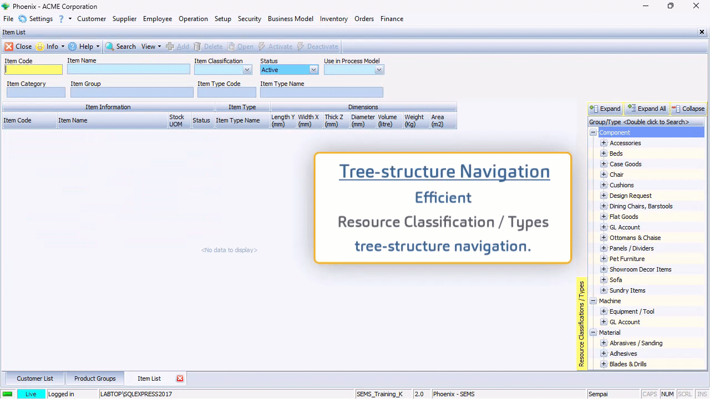   

4.  **Search Panel** and **Action Bar**  

5.  **TAB Navigation**.  

The **Main Navigation Menu** is the list of functions that runs horizontally along the top of the screen.  

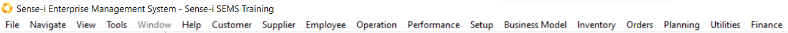   

The **Drop-down menu(s)** or Secondary Navigation Menus are accessed by clicking on any of the Main Navigation Menu options.  

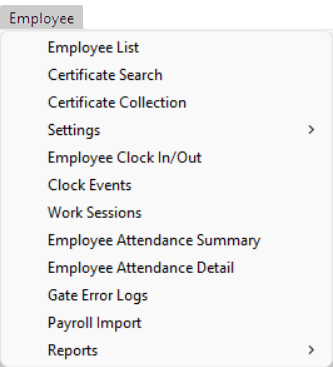   

The **Side Menus** or third-tier navigation options are available as further navigation from relevant drop-down menu options.  

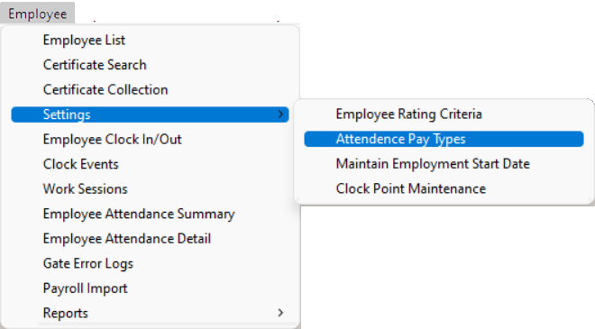   

___

As you click on a menu item the system opens the **Form** associated with the function in the Main Form section of the screen.  

In this example the **Maintain Sales Quote** Form is displayed _(accessed by selecting **Customer** from the Main Navigation Menu, and then clicking on **Sales Quote** on the Drop-down Menu)_.  

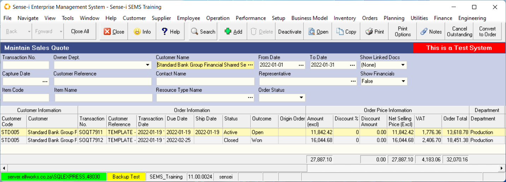   

The **Back** and **Forward** buttons allow you to move
between open forms.  
The **Close All** option closes all the open forms and returns you to the initial start view.

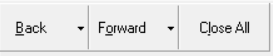   

The system displays a series of buttons in the Form Bar that are related to the
form that you are using. This makes it easy to use the system because
you only ever have access to features that are relevant to the form
you are using at the time.  

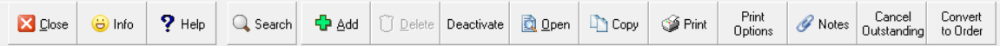   

## How The Screens Operate 

When you click on a function, either in the Main Menu or on the
Drop-down / Side Menu, the system will always first display a **LIST SCREEN**.  

The **LIST SCREEN** shows you what information has already been
captured in the system by yourself and other users. This helps because
it shows people what information is available, and if used correctly,
prevents people from entering the same information more than once.  

The LIST SCREEN lists all the information in the system for the
function you have chosen. So, if you have clicked on the Customer
Profile button, the system will open a FORM called CUSTOMER
LIST and display all Customer records that match the SEARCH
CRITERIA on the form.  

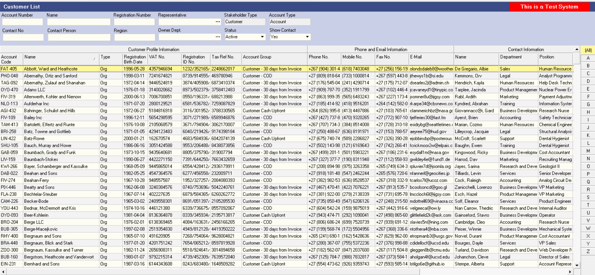   

You will notice that each LIST SCREEN consists of two different
sections. The top section of each LIST SCREEN is called the
**SEARCH CRITERIA PANEL**.  

This section of the form displays several boxes called **Fields** into
which you can type or choose specific information _(e.g. a **Customer Name**, or a **date range**, from one date to another date)_.  

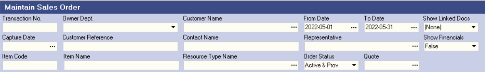   

The software program uses the words and options you have entered into the
fields on the SEARCH CRITERIA PANEL to find all RECORDS or TRANSACTIONS that are stored on the server and then display this information in the GRID on the LIST SCREEN.  

### The List Grid Panel  

On closer examination, you will notice that **FIELDS** contain information
and options that relate to the specific form or function you are
using.  

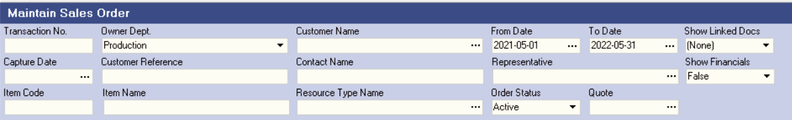   

You will also notice that the system displays a set of buttons
immediately above the blue bar on which the name of the form is
listed. This is called the **Form Bar**. These are the functions that
relate to the open form.  

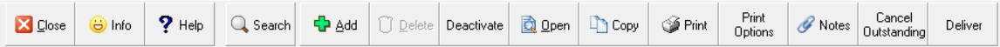   

### Using The System To Find Information 

1.  Select the **Customer** option on the Main Navigation Menu.  

2.  Then click on the **Customer** option on the Drop-down Menu.  

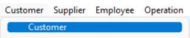   

3.  Notice how the system opens a screen titled **Customer List**.  
    This is the normal LIST SCREEN for viewing and updating
    Customer information in the system.  

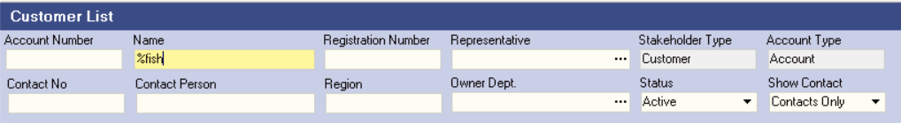   

4.  Enter information in the Search Criteria Panel. For example, enter a Name or a portion of a Name in the Name field.  

:::tip  
To find all customers that contain the letters "Fish" in their name you can type the **% symbol** and then the letters **"fish"** in the **Name** field.  
:::

5.  Then click on the **Search** Button on the Form Bar.  

6.  Notice how the system updates the list of Customer Profiles on the
screen to show only those Customers that match the name you have
entered.  

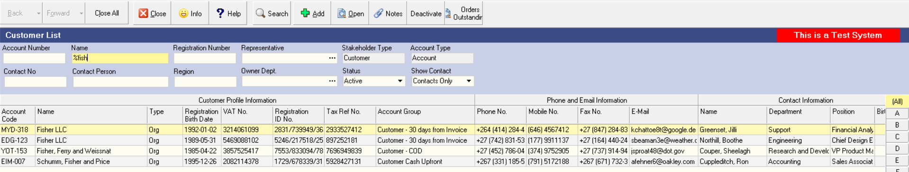   

So, to briefly recap, the when you **click on a function**, the
**system provides a list screen** that displays all the information
already in the system. To prevent displays lists of thousands of
records, the system FILTERS the information to display on RELEVANT
INFORMATION.  

You **enter SEARCH CRITERIA** on a LIST SCREEN to select
what information you consider to be relevant. The shorter lists make
it easier for you to find the exact information you need and also,
keeps the server working faster for all of the other users on the
system.  

### Using The System To Update Information 

1.  There are only three things that you can do on any computer system.  

You can **ADD** new information.  

You can change or **EDIT** existing information.  

And you can **DELETE** existing information.  

2.  Click on the ADD Button on the **Customer List Form Bar**.  

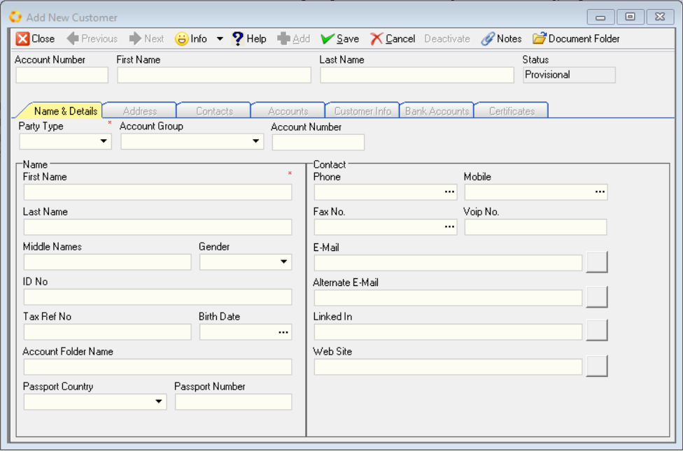   

3.  When you click on the ADD or OPEN Buttons on the form bar you will
notice that the computer system opens a new screen.  

If you clicked on the ADD Button, the system opens a BLANK FORM into
which you can enter new information.  

If you chose the OPEN Button, the system opens the same form but with
the information of the existing record that you chose to EDIT.  

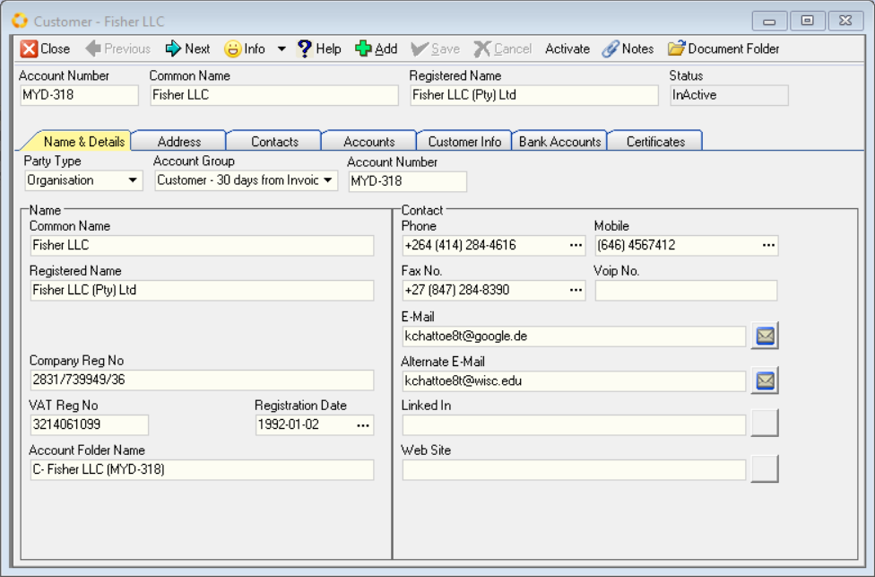   

:::tip  
To Edit information of an existing record, click on the **Deactivate** option on the Form Bar.  

Once you have amended the relevant information, click on the **Activate** button.  
:::  

If you chose the DELETE Button, the system will ask you if you are
sure if you wish to delete an existing records from the database.  

When adding information you will notice that each form that you open
contains specific information that must be completed.  
These are called **Fields**.  

Completing any of these forms is straight forward. There are only two
ways you can enter information.

The first is that **you can type information into a field** that
allows this. For example, the **Name** field or the **Phone Number** field on
the **Add New Customer Form**.  

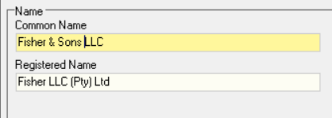   

The second way to enter information into a Form is to
**choose information from a list of information already in the system.**  

When you do this, the system displays the **List Options** in a Drop-down list from which you then select the information you wish to use. 

For example, on the Customer Profile Form you need to select **Terms** that apply to the Customer's Account from the **Account Group** drop-down list.  

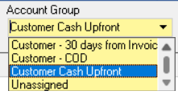   

Completing a form is simply a matter of working through each field on
the form step-bystep and entering information using these Entry
Methods.

### Completing a Form  

Whenever you click on a field that requires you to choose or SELECT information that already exists in the system, the system will display LIST SCREEN, as described earlier.  

When you need to select information the system displays the available information is a LIST GRID.  

And you will remember that each LIST SCREEN consists of a SEARCH
CRITERIA PANEL and the LIST GRID.  

So you can search for specific information in the system in exactly
the same way that you did in the first example of the LIST SCREEN we
described above.  

   

You can search for information without being exact about what records
or transactions you want the program to find. To do this type the
**% sign** before you type a partial or complete word. So to find all
customers that have the letters FISH in their name, type the **symbol %** and then **fish**. For this example, type **%fish** in the **Name field** on
the SEARCH CRITERIA PANEL.  

Then click the **SEARCH** Button on the Form Bar.  

   

To select information, you will need to click on the record in the
LIST GRID that you want to use and then...  

Click the **Open** Button on the Form Bar.  

The system will open the relevant Maintain **Customer** Profile screen, in this case the **Customer - Fisher LLC** form, and will display the existing information for that specific customer.  

   

Additional **fields** and information is accessed by clicking on the associated **TABS**, in this case **Address**, **Contacts**, **Accounts**, **Customer Info**, **Bank Accounts** and **Certificates**.  

## Recap 

The system is that simple to use. You simply complete the blank form
you have chosen by clicking on a field. The system will then open a
LIST SCREEN and you SELECT the information you need from this screen,
CLICK the SELECT Button on the FORM Bar, and the system will return
you to the form you are completing and display the SELECTED
INFORMATION in the Form. Where you need to type information is a
specific field, you simply use the keyboard to enter the appropriate
information on the required space on the form. It is that easy.  

1.  Select a **Function**. For example, **Customer / Sales Order**.  

2.  The system opens a **List Screen**.  

3.  Enter information in the **Search Criteria Panel**.  

4.  Then click the **Search Button**.  

5.  The system finds the relevant records and information.  

6.  You can choose to **ADD new information**.  

7.  Or you can choose to **EDIT or DELETE existing information**.  

8.  Click on the **Add** or **Open** button(s).

9.  The system **Opens a Form**.  

10. Select a **Field**, and then click on The **Open** button.  

11. **Enter / Select** the correct information.  

12. Repeat steps 10 -11 until the form is complete.  

13. Then click the **Save** and **Close** buttons.  

14. The system returns you to Step 2.  

The entire system works in this way. So once you have mastered these
simple steps, using the system will be that much easier and you will
not have to worry about how the remaining functions work in the
system.  

You will be free to focus you energy and attention instead on
understanding what the function does from a business perspective and
concentrate on entering the correct information and making the correct
decisions.  

This is what is important in making any business and team
function successfully.  

**This is the end of the Basic Introduction to the SEMS User Interface.**

