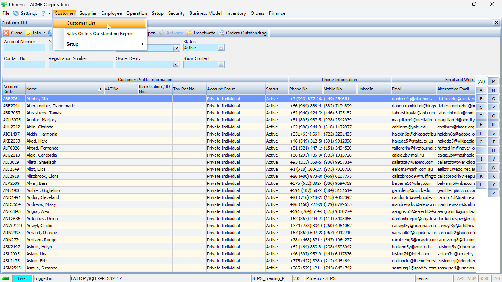
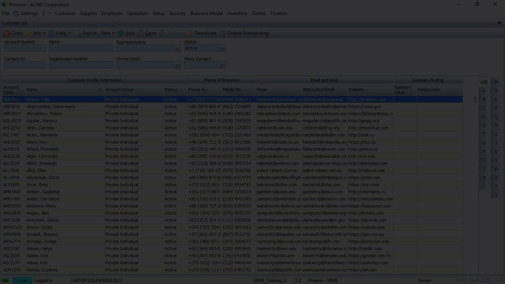
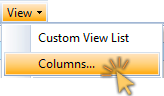
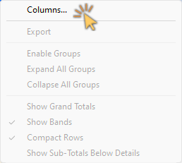
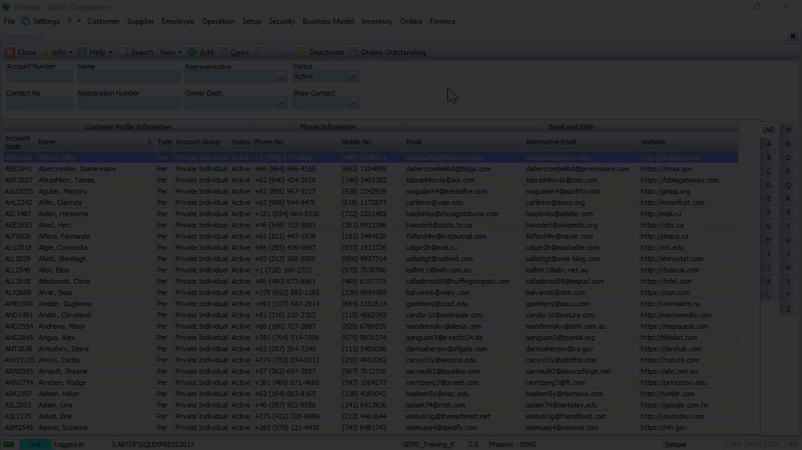

## Accessing Custom Views  

The Phoenix system allows you to **view** list grid screens with **different layout options**.  

1.  Open a list grid screen by clicking on an option in the Main Navigation menu.  

2.  Click on an option in the drop-down menu, then (if available)  

3.  Click on the desired option in the side-menu.  

   

In this example, the **Item Type** list grid screen is displayed, with the relevant form **Action Bar options** available across the top of the screen.  

4.  Click the **View** button on the Action Bar.  

   

### Pre-defined Views

The **View drop-down list** is displayed with a number of **Pre-defined Views** available.  

   

5.  Click on any one of the pre-defined views to change the list grid layout.  

  

:::important  
The current list grid layout being used is demarcated by a check-box.  

The ability to quickly change layout views is an extremely valuable feature when different tasks need to be performed as required.  
:::  

## Create and Save Custom Views  

The **Custom Views** feature also enables the Phoenix user to change the layout configuration of the list grid to suit his/her preference.  

This includes:  
- Hiding information bands and/or individual columns  
- Adjusting column width  
- Changing the column order  
- Grouping Information  

Once the Phoenix user is satisfied with the new layout & configuration of the grid, this can then be saved and accessed on subsequent logins.  

:::tip  
Different views can be saved, depending on various tasks that need to be performed.  
:::  

In this example, we will access the Customer List Grid.  

1.  Click the **Customer** button on the Main Navigation menu.  

2.  Click the **Customer List** option in the drop-down menu.  

   

The **<original\>** default view is displayed.  

If we click the **View** button on the Action bar, we will see that no pre-defined views have been created.  

   

The procedure below describes the typical step-by-step guideline to configure the List Grid for a customised display...  

### Hiding Non-relevant Information  

At times, some of the information on the screen is not relevant to the task that needs to be performed.

There are a number of ways to hide information that is not relevant to what needs to be displayed.  

1.  To hide a specific column, **right-click** on the **Column Heading** and choose **"Hide"**.  

   

If you don't need to see any of the information related to the entire band;  

2.  **Right-click** on the **Information Band** itself and choose **"Hide"**.

The system will then hide the band and all the columns related to that entity.  

   

In the example above, the **Email and Web**, and the **Summary Rating** Information Bands, and all columns underneath these bands were **hidden**.  

3.  Another way to do this - click **View** on the form Action Bar, then click on **Columns**.  

   

The program will display a screen that allows you to hide or (if they are already hidden) display specific bands & columns.  

   

:::tip  
An alternative way to access the Columns screen - **right-click anywhere in the Grid** and then choose **Columns** in the pop-up menu.  

   

:::  

### Adjusting Column Width

Individual Information Bands and Columns can be expanded or condensed to suit your display preferrence.  

To do this, simply hold down the mouse button on the edge of a column and then drag to extend / decrease the column width to the desired size.   

   

The "Size to Fit" feature is extremely useful if you would like to see all the information in all the fields under an Information Band and/or specific columns.  

To do this, **right-click** on any **Column heading**, and then choose the **"Size to Fit"** option.  

The system will automatically adjust the width of the column so that all information in all the fields under that column is displayed.  

   

The same principle applies to all columns under an Information Band - right-click on an Information Band, then choose **"Size to Fit"**.  All Columns under that Information Band will be automatically adjusted to the optimal width.  

### Changing the Column Order  

To change the order of the columns in a list grid: 
1.  Click and hold the mouse button on a column heading, then  
2.  Drag the column heading to the desired location.  
_The system will indicate the new position of the column heading with green arrows._  
3.  Release the mouse button when the column heading is in the correct slot.  

   

### Changing the Information Band Order  

The same procedure as described above can be followed to change the order of Information Bands.  

1.  Click and hold the mouse button on an Information Band, then  
2.  Drag the Information Band to the desired location.  
_The system will indicate the new position of the Information Band with green arrows._  
3.  Release the mouse button when the Information Band is in the correct slot.  

   

:::important  
Once the Information Band has been positioned in the new slot, all the columns underneath the Information Band will also be displayed in the correct locations.  
:::  

### Grouping Information  

The Grouping function allows you to effectively sort the information in the grid so that you can concentrate and focus on dealing with what is most important.

The system allows you to quickly and easily find and group information using the **Enable Group** function.

To group information in the grid;
1.  **Right-click** anywhere in the grid content area to display a small pop-up menu.

2.  Click the **Enable Groups** option.

   

The program will display a bar above the grid into which you can drag any column heading to arrange the information on your screen.  

In this example we will demonstrate how to group the Customer List, firstly by _Customer_ **Type**, then by **Account Group**.

To arrange the List Grid in this way, simply drag the **Type** column up into the Group Bar and then drag the **Account Group** column underneath it.

   

Click on the **"-" sign(s)** next to the **Account Group** and _Customer_ **Type** to collapse the detail lists.  

To expand the details you simply need to click the **"+" sign** next to a _Customer_ **Type**, and then click on the + sign next to an **Account Group**.  

You can then focus in on one set at a time.  

### Save Custom Views  
Once the grid layout has been configured to your preferrence, it can be saved for subsequent access to that List Grid.  

1.  Click the **View** button on the Action Bar, then  

2.  Click the **Columns** option.  

The system will display the **Columns...** screen.  

   

:::important  
If this is the first Custom View that is being been created, the **View Name** field will be displayed as **<original\>**, and  
the **Published** checkbox will be ticked.  
:::  

3.  Click the **Add View** button on the form Action Bar.  

   

4.  Type in a short descriptive name for the newly created layout configuration in the **View Name** field.  

5.  Click on one or more of the following check-boxes;  
- [x] User Default  
- [ ] Published  
- [ ] Published Default  

:::important  
[x] **User Default** - when choosing this option, the system will always display this layout configuration for the current login user in future access to the list grid.  

[x] **Published** - when checking this option, this layout configuration will be available for other Phoenix login users.  

[x] **Published Default** - when this option is checked, the system will automatically display this layout configuration for other Phoenix login users.  
:::  

   

6.  Click the **Save** button on the form Action Bar, then  

7.  Click the **Close** button.  

Repeat the steps above to create and save additional views.  

## Load Pre-defined View  

Once different views have been created and saved, Phoenix users can access the different layouts as needed.  

1.  To open the list grid screen, click the relevant option on the Main Navigation menu, then  

2.  Click on the appropriate option in the drop-down menu.  

3.  Click the **View** button on the Action bar.  

The pre-defined views are listed in the drop-down menu, with the current view in use, demarcated with a check-box.  

   

To switch to a different layout:  

4.  Click on the option in the drop-down menu.  

### Tools - Custom View List  

You can assign further attributes to pre-defined views:  
-   Set User Default  
-   Set Published Default 
-   Unpublish / Publish  

1.  Click the **View** button on the Action Bar.  

2.  Click the **Custom View List** option on the drop-down menu.  

The **Custom View List** screen is displayed, with various options available on the Action Bar.  

3.  Click on the row of the layout view you would like to change.  

  

4.  Click the **Set User Default** button on the Action Bar.  

:::note  
When selecting the **Set User Default** option, the system will always display this layout configuration for the current login user in future access to the list grid.  

The relevant Check-box under the **User Default** column will automatically be ticked.  
Click the **Clear User Default** button on the Action Bar to undo - the check-box will be cleared.  
:::  

5.  Click the **Set Published Default** button on the Action Bar.  

:::note  
When selecting the **Set Published Default**, the system will automatically display this layout configuration when ANY Phoenix login users access this particular list grid.  
:::  

  

:::important Only one view can be set as Published Default  
To assign a different Published Default view, click on the **appropriate row** in the Custom View List, then click the **Set Published Default** button on the Action bar.  
:::  

6.  Click the **Publish** button on the Action Bar.  

:::note  
When selecting the **Publish** option, the selected layout configuration will be become available for other Phoenix login users.  
:::  

  

:::note  
When selecting the **Unpublish** option, the selected layout configuration will be NOT be available for other Phoenix login users.  
:::  

:::important  
The **Unpublish** option is **not accessible** for System Defined views, but is indeed available for **User defined** views.  
:::  

### Copy Pre-defined View  

The Phoenix system allows you to copy a previously saved view.  

  

1.  Click on the row of the layout you would like to copy.  

2.  Click the **Copy** button on the Action bar.  

The system displays the **Copy View** dialogue window.  

3.  Type in a short description in the **View Name** field, then  

4.  Click the **OK** button.  

5.  Click the **Close** button on the Action bar.  

You can now amend the layout by following the steps in the **["Create & Save Custom Views"](https://sense-i.co/docs/PHXCUSTVIEW#create-and-save-custom-views)** section as described above.  

### Delete a Custom View  

  

To delete a previously saved layout, simply;

1.  Click the **View** button on the Action bar, then  

2.  Click on the **Custom View List** in the drop-down menu.  

3.  Click on the row of the view you want to delete, then  

4.  Click the **Delete** button on the Action bar.  

The system displays the **Delete View** confirmation window.  

5.  Click the **OK** button.  

The system removes the deleted view from the Custom View List.  

6.  Click the **Close** button on the Action bar.  

___

**This is the end of the PHOENIX Custom Views procedure.**
