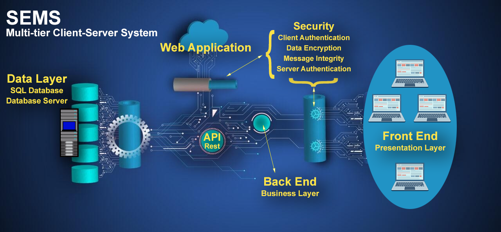
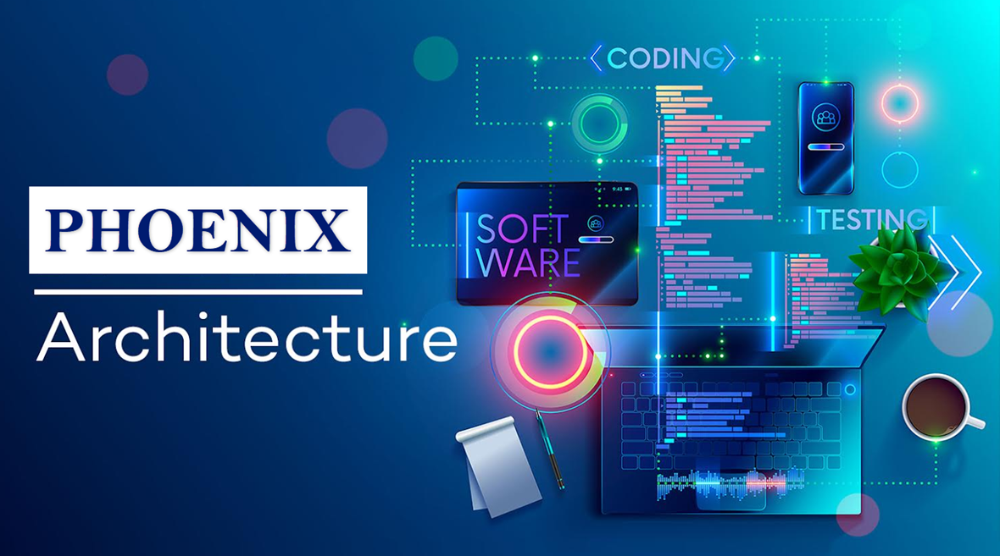

## Introduction
___  

The Sense-i Enterprise Management System (**SEMS**) is a **Multi-tier Client-Server system**.  

   

-   **Information/data** is stored on a **Microsoft SQL Database**, accessed from  
-   a central computer _(Server)_, known as the **Database Server**, using  
-   **Internet connectivty**.    
-   **Firewall Security**, together with  
-   **Client-Certificate Authentication** and  
-   **Encrypted Username & Password** access protects information flow, to and from the    
-   **SEMS Business Application** tier, which is  
-   presented on the **SEMS Front End program** _(Client)_ installed on each Login Users' **Personal Computer**.  
-   The **Web Application** tier allows HTTPS access over SSL _(Secure Socket Layer)_, which provides data encryption, server authentication, message integrity, and client authentication for a fortified TCP/IP connection.  
    -   The Web Application grants public access, authenticated & verified by an **API Rest server**, to register a bonafide individual as web-user, who can send and request information pertinent to the System.

Phoenix is an upgrade to the Sense-i Enterprise Management System **(SEMS)** front-end.  

   

The **Phoenix** Architecture is based on a layered infrastructure.  

Currently in _Beta_ form, Phoenix is being developed using the latest software technology.  

   

The Phoenix front-end program allows you to view, update and add new information which is stored on the Database Server.  

Some of the upgrade features of Phoenix include:
- A Modern and easy-to-use UI _(User Interface)_  
- Enhanced Navigation  
- Create and Save Custom Views  
- Custom "Skins" that change the graphical appearance of your interface  
- More information can be accessed and viewed simultaneously    
- Open screens on different monitors  
- Dock multiple screens next to each other to view related information
- Switch easily between screens and windows using a familiar interface  
- Bulk select and edit multiple records at the same time using Jobs  

## PHOENIX - The First Glimpse  

import ReactPlayer from 'react-player'

<ReactPlayer controls url='https://www.youtube.com/watch?v=_5J3abMICNw' />

For detailed information on the Phoenix features, please refer to the associated documents below:  
-   **["Phoenix Enhanced Navigation"](https://sense-i.co/docs/PHX-NAV)**  
-   **["Custom Views"](https://sense-i.co/docs/PHX-CUSTVIEW)**  
-   **["View, Add & Edit Records"](https://sense-i.co/docs/PHX-RCRDS)**  
-   **["Phoenix Screen Layout"](https://sense-i.co/docs/PHX-SCRNS)**  
-   **["Jobs - Edit Multiple Records"](https://sense-i.co/docs/PHX-JOBS)**  

