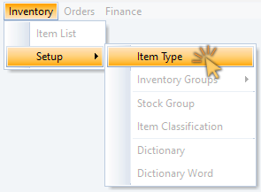
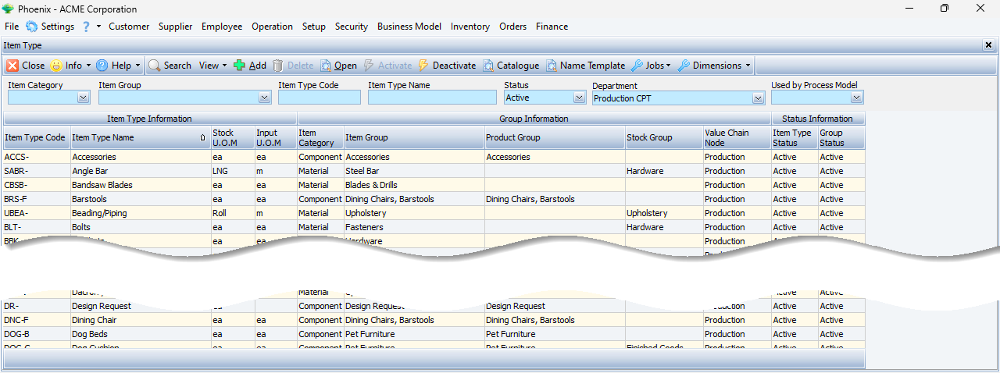
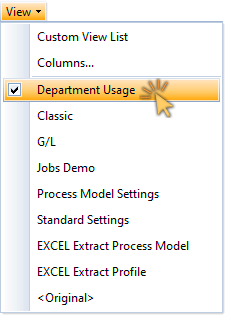
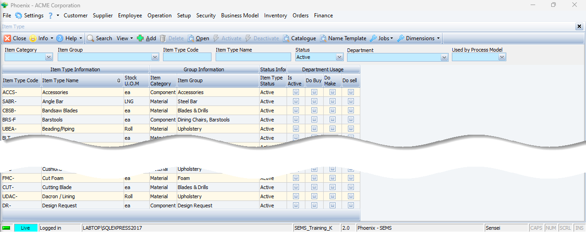
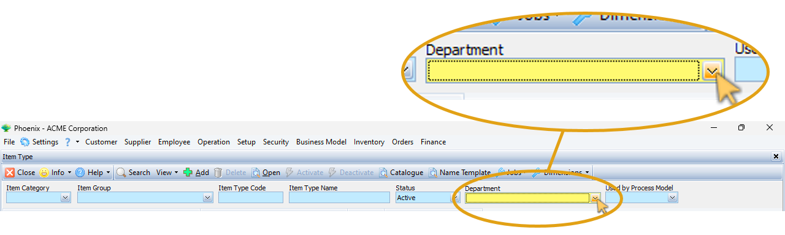
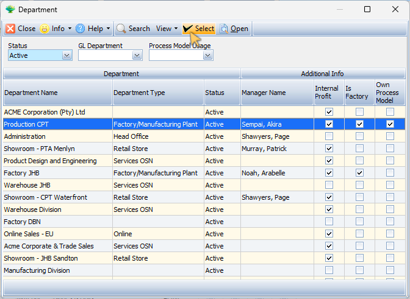
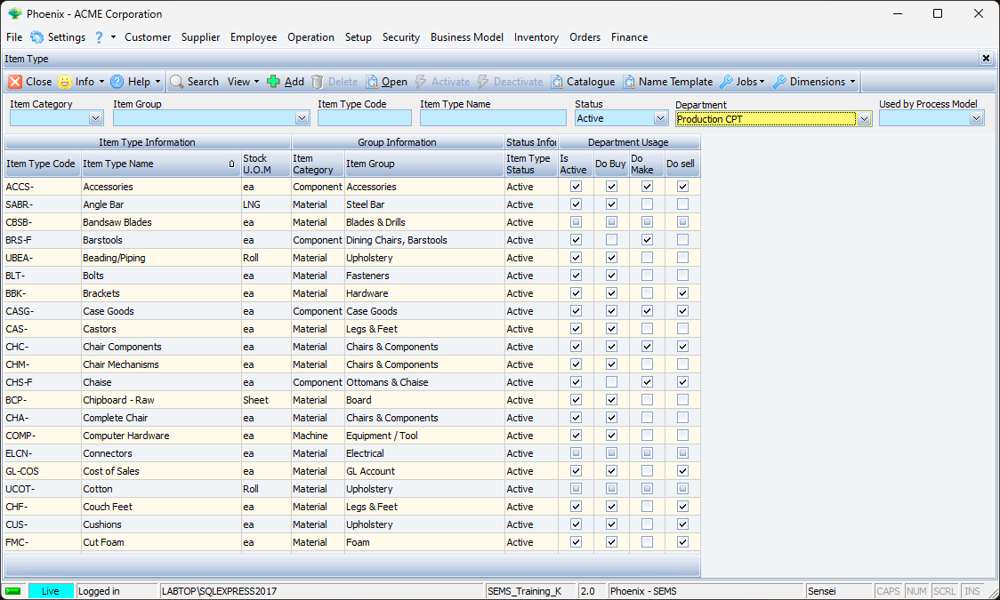
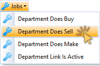
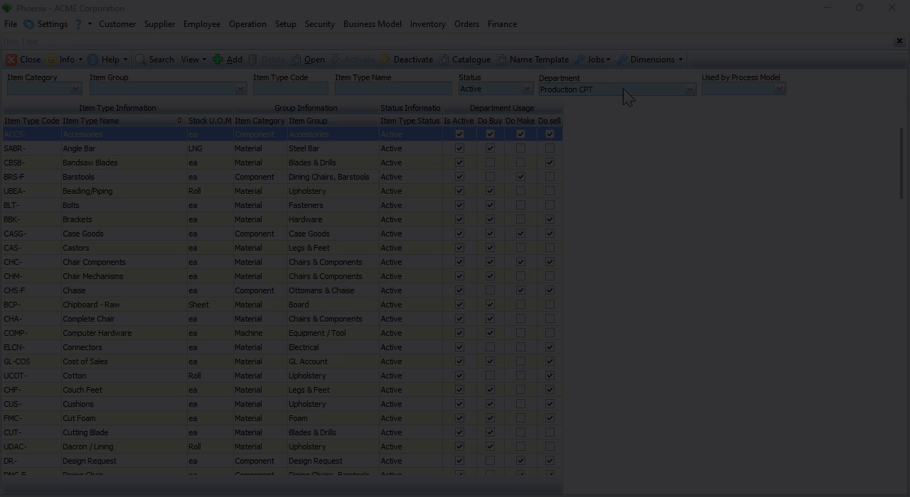

## Bulk Select and Edit Multiple Records  

Phoenix gives you the ability to **Bulk select**, and then **edit multiple data records** using the **Jobs** function.  

:::note  
The **Jobs** function is available on certain list grid screens where the neccessity to edit muliple data records is important.  

In this example, we will demonstrate how to select multiple Resource Item Types, and then change the attributes of all those Item Types using only a few mouse clicks.  

This efficient method of altering muliple records simultaneously, saves you an appreciable amount of time, as opposed to editing those reords individually.  
:::  

### Navigate to the Item Types screen  

1.  Click **Inventory** on the Main Navigation menu.  

2.  Click **Setup** on the drop-down menu, then  

3.  Click the **Item Type** button on the side menu.  

   

The **Item Type** list grid is displayed.  

  

:::important  
The next step is to choose a suitable **View**, and then filter the Item Type list to display only those Item Types that fall under a single manufacturing **department**.  
:::  

4.  Click the **View** button on the Action bar.  

  

5.  Then click **Department Usage** in the drop-down menu.  

The updated Item Type list grid is displayed with the **Department Usage layout**.  

   

6.  In the **Search Panel**, click on the **drop-down button** in the **Department** field,  

   

7.  Click on the relevant department in the drop-down list, and then  

8.  Click the **Select** button on the form Action bar.  

   

The system returns to the Item Type list grid screen.  

9.  To update the list, click **Search** on the Action bar.  

:::note  
Whenever you enter **new search criteria** in the Search Panel, the **Search icon** becomes prominent, indicating that you should click the Search button to update the list.  

   
:::  

The Item Type list grid is updated displaying only those Item Types that belong to the Department selected.  

  

### Select a "Job"  

1.  Click on the **Jobs** button in the Action bar.  

2.  Click on the **Department Does Sell** option in the drop-down menu.  

  

The **Department Does Sell** screen is displayed.  

:::tip  
You can move the _Department Does Sell_ screen to a new position allowing you an improved view of the information on the underlying screen.  

  
:::  

###  Select Multiple Records  

In the next steps we will select muliple records on the Item Type list grid screen.  

:::tip  
Click the **Do sell** column heading to filter the list to sequentially show all the records that are not yet checked.  
:::  

1.  Hold down the [SHIFT] key and select a group of adjacent Item Types from the list, or

2.  You can hold down the control key [CTRL] on the keyboard and then click to select / de-select relevant Item Types that are not grouped together.

  

3.  Click the **check-box** under **Department Does Sell** on the floating "Jobs" window.  

4.  Click the **Apply** button on the form Action bar. 

5.  Then, click the **OK** button in the dialogue box to confirm.  

The system will display an Information dialogue window to notify how many records have been updated.  

6.  Click the **OK** button to close the Information dialogue window.  

Repeat the steps above to apply changes to multiple records using the other menu options in the Jobs function.