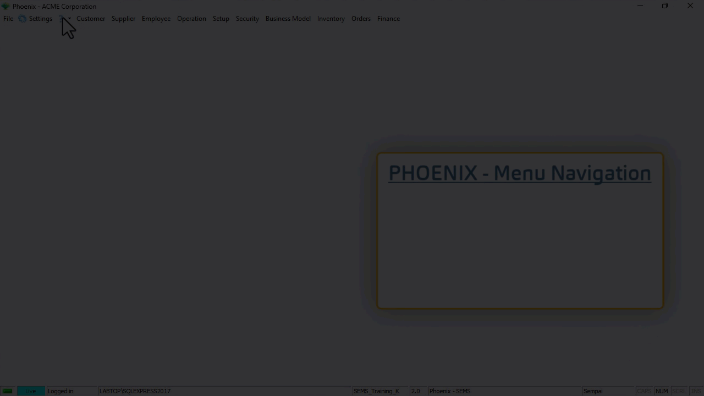
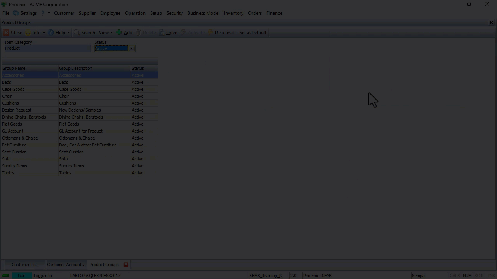

The Phoenix front-end system has 4 types of navigation:  

1.  **Menu Navigation**

2.  **Selection Panels**  

3.  **TAB Navigation**  

4.  **Search Panel** and **Action Bar**  

## Menu Navigation  

Menu Navigation includes the following:  
- Main Navigation Menu  
- Drop-down Menus  
- Side Menus, and Slide-out Menus.  

The **Main Navigation Menu** is the list of functions that runs horizontally along the top of the screen.  

   

The **Drop-down menu(s)** or Secondary Navigation Menus are accessed by clicking on any of the Main Navigation Menu options.  

The **Side Menus** and **Slide-out Menus** (third-tier navigation options) are available as further navigation from relevant drop-down menu options.  

When you click on a function, either in the Main Menu or on the Drop-down / Side Menu, the system will always first display a **List Screen**.  

The **List Screen** shows you what information has already been captured in the system.  

The List Screen lists all the information in the system for the function you have chosen.  

So, if you have clicked on the **Customer List** button, the system will open a form called Customer List and display all Customer records.  

## Selection Panels

### Alphabetic Selection Panel  

The **Alphabetic Selection Panel** is available on all **Party List screens**.  

Use the **Alphabetic Selection Panel** _(Customer List, Supplier List, Employee List, etc.)_ to display only those parties whose names begin with the selected letter.  

   

Click on the **All** button in the Alphabetic Selection Panel to display **all parties** in the list.  

### Tree-structure Navigation  

The Tree-structure Navigation and Selection Panel is available on all screens that list **Resource Items**.  

These include the following screens:
- **Item List** _(accessed by clicking **Inventory**, and then **Item List** using Menu Navigation)_
- **Product Catalogue** _(Products sold to Customers)_  
- **Supplier Catalogue** _(Materials procured from Suppliers)_  

Information about Resource Items is stored at four levels of detail in the Sense-i System.

At the top level, Resources are assigned to "**Categories**" such as Products, Materials, Machines, Facilities and so on.

Each Category is broken down into "**Groups**".

Each Group is further broken down into "**Types**".

Each Type consists of actual "**Item Profiles**" or **instances of specific Items**.

The Categories, Groups and Types are simply ways of arranging and storing information in the Sense-i database to make it easier to search for specific items from the entire list of everything that the company buys and sells.

The Tree-structure Navigation **Selection Panel** enables you to efficiently filter long lists of information to quickly find specific Resource Items.  

   

The **TABs** at the top of the **Selection Panel** allow you to:  
- **Expand** the Categories and view the Groups within each Resource Category,  
- **Expand All** Groups to view the different Types listed under each Resource Group, or  
- **Collapse** the tree-structure to display only the Categories, enabling you to navigate to a specific Group and Resource Type.

## TAB Navigation  

As you click on a menu item, the system opens the **Form** associated with the function in the Main Form section of the screen.  

In the example below, the **Customer List** form, the **Customer Account Group** and the **Product Groups** forms were opened.  

   

By clicking on the different TABs located at the bottom of the screen, you are able to quickly navigate to each of the forms.  

Click the [X] button in any of the TABs to close that form.  

## Action Bar, Search Panel & List Grid  

Each **List Screen** consists of three different sections:  
1.  At the top of the screen, the system displays a series of buttons in the **Action Bar**.
2.  The **Search Panel** is located near the top section of each **List Screen**.  
3.  The **List Grid**, comprised of **columns** & **rows**, makes up the bulk of the screen/form.  

### Action Bar  

The system displays a series of buttons in the **Action Bar** that are related to the form that you are using.  

   

This makes it easy to use the system because you have access to only those features that are relevant to the form you are using at the time.  

### Search Panel  

The **Search Panel** displays several boxes called **Fields** where you can type in, or choose specific information _(e.g. type in a **Customer Name**, or select a **Representative** from the drop-down list of your Company's Representatives)_.  

:::important  
The **Fields** contain information and options that relate to the specific form or function you are using.  
:::  

   

Once you have entered words or options in the fields on the **Search Panel**, the **Search icon** becomes prominent.  

   

Whe you click the **Search icon**, the Phoenix application uses the words and/or options you have entered into the fields on the **Search Panel** to find all matching **Records** or **Transactions** that are stored on the Database Server, and then displays this information in the **Grid** on the **List Screen**.  

In the example above, the system updates the list of Customer Profiles on the screen to show only those Customers that match the name _(or part of the name)_ entered.  

### The List Grid Section  

The List Screen allows you to view and update information in the system.  

The List Grid contains **Information Bands** that span over several **columns**.  

In this example, the **Customer Profile Information** band, spans over the Customer **Account Code**, Customer **Name**, **Account Group**, and **Status** columns.  

   

Under the columns, the **Record Rows** displays all information related to each specific entity, in this case, each specific customer in the grid.  

In the next document, **["Custom Views"](https://sense-i.co/docs/PHXCUSTVIEW)**, we will explain and illustrate how to change the layout configuration of the list grid.  

