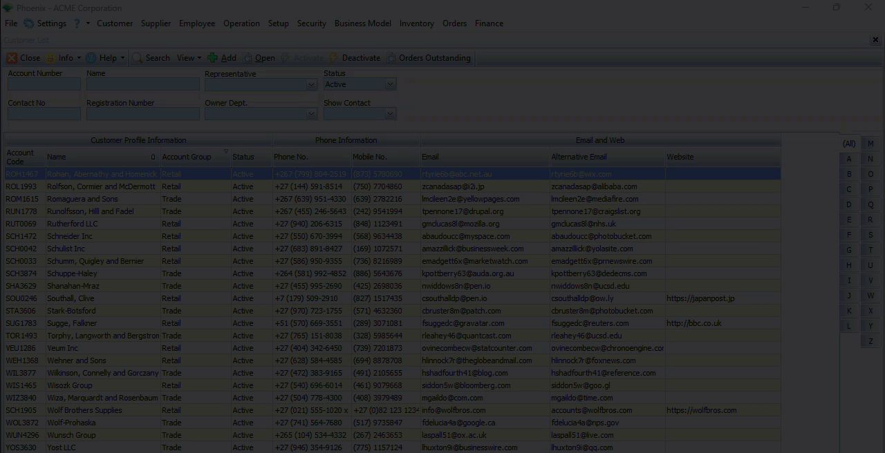
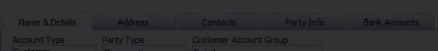
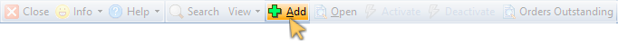
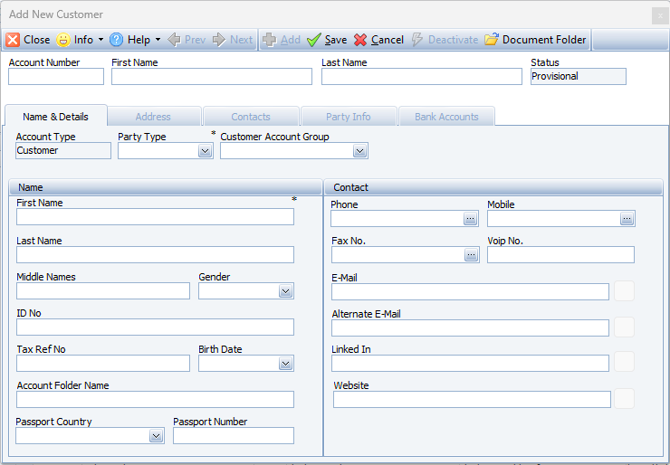
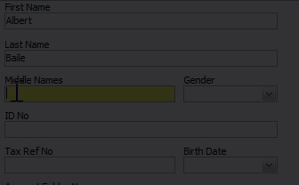
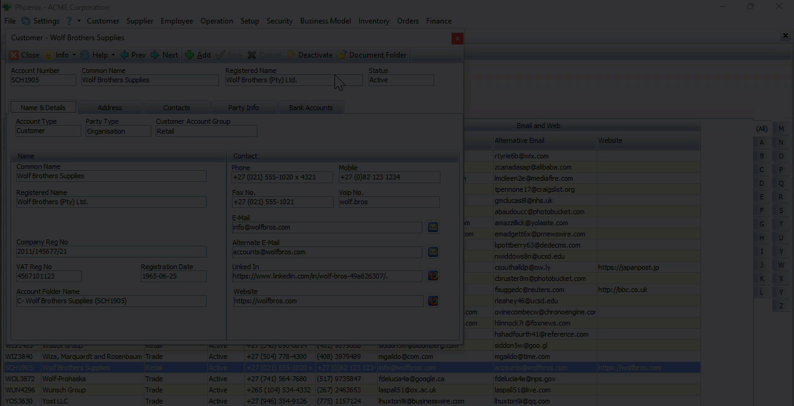

With regards to data Records, these are the three main actions that you can do on the system:
1.  You can **VIEW** existing information.  
2.  You can **ADD** new information.  
3.  You can change or **EDIT** existing information.  

## View Existing Information.  

### Search Panel  

The **Search Panel** displays several boxes called **Fields** where you can type in, or choose specific information _(e.g. type in a **Customer Name**, or select a **Representative** from the drop-down list of your Company's Representatives)_.  

   

Once you have entered words or options in the fields on the **Search Panel**, the **Search icon** becomes prominent.  

   

Whe you click the **Search icon**, the Phoenix application uses the words and/or options you have entered into the fields on the **Search Panel** to find all matching **Records** or **Transactions** that are stored on the Database Server, and then displays this information in the **Grid** on the **List Screen**.  

In the example above, the system updates the list of Customer Profiles on the screen to show only those Customers that match the name _(or part of the name)_ entered.  

### Open Detail Screen  

To view the details pertaining to an exisiting record:
1.  Click on the relevant **record row**, then  

2.  Click the **Open** button on the Action bar.  

:::tip  
Another way to open the Detail screen, is to simply **Double-click** on the record row .  
:::  

The program will display the **Detail screen** _(also known as a **Listener**)_

  

This form contains different detail pages, accessed by clicking on the **TABs**.  

   

Once you've reviewed all the information, click the **Close** button on the form Action bar.  

## Add Information  

1.  Click on the **Add** button on the **Customer List Action Bar**.  

   

The system opens a **blank form** into which you can enter new information.  

   

Each screen contains various **Fields** into which you can enter information.  

There are two ways to enter information:  
1.  You can **type information into a field** that allows this, or  
2.  **Choose** information from a **drop-down list** of options.   

   

:::important  
Once you've entered the necessary information in the various fields on the **Primary Profile** page, in this example, the fields under the **Name & Details** TAB - click the **Save** button on the form Action Bar.

The other **TABs** now become accessible.  
:::  

This different detail pages are accessed by clicking on the **TABs**.  

   

Completing a form is simply a matter of working through each field on the different pages under the TABs, entering information using the two entry methods described above.  

## Edit existing information  

To edit or amend an existing record:
1.  Click on a record row, then  
2.  Click the **Open** button on the Action bar.  

  

:::tip  
You can **double-click** on a record row to open the detail screen.  
:::  

The system opens the same form as the _"Add New Customer"_ above, but with information previously entered that you can **edit** or **update.**  

:::important  
To edit/update information of an existing record, click the **Deactivate** option on the form Action bar.  

   

Once you have amended the relevant information, click **Save**, and then the **Activate** button on the form Action Bar.  
:::  
