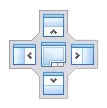
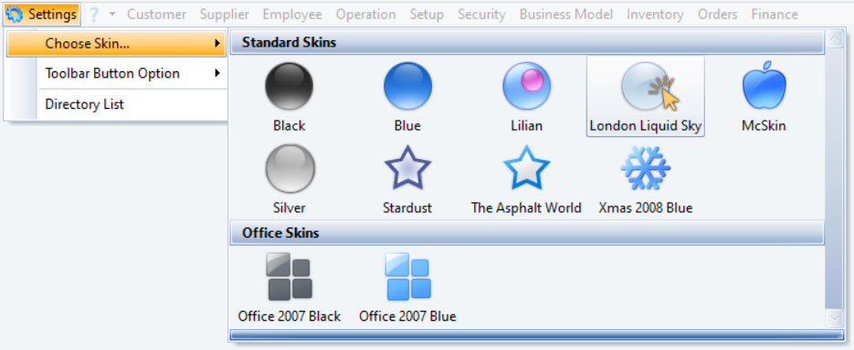

## Arrange Screens to View Supplementary Info  

The Phoenix system allows you to resize and arrange different screens and windows to suit your personal preferrences.  

  

To resize the main Phoenix screen;

1.  Click on the **Maximise / Restore** icon located in the top-right corner.  

2.  With your mouse cursor, hold down the left mouse button on one of the edges, then  

3.  Drag the edge to the desired position / size, and release the mouse button.  

4.  Repeat steps 2 & 3 above with the other edges, until you are satisfied with the window size.  

To position the main Phoenix screen:  

5.  Hold down your left-mouse button anywhere in the top bar of the window, then  

6.  Drag the entire window to the desired location, and then release the mouse button.  

Once you have opened a detail screen, follow steps 2 - 6 above to resize and position the detail _(Listener)_ window.  

If you open more main list grid screens:

7.  Click on the relevant TAB(s) at the bottom of the main Phoenix screen, then  

8.  Repeat the steps above to resize and position each of the detail windows.  

:::important  
When you click on the different TABs at the bottom of the main Phoenix window, the individual detail windows will retain their position.  
:::  

## Dual/Multiple Monitors 

   

If you use Dual or even Multiple monitors, another powerful feature of the Phoenix system is the ability to drag an entire list grid screen to a different monitor.  

To do this:  
1.  Position the cursor and hold down the left mouse button on the relevant TAB at the bottom of the main Phoenix window, then  

2.  Drag the window over to the other monitor, and release the mouse button.  

  

3.  Follow the steps in the **["Arrange Screens to View Supplementary Info""](https://sense-i.co/docs/PHXSCREENS#arrange-screens-to-view-supplementary-info)** section above, to resize and position the various windows on the different monitors.

This power feature enables you to access, view and work with a vast amount of information simultaneously.  

##  Docking - the Basics  

A floating window is one that you can freely move by clicking and dragging it, as explained above.  

The Phoenix "Docking" feature enables you to **dock floating windows** by neatly positioning and fixing them in different **fixed locations** within the main Phoenix screen.  

   

To do this:  
1.  Hold down your left-mouse button anywhere in the top bar of the floating window, then  

2.  (While still holding down the mouse button) position the cursor on the desired location of the **Docking Position Control**  

:::tip  
Position the cursor (keeping the mouse button down) on the **top** / **right** / **bottom** OR **left** icon of the **Docking Position Control**.  

The system will visually outline the **_potential_ window postion**.  
:::  

3.  Release the mouse button.  

The window will _snap_ into the fixed docked position.  

You can now resize the docked window:  

4.  Hold down the left mouse button on one of the edges, then  

5.  Drag the edge to the desired position / size, and release the mouse button.  

Repeat the steps above to dock (and resize) other floating windows.  

## "Skins"  

With the Phoenix "Skins" feature the graphical appearance of your interface (icons, colours, and contrast) can be changed by choosing from a wide range of preset custom themes, to suit the purpose, topic, or tastes of different users.  

  

1.  Open a list grid screen from the Main Navigation menu, then  

2.  Open a detail screen as well.  

:::tip  
The above steps are recommended, this to give you a comprehensive view of the different themes as they are chosen.  
:::  

3.  Click on **Settings** on the Main Navigation menu, then  

4.  Click on **Choose Skin...** in the drop-down menu.  

The system will display a range of preset custom themes.  

  

5.  Click on the theme of your choice.  

The graphical user interface will be updated accordingly.  

Repeat the steps above to choose the theme that suits your preferrence.  

