## Procedure Guideline
___  

In some cases you might want to load the materials for a Process Model by importing a list of materials for a product from an Excel Worksheet.  

1.  Select **Utilities** from the main menu, then click on **Import Process Model Materials** in the drop-down menu.  
	
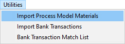  

2.  The program will open the **Import Data** screen.  
	
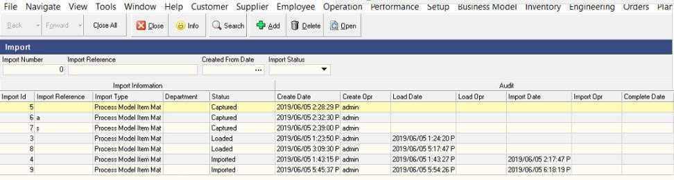  

3.  To import materials for a new product click the **Add** button on the Action Bar.  

4.  The program will open the **Add New Import** screen.  
	
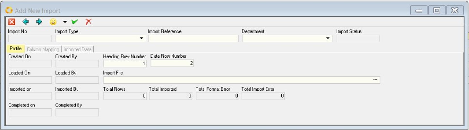  

5.  Choose the type of information you wish to import from the drop down list of **Import Types**.  

    In this case it is **"Process Model Item Materials"**.  
	
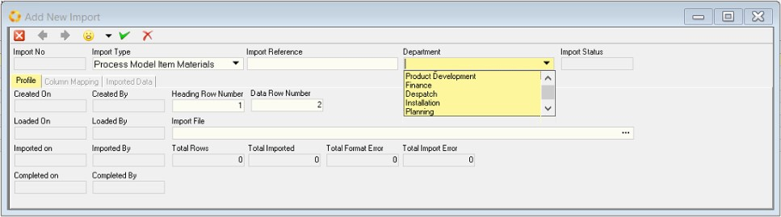  

6.  Choose the **Department** in which you are going to create the Process Model.  
    Normally, for products that your company sells this will be the "Production" department.  

7.  Define on which rows in your source Excel Spreadsheet the Column Headings appear and on which row the first data record appears.  

In the following illustration as an example, the column headings appear on Row 2 and the Data begins on Row 4.  
	
  

In this example the column headings appear in Row 1 and the data starts in Row 2.  
	
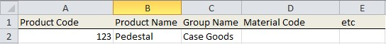  

Enter the information in the **Heading Row** number and the **Data Row** number fields according to how your spreadsheet is defined.  
	
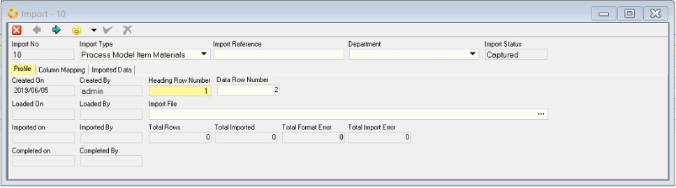  

8.  To find the source file, click on the **three-dot button** in the **Import File** field.  
	
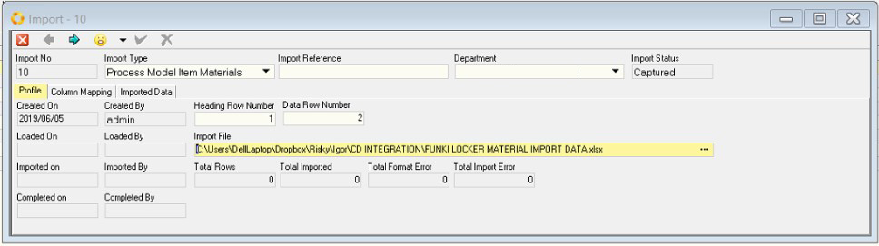  

9.  The program will remember the last folder from which you retrieved the specific data and open Windows Explorer to this folder so that you can select your next file to import.  

10.  Click the **Column Mapping Tab**.  
	
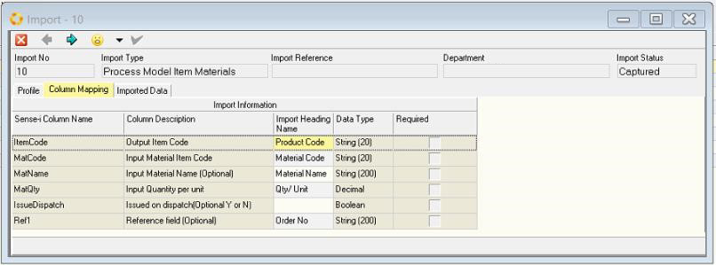  

11. The program will show the list of all the columns in your source spreadsheet in the **Column Description** column, and the Sense-i column required in the **Sense-i Column Name** column.  

12. The grid will also show you what kind of information is required in each column and what is required.  

13. Click the **Imported Data** tab.  
	
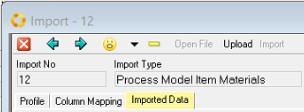  

14. The program will display a dialog showing you have many records have been loaded in total and how many rows have errors.  
	
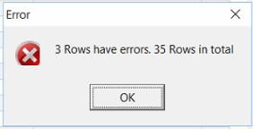  

15. The program will then display all the data in your source spreadsheet and show error messages and result codes in the Results columns.  
	
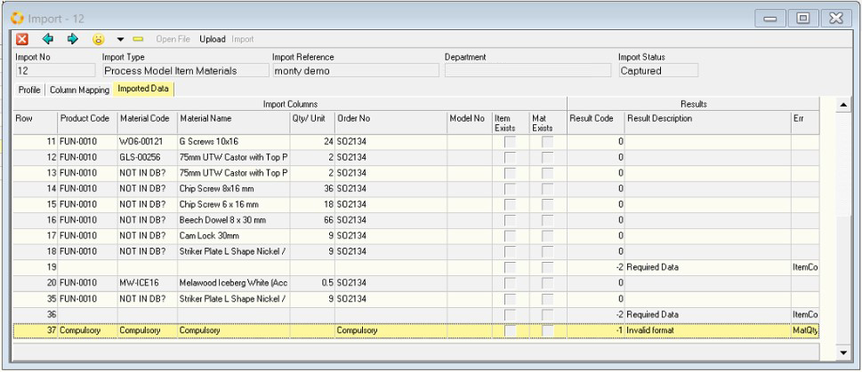  

16. Click the **Upload** button to load the information. Note that at this point it has not been saved to the database.  

17. A list of errors will appear.  

For example, if the information is missing the error will read:  
**"Data is required."**

If the material code on your spreadsheet does not match an EXISTING material code in the database in will display the message **"Material Code not found."**  

In this case you will need to go to the Supplier Catalogue and load the material before you can continue.  

The full list of error codes is displayed below.  
	
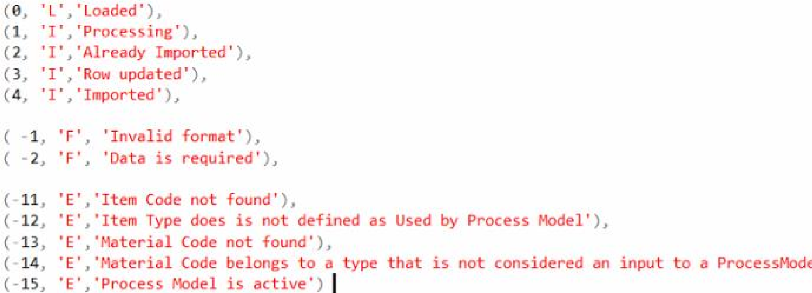  

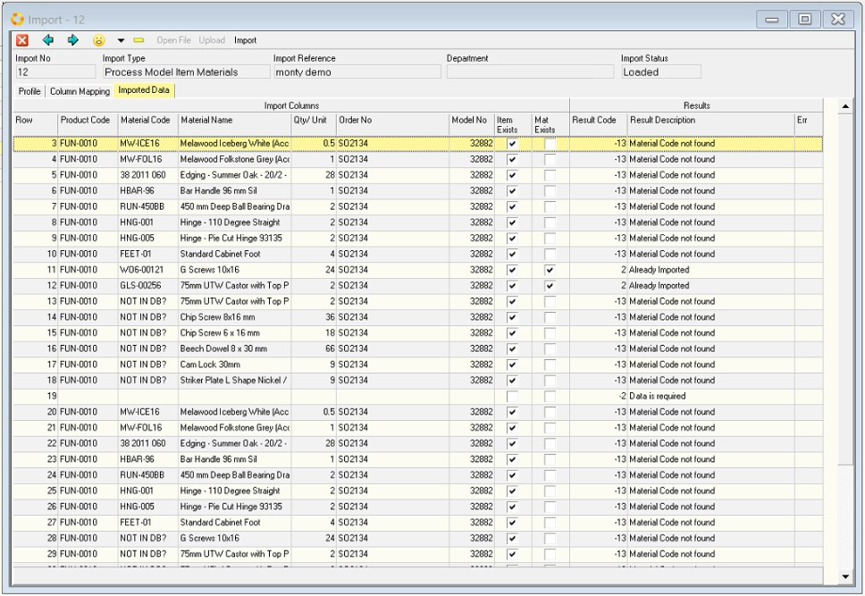  

18. To save the information in the grid against each product, in other words to create a list of Process Model Inputs automatically from the source data you have loaded in the grid, click the **Import** button.  

19. Then go to the Process Model screen and open the Process Model to check the inputs are correct, and activate the Process Model.  

20. Finally, go to the Sales Order for which you have defined the materials and click the Materials Tab. The program will display a list of all materials required to produce each product in your sales order.  

**This is the end of this procedure.**
