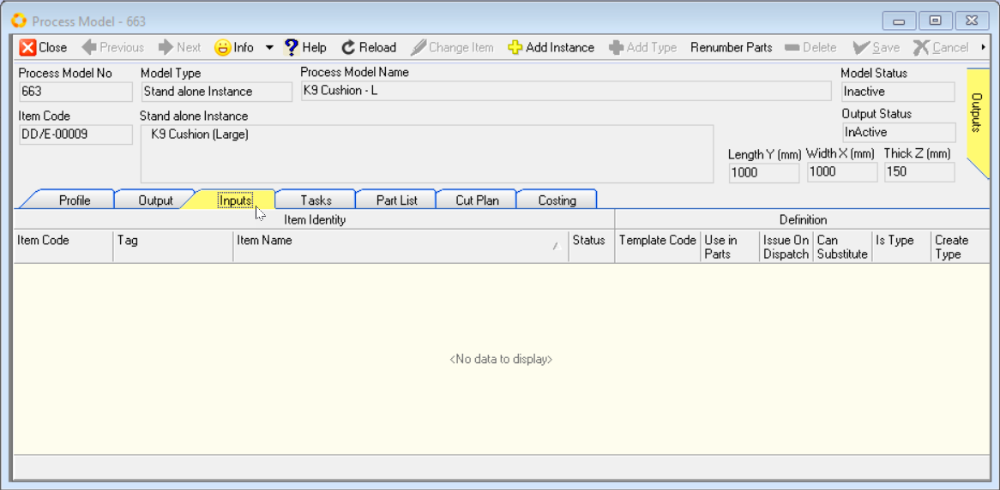
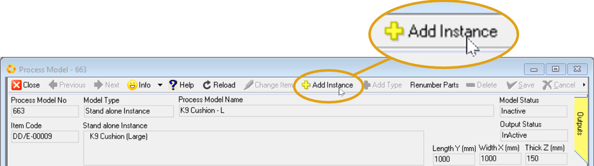
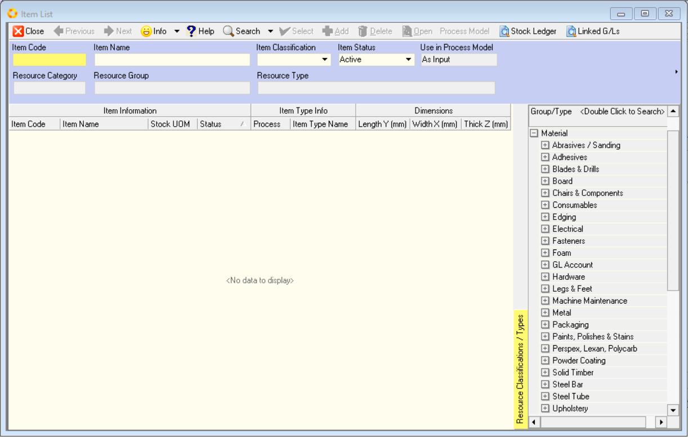
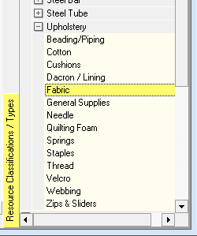
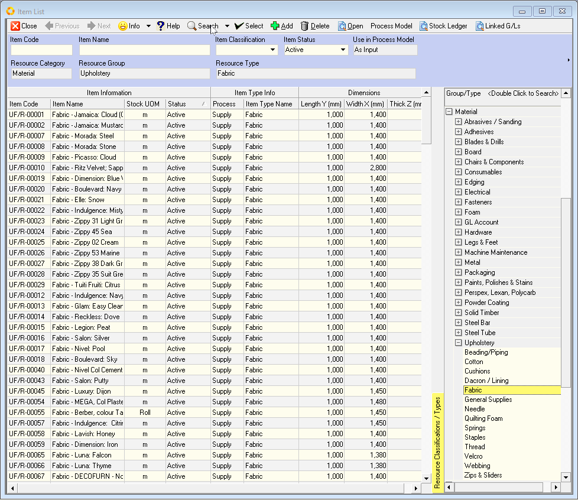
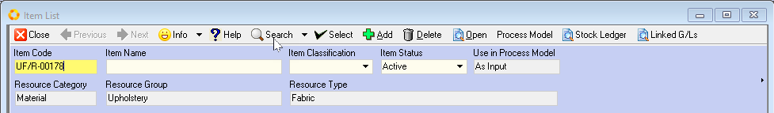
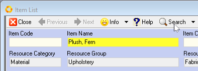
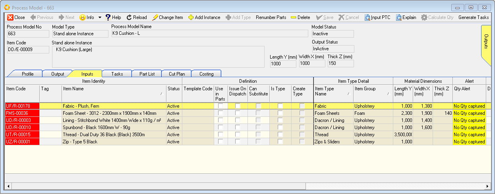
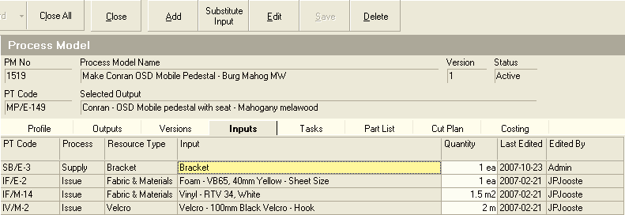
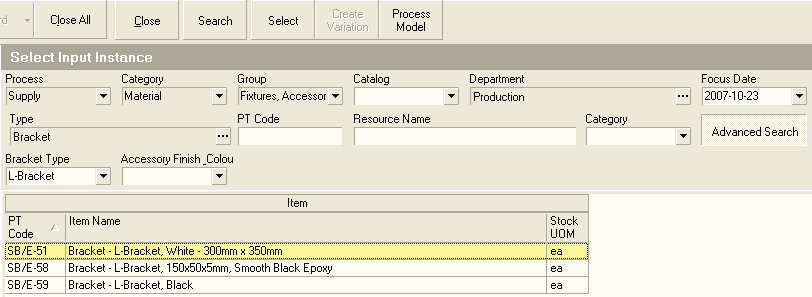

## Procedure Guideline
___

Once you have opened the Process Model screen you can add the **Materials** needed to complete the Process from those defined in the **Supplier Material Catalogue**.  

This enables the system to calculate what Materials are required in Production when Sales Orders are received from Customers, and assist relevant employees with the **Purchasing of the correct Materials** needed.

### Navigate to Inputs TAB  

1.  To view a list of all the Inputs required by the selected Process Model, click the **Inputs** tabbed worksheet.  
	
  

2.  The system will display the **Process Model Input List** sheet.  

This sheet will list (once added) each of the **Materials** that have been defined as **Inputs** to the selected Process.  

<!-- 4. You can click the column headings to sort the information. You will notice that the grid displays both the Material Type (such as Wood) and the specific Material Instance (such as Chipboard, 2750mm x 1830mm x 16mm) for each input listed.   -->

3.  To link a new Material as an Input to the Process Model, click the **Add Instance** button on the form Action Bar.  

  

4.  The **Item List** screen is displayed.  

  

### Material / Item search  

You can search for Materials by selecting any of the **Material Groups** in the **Selection Panel** (right-hand side of the screen).  

2.  Click on the **[+]** button of the selected **Material Group** to display the list of **Material Types**.

  

:::note  
If you double click on any of the **Group** or **Type** records the system will display all matching Materials in the Catalogue.  
:::  

3.  To search for a **specific item**, simply double-click on the record in **Material Group/Type tree** that best describes the Material Group or Material Type of the specific item you want to work with.  

For example, you could select "**Upholstery**", and under this select "**Fabric**".  

  

4.  Once you have entered the basic Search Criteria, click on the **Search** button on the form Action bar.  

5.  The system will now display a list of all Items that match the **"filters"** you have selected in the **Material Group/Type Selection** panel.  

  

6.  If you know the code for the specific item you are looking for, type the Item Code in the **Item Code** field, then click on the **Search** button on the form Action Bar.  

  

7.  You can also search for specific Items by typing a **word** that is contained in the Material Name in the **Item Name** field, then click **Search**.  

  

:::tip  
You can use the **Quick Filter controls** at the top of each column heading.  

This makes it very quick and easy to search through long and complicated **Item Catalogues** to find the items you wish to include in your **Process Model**.  

Refer to the document titled **["Customising Information Display"](https://sense-i.co/docs/LST004)**.  
:::  

8.  Once you have found the item you want to include as an Input in the Process, click on the relevant row, then click the **Select** button on the form Action Bar.  

9.  You can repeat the steps above for each Input you need to link to the Process Model.  

10. Once youve have selected all the necessary items, click the **Close** button on the form Action Bar.  

11. The system will return you to the Process Model Inputs screen.  

  

You will notice that the record fields under the **Item Code** column are coloured red, and the record fields under the **Alert / QTY Alert** column are hi-lighted in yellow with the alert information **"No QTY captured"**. 

<!-- You will notice that the Material Type you selected in step 7 and 8 is displayed in the list. If you look at the information in the grid you will see that two of the columns have the headings Resource Type and Input. The Resource Type column displays the name of the Type of Material you have linked as an Input. If the name displayed in the Input column is the same as the name displayed in the Type column, this is an indication that you have not defined the specific Material needed. You can leave the input set at the Material Type level, but only if the Output displayed in the Selected Output field is set at the Product Type level.   -->

<!--   

10. To link the Process Model to a specific Input, click the Material Type row in the grid and then click the Substitute Input button on the Form Bar.  

11. The system will display a screen titled Select Input Instance so that you can search for the specific Material you wish to link to the Process Model.  

  

12. You can scroll down the list of Materials to select the specific Material you wish to link to the Process Model. If the use of dictionaries have been defined and you want to search for a specific Material from a long list of records in the grid, click the Advanced Search button.  

13. The system will display the names of the dictionaries so that you can select words that best describe the Material you wish to link to the Process Model.  

14. Then click the Search button on the Form Bar.  

15. The system will then reduce the list to show only those Materials match the search criteria you have entered. Click on the specific Material you want to link to the Process Model.  

16. Then click the Select button on the Form Bar.  

17. The system will return to the Process Model Input Screen and display the name of the specific Material in the Input Grid.  

  

18. You can repeat the steps above for each Input you need to link to the Process Model.   -->

12. When you have completed adding the inputs you can either click on another of the tabs on the Process Model screen, or you can click the Close button.  

**This is the end of this procedure.**
