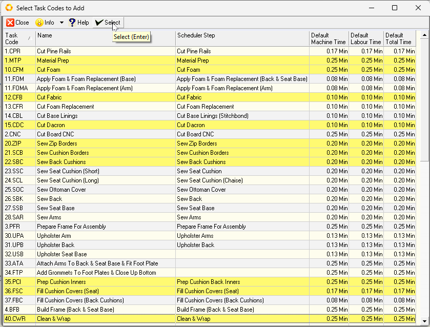

## Introduction  
___

It is important to define the specific actions, activities or Tasks that are performed as part of the processes you wish to schedule.  

Process Model Task information is used to **Accurately Cost** the **Labour and Machinery** used in a process and to **Schedule and Track Orders** in the company.  

In order to define the tasks you will need to return to the Process Model previously created, and then capture the information about the **Tasks** recorded on the Process Model Task List worksheet for each product or service provided by the company.  

## Procedure Guideline  

### Navigate to Process Models  

1. Click on the **Engineering** button in the Main Navigation menu.  

2. Click on the **Process Model** option in the Drop-down menu.  

  

The system will display the **Maintain Process Model** list screen.  

<!-- This screen lists all of the Process Models that have been captured in the Sense-i System.   -->

  

### Search for Process Model  

1. You can search for specific Process Models by entering information in the various **Search Fields** listed at the top of the screen and then clicking the **Search** button.  

  

:::note  
You can also use the **Resource Classification / Types** tree on the right-hand side of the screen, by clicking on the **Group** and/or **Item Type** that best describes the Item you are searching for.  

Then click the **Search** button.  

  

:::  

The system will display a list of all the Process Models that match the Search Criteria you have entered.  

2. To capture the details of the tasks for a Process Model, select the correct **Process Model** in the list and click the **Open** button on the Action Bar.  

The system will display the details of the selected Process Model on the **Process Model - ###** screen with a set of worksheet TABs.  

Ensure that you have opened the correct Process Model by reading the **Process Model Name** at the top of the screen.  

  

3. Click the **Output** TAB.  
    Select the correct Output _(Product)_ for which you wish to define the Tasks. 

4. On the Output Tab Sheet click on the name of the Product for which you are defining the Tasks.  

:::important  
Check that the name of the Product or Service for which you are defining tasks appears correctly in the **Selected Output** field.  

This is to ensure that you do not mistakenly add or modify the tasks for the wrong product.  
:::

  

### Add Tasks

1. Click the **Tasks** TAB.  

The system will display the grid list of the Tasks for the selected Product in the Tasks TAB sheet. You will notice that the columns on this form, list the Skill or **Task Code**, the **Production Step**, the **Task Name**, the **Labour**, **Machine**, **Total Times**, and other settings used for scheduling.  

  

2. To add new tasks to the Process Model, click the **Add Code** button on the form Action Bar.  
  
___

The system will display a floating window titled **"Select Task Codes to Add"**.  

This screen lists all of the Task Codes (or Skills) that have been defined in the system.  

  

3. Click on the Tasks that you want to include in your Process Model Task List.  

    These are the tasks that have to be completed to create the product you have selected.  

:::tip  
You can hold down the "Control" key and click on more than one Task Code.  
:::  

3. Click the **Select** button.  

4. Once you have selected the Task Codes that apply to the Process Model, the system will return you to the Process Model Task sheet.  The system will display each of the Task Codes you have selected in the **Task Code** column and the name of the Task Code in the **Task Name** column.  

  

:::important  
Usually this is not sufficiently detailed to describe a task. The Task Name that appears in the **Task** field is displayed on the Scheduling screen and is printed on the To-Do Lists for each Team Member.  

If the information provided on these To-Do Lists is going to be meaningful to the people who need to perform the assigned tasks, you should expand the **Task** Name so that the work you wish performed is clearly stated. This will prevent time being wasted by having Team Members go to Management to ask what work must be done.  

Type a more **detailed description** of the Task you wish performed in this field. Usually a good format to use is a **Verb -- Noun -- Standards -- Notes**.  

For example, **Cut** (Verb) **ALL Sides** (Noun) **to 1000mm x 1000mm** (Standards) -- **Ensure Square Cut** (Notes).  

  

:::  

5. Enter a name for each task that is more specific than the default used.  

This is important because the **Task Name** is printed on the **To-Do List** given to each employee.  

The more descriptive your Task Name, the easier it will be for employees to know and understand exactly what work they must do.  

6. If any default times have been defined for Labour or Machine usage, these will be displayed in the **Labour Time** and **Machine Time** columns.  

  

7. Where relevant. update and Enter the total duration required to complete each Task in:  
-   the **Labour Time** column  

-   the **Machine Time** column _(if the Task is performed on a specific Machine)_.  

:::note  
This information is used for **Costing** and **Scheduling**.  
:::  

8. Enter the Lead Time for the Task in the **Lead Time** field.  

:::note  
This is optional and should only be used if the delay between tasks is of a long enough duration that it needs to be managed.  

This is the time (in hours) that needs to elapse before the next task can begin.  

This is useful if there is a long distance or delay between two tasks, e.g. paint or glue needs to cure properly before the next task can begin.  
:::

You now need to specify how often the Task is repeated every time a Process Order _(i.e. Job Card)_ is created.  

This could be once for each batch in the order, once for each item made (i.e. the output), once for the order, or once for each person who is a customer of the order (i.e. Per Contact).  

  

9. Select the appropriate option from the drop-down list.  
    Usually this is set to **"Per Output"**.   

10. If you plan to schedule this task, click the **Schedule Task** check-box.  

  

11. You can also change the sequence in which the tasks are performed by changing the sequence number in the **Seq No** column.  

  

12. To remove a Task from the list, click on the name of the Task in the list, then click the **Delete Code** button on the form Action Bar.  

13. To add additional Tasks to the Process Model, click the **Add Code** button and repeat steps 3 to 12 until you have captured all the Tasks required to complete a Process correctly in the system.  

14. Once you have completed entering information about the tasks that must be performed, click the **Save** button on the form Action Bar.  

  

___

**This is the end of the procedure.**
