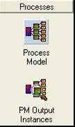
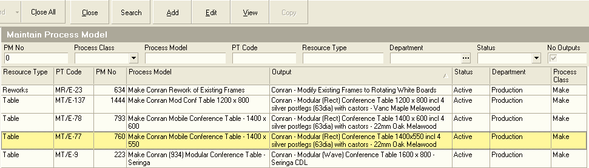
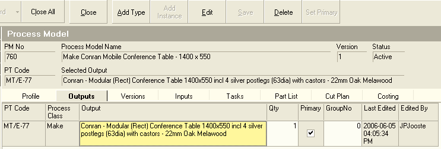
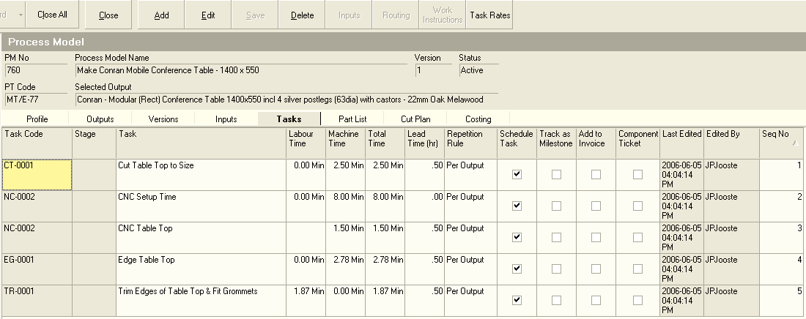

## Procedure Guideline
___

It is important to define the specific actions, activities or Tasks that are performed as part of the processes you wish to schedule.  

Process Model Task information is used to **Accurately Cost** the **Labour and Machinery** used in a process and to **Schedule and Track Orders** in the company.  

In order to define the tasks you will need to return to capture the information about the Tasks recorded on the Process Model Task List Development Worksheet for each product or service provided by the company.  

1. Click on the Process Bar in the Navigation Menu.  

2. Click on the Process Model Icon in the Navigation Bar. 	

  

The system will display the **Maintain Process Model List** screen.  This screen lists all of the Process Models that have been captured in the Sense-i System.  

  

3. You can search for specific Process Models by entering information in the various Search Fields listed at the top of the screen and then clicking the Search button.  

The system will display a list of all the Process Models that match the Search Criteria you have entered.  

4. To capture the details of the tasks for a Process Model, select the correct Process Model in the list and click the Edit button on the form bar.  

The system will display the details of the selected Process Model on a set of tabbed worksheets. Ensure that you have opened the correct Process Model by reading the Process Model Name at the top of the screen.  

  

5. Select the correct Output or Product for which you wish to define |
| the Tasks. Click the Output Tab.  

6. On the Output Tab Sheet click on the name of the Product or Output for which you are defining the Tasks.  

  

7. Click the Tasks Tab Sheet. Check that the name of the Product or Service for which you are defining tasks appears correctly in the Selected Output field. This is to ensure that you do not mistakenly add or modify the tasks for the wrong product.  

The system will display the details of the Tasks for the selected Product in the Tasks Tab Sheet. You will notice that the columns on this form list the Skill or Task Code, the Production Stage, the Task Name, the Labour, Machine and Total Times and other settings used for scheduling.  

  

8. To add new tasks to the Process Model, click the Add button on the form bar.  

The system will display a floating window titled "Select Task Codes." This screen lists all of the Task Codes (or Skills) that have been defined in the system.  

9. Click on the Tasks that you want to include in your Process Model Task List. These are the tasks that have to be completed to create the product or output you have selected. You can hold down the "Control" key and click on more than one Task Code.  

  

10. Click the Select button.  

11. Once you have selected the Task Codes that apply to the Process Model, the system will return you to the Process Model Task Screen.  The system will display each of the Task Codes you have selected in the Task Code column and the name of the Task Code in the Task Name column.  

12. If any default times have been defined for Labour or Machine usage, these will be copied into the Labour Time and Machine columns.  

  

You will notice that the system will display the Task Code you have selected in the Task Code field and also will have inserted the Task Code Name in the Task Name field. Usually this is not sufficiently detailed to describe a task. The Task Name that appears in the Task Name field on the Add Process Model Task screen is displayed on the Scheduling screen and is printed on the To-Do Lists for each Team Member. If the information provided on these To-Do Lists is going to be meaningful to the people who need to perform the assigned tasks, you should expand the Task Name so that the work you wish performed is clearly stated. This will prevent time being wasted by having Team Members go to Management to ask what work must be done. Type a more detailed description of the Task you wish performed in this field. Usually a good format to use is a Verb -- Noun -- Standards -- Notes. For example, Cut (Verb) Top and Sides (Noun) to 900mm x 1600mm (Standards) -- Check for Chipping (Notes).  

It should be obvious that if all the work and communication in the company was this clear, many problems would be prevented and productivity and morale would be greatly improved.  

13. You can now enter a name for the task that is more specific than the one used for the Task Code. This is important because the Task Name is printed on the To-Do List that is given to each employee in the company and the more descriptive your Task Name, the easier it will be for employees to know and understand exactly what work they must do.  

14. Enter the total duration required to complete each Task in the Labour Time column if the Task is performed by an employee. This information is used for Costing and Scheduling purposes.  

Enter the total duration required to complete each Task in the Machine Time column if the Task is performed on a specific Machine.  

This information is used for Costing and Scheduling.  

15. Enter the Lead Time for the Task in the Lead Time field. This is the time, in hours, that needs to elapse after this task is completed, before the next task can begin. This is useful if there is a long distance or delay between two tasks, or if paint or glue needs to cure properly before the next task can begin. This is optional and should only be used if the delay between tasks is of a long enough duration that it needs to be managed.  

16. You now need to specify how often the Task is repeated every time a Process Order (i.e. Job Card) is created. This could be once for the order, once for each batch in the order, once for each item made (i.e. the output) or once for each person who is a customer of the order (i.e. Per Contact). Select the appropriate option from the drop down list. Usually this is set to "Per Output."  

17. If you plan to schedule this task, click the Schedule Task block.  

18. You can also change the sequence in which the tasks are performed by changing the sequence number in the Seq No column.  

19. Once you have completed entering information about the task that must be performed, click on the Save Button on the Form Bar.  

20. To change the details of a Task, click on the name of the Task in the list, then click the Edit Button on the Form Bar.  

21. To remove a Task from the list, click on the name of the Task in the list, then click the Delete Button on the Form Bar.  

22. To add additional Tasks to the Process Model, click the Add button and repeat steps 9 to 20 until you have captured all the Tasks required to complete a Process correctly in the system.  

**This is the end of the procedure.**
