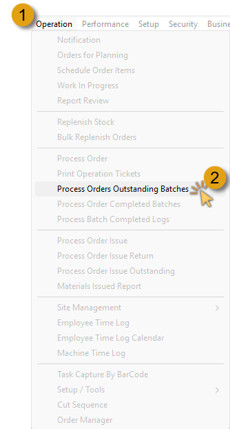
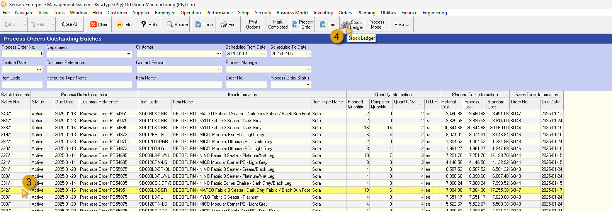
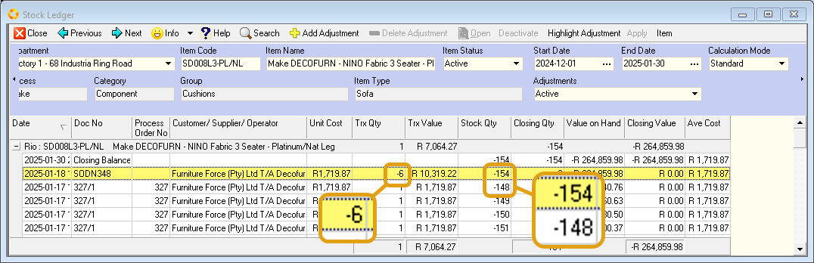
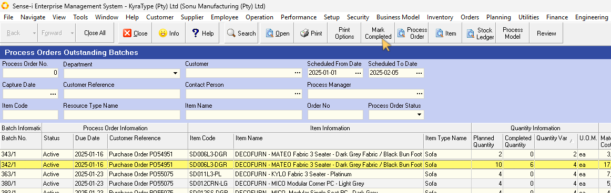
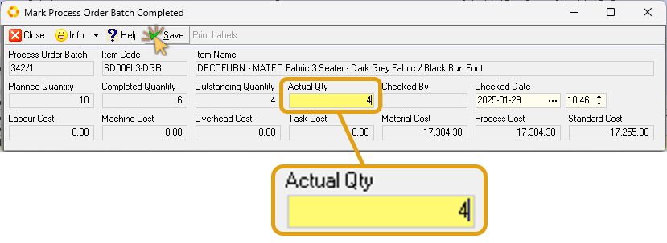
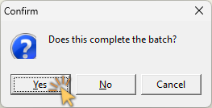
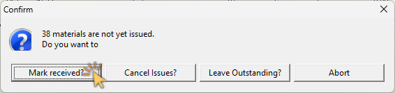
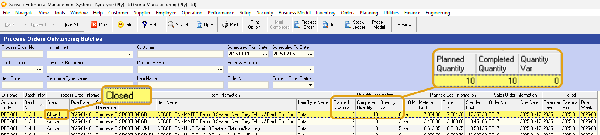

## Introduction
___  

This procedure enables a person in the Production or Finished Goods department to record which Process Orders _(aka Job Cards)_ have been completed. The system will change the status of a Process Order from Active to Closed once the Process Orders has been marked as complete.  

In addition, the value of the items made will be transferred from work-in-progress stock into Finished Goods stock.  

### Why would you use this procedure?  

To mark Process Orders as complete or finished and to move the value of goods from work-in-progress into Finished Goods.   

Ideally a terminal should be placed at the end of each Production Line or at the entrance to the Finished Goods Stock area and as goods are moved from the Production Line into the Finished Goods Stock area they should be counted and the completed quantity should be entered into the SEMS System using this procedure.  

## Procedure Guideline  

In this document we will describe and illustrate the steps needed to identify outstanding items in process order batches, check stock availability / requirements, and then, once the outstanding items have been produced, mark the Batch as Completed.  

1.  Click **Operation** in the Main Navigation Menu, then  

2.  Click **Process Orders Outstanding Batches** on the drop-down menu.  

  

The Process Orders Outstanding Batches screen is displayed.  

  

In this example we will select a process order batch where some of the items have been completed, and the remaining items are shown as outstanding.  

:::note  
The columns under the **Quantity Information** info band show the number of items **Planned**, **Completed**, and the number of Outstanding items is displayed in the _**Quantity Var**_ column.  
:::  

3.	Click on a record row where the Completed Quantity is less than the Planned Quantity.  

4.	Click on the view Stock Ledger button on the action bar.  

  

The **Stock Ledger** screen for that specific item is displayed.  

On this screen we can view the information relevant to this item, the number of units completed, and in this case delivered to the customer.  Note also the difference in Stock Quantity when compared to the previous record.  

:::important  
A Stock Ledger is a detailed accounting record that tracks all movements and current status of a company's inventory _(stock of goods)_.  

The inventory ledger typically contains:  
-   Date of each transaction that affects the stock, (e.g. purchases and production increase the balance, while, sales and negative adjustments decrease the balance)  
-   Transaction Numbers  
-   Item descriptions and unique identifiers / SKUs  
-   Unit costs
-   Transaction Quantity, and Stock Quantities
-   Average cost calculated after each transaction
-   Running balance after each transaction
-   Location of items (if multiple warehouses/locations)  
-   The Closing Quantity and Value are displayed as the top most line item.  
:::  

:::note  
The Stock Ledger screen displays a running total of stock availability for that specific item.  If the stock Quantity shows a negative value, and the Closing Quantity shows a value of 0 (zero), then there are no items available and these items must be produced to complete the order.  
:::  

5.	Click the **Close** button to close and exit the Stock Ledger screen.  
In this example we will produce the remaining items required to complete the Process Order Batch.  

Once the items have been produced:  

  

6.	Select the Batch record row on the **Process Orders Outstanding Batches** screen, then  

7.	Click on the**Mark Completed** button on the Action bar.  

The **Mark Process Order Batch Completed** screen is displayed.  

  

8.	In the **Actual Qty** field, type in the number of units produced to complete the order.  

9.	Click the **Save** button on the form action bar.  

10.	Click the **Close** button.  

  

11.	Click the **Yes** button in the confirmation dialogue box.  

:::note  
Click the **No** button if there are still units needed to complete the order batch.  
:::  

The Materials not issued confirmation dialogue box may be displayed.  

  

12.	Click the relevant option.  

In this case we chose the **Mark received?** option, as we did indeed receive the necessary materials required to produce the outstanding items.  

Back to the **Process Order Outstanding Batches** screen:  
13.	Click on the Search button to refresh and update the information saved to the database.  

  

:::note  
The status of the relevant batch has changed from Active to **Closed**.  
The values of the Planned Quantity and Completed Quantity are the same, leaving a Quantity variance of 0 – this means there are no items outstanding on this batch.  
:::  

Repeat the steps above to address all Process Order Outstanding Batches in the same way.  

**This is the end of this procedure.**
