## Introduction and Overview  

This **step-by-step guide** will show you how to **Add Employee Positions** in the **SEMS** application.  

Once defined, Employee Positions are used to link Department Positions when defining Company Department Profiles **and** assigning postions when capturing individual Employee Profiles.  

## Navigate to Employee Positions  

1.  Click on the **Business Model** button in the Main Navigation Menu.  

2.  Then click **Organisation Design** in the drop-down menu.  

3.  Then click **Position** in the side-menu.  

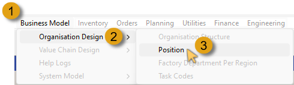  

The Position screen is displayed.  

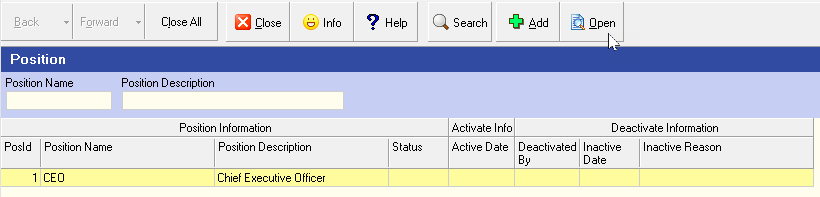  

On initial access, only the Chief Executive Officer is listed.  

Typically, the the highest ranking individual in a company, ususally the CEO, is listed as the 1st position **(PosID = 1)** in the Company Position grid screen.  

4.  Click the row and then click the **Open** button on the Action Bar.  

The **Position - CEO** screen is displayed.  

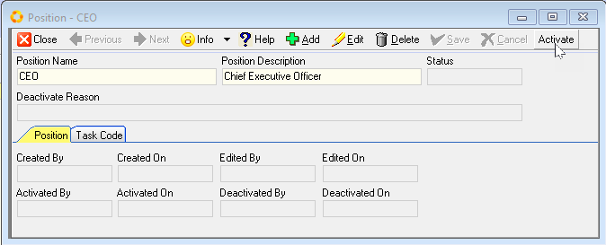  

5.  If needed, change the **Position Name** and **Position Description** as relevant to your company hierarchy, and then click the **Save** button.  

6.  Click the **Activate** button on the form Action Bar.  

7.  Then click the **Close** button.  

The **Position** grid screen is displayed with the updated Postion Information listed in the first record row.  

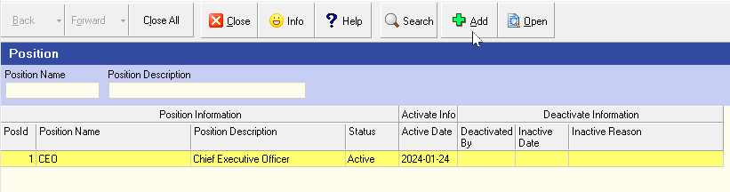  

### Add New Employee Position  

1.  Click the **Add** button on the Action Bar to add another Employee Position.  

The **Add New Position** screen is displayed.  

2.  Enter the Employee position name in the **Position Name** field.  

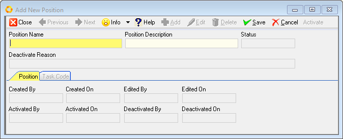  

3. Enter the position description in the **Position Description** field.  

4.  Click the **Save** button on the form Action Bar.   
 
:::important  
Once saved, the **Task Code** TAB becomes accessible.

The process of defining Employee Tasks and the associated Task Codes is detailed in the document titled **["Task Codes"](https://sense-i.co/docs/TSKCDE001)**.  

Once all employee Task Codes have been defined, you can link various tasks to the employee position.  
:::  

5.  Click the **Task Code** TAB.  

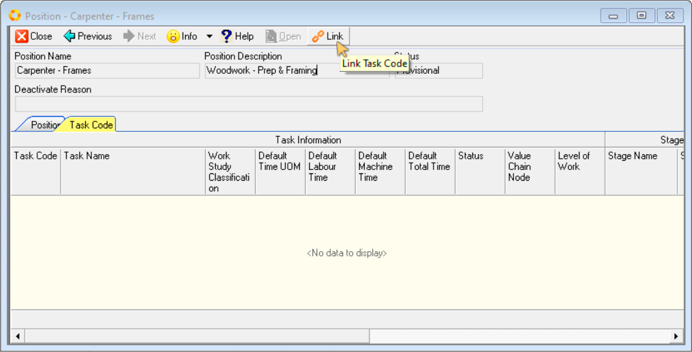  

6.  Click the **Link** button.  

The Task Code grid list screen is displayed.  

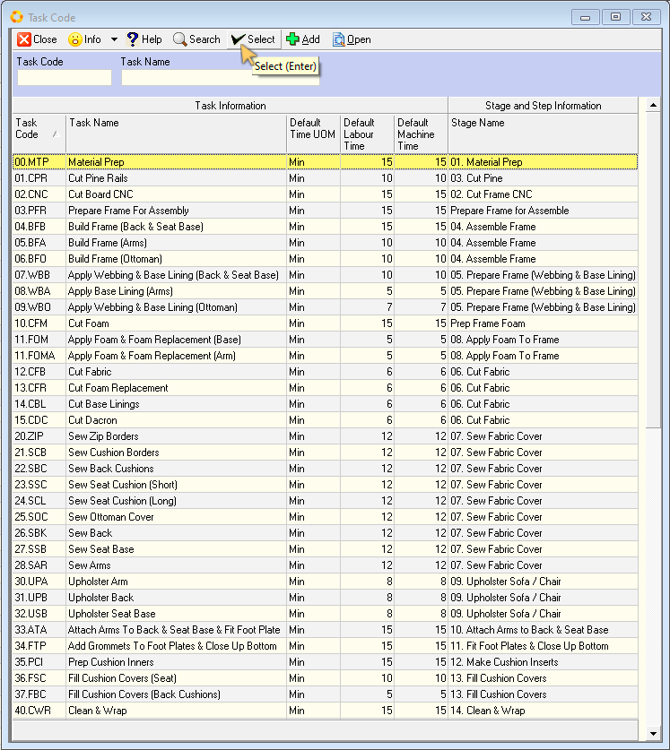  

7.  Click on the task you want to link to the position.  

8.  Click the **Select** button.  
  
:::tip  
To link multiple tasks, hold down the control key on the keyboard and click on all the tasks you want to link to the position, then click the **Select** button.  

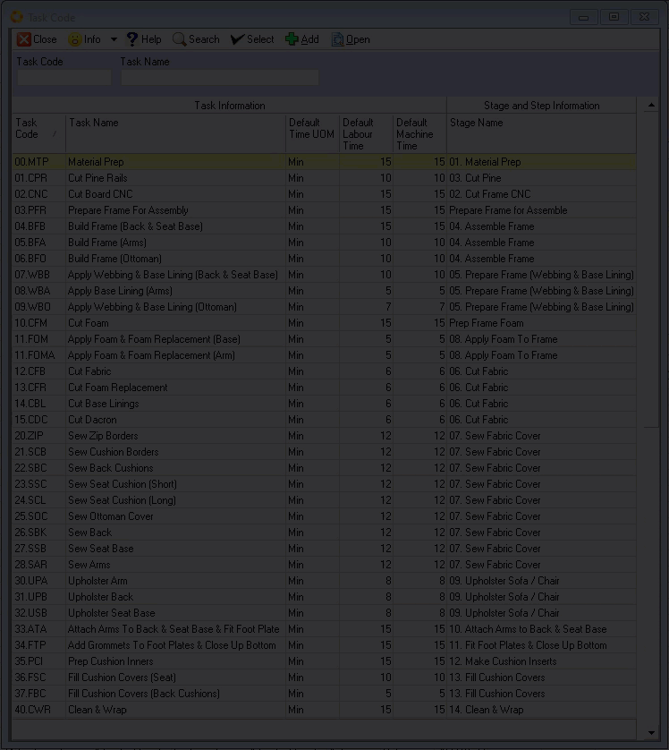  

:::  

The program will close the Task Code screen and display the tasks you have selected to add to the Position.  

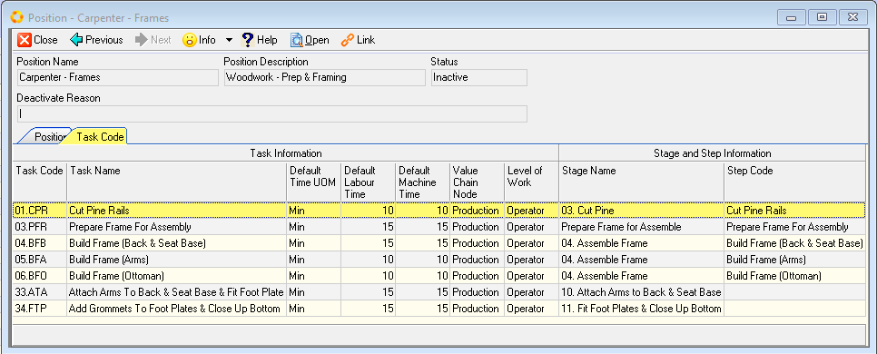  

:::important  
The task codes you link to an employee position determines the list of tasks from which the employee can select when logging tasks against jobs in the **Job Tracker** application.  

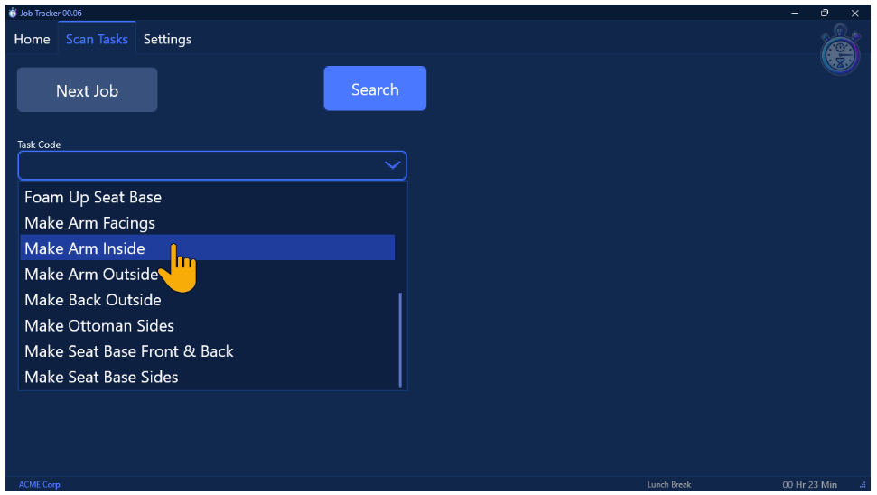  

:::  

Once all relevant tasks have been linked to an Employee Position;

9.  Click on the **Position** TAB, then  

10. Click the **Activate** button on the form Action Bar.  

11.  Click the **Close** button to return to the Position grid list screen.  

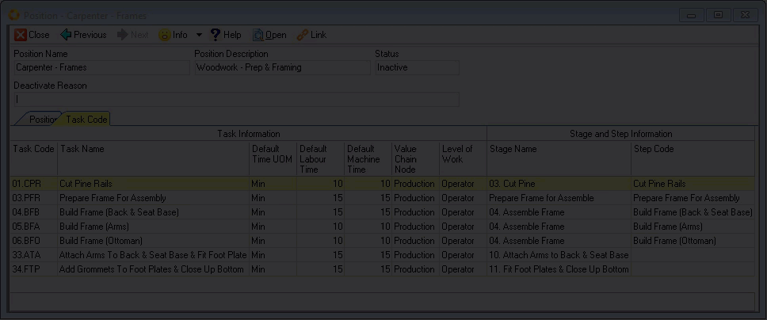  

Repeat the steps above to add all Employee Positions in the company.  

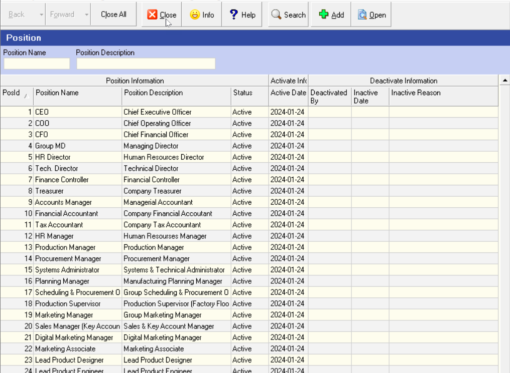  

Once all the Employee Positions have been added, click the **Close** button on the Action Bar.  

:::note  
This information can now be used to link Department Positions when defining Company Department Profiles **and** assigning postions when capturing individual Employee Profiles.  

Refer to the documents titled **["Company Departments"](https://sense-i.co/docs/DPMNT001)** and **["Capture Employee Information"](https://sense-i.co/docs/SAF1204)**.  
:::	 

___

**This is the end of the procedure.**

