# Product Classification Overview
___ 

Information about Products is stored at **four levels of detail** in the Sense-i System.  

At the top level, **Resources** are
assigned to **"Categories"** such as Products, Materials, Machines,
Facilities and so on.

Each Category is broken down into **"Groups"**.  

Each Group is further broken down into **"Types"**.

Each Type consists of actual **"Product Profiles"** or instances of
specific Products.

The Categories, Groups and Types are simply ways of arranging and storing information in the Sense-i database to make it easier to search for specific items from the entire list of everything that the company buys and sells.  

The actual Products that your company sells to its customers are called **Product Profiles**.  

Product Profiles are **instances of specific products** that appear in the **Product Catalogue** _(also known as Price Lists)_ and are used on **Sales Quotes**, **Sales Orders**, **Delivery Notes**, **Tax Invoices** and so on.

The following diagram illustrates these classification levels.  

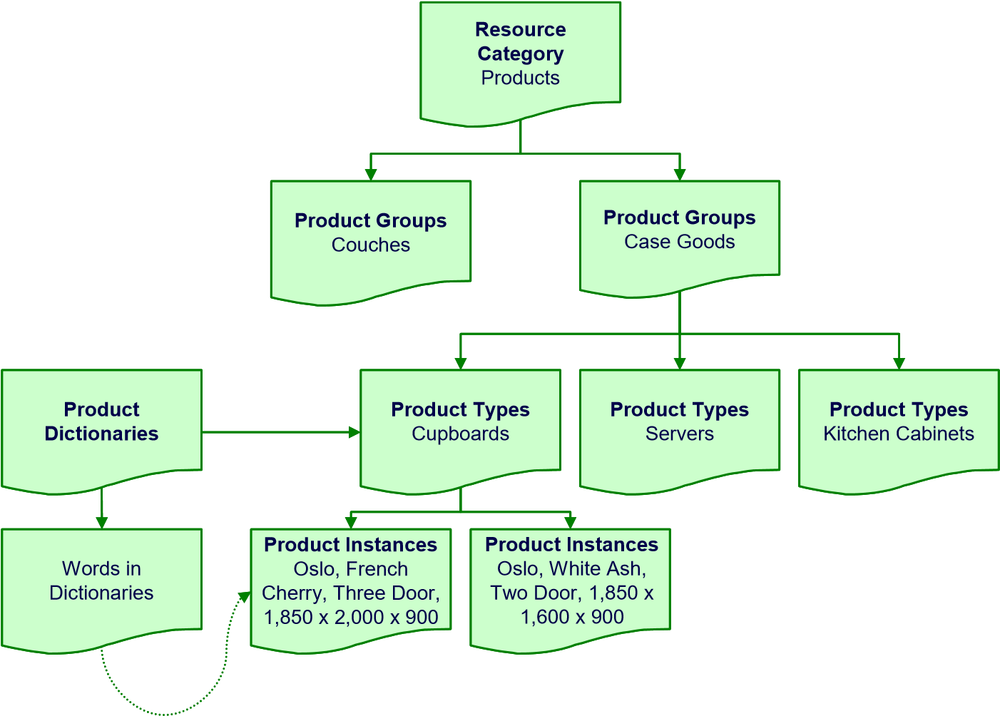  

# Procedure Guideline

In this procedure we will explain the process of defining, and adding **Product Groups**, and **Product Types** within the **Product Resource Category** using the Setup features in the Inventory function.  

## Product Groups  

The first step in the process would entail navigating to the Product Group grid list.

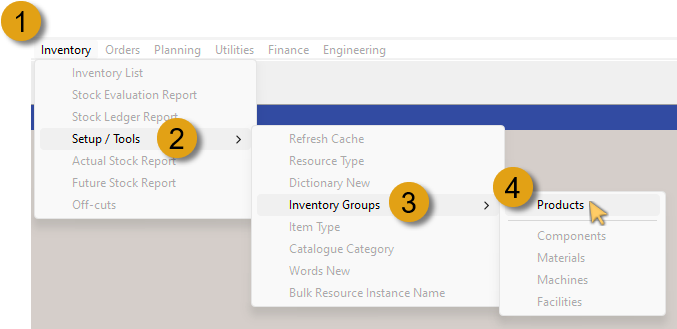  

1.  Click the **Inventory** option on the Main Navigation Menu.  

2.  Click **Setup / Tools** in the drop-down menu.  

3.  Click **Inventory Groups** in the slide-out menu.  

4.  Then click **Products** in the side menu.  

:::tip  
If you hover your mouse cursor over any menu option that has a **right-arrow**, the next level slide- / side menu will automatically be displayed, negating the need to click on that option.  
:::  

The **Maintain Product Group** grid screen is displayed, listing all the **Product Groups** that have been defined in the system.  

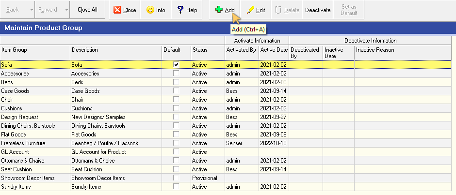  

5.  Click the **Add** button on the Action Bar.  

The **Add Group** screen is displayed.  

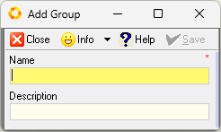  

6.  Type the Name of the Group you would like to add in the **Name** field.  

7.  Type a short description in the **Description** field.  

8.  Click the **Save** button on the form Action Bar.  

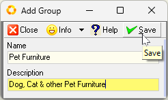  

9.  Click the **Close** button to return to the **Maintain Product Group** screen.  

The new Product Group, with the details you entered above is displayed in the grid list.  

10. Click the **Activate** button to change the status of the Product Group from Provisional to Active.  

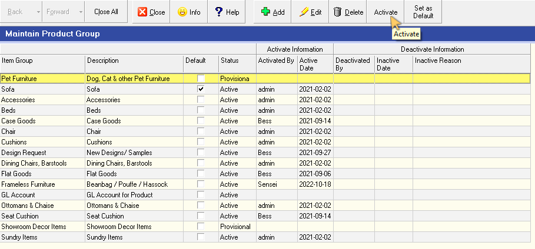  

Repeat the steps above to add any further new Product Groups.  

11. Click the **Close** button to close the Maintain Product Group screen.  

## Product Types

Once the Product Groups have been defined, the next process involves adding **Product Types** associated with the appropriate Product Group.  

1.  Click the **Inventory** option on the Main Navigation Menu.  

2.  Click **Setup / Tools** in the drop-down menu.  

3.  Then click **Resource Type** in the slide-out menu.  

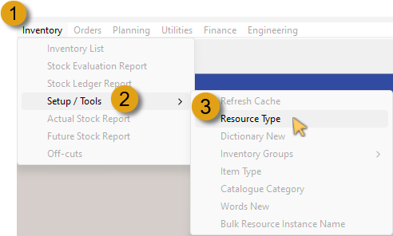  

The **Resource Type** grid screen is displayed, listing all the **Item Types** that have been defined in the system.  

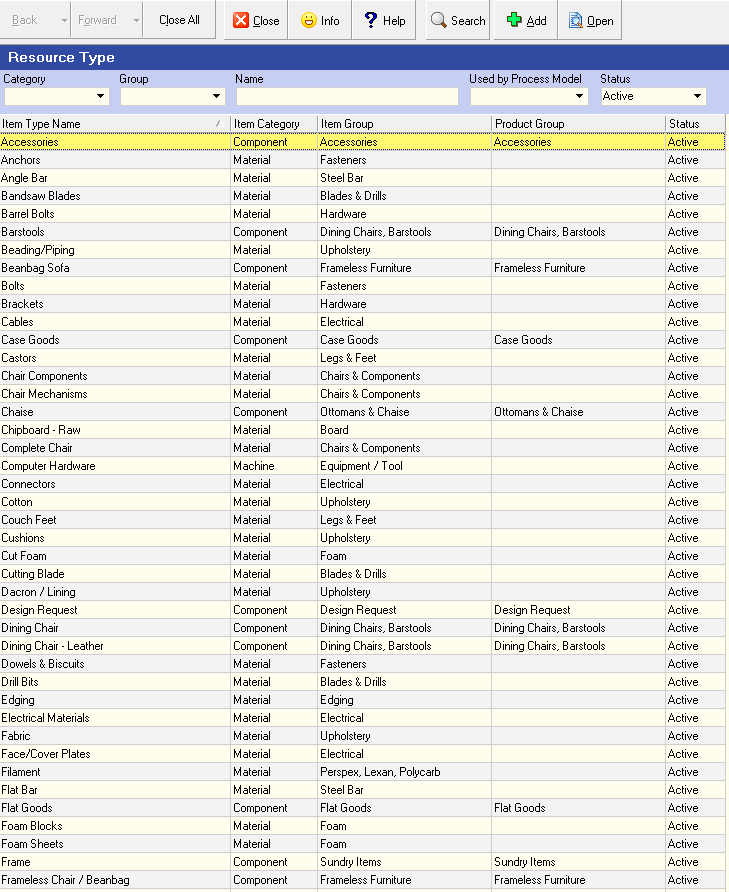  

As we are working with Product Types, we should filter the grid list to display only those Item Types that fall under the **Component / Product** section in the **Item Category**.

4.  Click the down-arrow button in the **Category** field.  

5.  Then click on the **Component** option in the drop-down menu list.

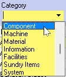  

6.  Click the **Search** button on the Action Bar.  

The **Resource Type** grid list now displays all the **Item Types** that fall under the **Component / Product** Category.  

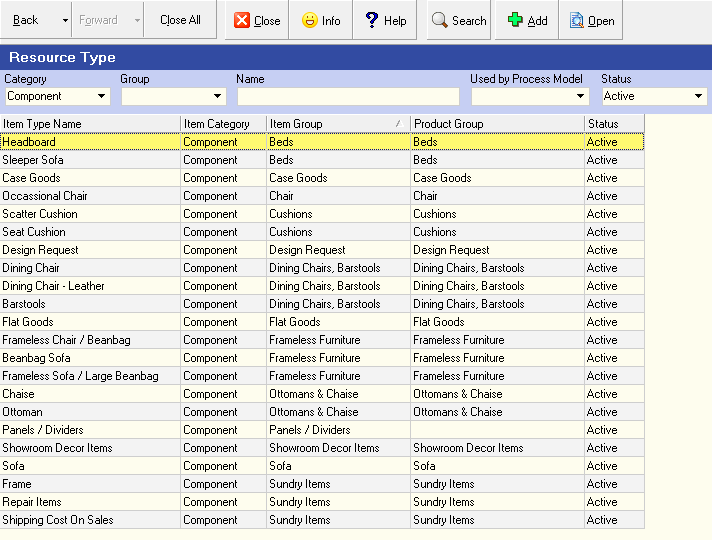  

7.  Click the down-arrow in the **Group** field.  

8.  Then (scroll down if needed), click on the Product Group option as defined previously.  

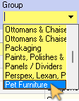  

9.  Click the **Search** button on the Action Bar.  

The Resource Type grid list will be reloaded listing the Item Types previously defined for that Group.  

:::note  
If no Item Types have been defined, the grid will be displayed without any Item Types listed.  
:::  

### Add New Product Type

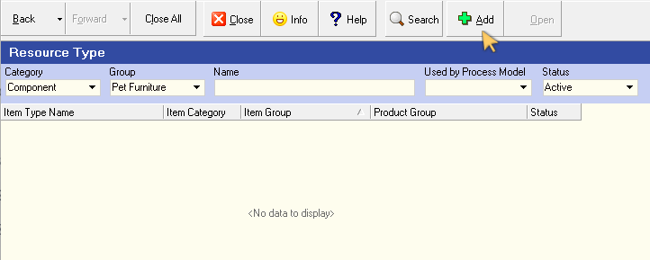  

1. Click the **Add** button on the Action Bar.  

The **Add New Resource Type** screen is displayed.  

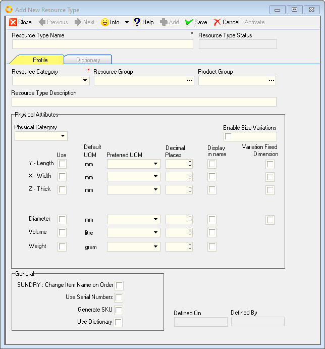  

2. Type in the name of the Product Type you wish to add in the **Resource Type Name** field.  

3. Click on the down-arrow button in the **Resource Category** field, and select the **Component** option.  

:::important  
The **Resource Type Name** and the **Resource Category** fields are demarcated with a red asterisk, and MUST be completed/selected.  
:::  

4. Click on the three-dot button in the **Resource Group** field.  

The **Select Resource Group** screen is displayed.  

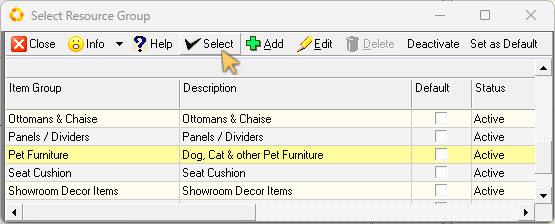  

5. Click on the relevant row in the grid list, and then click the **Select** button on the form Action Bar.  

The system returns to the **Add New Resource Type** screen.  

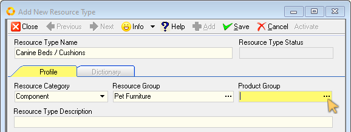  

6. Click on the three-dot button in the **Product Group** field.  

The **Select Product Group** screen is displayed.  

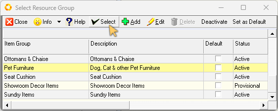  

7. Click on the relevant row in the grid list, and then click the **Select** button on the form Action Bar.  

The system returns to the **Add New Resource Type** screen.  

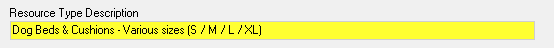  

8. Type a short description of the Product Type in the **Resource Type Description** field.  

### Product Type, Physical Attributes  

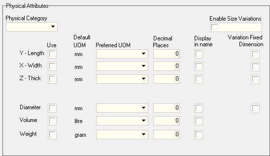  

In this part of the process we will capture the Physical Attributes of the new Product Type being added.

1.  Click on the drop-down arrow in the **Physical Category** field, and then click on the appropriate option in the drop-down list.  

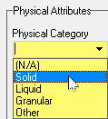  

2.  If this Product Type will include different sized Product Items, click the **Enable Size Variations** check-box field.  

3.  Click the **Y - Length** check-box (under the **Use** column) to select and use the Length attribute.  

:::important  
The **Y - Length** attribute MUST be selected for any Product Type that is defined as a **Solid** within the Physical Category list.  

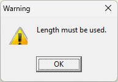  

The system will display a Warning dialogue when attempting to Save the new Product Type without the **Y - Length** option checked.  
:::  

4.  Click the drop-down arrow in the **Preferred UOM** field if you wish to use a different _Unit of Measure_ to that of the Default UOM.  

5.  Type in the desired amount of decimal places in the relevant **Decimal Places** field.  

6.  If your company uses the SEMS Dictionary Module, click on the relevant **Display in name** check-box field if you require the Product Type and associated Product Items to have the Length attribute included in the Product Instance Name.  

7.  Click on the relevant **Variation Fixed Dimension** check-box field if you require the Length attribute to be a Fixed Dimension in any product variations associated with this Product Type.  

8.  Repeat the steps above to define the **Width, Thickness** _(Height)_, and where relevant, the **Diameter, Volume** and **Weight** attributes for the Product Type being added.  

### General / SUNDRY  

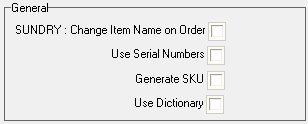  

1.  Click the **Change Item Name on Order** check-box to allow Sales Representatives to change the name of Products (associated with this Product Type) when generating Sales Quotes, Orders and Invoices.  

2.  Click the **Use Serial Numbers** check-box if your company uses sequential serial numbers on Product Items.  

3.  Click the **Generate SKU** _(Stock keeping unit)_ check-box to enable the manufacturing departments to generate unique alphanumeric codes that track product and price information.  

4.  Click the **Use Dictionary** check-box if your company subscribes to the SEMS Dictionary Module, and where Product Items & variants are uniquely defined using the descriptive features of this powerful module.  

### Save & Activate Product Type  

Once you are satisfied that all the Product Type **Profile** information has been entered correctly, the next step will be saving and activating the Product Type.  

1.  Click the **Save** button on the form Action Bar.  

:::note  
When the Product Type has been saved, the **Dictionary** TAB becomes available.  

For further information on Dictionaries, refer to the document titled **["SEMS Dictionary Module"](https://sense-i.co/docs/DICT001)**.  
:::  

2.  Click the **Activate** button.  

3.  Click the **Close** button.  

The system returns to the Resource Type screen with the newly added Product Type listed as a record row.  

Repeat the steps above to add other New Product Types.  

**This is the end of this procedure.**
