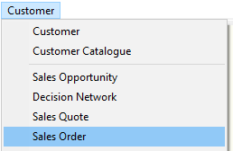
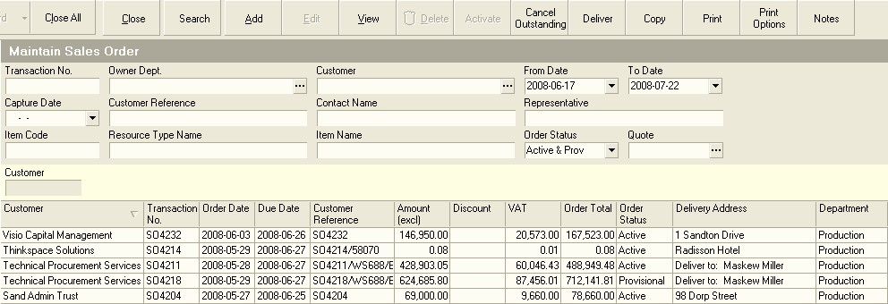
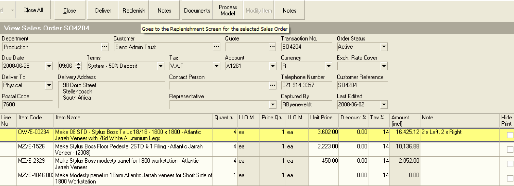
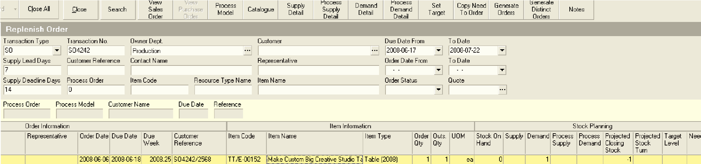
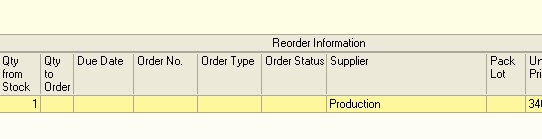
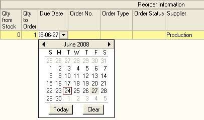
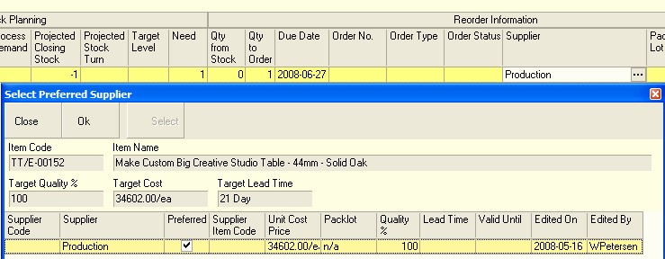
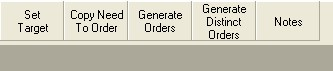

---
id: REP-001
title: Create Finished Goods Plan (REP-001)
sidebar_label: Finished Goods Plan
slug: /REP001
---  
## Step-by-step Guideline
___  

This procedure will enable you to generate the **Purchase Orders**,
**Internal Orders** and/or **Process Orders** required to ensure that the items
sold to the Customers are either bought or made by the company, so
that they can be delivered in time.  
Each Sales Order has a **Due Date** set by the Customer that specifies the date and time on which the items sold to the Customer must be delivered.

You will need to select a specific **Sales Order**.  

1.  Select **Customer** from the Main Navigation Menu.  
   
  

2.  Then click **Sales Order** in the Drop-down Menu.

3.  The system will open a screen titled **"Maintain Sales Order."** This
    screen lists all of the Sales Orders that have already been captured
    in the system within the From and To Date specified in the Search
    Panel. Note that you can change the information displayed in this
    list by changing the dates and other information in the Search
    Criteria Panel above the list of orders.  

  

4.  Click on the Sales Order in the list for which you wish to generate
    Process Orders.  

5.  Click on the View button on the Form Bar to view the details of the
    Sales Order.  

6.  The system will open the Sales Order in a screen titled, "View Sales
    Order." This screen will show the details of the Sales Order and
    list each of the items on the order and the quantity of each item
    that has been ordered.  

7.  Click on the Replenishment button on the form bar to open the
    Replenishment Planning screen.  

  

The system will display a screen titled Replenish Order. This screen
lists each of the items on the Sales Order, plus their Order
Quantities. Depending on whether the company has the basic or the
advanced version of the Replenishment Module, this screen may show a
series of columns that enables you to view information about future
stock transactions and the projected stock balance. *(You should read
the document titled Understanding Projected Stock Transactions if you
have not already done so.)*  

The Replenish Order screen enables you to view the Quantity of each
item on the order and analyse the current stock on hand for each item.
In addition to the current stock on hand the system displays
information about outstanding "Supply" and "Demand." The outstanding
Supply column lists all open orders that would increase your stock
levels for each item. Such orders include Purchase Orders, Internal
Orders and Process Orders.  

The outstanding Demand column lists all open orders that would reduce
your stock levels and includes all Sales Orders, Input Material
Requirement Plans and Internal Orders received from other departments.  

The system uses this information to calculate a Projected Closing
Stock balance. This is the stock balance that you will have on hand
when you need the items on order and it helps you to decide whether
you need to create any orders to increase your stock so that you can
fulfil this order and all other orders for the same items you have
received from your customers.  

  

To the right of the Replenishment screen you will see a set of columns
under the section titled Reorder Information. This lists the supplier
from whom you can acquire the item, the order quantity and the order
number.  

Note that the Replenishment screen is very wide and, unless you have a
very wide monitor, you should scroll to the right to see the remaining
columns.  

Once you scroll to the right you will notice that a set of additional
columns appear. These columns will list the best supplier from whom
you can source each of the items on order. They will be displayed once
you have entered amounts in the Order Quantity column.  

8.  To replenish the item you need to enter the Quantity you wish to
    order in the Qty to Order column. (Note: You can quickly copy all
    the needed quantities to the Qty to Order column by clicking the
    Copy Need to Order button.) *Be careful if you do this, particularly
    if you have not checked that your stock information is completely
    accurate because it will generate an Order Quantity that might
    actually be much higher or lower than you actually need.*  

9.  Alternatively, you can look up the Quantity that has been ordered by
    the Customer (this quantity will appear in the Quantity Ordered
    column, see (A) above) and simply type this in the Order Quantity
    column above.  

  

10.  You will need to assign a due date to each item by clicking in the
    Due Date cell and selecting a date from the drop down calendar.  

  

11. Next make sure you have selected a supplier for the item. You will
    only need to do this the first time you order a new item. Click on
    the Supplier Name in the list, then click Select, Ok and Close. From
    then on the system will remember your preferred supplier. You can
    change the preferred supplier at any time.  

  

12. Once you have entered the Order Quantity, Due Date and Supplier for
    each item on the Sales Order, you can click the Generate Order
    button on the Form Bar.  

  

13. The system will then an appropriate order to each of the Suppliers
    (whether that is your own Production Department or an External
    Supplier) for the items required and display the Order Number in the
    Order No field.  

14. The system will generate one of three possible orders. These are:

-   A **Process Order** (Job Card) for each of the items that you make;  

-   An **Internal Order** for the items that you purchase from **Another
    Department** within your company;  

-   A **Purchase Order** for items that you purchase from **External
    Suppliers**.  

15. You will now need to go the procedure titled Activate Process
Orders to mark the Process Orders (or Job Cards) as finalised so that
you can create the Material Requirement Plan and generate Purchase
Orders for the materials needed.

**This is the end of the procedure.**
