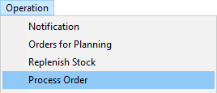
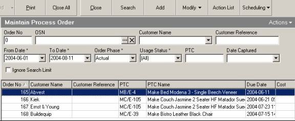
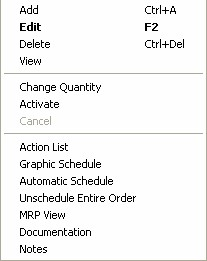

---
id: REP-002
title: Activate Process Order (REP-002)
sidebar_label: Activate Process Order
slug: /121
---  
## Step-by-step Guideline  
___  

This procedure will enables you to activate the Process Orders that
you generated when creating the Finished Goods Plan. You need to mark
the Process Orders as finalised before you can plan the materials
needed for these jobs.  

1.  Select **Operation** from the Main Navigation Menu.  

  

2.  Click on the **Process Order** option from the drop-down menu.  

3.  The system will display a screen titled **Maintain Process Order**.  
    This screen lists all the Process Orders in the system that match the
    search criteria defined in the header of the screen.  

  

4.  Click on the Process Order in the list. You may need to search for
    the specific order if it does not appear. To do that you can type
    the Process Order number into the **Order No** field  
    
    OR...  

5.  You can set an earlier **From Date** and a later **To Date** to show a
    longer list of Process Orders. Remember, the From and To Date work
    on the **Process Order Due Date** that you will have set in the previous
    procedure.  

6.  Click the **Search** button on the Form Bar.  

7.  Once you have found the correct process order, click on it in the
    row, then right click the mouse and select **Activate**.  
    Alternatively, you can click the modify button at the top of the screen and then
    select Activate.    

  

8.  The Process Order will now be in a state where the bills that have
    been linked to it can be used for Purchasing and where the stores
    will be able to issue materials to the job.  

**This is the end of the procedure.**
