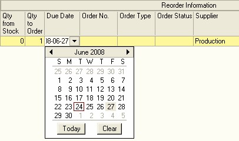
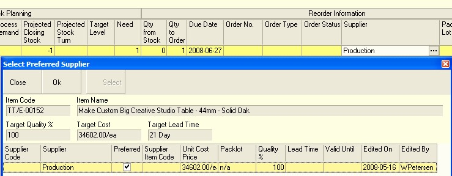
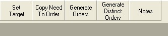

---
id: REP-003
title: Generate Material Requirement Plan (REP-003)
sidebar_label: Material Requirements
slug: /REP003
---  
## Step-by-step Guideline
___  

1.  Select **Customer** from the Main Navigation Menu.  
   
  

2.  Then click **Sales Order** in the Drop-down Menu.

The system will open a screen titled "Maintain Sales Order." This
screen lists all of the Sales Orders that have already been captured
in the system within the From and To Date specified in the Search
Panel. Note that you can change the information displayed in this list
by changing the dates and other information in the Search Criteria
Panel above the list of orders.  
  
  

3.  Click on the Sales Order in the list for which you wish to generate
    Process Orders.  

4.  Click on the View button on the Form Bar to view the details of the
    Sales Order.  

The system will open the Sales Order in a screen titled, **"View Sales
Order"**.  
This screen will show the details of the Sales Order and list
each of the items on the order and the quantity of each item that has
been ordered.  

5.  Click on the **Replenishment** button on the form bar to open the
    Replenishment Planning screen.  
  
  

The system will display a screen titled **Replenish Order**. This screen
lists each of the items on the Sales Order, plus their Order
Quantities. Depending on whether the company has the basic or the
advanced version of the Replenishment Module, this screen may show a
series of columns that enables you to view information about future
stock transactions and the projected stock balance. (You should read
the document titled Understanding Projected Stock Transactions if you
have not already done so.) To the right of the Replenishment screen
you will see a set of columns under the section titled Reorder
Information. This lists the supplier from whom you can acquire the
item, the order quantity and the order number.  

  

You will already have generated and activated Process Orders for the
items on the Replenishment screen in the previous procedures.  

6.  You can change the Replenishment Screen to show the inputs to the
    Process Orders instead of the Outputs that have been ordered on the
    Sales Order by clicking on the Transaction Type drop down list on
    the top left of the Replenishment screen. The abbreviation SO stands
    for Sales Order and shows the items on the Sales Order. By changing
    the transaction type to PO, (abbreviation for Process Order) the
    system will show all the materials needed for each the of Process
    Orders you have selected.  
  
  

7.  Click the **Search** button on the form bar.

The screen will list all the materials needed to complete the selected
Process Orders. Again, the system lists all the future stock
transactions for each material needed.  

:::note  
Before the system will show the materials, you will need to
have **Activated** the Process Order.  
:::  
  
  

8.  You will need to decide what quantity of each material you need to
    purchase. You can if you trust the information as being accurate,
    choose to order the recommended quantity by clicking the **Quantity
    Need to Order** button. Or you can enter the order quantity for each
    item manually. Normally, both options are used depending on the item
    being ordered.  
  
  

9.  You will need to assign a due date to each item by clicking in the
    **Due Date** cell and selecting a date from the drop down calendar.

:::tip  
Once you have set the first due date, click the Control + C keys
on your keyboard, this will put the date into memory. The simply press
the down arrow key to move to the next row and then click the Control
\+ V keys to paste the due date into the next row.  
:::
  
  

10. Next make sure you have selected a supplier for the item. You will
    only need to do this the first time you order a new item. From then
    on the system will remember your preferred supplier. You can change
    the preferred supplier at any time. To set the preferred Supplier,
    click on the right hand corner of the cell in the Supplier column.
    The system will display a three dot button. If you click on this the
    system will then display the Select Preferred Supplier screen.  
  
  

11. Click on the row that contains the name of the Supplier that you
    wish to set as the **Preferred Supplier**.

12. Then click the **Select** button.  

The system will display the name of the Supplier that you have
selected in the Supplier column. Remember this can either be a
Department from within your company or the name of an External
Supplier.  

13. Once you have entered the **Order Quantity, Due Date** and **Supplier** for
    each item on the Sales Order, you can click the **Generate Order**
    button on the Form Bar.  
  
  

14. The system will then Generate a **Process Order (Job Card)** for each of
    the items on your plan that you make and will generate a
    **Purchase Order** for each item that you buy from your suppliers. The system
    will show the **Purchase Order number** in this field.  

15. You will now need to go the **Purchase Orders Module** and perform the
    procedure for **Activating Purchase Orders**.  

16. If you are running the **Capacity Planning Module** as part of your
    Production Planning System, you should run the **Capacity Plan** to
    calculate when you need the Materials to Arrive in order to complete
    the Process Orders on time.  

**This is the end of this procedure.**
