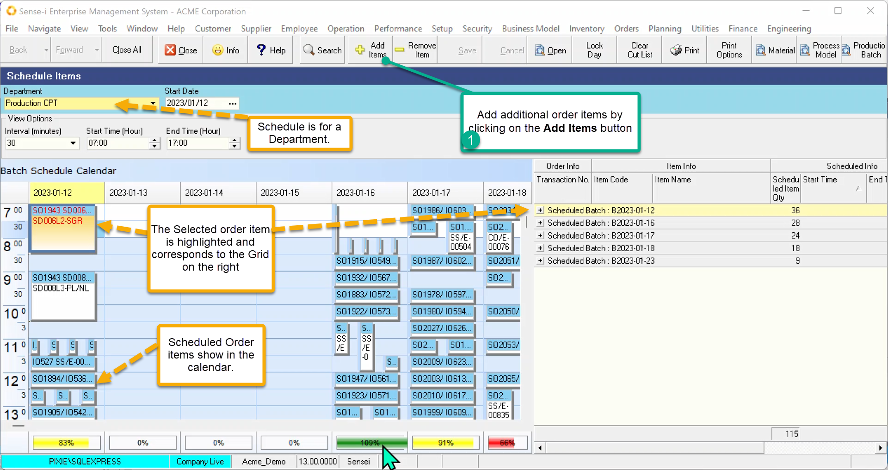
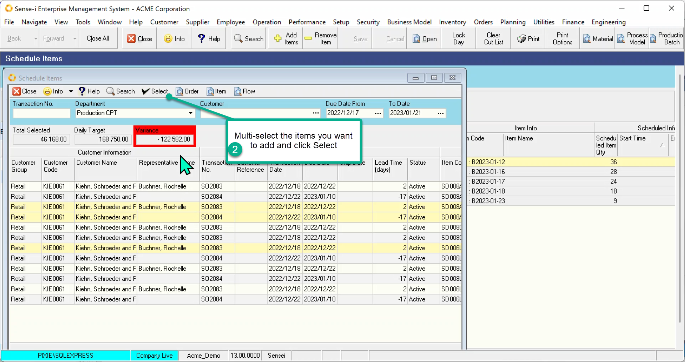
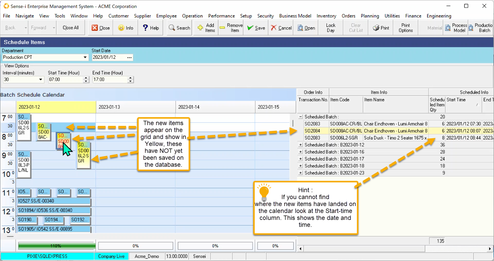
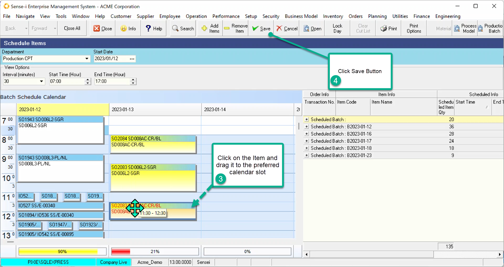
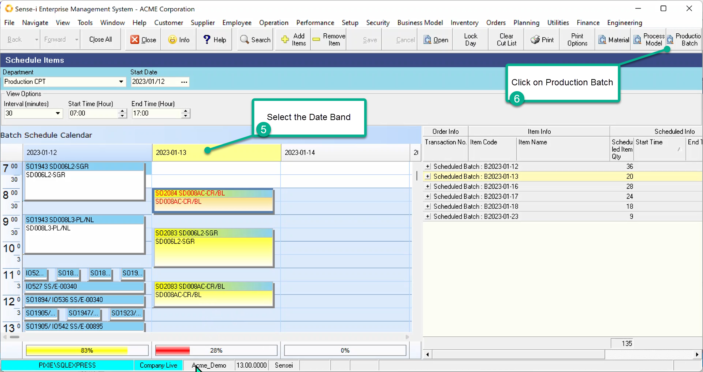
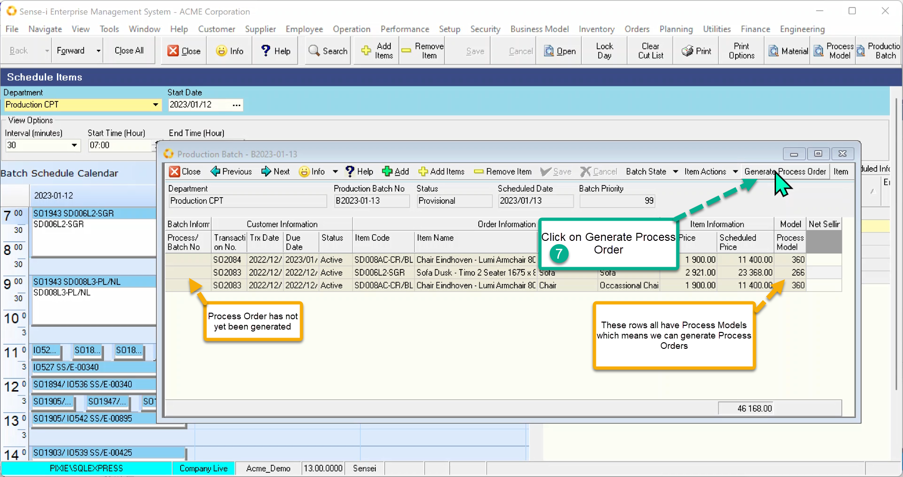

If you replenish to process order prior to scheduling, the system will determine a scheduled date and place the job in the calendar. In order to schedule the jobs yourself, you would need to schedule the items first and then Replenish by generating the Process Orders.

Navigate to Operation \> Schedule Order Items.

Select the department and the Starting date before Searching.

The Calendar will display populated with the existing scheduled items.

1. To add new items, click the **Add Items** button.

 

Only those outstanding order items(sales or internal) NOT yet on the calendar will be displayed.

 

2. Multi-select the records you want to add and Click Select.

The new items now appear both in the calendar and the grid.

 

3. Move the items to the preferred date and time.
4. Click Save

 

5. Open up the Production Batch by selecting the Date Band and
6. Clicking the Production Batch button.

 

The Production Batch opens and lists all the order items in it.

Check to see whether any rows have not yet had a process order generated.

7. Click Generate Process Order

 

The process orders are generated AND activated. The scheduled order items are thus replenished.

 
