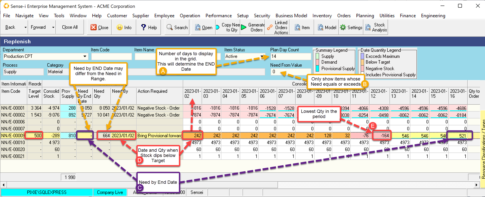
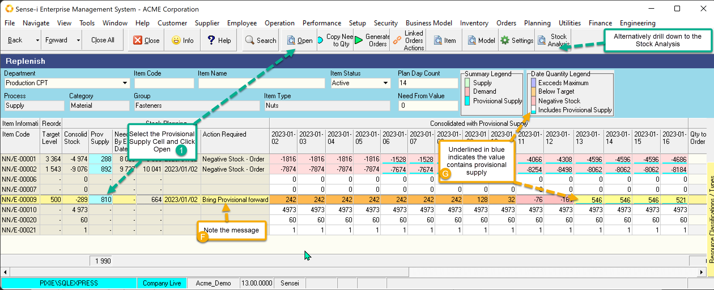
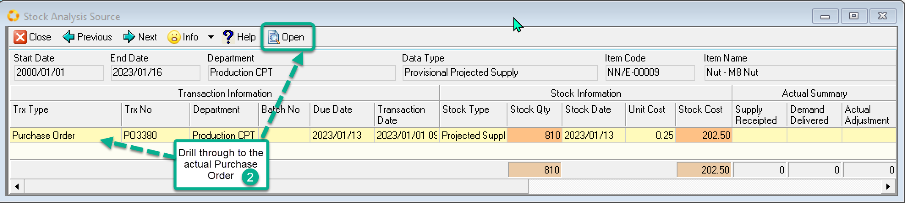
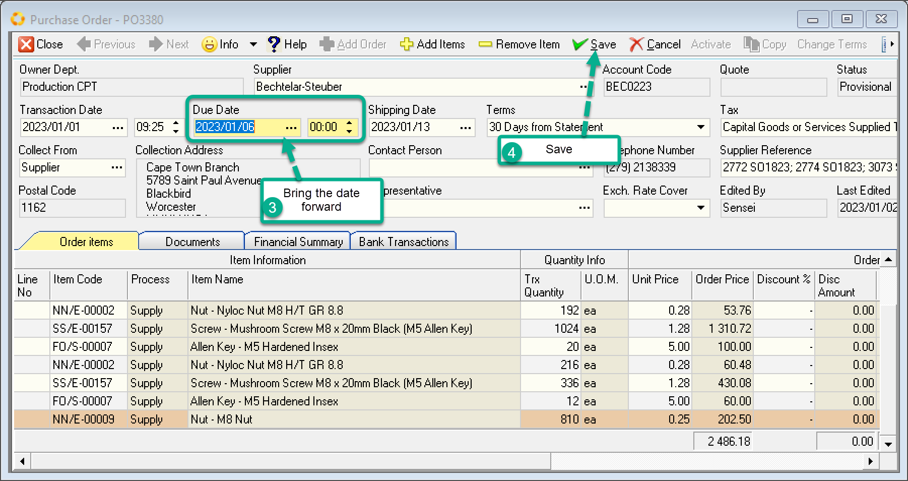
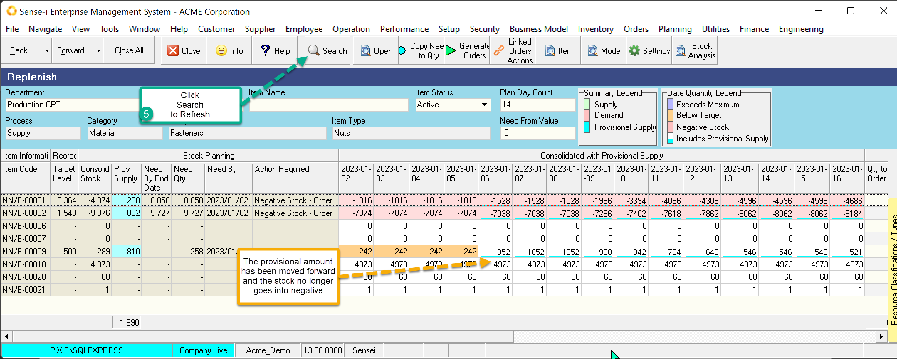

:::tip
If you choose to replenish from stock, you must **ensure your stock quantities** are accurate.
:::

The mechanism of stock replenishment works the same as any replenishment. IE. You need to:
- Set the quantity to be replenished.
- Confirm/change the supplier.
- Generate the order.

The difference lies in the fact that there is `no underlying order` to work with. This means you must

- Search for the stock items of interest – as opposed to letting the underlying orders produce the list.
- Populate the replenish quantity either manually or copying the system calculated Need

From the main menu, navigate to Operation \> Replenish Stock.

From the Replenish screen choose the Resource group to Replenish.

## Search Parameters of interest

- (A) Search parameter **Plan Day Count** returns the number of dates to show in the calendar and determines the values in the Stock Planning Band as they are calculated up to the end date. (IE Current Date + Plan Day Count)
- (B) The **Need from Value** can be used to refine the search to only show records whose need equals or exceeds a certain value.

The grid returns the expected stock values for a range of dates. The values correspond to the [**Consolidated with Provisional Supply Stock View**](./STC-CON), as can be seen by those numbers underlined in blue. 

 


## Need columns

The grid shows 2 need columns.

### Need by the End Date

By the **end of the period** we need a certain amount of stock to be ordered to achieve the Target Level. This is the Need by the End Date (C), 

`Need by End Date = Target - Value at end Date`   
```
                = 500 - 521   
                = -21 
```                      
 
As this is a negative value, another order is not yet required.

> The selected row above shows blank (zero) for the need by date.

### Need by Calculated Date.
 
The **first date where the stock dips below target** is the _Need by Date_.(D) 

The screen above shows that the stock level is already below target for TODAY. It is 242 and the Target is 500. The need by date is set to today.

The Need Quantity is calculated based on the lowest quantity(E) in the period.

`Need by End date= Target – Lowest value`
```
                = 500 - (-164)
                = 664
```               

## Bring the Provisional Stock forward

 

The selected row show that the stock dips below zero during the period but is at an acceptable level by the end of the period. If the provisional order is brought forward we may be able to prevent negative stock.

:::note
- (F) The required action states that the Provisional Supply needs to be brought forward. We can see that there is sufficient stock at the end of the period but there will be a stock shortage during the period. Stock level drops below negative.
- (G) The provisional supply pushes the stock value to an acceptable level.
:::


1. Select the Provisional supply cell and Click Open.

 The list of source documents is listed.

 

2. Drill through to the purchase order.

 

The purchase order opens and highlights the Item we are querying. (Change the quantity of the order if needed.)

3. To bring the due date forward, change the due date.
4. Save the record.

Close down the drill through screens.

5. Click the Search button to refresh.

The refreshed data shows that the stock no longer dips below zero.

 

