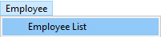
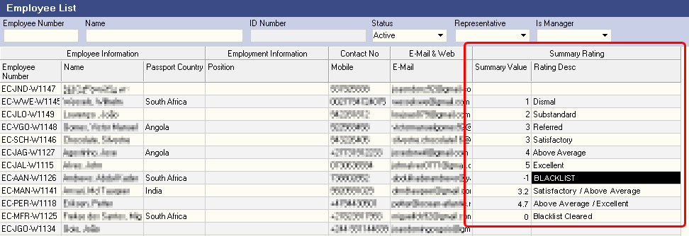
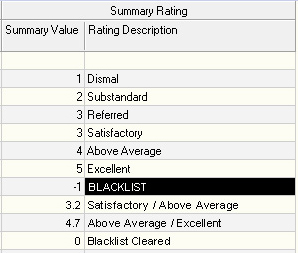
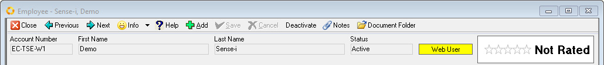
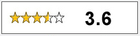
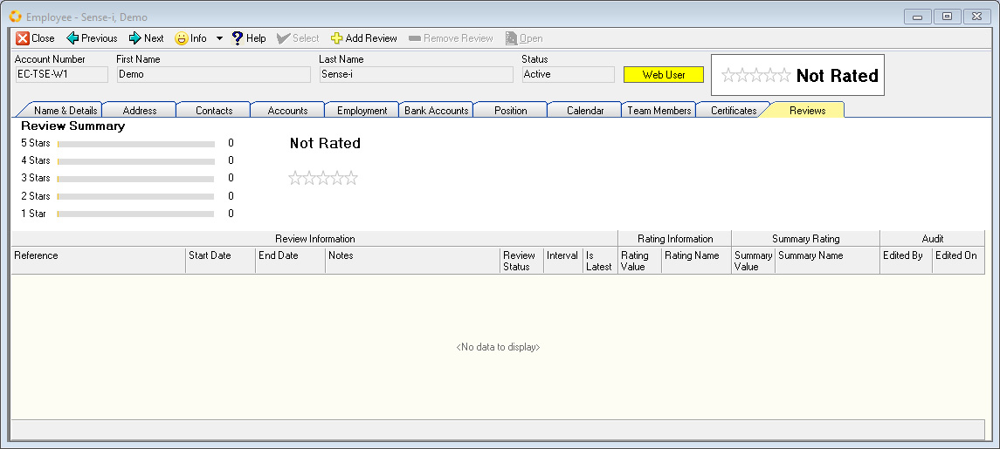
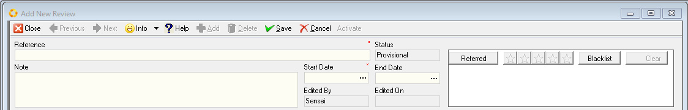
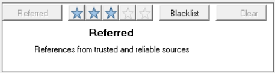
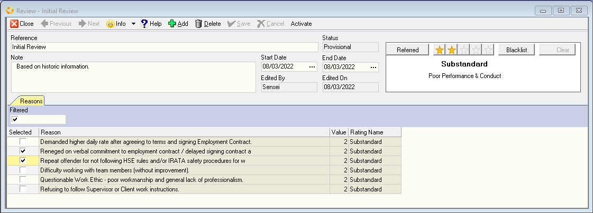
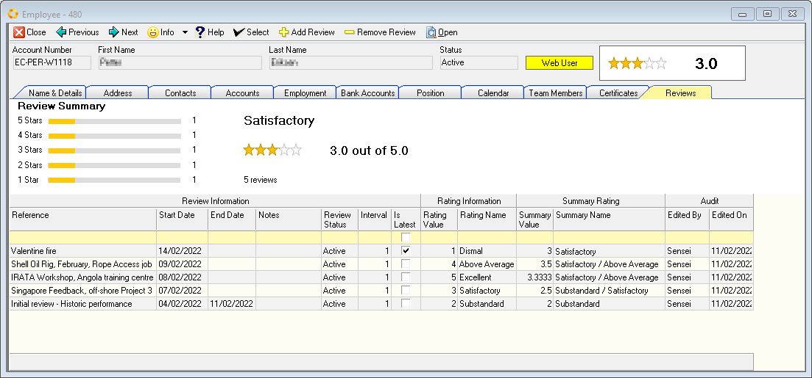

## Procedure Guideline    
___  

### Introduction  

This procedure explains how to add, view and maintain Rating scores for
an individual party (Person or Organisation) in the SEMS-app.  
The application uses a **5-star Rating system**.

For demonstration purposes we will be using the Rating and Review system
in the **Employee** section.

:::note

The same principles and procedures apply when you need to Add, View & Maintain
Rating scores and Reviews for other parties - **Customer, Supplier, Legislator** and **Financier**.  

:::  

### Step-by-step Guideline  

1.  Select **Employee** from the main navigation bar, and then

2.  Select the **Employee List** option.

  

The **Employee List** grid is displayed.

  

The **Summary Rating** band has two columns;

-   **Summary Value**

-   **Rating Description**

Note: Initially each contractor **will NOT** have a Rating Value.

Once ratings have been captured for the individual employees /
contractors the **Employee List** screen will reflect the relevant
rating scores and descriptions under the **Summary Rating** band.

The **Summary Value** is the **cumulative average** of all
individual ratings added and applied for an employee / contractor.

Herewith an example once ratings have been captured for a few
contractors;

  

This graphic shows the different **Rating Values**, from 1-star to 5-star (displayed as numbers) with the related standard **Rating Description(s)** where a single rating was applied.

Once **Blacklisted**, the contractor will have a Rating Value of "-1" (minus one).

For those contractors that have had subsequent ratings applied, the
summary rating value is the cumulative average and would be displayed as
a floating score (with a decimal point where relevant).

The final record shows a rating of 0 as applied after lifting the
Blacklist status.

Where the summary rating is between the absolute values these Rating
Descriptions are used;

**Between 1 and 2 Dismal / Substandard**  
**2 - 3 Substandard / Satisfactory**  
**3 - 4 Satisfactory / Above Average**  
**4 - 5 Above Average / Excellent**  

**NB! The descriptions above are hard-coded in the system.**  

### View an Individual Profile

3.  Select the employee / contractor from the Employee List grid.  

4.  Open the specific party record to view the profile. This can be done
    by either double-click or using the **Open** button.  

The **Employee profile** screen is displayed.  

  

The Summary Rating is visually displayed in the top right section of the
screen.  

Initially each individual Party **will not** have a Summary Rating.  

:::note  

As additional individual ratings are
captured and activated, the Summary Rating is automatically calculated
by the system.  

  

:::  

5.  Select the **Reviews** tab.

  

The reviews summary screen is displayed with the following elements;  

-   A visual summary of the overall rating using the 5-Star system in
    graphic format and the Summary Rating score in text format - (avg.
    score) out of 5.0  

-   Graphic depiction detailing how many times the contractor received a
    rating for each category.  

-   Individual rating details in grid format with the following bands
    and underlying columns;  

-   **Review Information**
    -   Reference
    -   Start Date
    -   End Date
    -   Notes
    -   Review Status
    -   Interval
    -   Is Latest

-   **Rating Information** *(Individual)*
    -   Rating Value
    -   Rating Name

-   **Summary Rating** *(cumulative average)*
    -   Summary Value
    -   Summary Name

-   **Audit**
    -   Edited by
    -   Edited on

### Add New Review  

6.  Click on the "**Add Review**" button to capture a new rating.

  

The **Add New Review** screen is displayed.  

7.  Enter a **Reference**. This could be a specific project / job name
    OR a review period description, e.g. "*Initial rating, historic
    performance.*" Note: This field is limited to 80 characters.  

8.  Enter a **Note.** This field could be used to add a comment(s)
    relating to the specific review (optional).  

9.  Enter the job / review **Start** and **End Date** period.  

### Apply a "Star" Rating  

10. Select the **Referred** button
    (optional) - this option is for those employees / contractors who have
    references from trusted & reliable source(s).

  

The system will automatically apply a 3-Star rating with the
description;  
_"**References from trusted and reliable sources.**"_  

**ALTERNATIVELY**  

11. Select any of the star options and then select **Save**.  

The relevant description and associated rating criteria (Reasons) will
be displayed.  

  

12. Select the relevant Reason(s) in the Rating Criteria area by
    clicking on the desired checkbox fields.  

:::note  

The "Filtered" checkbox is checked by default. The listed
reasons in this instance pertain only to the specific Star Rating
selected.

De-selecting the "Filtered" checkbox will list ALL the Rating Criteria
(Reasons) as defined for all the Rating levels. This allows you select
reasons that may be relevant to this party.  

The Star Rating value as chosen initially will apply, even though
reasons other than the default for that specific rating level were
selected.  

:::  

13. Selecting the **Blacklist** option will tag the contractor as such.  
    In this instance a new rating Interval will be added.
    
    Note: this will set the rating score to -1.  

-   Select the relevant Reason(s) for Blacklisting the contractor in the
    **Rating Criteria** area by clicking on the associated checkbox
    fields.  

:::note  

The status will be **Provisional** while the SEMS-user is editing the record.  

:::

14. Once the relevant rating has been captured, select **Save**.  

15. In order for this rating to be added to the cumulative score, select
    the **Set Active** option from the **Set Status** drop-down list.

16. **Close** the Rating screen.

:::note  

Blacklist status can be lifted (**"Clear"** button) after
authorisation from management - this will reset the Rating Score to **0**
_(zero)_.  

In this instance, a new rating **Interval** will be added.  

:::

**Repeat steps 6 - 16 above to add additional reviews and Individual Ratings**.  

In order to edit a record the status needs to be set to **InActive**.
This will remove it from the summary rating calculation, the previous
individual rating will be marked as the "Is Latest" score and the
updated Summary Rating will be displayed.

Once the reviews are completed and activated, the Employee screen is
updated with the new information.

  

In this example the contractor has been rated on various occasions, the
first with a 2-Star rating, followed by a 3-Star, a 5-star, a 4-star and
finally a 1-star, bringing the Summary Rating to 3.0

**This is the end of this procedure.**  
___
