## Procedure Guideline
___  

## Maintain Working Calendars  

### Navigate to Working Calendars  

1.  Click **Planning** on the Main Navigation Menu.  

2.  Then click **Calendar Maintenance** on the drop-down menu.  

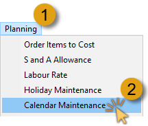  

The system will open a screen titled **Maintain Calendar**.  

This screen lists all the various working calendars that have been defined for your company.  

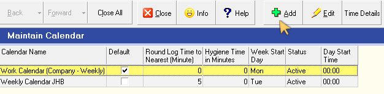  

It is normal for some companies to have separate calendars for different departments and divisions within the company.  
Factory calendars for example often differ from calendars that apply
to the retail outlets of the same company.  

### Add Working Calendar  

1.  To add a new calendar to the company's database, click the **Add** button on the Action bar.  

The system will display the **Add Calendar** screen.  

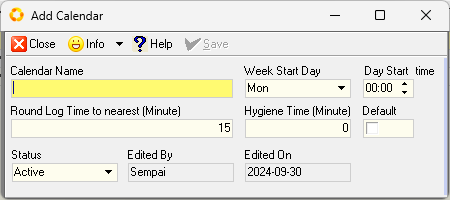  

2.  Enter a name to identify the Calendar you are about to create in the **Calendar Name** field.  

3.  Click the drop-down arrow in the **Week Start Day** field, to specify the day on which the week starts.  This is used for calculating totals for payroll.  

4.  Adjust the work day start time by entering the relevant values in the **Day Start time** field.  

5.  If you wish to make provision for Employees who arrive late for work, by adjusting the actual clock-in times - then enter the minute value in the **Round Log Time to nearest (Minute)** field.  

6.  Enter the time allowed for rest-room visits in the **Hygiene Time (Minute)** field.  

7.  If the Calendar you are creating is to be the common calendar used most in the company, check the **Default** option.  

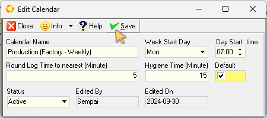  

8.  Once you have entered the information needed to create a new Working Calendar, click the **Save** button, and then the **Close** button on the form Action bar.  

### Add Working Time Periods  

You will now need to define the details of the **working time periods** within the Calendar.  

1.  Click on the newly created Calendar record row, then  

2.  Click the **Time Details** button on the Action bar.  

The system will open the **Calendar Detail** list screen.  

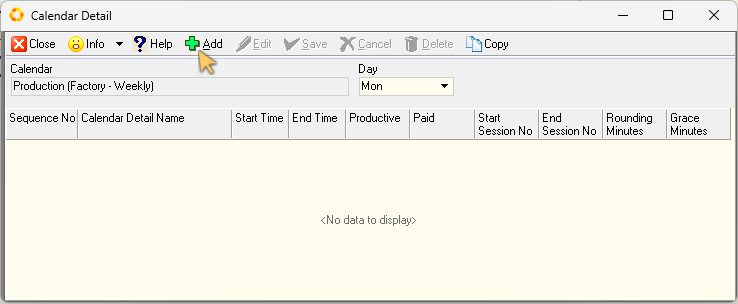  

This screen lists time period detailed information for each day on the calendar.  

:::important  
On initial access, the Calendar Detail list screen will not display any data.  

The next step is to add consecutive work time periods for the entire working day.  
:::  

3. To create a new period, click the **Add** button on the form Action bar.  

The **Add Calendar Detail** screen is displayed.  

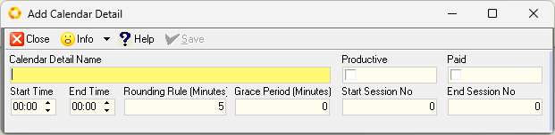  

This screen enables you to enter detailed information by assigning a Work Period **Name**, **create Work Periods**, with a **start time** and **end time** for each period.  

In addition, for each period you create you need to specify whether the period is a **productive** period and whether the period is **paid** or not.  

4. Enter a name to describe and identify the period in the **Calendar Detail Name** field.  

5.  If you expect Employees who are assigned to this period to do productive work during the period, ensure the check-box in the **Productive** field is set to checked.  

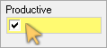  

Alternatively, if the period is reserved for preparing for the day, cleaning up, breaks or lunch, then leave the Productive field un-checked.  

6.  If you pay Employees for the time they are at the company during this period, then set the **Paid** field to **Checked** by clicking the check-box in the Paid field.  

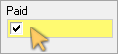  

If not, then leave the Paid field un-checked.  

7. Enter the **Start Time** for the period you are adding to the Calendar.  

:::note  
If the new period follows on from a previous period, your Start Time should be the same as the End Time of the previous period.  
:::  

8. Enter the **End Time** for the period.  

9.  Enter the number of minutes to be applied as a rounding calculation in the **Rounding Rule (Minutes)** field.  

10. Enter the number of minutes extended as the grace period in the **Grace Period (Minutes)** field.  

11. Enter the sequential number of the work session in the **Start Session No** and **End Session No** fields.   

:::note  
If your company adheres to firm and resolute start and end times for each work period, a new work session follows on sequentially from a previous session.  In this case, the _End Session No_ should be the same as the _Start Session No_ for each period, and increase incrementally to that of the previous period.  

If your company has flexible starting times for each work period, then you can to set the **Start Session No** for the 1st Work Period of the day, and the same number in the **End Session No** for the last period of the day.  
:::  

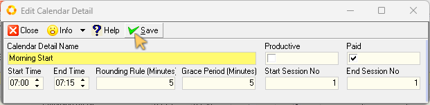  

12. Once you have entered the relevant information for the work period, click the **Save** button on the form Action bar, then  

13. Click the **Close** button. 
 
Repeat the steps above for each period you wish to add to the Calendar Detail list.  

Once you have added all the necessary work periods for the work day, click the **Save** button on the Action bar.  

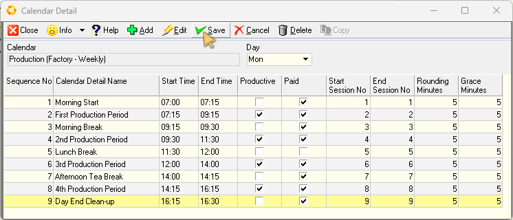  

### Copy Daily Work Periods  

Once you have entered the working time periods for a specific day, you can copy the details to other day(s) of the week.  If your company follows the same working routine each day, you can then leave them unchanged.  
Alternatively, you can edit the details to depict the differences in periods for each day, e.g. if your Friday work day ends early.  

To copy Work Periods:  

1.  Click the **Copy** button on the form Action bar.  

The system will open a screen titled **Calendar Copy to Day**.  

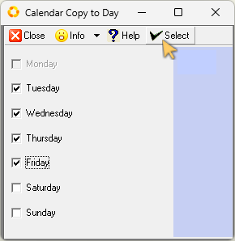  

:::important  
The day in which you are working will be disabled (greyed out).  
This indicates that the system will use the details of the disabled day to copy to the days you select.  
:::

2.  Check the days to which you wish to copy the details of the chosen day.  

3.  Click the **Select** button.  

The system will display an Information dialogue confirming "Calendar Copy complete."

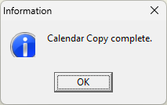  

4.  Click the **OK** button on the form Action bar.  

You can now select a day on the Calendar Detail screen, and then edit the work periods as necessary.  

### Edit Work Periods  

To edit Work Time Periods for a specific day:

1.  Click the down-arrow in the **Day** field, then  

2.  Click on the relevant option in the drop-down list.  

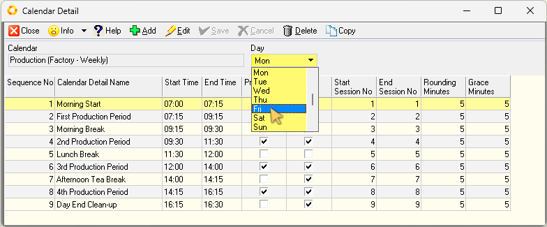  

3.  You can now **Add** a new record, **Edit** an existing record, or **Delete** a work time period record.  

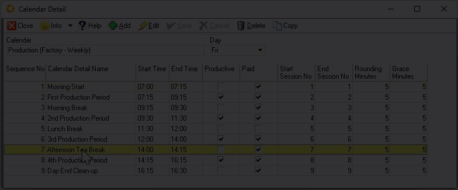  

Once all amendments are made:  

4.  Click the **Save** button, then  

5.  Click the **Close** button on the form Action bar.  

The **Maintain Calendar** list screen is updated with the new Calendar details. 

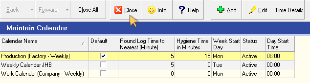  

6.  Click the **Close** button on the Action bar.  
___

## Maintain Holiday Calendars  

1.  Click the **Planning** option on the Main Navigation Menu, then  

2.  Click **Holiday Maintenance** on the drop-down menu.  

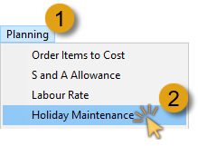  

The system will open a screen titled **Holiday Maintenance**.  

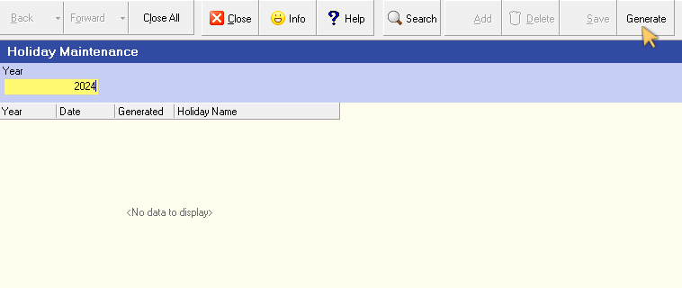  

You can automatically populate the Holiday Calendar using the information for the country in which your company is based.  

To do this: 

3.  Enter the Year number in the **Year** field, and then  

4.  Click the **Generate** button on the Action bar.  

The system will generate entries for each of the official Holidays based on the rules defined.  

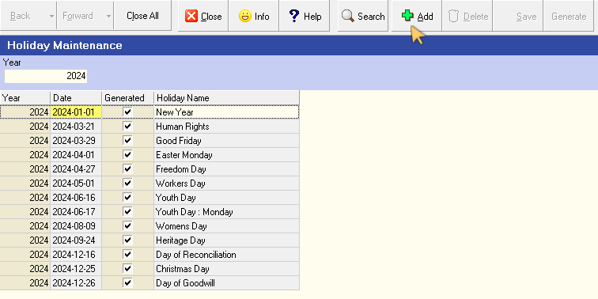  

To Add you own Holiday, (for example "Annual Company Shut Down" date):  

5.  Click the **Add** button on the form bar.  

The system will insert a blank row into the grid.  

6.  Select the **Date** you wish to apply to the Holiday you are about to
    create.  

7.  Enter a **Name** for the Holiday.  

8.  Click the **Save** button.  

9.  Click the **Search** button to refresh the Holiday Maintenance list screen.  

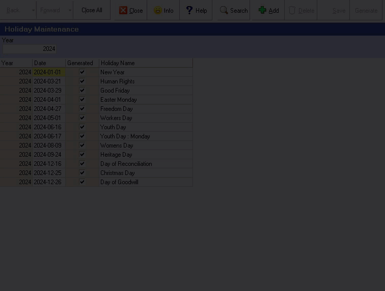  

To remove a Holiday from the list:  

10. Click on the record row displaying the holiday you wish to remove, and then   

11. Click the **Delete** button on the Action bar.  

:::note  
You cannot remove System Generated holiday records.  
:::  

12. Click the **Save** button to save the Holiday Calendar to the database.  

13. Click the **Close** button to exit the Holiday Maintenance screen.  
___
**This is the end of this procedure.**  
