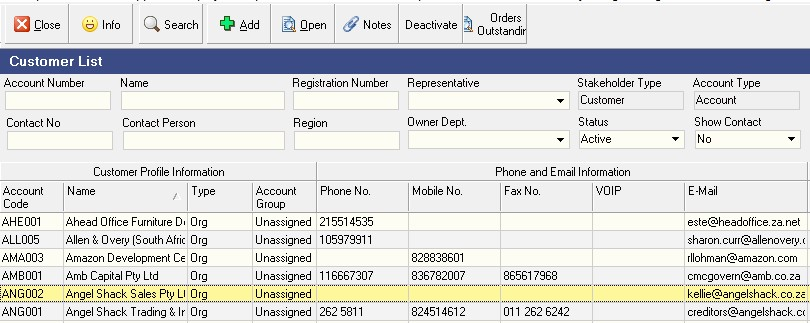

## Procedure Guideline
___  

This procedure explains how to **search** for, **select**, **add** and
**change** customers in the Sense-i Enterprise Management System.

1.  Click **Customer** on the Main Navigation Menu.

2.  Select the **Customer** option from the Drop-down Menu.  

  

The system will display a screen titled **Maintain Customer Profile**.
This screen lists all the companies classified as Customers in the
system. At the top of this screen is a panel consisting of two rows
and the bottom a grid of many rows containing customer information.  

### Customer Search

The top panel is called the "**Search Criteria**" panel and it enables
you to enter partial information about a Customer and then to instruct
the system to find all records that match the information you have
entered.  

  

3.  To find all customers that contain the letters "*Mod*" in their name
    you can type the **%** symbol and then the letters "***mod***" in
    the Name fields and then...  

4.  Select the **Search** Button on the Menu Bar.  

### Add Customer

1.  If you cannot find the Customer you wish to use, Click the **Add**
    Button on the Menu Bar.  

2.  The system will display a screen titled **Add New Customer** on top
    of the list of Customers already captured in the system.  

This screen provides a series of blank fields that will enable you to
record basic information about the Customer, such as their **Name**,
their **Registered Name**, **Registration Number**, **Tax Number** and
**Contact** details.  

  

3.  First you will need to define whether the Customer Profile you are
    about to add is for a "**Person**" or an "**Organisation**."  

Entering information about Customers who are Individuals use
different fields from entering information about Customers who are
Organisations.  

Click on the drop down list in the **Party Type** field and then
depending on whether you want to enter information about a Customer
that is an **Organisation** or a **Person** select the appropriate
Customer Type.  

  

4.  To add a Customer it is necessary to complete the remaining fields
    on the screen. The more complete and accurate the information you
    enter into the system, the better the system will function.

-   Capture the Short / Common or Abbreviated Name in the **Common Name**
	field. This is usually the trading name.

-   Capture the Registered Name in the **Registered Name** field.

-   Enter the Customer's Registration Number in the **Registration
    Number** field.

-   Enter the Customer's VAT Number in the **VAT Number** field.
    This will appear on all Quotes, Orders, Delivery Notes and
    Invoices as required by law.

-   Capture the date on which the Customer's company was registered
    in the **Registration Date** field. For individuals, this would
    be their **Birth Date**.

5.	Enter a Customer specific account folder name in the **Account Folder Name** field. 
	This folder will be used by the system to store communication, proposals, word 
	documents and PDF Files such as **Sales Orders**, **Delivery Notes** and **Invoices** 
	that are created for this Customer in the system.  
	
:::note Customer Directory
The **Customer Directory** needs to be established under **Party Document Folders**.  
This can be setup by selecting **Tools / Directory Setting** :memo: from the main menu.  
It is advisable that this directory is created as a shared folder on your company's Local Area Network.
:::	

### Primary Contact Information

-   Enter the main phone number for the Customer in the **Phone No**
    field.

-   Enter the mobile number of the primary contact for the Customer in
    the **Mobile No** field.

-   Enter the Fax Number in the **Fax No** field.

-   If you communicate with the customer using internet telephony then
    enter their Voice Over IP name in the **VOIP** field.

-   Enter the Primary **E-mail** Address. You will notice that as you
    enter an e-mail the system displays an icon next to the e-mail
    address. You can click on this icon to open an e-mail to this
    customer from within the system.

-   Enter any Second e-mail Address in the **Alternate E-Mail** field.

-   Enter the website address for the Customer in the **Web Site**
    address field.  

### Customer Address Information

1. Select the **Address** Tab on the Add New Customer screen to add
    Addresses for the Customer.  

  

2. The system will display a window that lists all of the addresses
    that have been defined for the customer.  

3. To add a new address click the **Add** button.  

4. The system will display a screen titled Add Address. This screen
    enables you to store as many Physical, Postal and Shipping Addresses
    for each Customer as you need.  

  

5. You can assign a name to each address, for example, Head Office, or
    Cape Town Branch, or whatever is appropriate.  

6. Choose the **Address Type** from the Drop Down List.  

7. Enter the Street / P.O. Box address. You can do this over two lines.  

8. Enter the **Suburb**.  

9. Enter the **City**.  

10. Enter the State or **Province** in which the Customer is located.  

11. Enter the Zip or **Postal Code** for the Customer.  

12. Select the **Country**.  

13. The system stores a list of all the suburbs, cities and postal or
    zip codes for the country in which you are based.

Provided that you have entered sufficient information for the system
to find a match, the system can autofill the remaining fields.
Usually, the Province and City are sufficient to be able to view a
list of Suburbs in the system and clicking the fill button will find
the correct postal code.

14. Click the **Save** button once you have completely entered the
    address.  

If you need to create additional addresses for the Customer repeat
the steps above as often as you need to.  

### Add Contacts

1.  You can add as many contacts as you wish to each customer.  

1.  Simply click on the **Contacts** tab to view a list of all of the
    Contacts that have been defined for the selected customer.  
	
1.	To add an additional customer contact, click the **Add** button.

1.  The system will display a screen titled Add Contact. Simply enter as
    much information as you need about the contact in the fields on this
    screen.  
	
  	

:::note
This screen enables you to enter all of the information you might need to 
maintain accurate and complete contact records.
:::

5.  When you have completed entering details for the contact, click the
    Save button.

1.  You can repeat the steps above for each contact you need to add for
    the supplier.  
	
### Accounts Information  

1.  To enter accounts details for the Customer, click the **Accounts** Tab.

1.	To edit the Customer Account information, select and then double-click 
	the **specific Customer** record line.

1.	The **Edit Account** screen will be displayed.

  

Amend the account details as required then select **Save**.  
On completion click on the **Close** button.

### Additional Customer Information

1.  To add details about the customers account, payment terms and so on,
    click the **[Customer Info]** tab.

  

2. Enter an Account Number for the Customer in the **Account Number**
    field.  

3. Click on the Drop-Down Button in the **Account Group** field.  

4. Select an Account Group from the **drop-down list** of Account
    Groups that have been defined in the system.  

This field allows you to assign the specific Customer you are adding
to a Grouping of companies. These groupings allow you to analyse your
sales and income at a higher level than individual customers.

You could use groupings such a Corporate, Hospitality, Individuals,
Restaurants and so on to group customers...  
or you could group your Customers according to the type of **Industry**
in which they operate.

5. Select the **Currency** in which your company will transact with the
    Customer.

6. Set any default discount given to the Customer in the **Trade Discount** field.  

7. Select the default **Tax Rate** you wish to use on Orders captured
    for this Customer.  

8. If you are going to allow the people who will be capturing Sales
    Orders to use different terms for this Customer when creating Sales
    Orders, then check the **Allow Terms Over-ride** box.  

9. If you are going to allow the people who will be capturing Sales
    Orders to change the **Material Cost Price** of the items that
    appear on the Sales Order, then check the **Allow Price Over-ride**
    box.  

10. Select the method by which you will check on the **Credit Available**
to the Customer.  

You can either check that the Customer has sufficient Credit Available
when capturing the Order (i.e. upfront, before you start the work) or
before you deliver the items to the customer (i.e. after the work has
been completed.)  

11. Select the **Payment Terms** for this Customer from the drop-down
list of terms available.  

:::note
If you do not find the right set of terms in this list, go to the
procedure titled **[Customer Payment Terms](710)**.  
:::

12. Once you have entered the necessary and available information, you
    should click on the **Save** button on the Add New Customer screen
    to save this information to the database.  

___
You can leave any field that does not have a **"\*"** sign next to its
name blank.  
All fields that do have a **"\*"** sign next to the name must
be completed.  

Remember also that you can change or add additional information to the
database at any time, but it is always better to capture complete and
accurate information the first time, if this is possible.

- Click the **Close** Button once you have completed adding customer
    information to the system.

You have now set-up the Customer's profile.

This information will appear on the Customer Transaction forms such as
**Sales Orders, Delivery Notes, Sales Tax Invoices** and other customer
related documents.

**This is the end of this procedure.**

:::warning Note to Scribe
Content required for the following sections / documents:
- Bank Accounts
- Certificates
:::