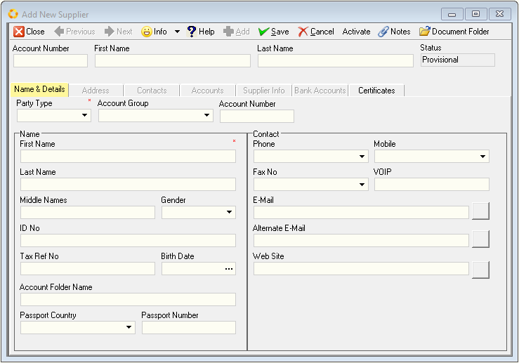
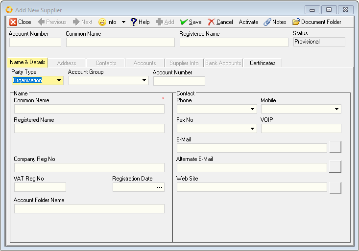
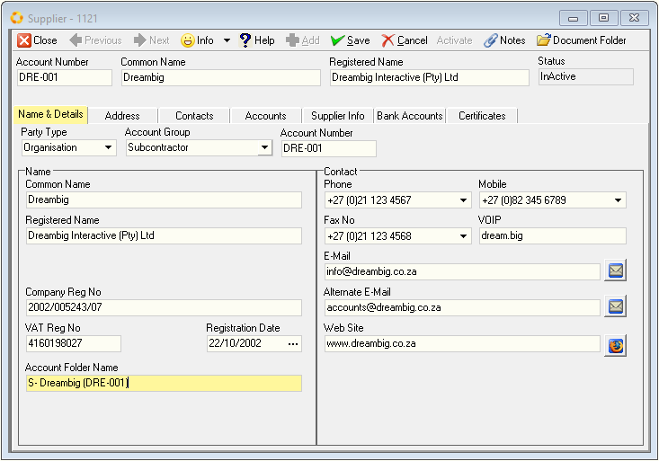
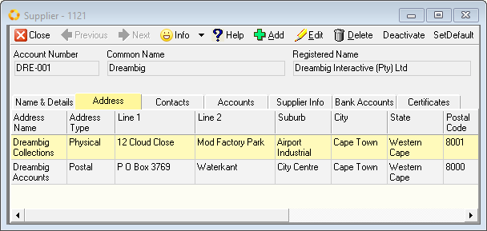
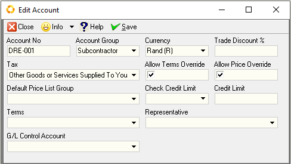

## Procedure Guideline
___  

This procedure describes how to add the names of new suppliers and
their details to the Sense-i Enterprise Management System.  

1.  Click on the **Supplier** item on the main menu.  

2.  Click on the **Supplier** item from the drop down list.  

  

The system will display a screen titled **Supplier List**.  
This screen lists all of the companies that have been classified as 
Suppliers in the system.  

_(The first time you enter this screen it will not have any
information to list so the grid will be empty.)_  

  

3.  Click on the **Add** Button on the Form Bar.

4.  The system will display a screen titled **Add New Supplier**.

  

You will notice that this screen contains additional _**Tab**_ sheets; 
- Name & Details  
- Address  
- Contacts  
- Accounts  
- Supplier Info, and  
- Bank Accounts

You enter information about the Supplier in the fields on each of these Tab sheets.  

### Supplier Name & Details

1.  The **Name & Details** Tab on the **Add New Supplier** screen provides a series 
	of blank fields that will enable you to record basic information about the
	supplier, such as their **Name** / **Company Name**, their **Registered Name** and 
	**Registration Number**, **Tax Number** and primary **Contact** details.  
	To add a Supplier it is necessary to complete these fields. The more complete and 
	accurate the information you enter into the system, the better the system will
    function.

2.  First, you need to define whether the Supplier you are adding to the
    database is a **Person** or an **Organisation**. 
	Select the appropriate option from the **Party Type** drop down list.

1.  If the supplier is an organisation, capture the Common or Short Name
    in the **Common Name** field. If the supplier is an individual, capture
    their First Name in the **First Name** field.

1.  If the supplier is an organisation, capture the Registered Name in
    the **Registered Name** field or if the supplier is an individual,
    capture their **Last Name** and then **Middle Name** in the next two fields.

1.  Enter the Supplier's Registration Number in the **Company Reg No** field.

1.	Enter the Supplier's Tax Number in the **VAT Reg No** field.

1.	Capture or Set the **Registration Date**, that is the date on which the
    Supplier's company was registered.  
	
1.	Enter a Supplier specific account folder name in the **Account Folder Name** field. 
	This folder will be used by the system to store communication, proposals, word 
	documents and PDF Files such as **Purchase Orders** and **Supplier Claim forms** 
	that are created for this supplier in the system.  
	
:::note Supplier Directory
The **Supplier Directory** needs to be established under **Party Document Folders**.  
This can be setup by selecting **Tools / Directory Setting** :memo: from the main menu.  
It is advisable that this directory is created as a shared folder on your company's Local Area Network.
:::	

### Primary Contact Information

1.	Enter the main phone number for the Supplier in the **Phone** _(number)_
    field.

1.	Enter the mobile number of the primary contact for the Supplier in
    the **Mobile** _(number)_ field.

1.	Enter the Fax Number in the **Fax No** field.

1.	If you use the internet to communicate with the supplier using an
    application like Skype, enter the supplier's **VOIP** _(number / Name)_ in
    this field.

1.	Enter the Primary **E-mail** address.

1.	Enter any **Alternate E-mail** address.

1.  Enter the Website Address for the supplier in the **Web Site** address
    field.

1.  Once you have entered the necessary and available information, you
    should click on the **Save** button on the Add New Supplier screen to save
    this information to the database.  
	
  	
	
:::tip Document Folder
Once the New Supplier Information has been saved and Activated, Click on the  button (top-right of the form) 
and confirm the relevant folder to be created and shared across the network.   
:::  

### Supplier Address Information	

1.  Click the **Address** Tab to add Addresses for the Supplier.  

1.  To add an address for the supplier to the database, click the Add
    button on the Add Supplier screen.  
	
1.  The system will display a window titled **Add Address** that enables you to store
    various Physical, Postal and Shipping Addresses for each supplier.

  

4.	You can enter an **Address Name** for the address you are capturing.  

1.  Choose the **Address Type** from the Drop Down List.  

1.  Enter the Street / P.O. Box address. You can do this over **two lines**.  

1.  Enter the **Suburb**.  

1.  Enter the **City**.  

1.  Enter the **Province** _(State)_ in which the Supplier is located.  

1.  Enter the **Postal Code** _(Zip Code)_ for the Supplier.  

1.  Select the **Country**.  

:::note
The system maintains a list of all suburbs, cities, provinces and
postal codes for the country. When you have entered sufficient
information for the system to find a unique match, you can click the
**Fill** button and the system will complete the address with the
correct information.  
:::

12. Click the **Save** button once you have completely entered the address
    and then click the Close button.

1.  If you need to create additional addresses for the Supplier then
    repeat the steps above for each address you need to load.

1.  The system will display each address you have added in a list of
    addresses on the **Address** Tab.  

  

### Add Contacts

1.  You can add as many contacts as you wish to each supplier.  

1.  Simply click on the **Contacts** tab to view a list of all of the
    Contacts that have been defined for the selected supplier.  
	
1.	To add a contact to the supplier, click the **Add** button.

1.  The system will display a screen titled Add Contact. Simply enter as
    much information as you need about the contact in the fields on this
    screen.  
	
  	

:::note
This screen enables you to enter all of the information you might need to 
maintain accurate and complete contact records.
:::

5.  When you have completed entering details for the contact, click the
    Save button.

1.  You can repeat the steps above for each contact you need to add for
    the supplier.  
	
### Accounts Information  

	

1.  To enter accounts details for the Supplier, click the **Accounts** Tab.

1.	To edit the Supplier Account information, select and then double-click 
	the **Supplier** record line.

1.	The **Edit Account** screen will be displayed.

  

4.  Assign the supplier to a **Supplier Group**. This field lists all the
    Supplier Groups that have been defined in the system. The Supplier
    Group function allows you to assign the specific Supplier to one of
    the groups you have defined. These groupings allow you to analyse
    your purchases and expenditure at a higher level than individual
    suppliers. You could use groupings such a Local, Foreign, BEE
    Approved, Non-BEE and so on to group your suppliers, or you could
    group them according to the type of Industry in which they operate.    
	
1.  Select the **Currency** in which your company will transact with the
    Supplier.  

1.  Enter a default **Trade Discount** percentage that is used when 
	placing orders with the supplier if one applies.  
	
1.  From the dropdown menu Select a default **Tax** Rate for use on all 
	the transactions you capture for the supplier. You can override this 
	when capturing the actual transactions.  

1.  If you are going to allow the people who capture Purchase Orders to
    use different terms for this Supplier when creating Orders check the
    **Allow Terms Override** box.  

1.  If you are going to allow the people who will be capturing Purchase
    Orders to change the Material Cost Price of the items that appear on
    the Purchase Order, then check the **Allow Price Override** box.  

1.  Select the **Check Credit Limit** method by which you will check the 
	Credit Available from the Supplier.  
	You can either check that you have sufficient Credit available when 
	capturing the Order (i.e. upfront) or before the Supplier delivers 
	the items. The terms method depends on the terms granted by the 
	Supplier to your company.  
	
1.  Enter a **Credit Limit** amount. :memo:

1.  Select the Payment **Terms** on which this Supplier sells materials or
    machines to your company from the drop down list of terms available.
    If you do not find the right set of terms in this list, go to the
    procedure titled Define Account Terms.  

1.  Once you have completed adding contact information, click the **Save** 
    button.  

1.  You have now set-up the supplier's profile. This information you
    have entered will appear on the Supplier Transaction forms such as
    Purchase Orders, GRVs, claim forms and similar documents.  

1.  You can now search for the Supplier on the Maintain Supplier List
    screen using the **Search** fields at the top of the screen.  

1.  Repeat this procedure for each supplier you need to add to the
    system.  

**This is the end of this procedure.**  

:::warning Note to Scribe
Content required for the following sections / documents:
- Supplier Info
- Bank Accounts
- Certificates
:::
