## Procedure Guideline
___  

### Introduction  

This procedure explains how to **search** for, **select**, **add** and
**change** **SUPPLIERS** in the Sense-i Enterprise Management System.

1.  Click **Supplier** on the Main Navigation Menu.

2.  Select the **Supplier** option from the Drop-down Menu.  

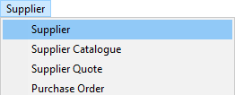  

The system will display a screen titled **Supplier List**.  

This screen lists all the parties (companies & individuls) classified as Suppliers in the system.  

This screen consists of;  
-   a panel (consisting of two rows) at the top called the **Search Criteria Panel**  
-   an **Alphabetical Selection Panel** on the far right of the screen, and  
-   a Grid of many rows containing supplier information at the bottom called the **Supplier List Grid**  

:::imporant  
On opening the **Supplier List** screen, the default **Alphabetical Selection Panel** displays supplier names beginning with the letter **"A"**.  

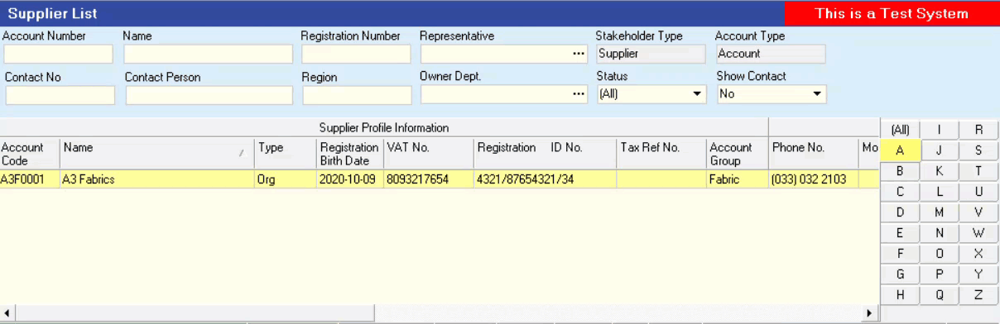  

Click on the **(All)** button to list **all Suppliers**.  

Click on the relevant letter in the **Alphabetical Selection Panel** to list supplier names that begin with that specific letter.  
:::  

### Supplier Search

The top panel is called the "**Search Criteria**" panel and it enables you to enter partial information about a Supplier and then to instruct the system to find all records that match the information you have entered.  

:::important  
1.  Ensure that the **(All)** button is selected on the **Alphabetical Selection Panel**.  
:::  

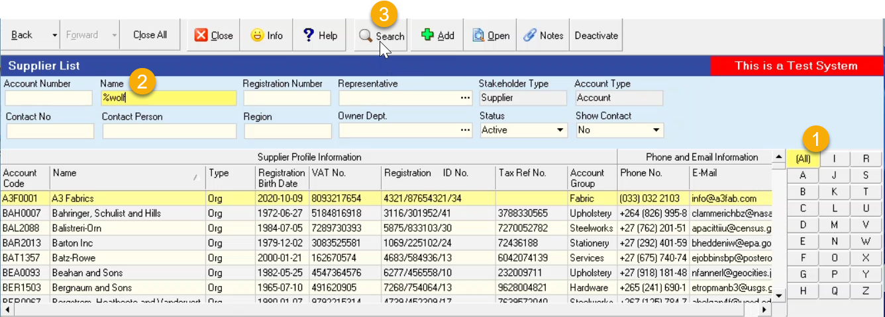  

2.  To find all suppliers that contain the letters **"*wolf*"** in their name you can type the **% symbol** and then the letters "***wolf***" in the **Name field** and then...  

3.  Select the **Search** Button on the Menu Bar.  

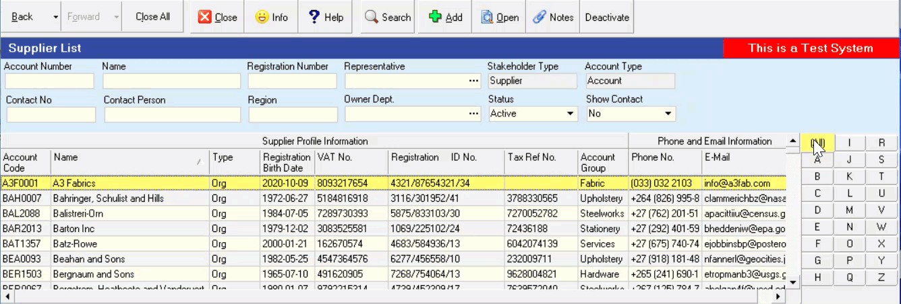  

## Add Supplier  

This procedure describes how to add the names of new suppliers and
their details to the Sense-i Enterprise Management System.  

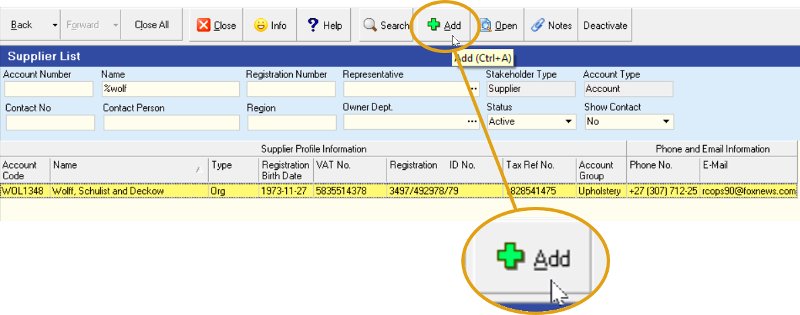  

1.  If you cannot find the Supplier you wish to use, click the **Add** button on the Form Action Bar.

2.  The system will display a screen titled **Add New Supplier**.

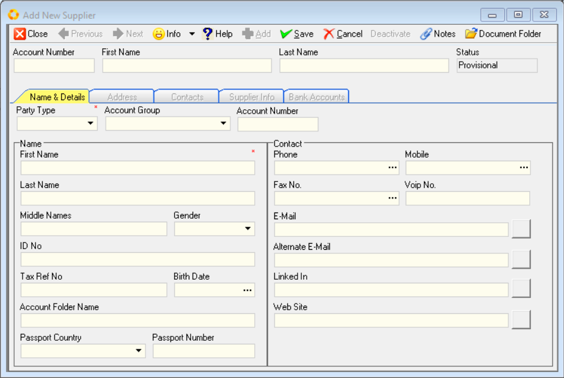  

You will notice that this screen contains additional _**Tab**_ sheets; 
- Name & Details  
- Address  
- Contacts
- Supplier Info, and  
- Bank Accounts

You enter information about the Supplier in the fields on each of these Tab sheets.  

### Supplier Name & Details

The **Name & Details** Tab on the **Add New Supplier** screen provides a series of blank fields that will enable you to record basic information about the supplier, such as their **Name** / **Company Name**, their **Surname / Registered Name**, **Identity / Registration Number**, **Tax Number** and primary **Contact** details.  

To add a Supplier it is necessary to complete these fields.  

:::tip  
The more complete and accurate the information you enter into the system, the better the system will function.  
:::  

1.  First, you need to define whether the Supplier you are adding to the database is an **Organisation** or a **Person** _(individual)_.  
Select the appropriate option from the **Party Type** drop down list.  

:::note  
The subsequent fields in the **Name section** will be relevant according to the **Party Type** chosen. 

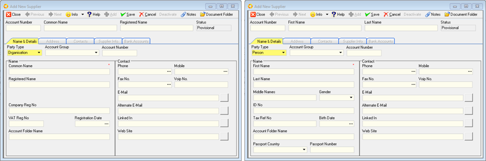  

:::  

2.  Assign the supplier to an **Account Group**. This field lists all the Supplier Groups that have been defined in the system.  

The Account Group function allows you to assign the specific Supplier to one of the groups you have defined. These groupings allow you to analyse your purchases and expenditure at a higher level than individual suppliers.  

You could use groupings such a Local, Foreign, BEE Approved, Non-BEE and so on to group your suppliers, or you could group them according to the **type of Industry** in which they operate.  

3.  Assign a **_unique_ Account Number** to the Supplier.  
This could be a combination of alpha numeric characters _(letters and numbers)_.

4.  If the supplier is an organisation, capture the Common or Short Name in the **Common Name** field.  
If the supplier is an individual, capture their First Name in the **First Name** field.

5.  If the supplier is an organisation, capture the Registered Name in the **Registered Name** field.  
If the supplier is an individual, capture their **Last Name** and then **Middle Name** in the next two fields, then select their **Gender** from the drop-down options.  

6.  Enter the Supplier's Registration Number in the **Company Reg No** field, or enter their **ID number** if the supplier is an individual.  

5.	Enter the Supplier's Tax Number in the **VAT Reg No / Tax Ref No** field.  

6.	Capture or Set the **Registration Date**, that is the date on which the Supplier's company was registered.  
If the supplier is an individual, capture or set their **Birth Date**.  

The **Account Folder Name** field contains folder that will be used by the system to store communication, proposals, word documents and _.PDF_ files such as **Purchase Orders** and **Supplier Claim forms** that are created for this supplier in the system.  

:::tip  
If you leave the **Account Folder Name** blank, the system will automatically generate an appropriate Account Folder Name on **Activation** of the supplier record.  

ALTERNATIVELY, you can...  

7.	Enter a custom Supplier Account Folder Name, of your choice, in the **Account Folder Name** field.  
:::  

:::important Supplier Directory  
The **Supplier Directory** needs to be established under **Party Document Folders**.  

This can be setup by selecting **Tools / Directory Setting** from the main menu.  

This directory should be created as a **shared folder** on your company's Local Area Network OR shared Cloud-based drive.  

Refer to the document titled **["Directory Settings"](https://sense-i.co/docs/CNF002)**.  
:::	 

8.  If the supplier is an individual, select the relevant country from the **Passport Country** drop-down list, and then enter their passport number in the **Passport Number** field.  

### Primary Contact Information

1.	Enter the main phone number for the Supplier in the **Phone** _(number)_ field.

2.	Enter the mobile number of the primary contact for the Supplier in the **Mobile** _(number)_ field.  

3.	Enter the Fax Number in the **Fax No.** field.  

4.	If you use the internet to communicate with the supplier using an application like Skype, enter the supplier's **VOIP** _(number / name)_ in this field.  

5.	Enter the Primary **E-mail** address.  

6.	Enter any **Alternate E-mail** address.  

7.  Enter the supplier's **LinkedIn** URL address.

8.  Enter the Website Address for the supplier in the **Web Site** address field.  

9.  Once you have entered the necessary and available information, you should click on the **Save** button on the Add New Supplier screen to save this information to the database.  
	
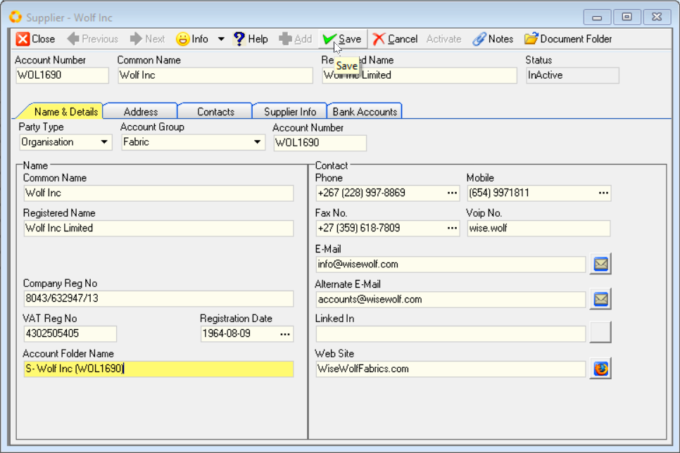  	

:::tip Document Folder  
Once the New Supplier Information has been saved, click on the  button (top-right of the form) and confirm the relevant folder to be created and shared across the network.   
:::  

### Supplier Address Information	

1.  Click the **Address** Tab to add Addresses for the Supplier.  

2.  To add an address for the supplier to the database, click the Add button on the Add Supplier screen.  

3.  The system will display a window titled **Add Address** that enables you to store various Physical, Postal and Shipping Addresses for each supplier.  

  

4.	You can enter an **Address Name** for the address you are capturing.  

5.  Choose the **Address Type** from the Drop Down List.  

6.  Enter the Street / P.O. Box address. You can do this over **two lines**.  

7.  Enter the **Suburb**.  

8.  Enter the **City**.  

9.  Enter the **Province** _(State)_ in which the Supplier is located.  

10. Enter the **Postal Code** _(Zip Code)_ for the Supplier.  

11. Select the **Country**.  

:::note  
The system maintains a list of all suburbs, cities, provinces and postal codes for the country. When you have entered sufficient information for the system to find a unique match, you can click the **Fill** button and the system will complete the address with the correct information.  
:::  

12. Click the **Save** button once you have completely entered the address and then click the **Close** button.  

If you need to create additional addresses for the Supplier then repeat the steps above for each address you need to load.  

The system will display each address you have added in a list of addresses on the **Address** Tab.  

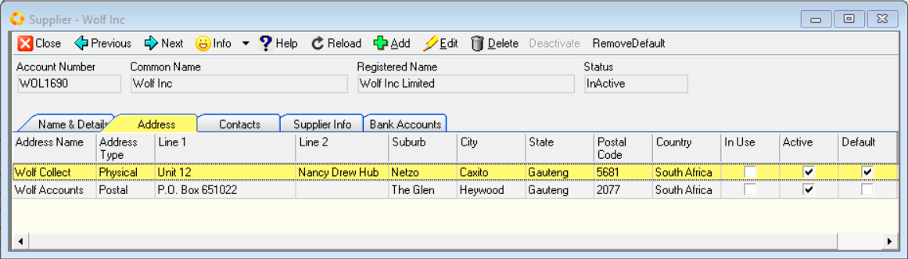  

### Add Contacts

1.  You can add as many contacts as you wish to each supplier.  

1.  Simply click on the **Contacts** tab to view a list of all of the
    Contacts that have been defined for the selected supplier.  
	
1.	To add a contact to the supplier, click the **Add** button.

1.  The system will display a screen titled Add Contact. Simply enter as
    much information as you need about the contact in the fields on this
    screen.  
	
  	

:::note
This screen enables you to enter all of the information you might need to 
maintain accurate and complete contact records.
:::

5.  When you have completed entering details for the contact, click the
    Save button.

1.  You can repeat the steps above for each contact you need to add for
    the supplier.  
	
### Supplier Info    

1.  To enter accounts details for the Supplier, click the **Supplier Info** Tab.

2.	The **Supplier Account** screen will be displayed.

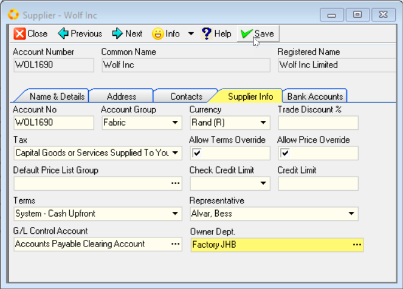  

4.  Assign the supplier to an **Account Group**. This field lists all the Supplier Groups that have been defined in the system.  

The Account Group function allows you to assign the specific Supplier to one of the groups you have defined. These groupings allow you to analyse your purchases and expenditure at a higher level than individual suppliers.  

You could use groupings such a Local, Foreign, BEE Approved, Non-BEE and so on to group your suppliers, or you could group them according to the type of Industry in which they operate.  
	
5.  Select the **Currency** in which your company will transact with the Supplier.  

6.  Enter a default **Trade Discount** percentage that is used when placing orders with the supplier if one applies.  
	
7.  From the dropdown menu Select a default **Tax** Rate for use on all the transactions you capture for the supplier.  
You can override this when capturing the actual transactions.  

8.  If you are going to allow the people who capture Purchase Orders to use different terms for this Supplier when creating Orders check the **Allow Terms Override** box.  

9.  If you are going to allow the people who will be capturing Purchase Orders to change the Material Cost Price of the items that appear on the Purchase Order, then check the **Allow Price Override** box.  

10. Select the **Check Credit Limit** method by which you will check the Credit Available from the Supplier.  

You can either check that you have sufficient Credit available when capturing the Order (i.e. upfront) or before the Supplier delivers the items. The terms method depends on the terms granted by the Supplier to your company.  
	
11. Enter a **Credit Limit** amount.  

12. Select the **Payment Terms** on which this Supplier sells materials to your company from the drop down list of terms available.  

If you do not find the right set of terms in this list, go to the procedure titled **["Supplier Payment Terms"](https://sense-i.co/docs/SAF720)**.  

13. Once you have completed adding contact information, click the **Save** button.  

### Bank Accounts _(Supplier)_  

1.  To enter Bank Account details for the Supplier, click the **Bank Accounts** Tab.

    The **Supplier - _(Name)_** Bank Accounts grid screen will be displayed.  

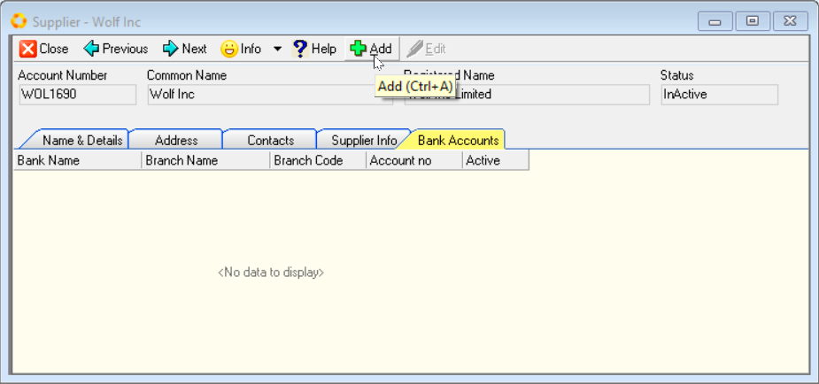  

2.  Click the **Add** button.  

    The **Edit Bank Account** screen is displayed.  

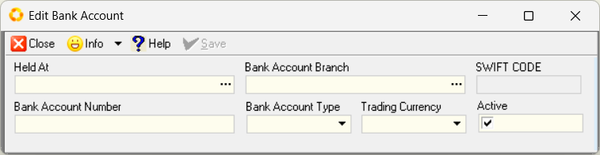  

3.  Click the **three-dot button** in the **Held AT** field to display a list of pre-defined banks.  

4.  Select the relevant Bank from the list.  

5.  Click the three-dot button in the **Bank Account Branch** field, and then select the relevant branch from the list.  

:::note  
The SWIFT CODE field is automatically populated when the **Bank Account Branch** is selected.  
:::  

6.  Enter the Supplier's **Bank Account Numer**.  

7.  Select the relevant **Bank Account Type** from the drop-down list.  

8.  Select the appropriate currency from the drop-down list in the **Trading Currency** field.  

The **Active** checkbox is enabled by default.  

9.  Click the **Save** button.

10. Repeat steps 2 - 9 above to capture additional Bank Accounts for the supplier.

### Save & Activate  

Once you have reveiwed all the information in the different Tabs on the Supplier screen, and you are satisfied that the information is correct, the supplier's profile is complete.  

1.  Click on the **Name & Details** Tab.  

2.  Click the **Save** button, then click the **Activate** button on the form Action bar.  

3.  Click the **Close** button to close and exit the Supplier Information screen, and return to the Supplier List grid screen.  

The information you have entered will appear on the **Supplier Transaction forms** such as Purchase Orders, Purchase Order Returns _(Claim forms)_ and similar documents.  

___

You can now search for the Supplier on the **Supplier List** screen using the **Search** fields at the top of the screen.  

Repeat this procedure for each supplier you need to add to the system.  

**This is the end of the Supplier Information procedure.**  