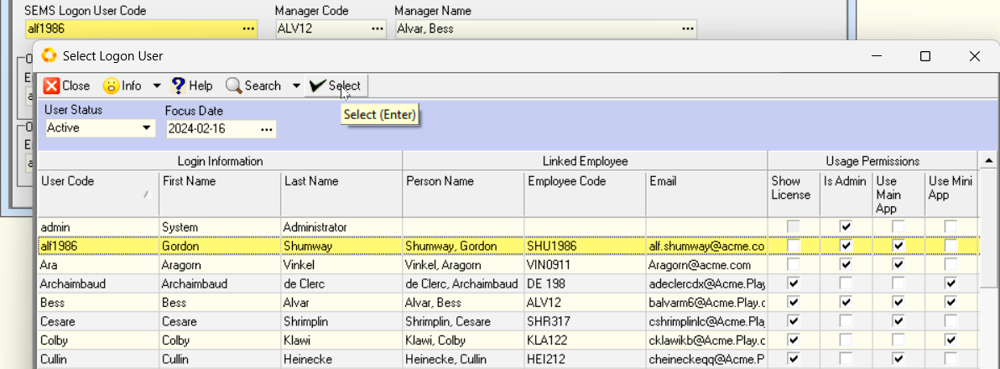
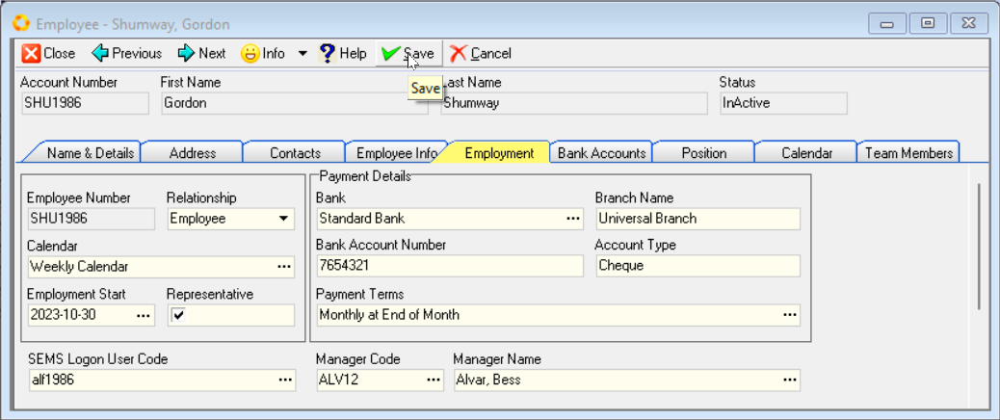
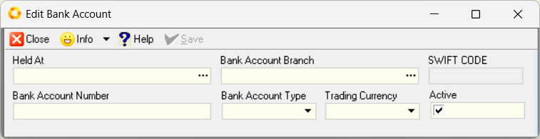

## Procedure Guideline  

This procedure explains how to **search** for, **select**, and **add Employees** in the Sense-i system.  

1.  Click on the **Employee** button in the Main Navigation Menu.  

2.  Then click **Employee List** in the Drop-down menu.  

  

The system will display a screen titled **Employee List**.  

This screen lists all the individuls classified as Employees and Contractors in the system.  

This screen consists of;  
-   a panel (consisting of two rows) at the top called the **Search Panel**  
-   an **Alphabetical Selection Panel** on the far right of the screen, and  
-   a Grid of many rows containing employee information at the bottom called the **Employee List Grid**  

:::important  
On opening the **Employee List** screen, **all** employees and contractors are displayed.  The **(All)** button in the **Alphabetical Selection Panel** is active.  

  

Click on the relevant letter in the **Alphabetical Selection Panel** to list employee names _(Surname, First name)_ that begin with that specific letter.  
:::  

### Employee Search

The top panel is called the "**Search Panel** and it enables you to enter partial information about a employee and then to instruct the system to find all records that match the information you have entered.  

:::important  
1.  Ensure that the **(All)** button is selected on the **Alphabetical Selection Panel**.  

:::  

  

2.  To find all suppliers that contain the letters **"*alf*"** in their name you can type the letters "***alf***" in the **Name field** and then...  

3.  Select the **Search** Button on the Menu Bar.  

  

## Add Employee  

This procedure describes how to add the names of new employees and their details to the Sense-i Enterprise Management System.  

  

1.  If you cannot find the employee you wish to use, click the **Add** button on the Action Bar.

2.  The system will open a screen titled **Employee - No Record**.  

  

You will notice that this screen contains additional _**TAB**_ sheets; 
- Name & Details  
- _Address_  
- _Contacts_<!-- - _Employee Info_   -->
- _Employment_  
- _Bank Accounts_  
- _Position_  
- _Calendar_, and  
- _Team Members_  

Once you have entered and saved the information on the **Name & Details** TAB sheet, the other TABs will become accessible.

You enter information about the Employee in the fields on each of these TAB sheets.  

### Employee Name & Details

The **Name & Details** Tab on the **Add New Employee** screen provides a series of blank fields that will enable you to record basic information about the employee.

These fields include **Name(s)**, **Surname**, **Gender**, **Identity** and **Tax Number**, **Birth Date** and **Passport** details.  
The right hand section contains the fields for the primary **Contact** details.  

:::important  
All fields that have a little **red Asterisk** sign next to the name **MUST** be completed.  
To add an Employee it is necessary to complete these fields.  

  
:::  

:::tip  
The more complete and accurate the information you enter into the system, the better the system will function.  
:::  

1.  First, you need to define whether the Employee you are adding to the database is an **Contractor** or an **Employee**.  
Select the appropriate option from the **Relationship** drop-down list.  

2.  Enter a unique **Employee Number** using the naming convention as preferred by your company… this could be any combination of alpha-numeric characters.  
As an example, we could use the first three letters of the employee’s surname followed by a four-digit number.

3.  Assign the employee to a **Department**. This drop-down field lists all the Company Departments that have been defined in the system.  

  

4.  Next, you need to assign the Employee to a Position within the Department you have chosen.  
Click on the three-dot button in the **Position** field, select & click on the position the employee occupies, and then click the **Select** button.  

  

5.  Capture their First Name in the **First Name** field.

6.  Capture their **Last Name** and then **Middle Name** in the next two fields, then select their **Gender** from the drop-down options.  

7.  Enter their **ID number**.  

8.	Enter the Employee's Tax Number in the **Tax Ref No** field.  

9.	Capture or set their **Birth Date**.  
This is easily done by clicking on the three-dot button in the Birth Date field, and using the pop-up **date control panel** to select the relevant year, month and day.

The **Account Folder Name** field contains folder that will be used by the system to store communication, documents and _.PDF_ files that are created for this employee in the system.  

:::tip  
If you leave the **Account Folder Name** blank, the system will automatically generate an appropriate Account Folder Name on **Activation** of the employee record.  

  

ALTERNATIVELY, you can...  

7.	Enter a custom Account Folder Name, of your choice, in the **Account Folder Name** field.  
:::  

:::important Employee Directory  
The **Employee Directory** needs to be established under **Party Document Folders**.  

This can be setup by selecting **Tools / Directory Setting** from the main menu.  

This directory should be created as a **shared folder** on your company's Local Area Network OR shared Cloud-based drive.  

Refer to the document titled **["Directory Settings"](https://sense-i.co/docs/CNF002)**.  
:::	 

8.  Select the relevant country from the **Passport Country** drop-down list, and then enter their passport number in the **Passport Number** field.  

### Primary Contact Information

1.	Enter the main phone number for the Employee in the **Phone** _(number)_ field.

2.	Enter the mobile number in the **Mobile** _(number)_ field.  

3.	Enter the Fax Number in the **Fax No.** field.  

4.	If the employee uses the internet to communicate (using an application like Skype), enter the employee's **VOIP** _(number / name)_ in this field.  

5.	Enter the Primary **Email** address.  

6.	Enter any **Alternate Email** address.  

7.  Enter the employee's **LinkedIn** URL address.

8.  Enter the Website Address for the employee in the **Website** address field.  

9.  Once you have entered the necessary and available information, you should click on the **Save** button on the form Action Bar to save this information to the database.  

The remaining TAB sheets now become accessible.
	
  	

:::tip Document Folder  
Once the New Employee Information has been saved, click on the  button (top-right of the form) and confirm the relevant folder to be created and shared across the network.   
:::  

### Employee Address Information	

1.  Click the **Address** Tab to add Addresses for the Employee.  

2.  To add an address for the employee to the database, click the Add button on the form Action Bar.  

3.  The system will display a window titled **Add Address** that enables you to store various Physical, and Postal Addresses for each employee.  

  

4.	You can enter an **Address Name** for the address you are capturing.  

5.  Choose the **Address Type** from the drop-down list.  

6.  Enter the **Street / P.O. Box address**. You can do this over **two lines**.  

7.  Enter the **Suburb**.  

8.  Enter the **City**.  

9.  Enter the **Province** _(State)_ in which the Employee is located.  

10. Enter the **Postal Code** _(Zip Code)_.  

11. Select the **Country**.  

:::note  
The system maintains a list of all suburbs, cities, provinces and postal codes for the country. When you have entered sufficient information for the system to find a unique match, you can click the **Fill** button and the system will complete the address with the correct information.  
:::  

12. Click the **Save** button once you have completely entered the address and then click the **Close** button.  

If you need to create additional addresses for the Employee then repeat the steps above for each address you need to load.  

The system will display each address you have added in a list of addresses on the **Address** Tab.  

  

### Add Contacts

1.  You can add as many contacts as you wish to each employee.  

1.  Simply click on the **Contacts** TAB to view a list of all of the Contacts that have been defined for the selected employee.  
	
1.	To add a contact to the employee, click the **Add** button.  

1.  The system will display a screen titled **Add Contact**. Simply enter as much information as you need about the contact in the fields on this screen.  
	
  	

5.  When you have completed entering details for the contact, click the **Save** button.

1.  You can repeat the steps above for each contact you need to add for the employee.  
	
<!-- ### Employee Info    

1.  To enter accounts details for the Employee, click the **Employee Info** Tab.

2.	The **Employee Account Info** screen will be displayed.

  

3.  Assign the employee to an **Account Group**. This drop-down field lists all the Employee Groups that have been defined in the system.  

The Account Group function allows you to assign the specific Employee to one of the groups you have defined. These groupings allow you to analyse your payroll & production expenditure at a higher level than individual employees.  

You could use groupings such a **Director, Management, Full-time, Part-time, Contractor, Freelance**, and so on to group your employees, or you could group them according to the **Departments** in which they operate.  
	
4.  Select the **Currency** in which your company will transact with the Employee.  

5.  Enter a default **Trade Discount** percentage that is used if one applies.  
	
6.  From the dropdown menu Select a default **Tax** Rate for use on all the transactions you capture for the employee.  
You can override this when capturing the actual transactions.  

7.  If you are going to allow the people who capture transactions to use different terms for this Employee, check the **Allow Terms Override** box.  

8.  If you are going to allow the people who will be capturing transactions to change the Rates for the employee, then check the **Allow Price Override** box.  

9. Select the **Check Credit Limit** method.  

You can either check that you have sufficient Credit available upfront (upon acceptance of employment agreement) or before the contractor delivers the project. 

The terms method depends on the terms agreed to by the Contractor/Employee and your company.  
	
10. Enter a **Credit Limit** amount.  

11. Select the **Payment Terms** on which this Employee/Contractor delivers projects to your company from the drop down list of terms available.  

12. Once you have completed adding Employee Account information, click the **Save** button.   -->

### Employment Details  

1.  Click the **Employment** tab.  

The system will display the Employment information screen.  

This screen enables you to add the Employee's Start date, allow you to tag the employee as a Representative (Customer Sales and/or Supplier Materials Procurment), add Employee's banking details & Payment terms to the system, assign a SEMS Logon User Code, Manager Code and the relevant Manager Name. 

  

2. The Employee's Account Number, and his/her Rlationship to the company are already displayed in the **Employee Number**, and **Relationship** fields.  

3. Click on the **three-dot** button in the **Calendar** field.  

The system will display a list of Working Calendars that have been defined for the company.  

4. Click on the row containing the name of the **Working Calendar** to which you wish to link the selected Employee.  

  

5. Click on the **Select** button.  

Next, you need to define the employees Employment Start Date. This is the date on which they first began working for the company.  

6. Click the three-dot button in the **Employment Start Date** field to view a drop-down calendar and select the correct **Starting Date** for the Employee.  

7.  If the Employee is a **Customer Representative** and handles **Sales Quotes and Sales Orders** for the company, then check the **Representative** field.  

    Similarly, if the employee represents your company when dealing with **Suppliers** and handles **Purchase Orders**, then check the **Representative** field.  

  

:::important  
When tagging an employee as a **Representative**, the system will automaically add the employee as a Company **Contact**.  

The Employee details will then be available in the Company **Representative** list, and when selected, his/her details will be included on transactional documents as sent to Customers and/or Suppliers.  
:::  

8.  Select the Employee's Bank by clicking on the three-dot button in the **Bank** field.  

The system will open the **Add Bank Account** screen that enables you to capture the employees' banking details.  

  

9.  Click on the three-dot button in the **Held At** field to select the employee's Bank from a list of defined banks.  

    Click on the Bank at which their account is held and then click **Select**.  

  

10.  Click on the three dot button in the **Branch** field. The system will display a list of branches for the bank you have selected. Click the branch at which the employee's account is held and then click **Select**.  

:::note  
The SWIFT CODE field is automatically populated when the **Bank Account Branch** is selected.  
:::  

11.  Enter the employee's bank account number in the **Bank Account number** field.  
     
:::important  
If you are not going to record the Employee's details for payroll purposes in this system because you are using another system, then simply enter the numbers _123456_.  

If you are not recording the employee's banking information in the system, then use a *Default Employee Bank Account* which you can use instead of the actual bank account.  
:::  

12.  Select the **Account Type** from the drop-down list.  

13.  Next you need to define when the employee is paid. Click on the three-dot button in the **Payment Terms** field.  

This is either Daily, Weekly, Fortnightly, Monthly and so on.  

14.  Select the Interval or Cycle at which the Employee is paid.  

15.  Select the Day of the Week or Day of the Month on which payment is made to the Employee.  

  

#### SEMS Logon User Code  

:::important  
This procedure is relevant where the Employee will be using the SEMS system as a **Company Representative**, and will use the **Outgoing Email** function to send Transaction documents to Customers / Suppliers.  

The SEMS System Administrator must first add the Employee to the **Login User** list.  

Refer to the document titled **[Add SEMS Users](https://sense-i.co/docs/CNF003)**.  
:::  

1.  Click on the three-dot button in the **SEMS Logon User Code** field.  

The **Select Logon User** screen is displayed.  

  

2.  Click on the relevant record row, and then click the **Select** button on the list Action Bar.  

The system will return to the Employee Profile screen.  

:::important  
The **Outgoing Mail** and **Outgoing Alternative Mail** sections now become available and accessible.  

  

Refer to the document **[Configure Outgoing Email Settings](https://sense-i.co/docs/CNFE002)** for detailed procedure guidelines.  
:::  

3.  Click the three-dot button in the **Manager Code** field to select the manager to whom the Employee reports to.  

The system will return to the Employment TAB screen and display all the information you have defined for the selected employee.  

  

4. Click the **Save** button.  

### Bank Accounts  

1.  Click the **Bank Accounts** Tab.

    The **Employee - _(Name)_** Bank Accounts grid screen will be displayed, with the bank account details as captured in the Employment TAB screen.   

  

2.  To enter additional Bank Account details for the Employee, click the **Add** button.  

    The **Edit Bank Account** screen is displayed.  

  

3.  Click the **three-dot button** in the **Held At** field to display a list of pre-defined banks.  

4.  Select the relevant Bank from the list.  

5.  Click the three-dot button in the **Bank Account Branch** field, and then select the relevant branch from the list.  

:::note  
The SWIFT CODE field is automatically populated when the **Bank Account Branch** is selected.  
:::  

6.  Enter the employee's **Bank Account Numer**.  

7.  Select the relevant **Bank Account Type** from the drop-down list.  

8.  Select the appropriate currency from the drop-down list in the **Trading Currency** field.  

The **Active** checkbox is enabled by default.  

9.  Click the **Save** button.

10. Repeat steps 2 - 9 above to capture any additional Bank Accounts for the employee.  

### Position

1. Click the **Position** TAB to view a record of positions previously held by the employee.  

  

You can set an end date for any position previously held by the Employee.  

2.  Select the relevant row, and then click the **Edit** button on the Action bar.  

  

3.  Click the three-dot button in the **End Date** field, and then select a date from the drop-down calendar.  

    The employees history will be retained although they will no longer be assigned to the position to which you have assigned an end date.  
    
  

### Calendar  

1.  Click the **Calendar** TAB to view the details of the Working Calendar as captured in the Employment TAB.  
    
  

### Save & Activate  

Once you have reveiwed all the information in the different TABs on the Employee screen, and you are satisfied that the information is correct, the employee's profile is complete.  

1.  Click on the **Name & Details** Tab.  

2.  Click the **Save** button, then click the **Activate** button on the form Action bar.  

3.  Click the **Close** button to close and exit the Employee Profile screen, and return to the Employee List grid screen.  

:::tip  
If you have tagged the employee as a **Representative**, pertinent contact information you have entered will appear on the **Client transaction documents** and/or **Supplier transaction documents** such as Purchase Orders, Purchase Order Returns _(Claim forms)_ and similar documents.  
:::  
___

You can now search for the Employee on the **Employee List** screen using the **Search** fields at the top of the screen.  

Repeat the steps above for each Employee you wish to add to the system.   

**This is the end of this procedure.**  
