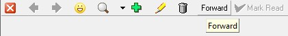

___  
## What are Notes?

Notes are important comments, communication or information that users in
the system can attached to "Business Objects".  

"Business Objects" are things like Customers, Customer Contacts, 
Suppliers, Products, Materials, Orders and Accounting Information 
(to name just few).  

The Notes function in Sense-i allows any user with security permission
to add such information to these "Business Objects" and then send them
to other users in the system.  

Once a Note is attached to one of these Business Objects the Note 
remains in the system until the Business Object is archived.  
This allows any user, again depending on their security permission, 
to view all the correspondence, communication and
comments that were made about a specific Customer, Sales Order and so on
and that enables users to get the information and access to history that
they need to provide a better service to the Company's Customers and to
each other.  

## Step-by-step Guideline to Using Notes

1.  Wherever the system allows Notes to be attached to Business Objects
    and wherever you as a user have the permission to access these
    Notes, you fill see a Notes button at the top of the screen on the
    Button Bar.  

  

The system will open the Notes screen. This screen consists of three
sections, at the top is the standard Button Bar that lists the buttons
for all the actions to which you have permission. The second section
of the screen lists all of the Notes that have been attached to the
selected Order or Customer (i.e. Business Object). The bottom of the
screen displays the detail of the selected Note.  

  

2.  To view the full details of a Note, double click on the relevant Note 
	in the Note List.  

The system will open the Notes Detail screen. This screen shows you
the type of Business Object to which the Note is attached, in this
example a Sales Quote, the Subject of the Note in the Subject line and
the detail of the Note in the text box.  

  

3.  To close the Note Detail screen click the Close button on the Button
    Bar.  

## Add a New Note

1.  To Add a new Note, click the Add (the green plus sign) on the Button
    Bar. The system will open a blank screen titled "Add Note."  

  

2.  To add a new Note type the Subject of the Note in the Subject field.  

1.  Then type the detail of the Note in the Text field.  

1.  And when you have completed adding the Note click the Save button.  

The system will close the Add Note and return to the Note List screen
and display Note you have just added in both the list and the Preview
panes.  

## Send a Note  

1.  To send a Note to one or more users of the system, click the Forward
    button on the Button Bar.  
	
  

The system will open the Forward Note screen.  

  

2.  You can click on the Recipient field and then select the name or
    names of all of the users to whom you wish to send the Note you have
    just added to the system.  

3. Once you have selected the names of the users to whom you wish to
    send the Note, click the Select button at the top of the screen.  

4. You set a Due Date by which you expect the users to whom you have
    sent the Note to have read the Note.  

5. And you can mark a Note as Urgent by click the check box in the
    Urgent field.  

6. Once you have completed the fields you need to Forward the Note to
    the appropriate users, click the Save button.  

The system will then send the Note to all the users you have selected.  

7. To view a list of all the users to whom each Note has been sent,
    click the Notification Tab.  

The system will open the Notification screen. This screen lists the
header for each Note (i.e. the Subject), the people to whom the Note
has been sent, the date on which the Note was sent, the Business
Object to which the Note is related and whether the Note has been read
or not.

  

## Notification Inbox

  

The Notification Inbox provides a single screen that enables you to
view all of the Notes that have been sent to you.  

A.  At the top of the Note Inbox screen are a set of fields that you can
    use to search all of the Notes that have been sent to you. You can
    search for Notes using Company Name, Contact Name, Subject,
    Transaction No and Sender's Name.  

B.  The Note Inbox displays the header information for each Note that
    has been sent to you in a grid that you can filter.  

C.  And the Note Inbox displays the full content of each Note in the
    Note Preview Pane at the bottom half of the screen.  

:::note Mark as Read  
You will notice that all Notes that you have not yet read appear
in bold in the Note List. Once you have read the Note click the Mark
as Read button.
:::

**This is the end of the procedure.**