## Step-By-Step Guideline
___  

1.  Select **Supplier** on the Main Navigation Menu.

2.  Then click the **Purchase Order** option on the drop-down menu.
	
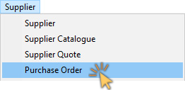  

The system will open a screen titled **"Maintain Purchase Order"**.  

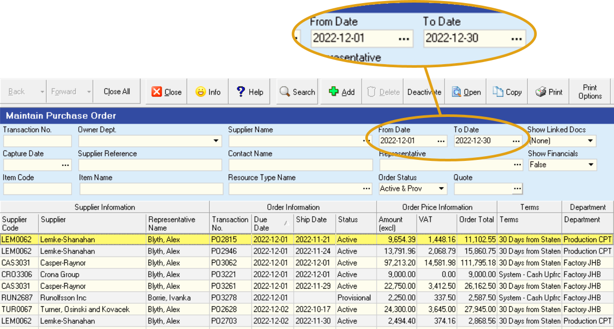  	

This screen lists all of the **Purchase Orders** that have already been captured in the system within the **From** and **To Date** specified in the Search Panel.  

:::note  
You can change
the information displayed in this list by changing the dates and other
information in the **Search Criteria** Panel above the list of orders.  
:::

### Create a New Purchase Order  

1.  Click on the **Add** button on the Form Bar to create a new Purchase
    Order.

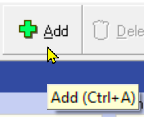  	

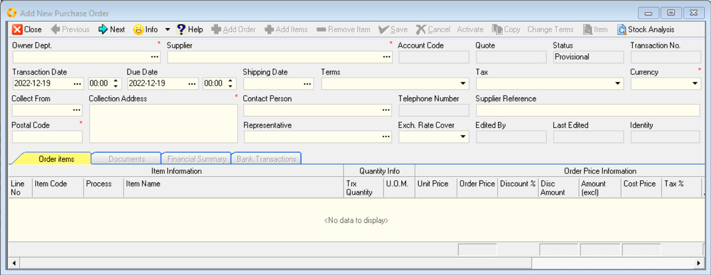  	

2.  You will first need to decide which department is buying items you
    are going to order from the supplier. To do this, click on the
    **three dot button** in the **Department** field.  

The system will open a screen that enables you to select a specific
department from a list of all the departments defined for the company.  

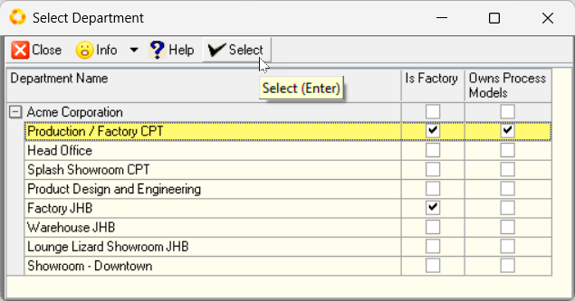  	

3.  Click on the **name of the department** you wish to use, (usually this
    is production), and then

4.  Click the **Select** Button on the form bar.  

5.  The system will return to the **Add Purchase Order** screen and display
    the name of the department you have chosen on the screen.  

6.  Next you will need to select the **Supplier** from whom you are going to
    purchase the items needed. Click on the **three dot button** in the
    **Supplier Name** field.  

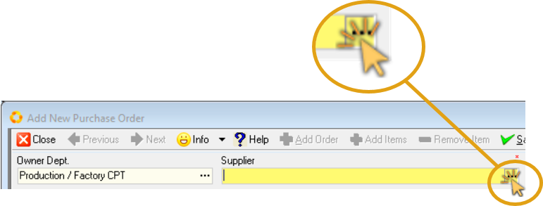  	

7.  The system will open a screen that enables you to select a specific
    Supplier from a list of all the Suppliers that have been captured in
    the system.  

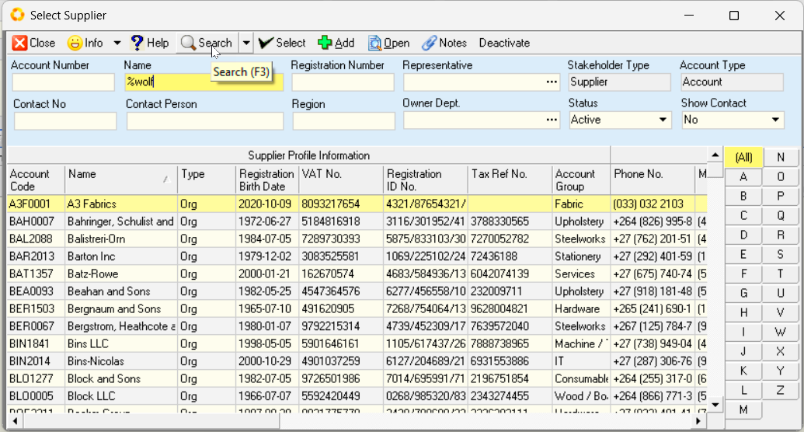  	

8. You can search a long list of Suppliers to find a specific Supplier
    by typing in the **%** sign and a few letters from the Supplier's name
    in either the **Common Name** or **Registered Name** field.  

9. Then click the **Search** button on the form bar.

10. Once you can see the **name of the Supplier** you wish to use for this
    Purchase Order on the screen, click on this name.  

11. Then click the **Select** button.  

:::note  
Refer to the **["Supplier Search"](https://sense-i.co/docs/1203#supplier-search)** section in the **["Supplier Information"](https://sense-i.co/docs/1203)** document to use this feature effectively.  
:::  

12. The system will return to the **Add Purchase Order** screen and show the
    name of the Supplier you have chosen in the Supplier Name field.

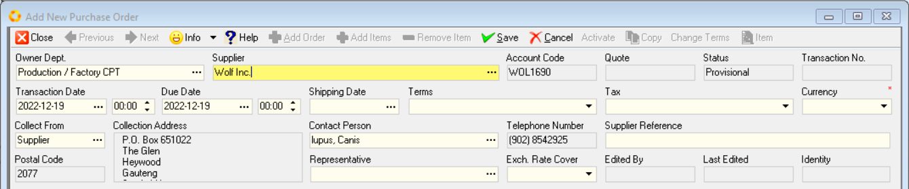  	

13. Now you need to press the **[Tab]** key on the keyboard to enter the
    remaining information about the order before you select the specific
    materials you wish to order.  
    
    You need to enter information such as the **Due Date**, the **Terms**, the **Address** to which the items must be delivered and a **Reference** number, in the **Supplier Reference** field, and so on.  

14. Once you have completed the **Header information** of the Purchase Order click the **Save** button.  

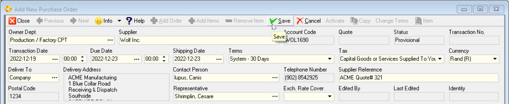  

### Select Material Items  

1.  Click the **Add Items** button on the Form Bar.

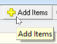  	

The system will display a screen titled **Item List**.

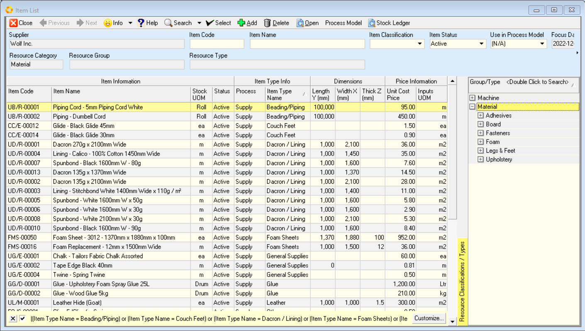  	

:::important  
Ensure the **Materials** option _(Resource Category)_ is selected in the **Selection Panel** (right-hand side of the screen).  
:::  

:::note  
Refer to the **["Search for Material Information"](https://sense-i.co/docs/442#search-for-material-information)** section in the **["Supplier Catalogue"](https://sense-i.co/docs/442)** document to use this feature effectively.  
:::  

2.  Click on the **name of the items** you wish to order from the Supplier.  
    
    :::tip  
    You can hold down the **CTRL** key on your keyboard and
    **select multiple items** to be included on the Purchase Order.  
    :::

4.  Then click the **Select** button on the Form Bar.  

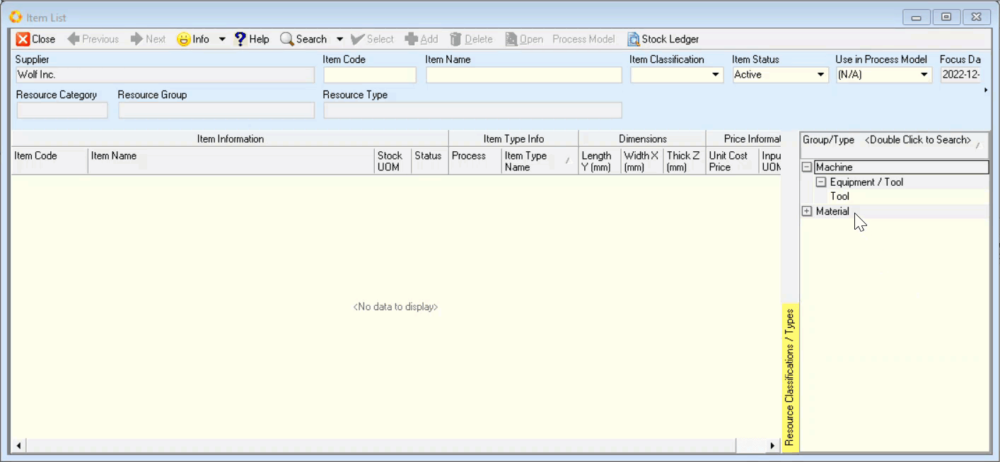  	

5. The system will return you to the **Add Purchase Order** screen and
    display the materials you have selected in the Purchase Order.  

:::note  
if the lead-time (that is the time between when you are entering the order and the due date is too short, the system will warn you with the following message;  
	
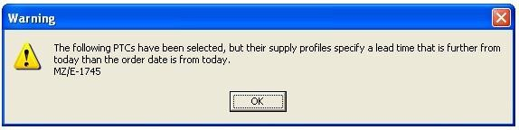  

**Click OK to accept this or change the due date to allow more time.**  
:::  

6.  Enter the quantity of the item that you need the Supplier to provide in the **Quantity** field.

7.  The system will display the **Cost Price** for the item based on the one set in the database for the Supplier's Catalogue. If you have permission you can change the unit price for the item in the **Unit Price** field.  

8.  The system will display a screen asking if you are sure you wish to change the price. If you are sure you wish to change the **Unit Cost Price**, then click the **Yes** button.  

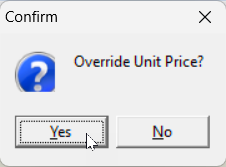  	

9.  You can enter a discount percentage that you might be able to negotiate with the Supplier in the **Discount** column.  

10. The system will display the default tax rate applicable to the Purchase Order if the Supplier is VAT Registered in the **Tax Rate** column. You can override this if you need to change it.  

11. You can enter any specific notes about the item in the **Notes** column.  

12. You can click the **Add Items** button on the Form Bar if you need to
    add additional items to the Purchase Order.  

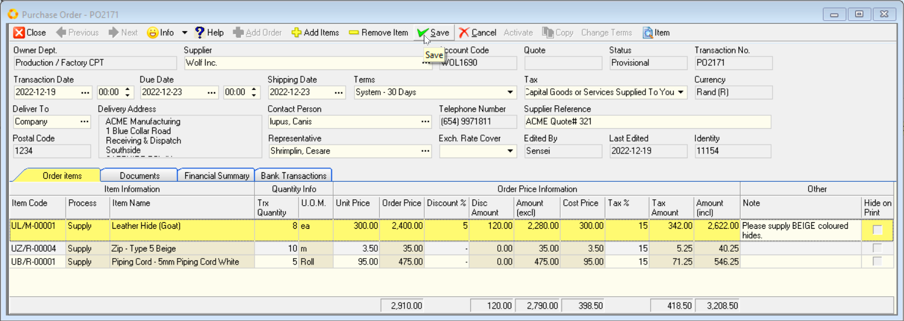  	

13. Then click the **Save** button on the Form Bar to save the information you have entered to the database.  

14. If you are sure that the details on the order are correct and that you have finalised the details of the Order, click the **"Activate"** button on the form Action bar, and then click the **Close** button.  
    
:::important  
Remember that you cannot easily change Active Purchase Orders as these are a record of the contract between the company and the supplier.  
:::  

15. The system will return you to the **Maintain Purchase Order** screen and display the summary information about the Purchase Order you have just entered in the list of Purchase Orders.  

### Print, Covert to .PDF & Email the Purchase Order  

1. Click on the order in the list screen and then click the **Print** button on the Form Bar.  

2. Select the **Sense-i Purchase Order** option.

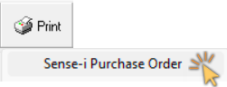  	

3. The system will display the document **Preview** screen.  

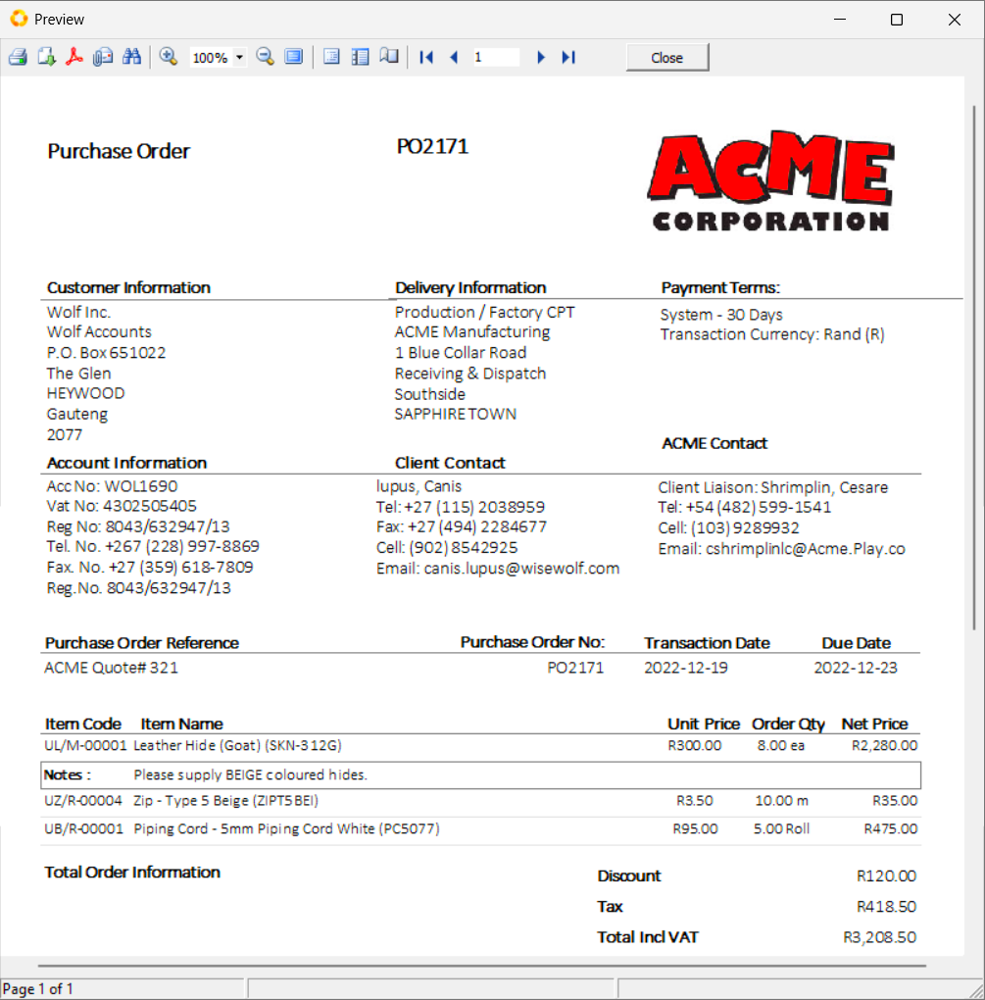  	

4.  If you decide to print the document then you can click the **Print** Icon at the top of the window.  

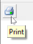  	

5. If you decide that you wish to email the Purchase Order to the Supplier you can create a **PDF copy** of the Order and then attach it to an email.  

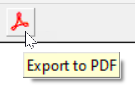  	

To do this click the PDF button on the top of the Print Preview screen.

6. To close this screen, click the **Close** button at the top of the screen.

7. The system will close this screen and return you to the **Maintain Purchase Order** screen to view a list of all the Purchase Orders in the system that match the Search Criteria you have entered.

**This is the end of this procedure.**
