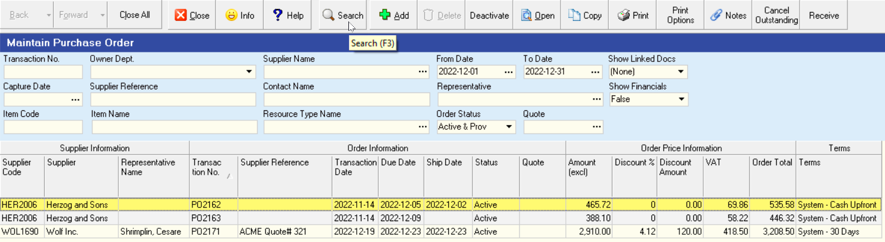
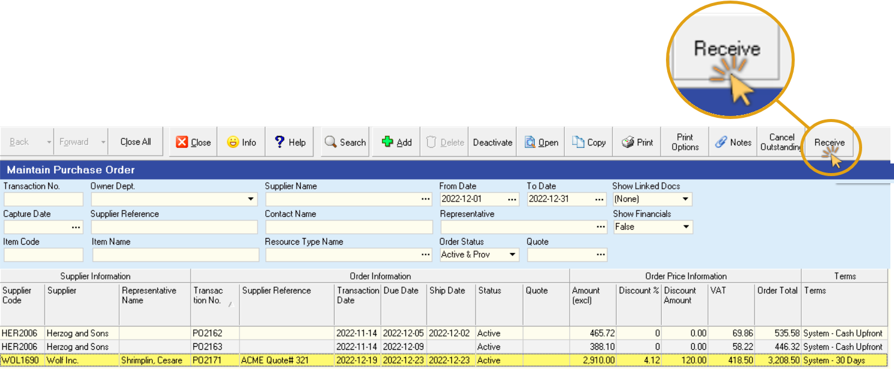
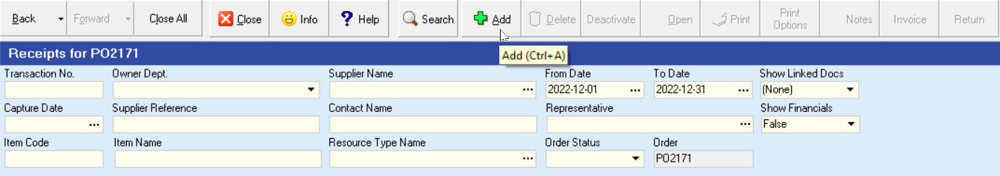
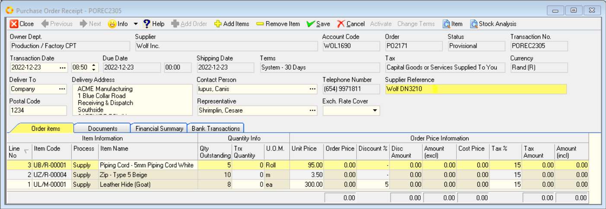
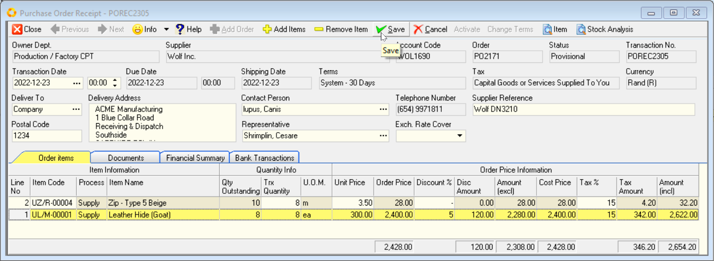
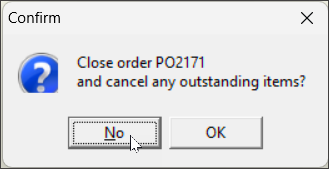
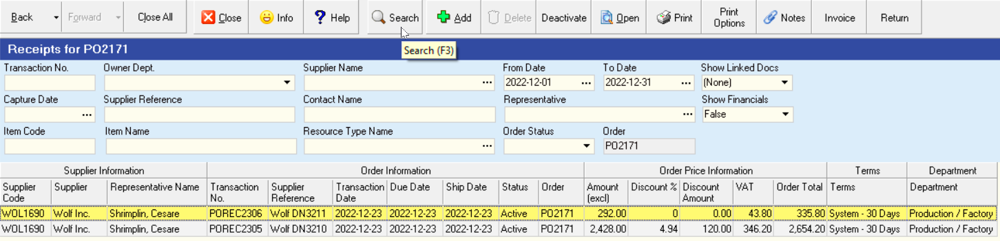
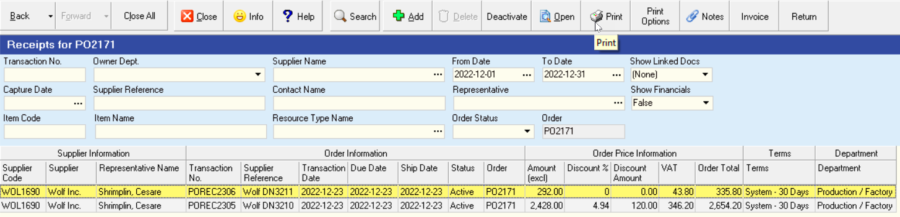

## Step-By-Step Guideline
___  

1.  Click on the **Supplier** option in the Main Menu.

2.  Click on the **Purchase Order** item on the Drop Down Menu.  

  

The system will open a screen titled **"Maintain Purchase Order"**.  
This screen lists all of the Purchase Orders that have already been captured
in the system within the **From** and **To Date** specified in the Search Panel.  

  

:::note  
You can change the information displayed in this list by changing the dates and other information in the **Search Criteria Panel** above the list of orders.  
:::  

### Add a Purchase Order Receipt

1.  Click on the **Purchase Order in the list** for which you wish to capture a Receipt.  

2.  Click on the **Receive** button on the Form Bar to view a list of receipts for this order.

  

The system will open a screen titled "**Receipts for PO### _(Purchase Order Number ###_)**".  

This screen will show a list of all the Purchase Order Receipts (in other words the previous deliveries by the supplier) that have been captured for this Purchase Order.  

:::note  
If this is the first time you are receiving materials against this Purchase Order the system will obviously not list any Purchase Order Receipts.  
:::  

3.  Click on the **Add** button on the form bar to open the Purchase Order Receipt screen.  

  

The system will display a screen titled "***Purchase Order Receipt - POREC####***".  

This screen will automatically list all of the outstanding items against the Purchase Order you have selected.  

4.  You can enter the **Supplier's Delivery Note Number** in the **Supplier Reference** field if you wish to keep track of and match the computer records to the Supplier's documents.  

  
	
5.  Note the grid beneath the Order Header lists the **item code**, the **item name** and the **outstanding quantity** for each item on the Purchase Order.  

As you capture receipts against this Purchase Order the system will **automatically update the Outstanding Quantity** to make it easy for you to keep track of what items your suppliers must deliver.  

6.  You will need to check and count the items delivered by your supplier and then once you have obtained the correct quantity, enter the quantity received in the **Trx Quantity** column for each item.  

7.  When you have completed capturing the quantity of each item received, you need to remove items that the supplier has **not delivered**.  
To do this, click the **Remove Item** button on the form bar.  

8. Once you have completed capturing the details of the receipt, click the **Save** button on the form bar.  

  

9. If you are confident that all the information is accurate, click the **Activate** button.  

### Partially Fulfilled Purchase Order

1. If the supplier's delivery has only partially fulfilled the Purchase Order, and you click the **Activate** button, the system will present a dialog asking you if you wish to **Cancel the Outstanding Items**.  

  

:::important  
You should only cancel the outstanding items if you no longer wish to receive these. If you do so, the Purchase Order will be marked as closed and you will not be able to capture any future receipts against it.  
Normally you would choose **"No"**.  
:::  

2. Repeat the steps above to add Purchase Order Receipts for any subsequent items recieved from the supplier.  

3. Click the **Close** button.  

4. The screen will return you to the ***Receipts for PO###*** screen and list all the receipts that have been captured against the selected Purchase Order.  

  

### Add Notes / Print Purchase Order Receipt  

1. If you need to record any notes about the Purchase Order or the Receipt, click the **Notes** button on the form bar.

2. To print the Purchase Order Receipt and attach it to the Supplier's Delivery Note, click the **Print** button.  

  

3. Once you have completed the process of capturing Purchase Order Receipts, click the **Close** button on the form bar.

**This is the end of this procedure.**

_You should now proceed to the  **["Monitor Outstanding Purchase Orders"](https://sense-i.co/docs/130)** procedure to see how the system has updated the list of outstanding Purchase Orders._
