## Introduction
___  

Before you can process a Material Return to a Supplier, you should receive a manual **request from** the **Stores** or **Production** personnel explaining exactly what materials they wish to return to which suppliers.  

This **Material Return Request form** should be signed by the person initiating a return.  

It is important to understand that a Material Return Request is just that, a request.  
It is not an authorisation and stock may not be sent out of the company without authorisation.  

In the **Sales Transaction Stream**, the document authorising the movement of stock is a **Sales Delivery Note**.  

In the **Materials Transaction Stream**, the document authorising stock to be sent out of the company is the **Purchase Order Return**.  

This document must be captured from the **Material Return Request** by a person authorised to initiate returns to suppliers, the Purchase Order Return must then be printed and sent to the store.  

:::important  
**Only once the above procedure has been followed may the goods be returned to the supplier**.  
:::  

Ideally, **two copies** of the **Purchase Order Return** must be printed.  
-   The first should be signed by the **person receiving the returned materials** on
behalf of the supplier.  
-   The second must be given to the **supplier** as a record of the materials that have been returned and should be used to request that the supplier create a **Credit Note** on the company's account for the materials that were returned.  

## Procedure Guideline

1.  Select **Supplier** in the Main Navigation Menu.  

2.  Then click the **Purchase Order Return** option in the drop-down menu list.  

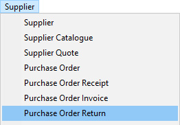  

The system will display a screen titled **Maintain Purchase Order Return**.  
This screen lists all of the Purchase Order Returns that have already
been captured in the system.  

3.  The default search criteria are the **From Date** and **To Date** and the
    system will display all Purchase Order Returns captured within the
    From and To Date range that has been set in these fields.  

:::note  
You can change these dates and enter any other information into the search fields to change the list of transactions that are displayed on the screen.  
:::  

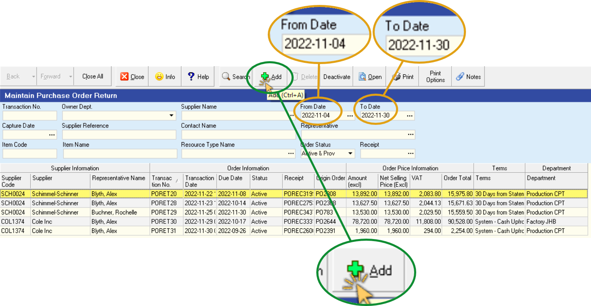  

4.  To add a new Purchase Order Return to the system click on the **Add** button on the form bar.  

The system will open a new, blank Purchase Order Return form in a screen titled **Add New Purchase Order Return**.

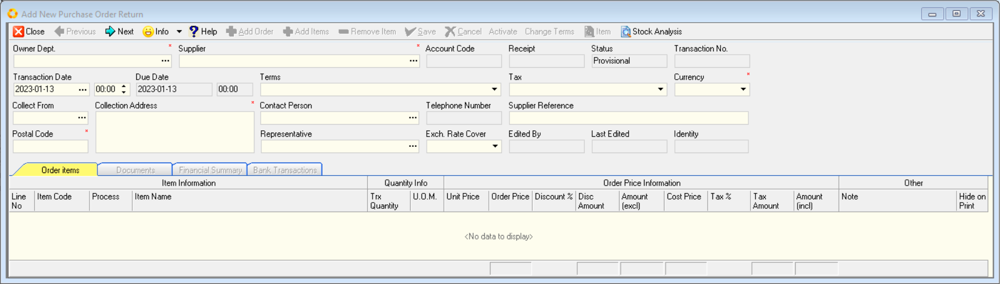  

The blank Purchase Order Return form has two sections that need to be
**accurately completed** in order to save a **Purchase Order Return**.  

These are;
-   the **Header section**, and  
-   the **Order Item Detail section**.  

The Header section stores information about the **Department or OSN** that
is returning the materials to the Supplier, the **Suppliers Name**, the
**Return Date**, **Contact information**, **Account Terms** and **Tax Rate** and a
**Reference Number**.  

The Order Item Detail section stores information about the items being
returned, the **reason** for each return, the **quantity** being returned, the
**cost price** and related information.  

In order to complete a Purchase Order Return you must **complete** _(and Save)_ the Purchase Order Return **Header section** before entering information about the items being returned in the Order Item Detail section of the screen.  

6.  To add a new Purchase Order Return you first need to select the **Purchase Order Receipt** on which the goods being returned were recorded coming in to the company.  

7.  Click on the **POREC (Purchase Order Receipt)** field on the top left of
    the screen.  

The system will open a screen titled Select **Purchase Order Receipt**.
	
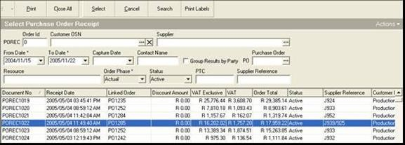  

Note that this is a search screen so you can enter information in the
search fields to find a specific document. You could for example,
enter the **Purchase Order Receipt number** and click **Search** to find a
specific document.  

If you do not know the document number you could
enter the **Supplier's name** and a **date range**, that is the dates between
when you know the delivery was made, and then click **Search**.  

8.  Once you have entered the search criteria, click on the **Search**
    button on the form bar.  

9.  Once you have found the Purchase Order Receipt against which you
    want to return items to the supplier, click on it in the list of
    transactions, and then  

10. Click on the **Select** button on the form bar.  

The system will display the **Add Purchase Order Return** screen. The
system will list all of the information about the supplier's delivery
as it was captured in the system in this screen. The items and
quantities of each item will be displayed in the **Order Item Detail**
section of the screen.  

11. The system will place the cursor in the **Return Reason** column. This
is a field that you must complete for each item being returned.  

Click on the right corner of the block and the system will display a set of
pre-defined reasons for which you might be returning items to your
supplier.  
	
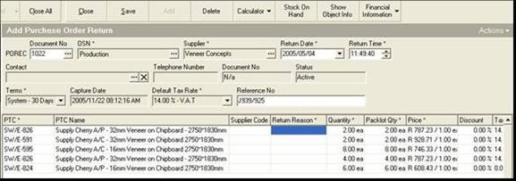  

12. **Select the appropriate reason** for which you are returning the
materials to the supplier.  
	
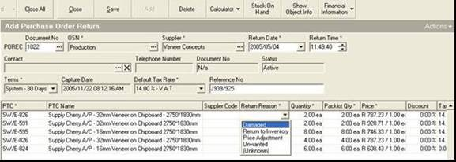  

13. You will need to enter the quantity of the material that is being
returned. Type the quantity being returned in the **Quantity** column.  
	
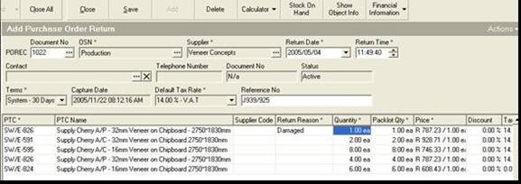  

Repeat steps 12 and 13 for each item being returned.  

Leave the reasons blank for any item not being returned, even though it
appears in the list.  

The system displays all items that were captured at the time of
the Supplier's delivery to make it easier for you to process the
return.  

Once you have entered information about the items that are being
returned, you can **remove the items** that appear in the list that you
are **not going to return**.  
	
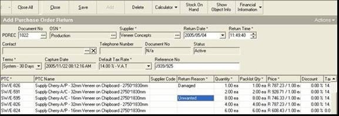  

14. Once you have entered details about all of the items being
returned, **click on the first row listing items that you are not going
return** and then  

15. Click on the **Remove Item** button on the Form Bar.  
	
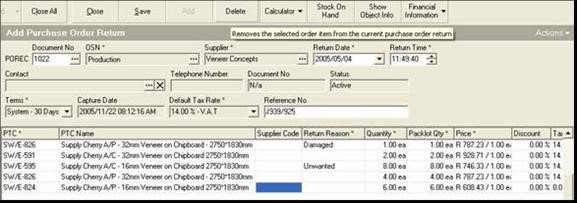  

16. The system will display a message asking you to **confirm** that you
wish to delete this item from the return. If you have clicked on the
correct row and you wish to remove the item from the Purchase Order
Return, then click the **Yes** button.  

**If you have clicked on the wrong row and made a mistake, click "No"**.  
	
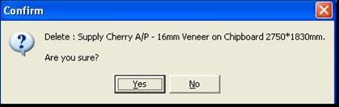  

Repeat steps 11 to 13 for each item you wish to remove from the
Purchase Order Return.  

17. Once you have removed all the items that are not being returned,
and the correct reasons and quantities have been recorded against each
of the items that is being returned, click on the **Save** button on the
form bar.  
	
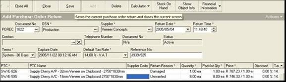  

The system will ask you if you wish to capture a Credit Note at this
point. Whether you do or not depends on your company's policy in this
regard.  

Some companies prefer to capture a Credit Note at this point
and then resolve any discrepancies with the Supplier's Account when
doing Account Reconciliations. This is a more conservative financial
approach and puts the burden on the supplier to get paid for invoices
they submit. It means you do not have to rely on the Supplier's
accounting department to send you a Credit Note before you capture the
claim.  

Other companies prefer to only capture Credit Notes once these have
been issued by the Supplier, as sometimes suppliers do not give credit
for items returned and if this happens this means that you will have
to change the Credit Note you capture now.  
	
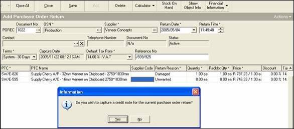  

18. Click **Yes** if you wish to capture a **Credit Note** now and then go the
**procedure for capturing Credit Notes**.  

Select **No** if you do not wish to capture a Credit Note at this point.  

19. The system will return you to the **Maintain Purchase Order Return**
list screen. Click on the Search button on the form bar to see the
Purchase Order Return you have just captured in the list.  
	
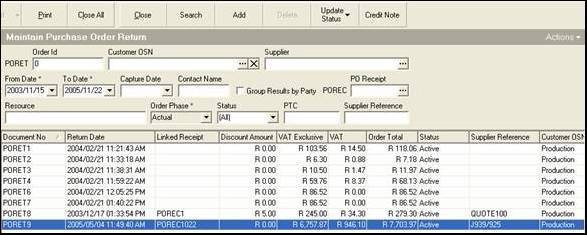  

20. Select the document from the list, right click the mouse and choose
**Print Document**.  

21. Sign the document and hand it to the Material Store to process the
return.  

This signed Purchase Order Return then becomes the authorization for
the stores manager to remove the Raw Materials from the Stores and
return it to the Supplier. If your company employs a security guard
then this document is the document against which the security guard
needs to check the quantity of the items being returned.  

**This is the end of this procedure.**
