## Step-By-Step Guideline
___  

1.  Click on **Supplier** in the Main Menu.

2.  Then click the **Purchase Order Receipt** option on the Drop Down Menu.  

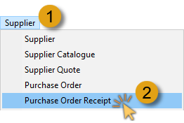  

The system will open a screen titled **"Maintain Purchase Order Receipt."**  

This screen lists all of the Purchase Orders Receipts (also known as **Goods Received Notes**) that have already been captured in the system within the **From** and **To Date** specified in the Search Panel.  

:::note  
You can change the information displayed in this list by changing the dates and other information in the Search Criteria Panel above the list of orders.  
:::  

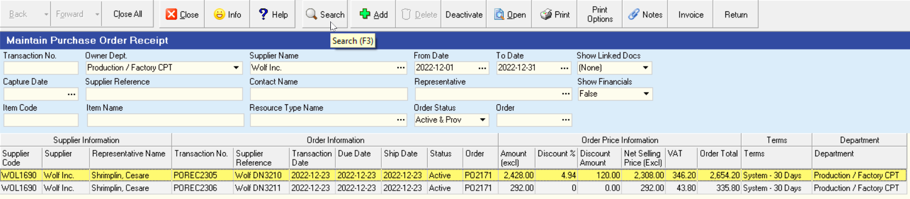  

3.  Click on the **Purchase Order Receipt** in the list for which you wish to capture an Invoice.  

:::tip  
You can sort the information in the list using the **Column Sort** or **Quick Filter** functions.  
It is a good idea to find the name of the **Supplier** for whom you wish to capture an invoice.  
:::  

4.  Click on the **Invoice** button on the Form Bar to view a list of Invoices that have been captured against this Purchase Order Receipt.  

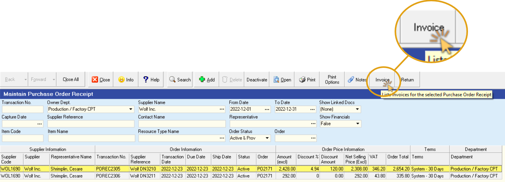  

The system will open a screen titled **"Invoices for POREC ###"**. This
screen will show a list of all the Invoices that have been captured
against the selected Purchase Order Receipt.  

If this is the first time you are capturing an invoice against this Purchase Order Receipt, the system will obviously list no Purchase Order Receipts.  

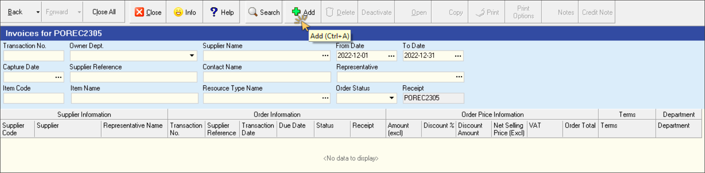  

5.  Click on the **Add** button on the form bar to open the Add Purchase Order Invoice screen.  

The system will display a screen titled **"Purchase Order Invoice - POINV####"**.  

:::note  
This screen will automatically list all of the details that were captured on the Purchase Order Receipt you selected in step 3 above.  
:::  

This screen consists of three parts, the **Header**, the **Detail** and the **Footer**.  

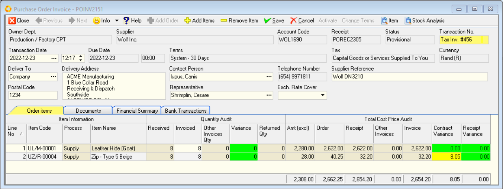  

The **Header** is displayed at the top of the screen and displays **information about the Supplier**, the transaction numbers, dates, payment terms, delivery address and so on.  

The **Detail** is displayed in the middle of the screen in a worksheet or
grid and **lists each of the individual items** that were delivered by the
Supplier.  

The **Footer** displays the **total value for the order** at the bottom of the screen.  

6.  You need to enter the **Invoice Number** as it appears on the Supplier's Invoice in the **Transaction No.** field.  

Simply overtype the correct Supplier Invoice number in this field.  

7.  You can enter a Reference number in the **Supplier Reference** field, if this invoice is for a specific order.  

**OR** you can leave the reference number the same as it was captured on the Purchase Order Receipt.  

:::note  
The grid at beneath the Order Header lists the **item code**, the **item name** and the **quantity received** for each item as they were captured on the Purchase Order Receipt.  
:::  

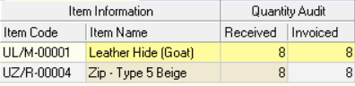  

8.  You need to **check that the quantity** for which you are being invoiced **corresponds** to the quantity that was booked into stock on the **Purchase Order Receipt**.  

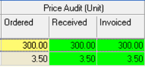  

9.  Once you are satisfied that the quantity for which you are being invoiced matches the quantity that was received, you need to check the **Unit Cost Price** being charged by the supplier.  

:::note  
If you notice a difference, you can change the Unit Price in the grid by typing the correct Unit Price in the **Invoiced** field.  

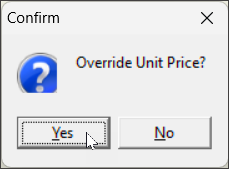  

Click on the **Yes** button on the Confirmation Dialog pop-up screen to override the Unit Price.  
:::  

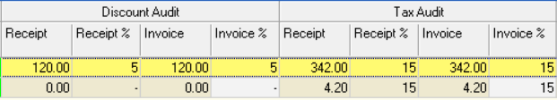  

10. Check that the **Discount %** and **Tax %** amounts are correct.  

11. Check that the **Amount (excl)** on the screen **matches** the Amount Excluding Tax on the **Supplier's Invoice**.  

12. Repeat steps 8 through 11 for each item listed on the screen.  

13. Once you are satisfied that you have captured in the details for the Supplier Invoice correctly on the system, click the **Save** button on the form bar.  

14. If you are confident that all the information is accurate, click the **Activate** button.  

15. You can now exit the form by clicking on the **Close** button.  

16. The system will return you to the **Invoices for POREC####** screen and list the Invoice that you have captured against the selected Purchase Order Receipt.  

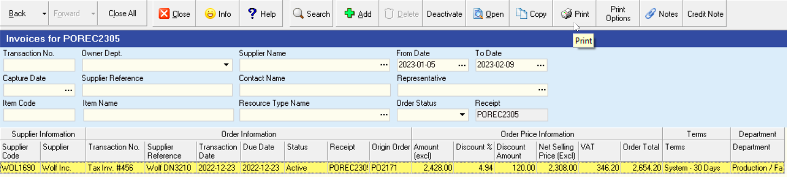  

17. To print the Purchase Order Invoice and attach it to the Supplier's Invoice Note, click the **Print** button.  

The system will display the Purchase Order Invoice in the Print **Preview** screen.  

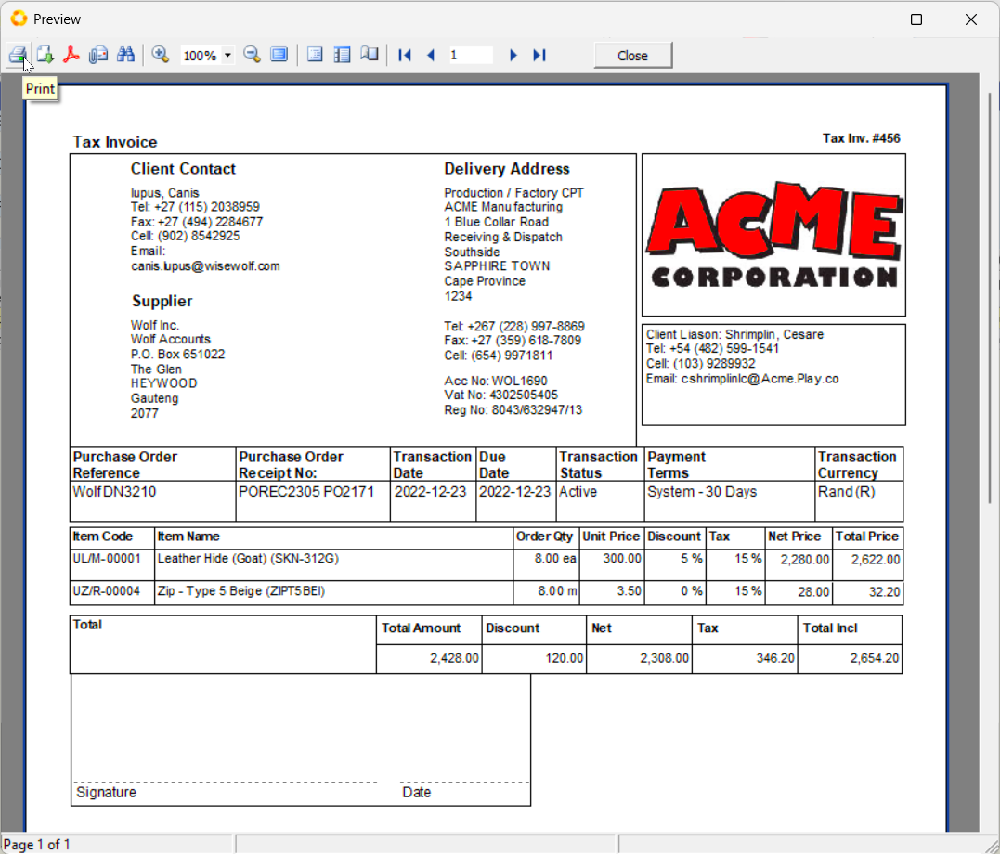  

18. To Print the document as previewed, click the **Printer Icon** on the  top left of the screen.  

The system will print the Purchase Order Invoice.  

19. Retrieve the printed Purchase Order Invoice and staple it to the original Tax Invoice received from the Supplier and the file these two documents.  

20. Once you have completed capturing the receipt, click the Close button on the form bar.  

**This is the end of this procedure.**
