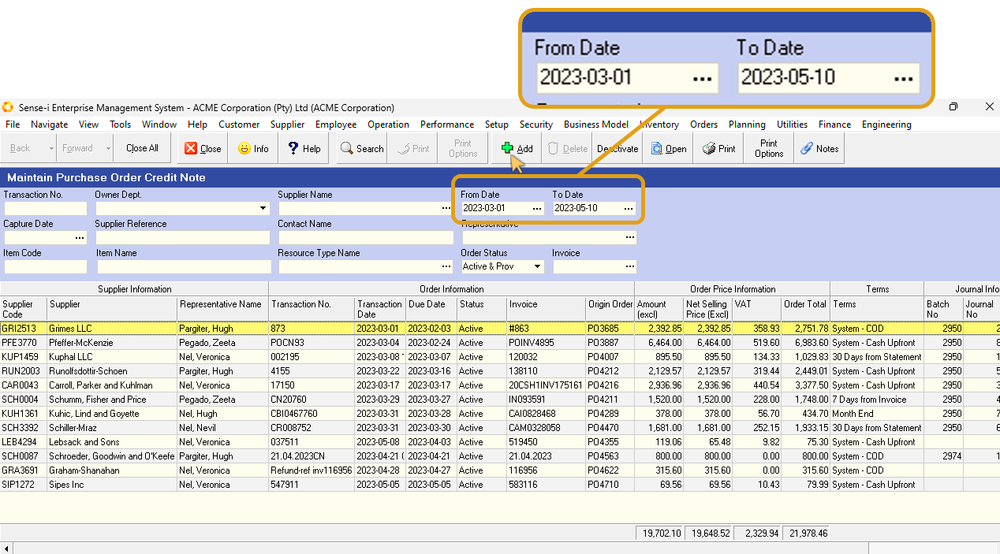
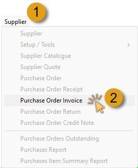
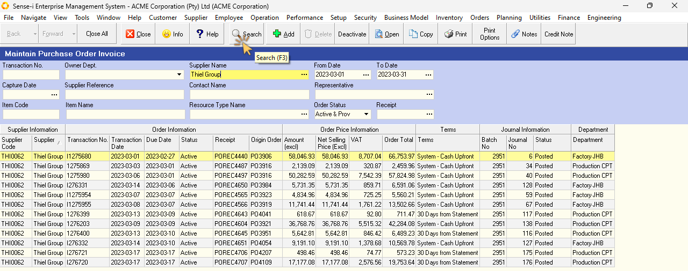
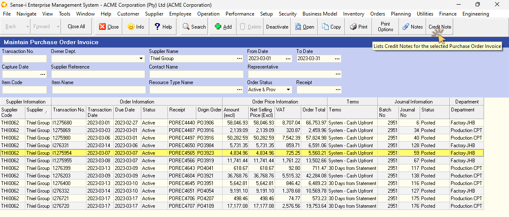
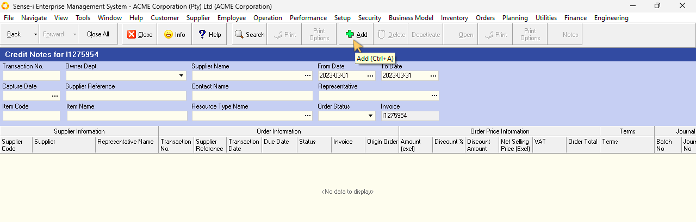
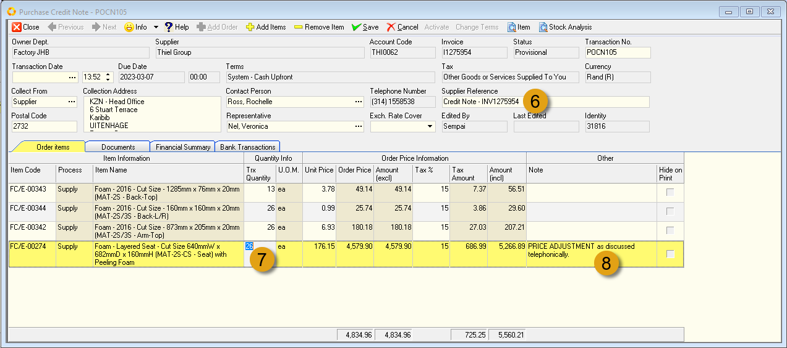
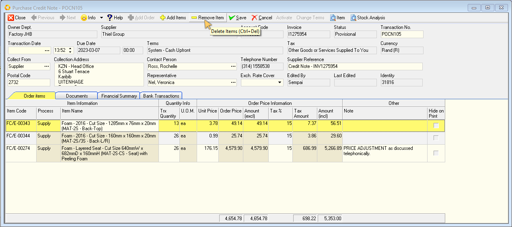
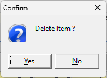

## Procedure Guideline  
___  

### Introduction

Before you can process a Credit Note for a Supplier Return, you should either : 
-   have completed a Purchase Order Return document for the supplier delivery, detailing exactly what materials you are returning to the Supplier and the reasons for the return,  

**OR**  

-   have identified a delivery and invoice from the supplier where the price is incorrect and you need the supplier to provide you with a credit against an invoice they have issued.  

:::important  
If you are processing a credit note against a return of goods to the supplier, you should have a copy of the **Purchase Order Return document** and this should be signed by an authorized representative of the supplier.  

It is important to understand that a Purchase Order Return to your supplier represents an **authorized return of goods**.  
:::  

:::note  
In the **Purchases Transaction Stream**, the document authorizing the movement of stock from you to your supplier is called a **Purchase Order Return**.  

In your **Financial Transaction Stream**, the document acknowledging receipt of returned goods and adjusting the Supplier's account is the **Credit Note**.  
:::  

This Credit Note can be captured either:
-   based on the received **Purchase Order Return** by a person authorized to process credit notes, and the Credit Note must then be sent to the customer,  

**OR**  

-   against a **Supplier Invoice**, if there is a price difference that needs to be corrected.  

:::tip  
Ideally, **two copies** of the Credit Note must be printed.  
-   The first should be kept for your records with the supplier's Purchase Order Return attached.  
-   The second must be sent to the supplier as confirmation that their account has been credited for the returned materials or for a price discrepancy.  
:::  

## Navigate to Supplier Credit Note  

1.  Click on the **Supplier** option in the Main Navigation Menu, then  

2.  Click on the **Purchase Order Credit Note** option on the Drop Down Menu.  

  

The system will open a screen titled "**Maintain Purchase Order Credit Note**."  

This screen lists all of the Purchase Order Credit Notes that have already been captured in the system within the **From** and **To Date** specified in the Search Panel.  

  

:::note  
You can change the information displayed in this list by changing the dates and other information in the Search Criteria Panel above the list of Credit Notes.  
:::  

## Add New Credit Note  

To add a new Credit Note you first need to select the original Purchase Order Invoice against which the goods are being credited.  

1.  Click on **Supplier** on the main navigation Menu, then  

2.  Click on **Purchase Order Invoice** in the drop-down menu.  

  

The system will open a screen titled **Maintain Purchase Order Invoice**.  

:::important  
The Search Panel enables you to enter information in the search fields to find a specific document.  

You could for example, enter the **Invoice number** and click **Search** to find a specific document.  

If you do not know the document number you could enter the **Supplier's name** and a **date range** _(i.e. the dates between when the invoice was issued)_, and then click **Search**.  

  

:::  

Once you have found the Purchase Order Invoice against which you want to process the credit note,  

3.  Click on the record row in the list of transactions, and then  

4.  Click the **Credit Note** button on the Action bar.  

  

The system will open a screen titled **Credit Notes for _(Invoice Transaction number)_**.  

  

:::note  
If this is the first Credit Note to be added against this invoice, no previous Credit Notes will be listed.  
:::  

5.  Click the **Add** button on the Action Bar.  

The system will display a screen titled **Purchase Credit Note - POCN###**, with the relevant information as it was captured in the Purchase Order Invoice.  

The Credit Note has two sections that need to contain accurate information. These are the **Header section** and the **Credit Note Detail section**.  

The **Header section** stores information about the Supplier to whom you are returning the materials.  Ensure that these details are correct.  

  

6.  Type in an appropriate reference in the **Supplier Reference** field.  

The **Credit Note Detail section** stores information about the items being credited, the quantity being credited, Order Price Information, and a Notes column detailing the reason for each return / related information.  

The system displays all items that were captured at the time of the original invoice to make it easier for you to process the credit.  

You will need to enter the quantity of the material that is being credited.  

7.  Type the quantity being credited in the **Quantity** column.  

8.  You can type in the Reason for the item being credited in the **Notes** column. This is a field that should be completed for each item being credited.  

:::tip  
You can opt to type in the appropriate reason as provided on the Purchase Order Return document.  Refer to the document titled **["Capture Materials Returned To Suppliers"](https://sense-i.co/docs/150)**
:::  

Repeat these steps for each item being credited.  

Once you have entered information about the items that are being credited, you can **remove the items** that appear in the list that are **not** going to be credited.  

  

9.  Click on the first row listing items that you are not going to credit, and then  

10.  Click the **Remove Item** button on the form Action bar.  

The system will display a message asking you to confirm that you wish to delete this item from the credit note.  

  

11. If you have clicked on the correct row and you wish to remove the item from the Credit Note, then click the **Yes** button.  

If you have clicked on the wrong row and made a mistake, click "**No**".  

Repeat these steps for each item you wish to remove from the Credit Note.  

Once you have removed all the items that are not being credited, and the correct reasons and quantities have been recorded against each of the items that is being credited,  

12. Click the **Save** button on the form Action bar.  

Once you have checked the details of the credit note, that the items listed and the quantity returned for each item are correct, and that any changes to the unit cost price is correct, you need to Activate the Credit Note.  

13. Click the **Activate** button to post the Credit Note you have created.  

The Credit Note should be printed / saved to .PDF file at this point.  

It is recommended to print two copies:  
-   One for your records (to be attached to the supplier's Purchase Order Return)  
-   One to send to the Supplier.  

Click the **Print** button to print / save the Credit Note to .PDF file.  

File the signed Purchase Order Return from the Supplier with your copy of the Credit Note.  

Send the second copy of the Credit Note to the Supplier as confirmation that your account should be credited for the returned items.  
___

**This is the end of this procedure.**
