:::important  

If you have accessed this document from the associated Help link in the Sales Order Invoice section of the SEMS application, it is important to add / initiate the **creation of a Invoice** by clicking on the relevant **preceding Delivery Note record** and then the **Invoice** button on the **Sales Delivery Note** screen.  

:::  

## Step-By-Step Guideline
___ 
### Search for Specific Delivery Note  

Once the Delivery Note has been activated and Printed, the next step is to create a **Sales Order Invoice**.  

1.  Select the **Customer** option from the Main Navigation Menu.  

2.  Then click on **Sales Delivery Note**.  
	
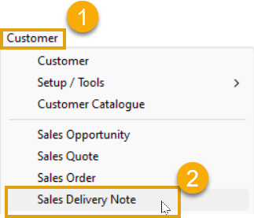  

3.  The system will open a screen titled **"Maintain Sales Delivery Note"**.  

4.  Search for the **specific Delivery Note** against which you wish to capture an Invoice.  
	
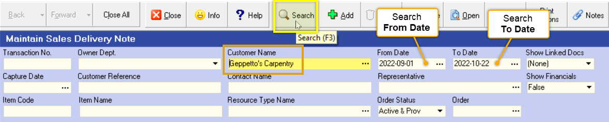  

### Create the Invoice  

Once you have found the correct Delivery Note, 
1.  **Click on the row** in the list and then...  

2.  Click the **Invoice** button on the **Action Bar**.
	
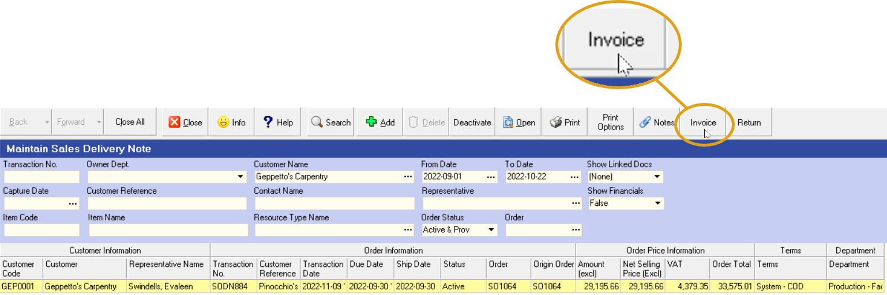  

3.  The system will display a screen titled **"Invoices for _S0DN####_"** _(the **Delivery Note number** relevant to the specific Delivery Note record selected)_.  
 
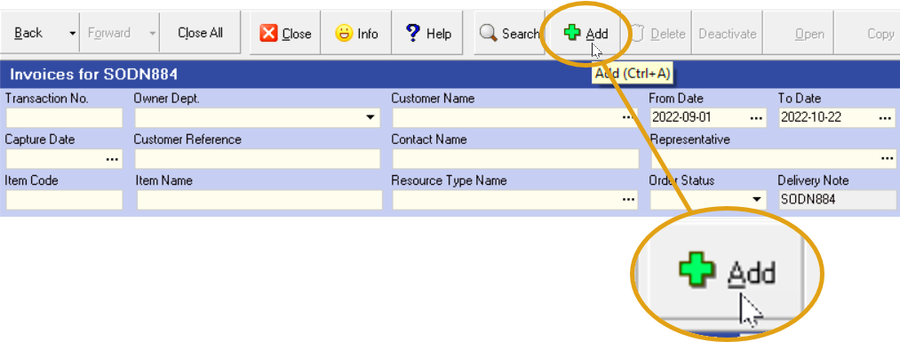  

4.  To add the new Invoice, click the **Add** button on the **Action Bar**.  

5.  The system will open a screen titled **Sales Invoice**, with the Sales Order Invoice Number (**- SOINV###**) automatically generated by the system.  
	
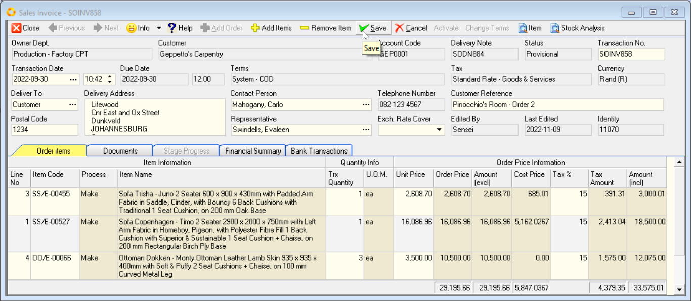  

This screen lists all the details that were captured on the Invoice.  

6.  Ensure that the information on the Invoice is correct.  

### Finalise the Invoice  

1. Once the Invoice has been finalised, click the **Save** button.  

2. Select the **Activate** button to Activate the Invoice.  

Activating an Invoice finalises the details of the Invoice in the system, prevents future changes and allows you to print, export to .PDF and email the Invoice to the Customer.  
	
3. Once the Invoice has been finalised, click the **Close** button on the form bar.

5. The system will return you to the **"Invoices for _S0DN####_"** screen.  
	
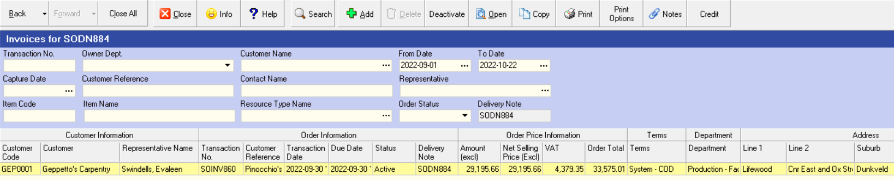  

The system will display the details of the Invoice you have just captured in the grid.

### Print the Invoice

1. Click on the row that contains the details of the Invoice you have captured.  

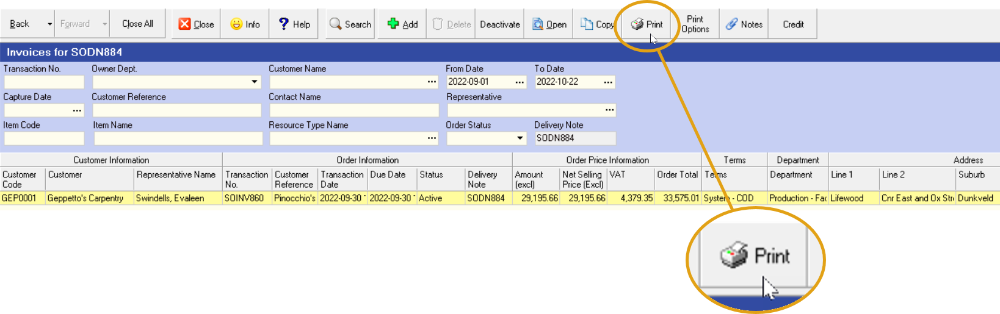  

2. Click the **Print** button on the Form Bar. 
	

When you click the Print button, the system displays a list of the different Invoice Layouts that have been defined.  

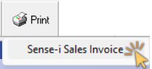  

:::note  
If you do not have any customized layouts defined for your Invoices, then the system will only show the Standard Layout.  

If custom layouts have been defined, they will be listed underneath the Standard Layout.  
:::  

3. Once you select the appropriate layout or format you wish to print or email, the system will display this in a **Print Preview** window.  

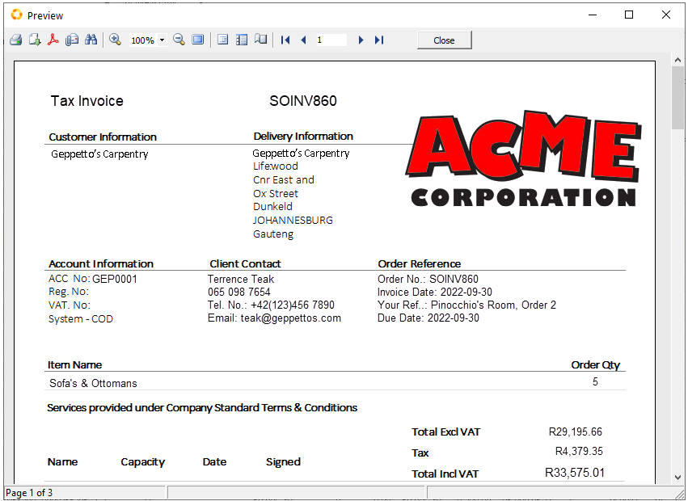  

4. To simply Print the Invoice, click the **Printer** Icon  

---  
## Save as PDF  

1. If you decide that you wish to save the Invoice as a PDF document then click on the **PDF** icon  at the top of the preview form.  The system will display the **Export to PDF** settings dialog.  

  

2. Click the **[Ok]** button once you have selected the desired options.  

3.  The standard File Manager **Save As** dialog window opens allowing you to save the **_.pdf_** to a specific location.  

This location could be to a relevant folder on your computer or a shared folder on your Local Area Network.  

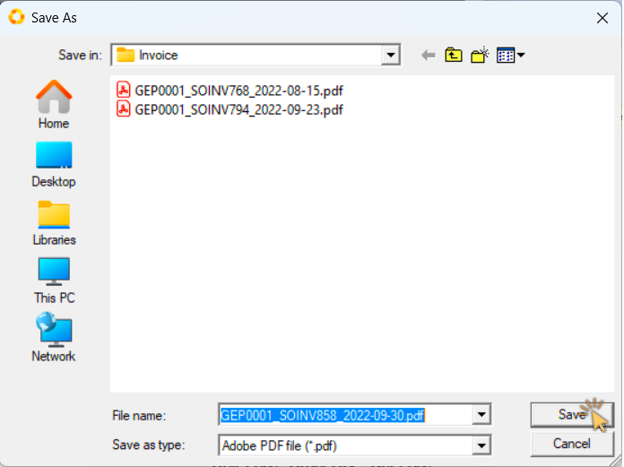  

4.  Once you have selected the folder and named the file click the **[ Save ]** button.  

---
## Email

1. If you decide that you wish to email the Sales Order to the client, the click the **Send by E-mail** icon  at the top of the Preview window.  

  

2.  The program will display the Email window.  

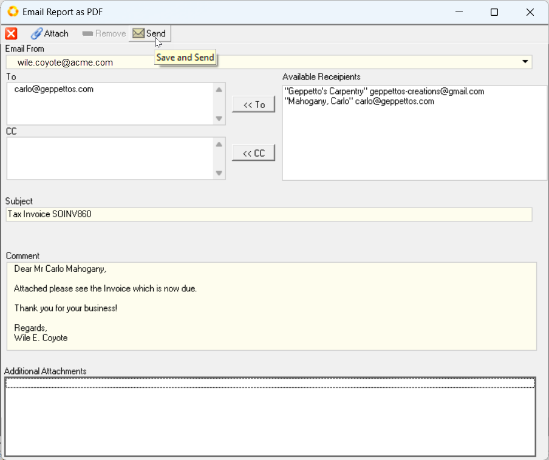  

3. If your email details have been setup on the system, they will appear in the **Email From** field at the top of the screen.  

:::note  
For more information on setting up your email in the system, refer to the document titled **[Configure Email Settings](https://sense-i.co/docs/CNF001)**.  
:::  

4. If you have defined a contact for the Sales Invoice as described above, then the program will display the email address for the selected contact in the **To** field.  

5. You can add additional email addresses as required in either the **To** or _Copy_ **(CC)** fields.  

6. The program will automatically populate the Subject line.  Alter this if needed.

7. You can add the text for the email you are sending in the **Comment** field.  

8. And you can add any addition attachments to the email by clicking the  button at the top of the form.  

9. When you have completed your email, click the  button at the top of the form.  

  

The **Information** dialog will display **"Message Sent"**.  

10. Click **[ Ok ]** to continue.

:::note  
The system will automatically send the e-mail to your own e-mail address - this for your records.  
Check the **Inbox** in your Email Client application (e.g. MS Outlook).  
:::  

11. To close the Print Preview screen, click the **[ Close ]** button at the top of the screen.  

The system will close this screen and return you to the **Maintain Sales Order Invoice** screen to view a list of all the Invoices in the system that match the Search Criteria you have entered.  

---

**This is the end of this procedure.**
