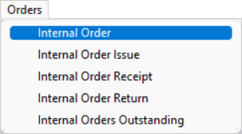
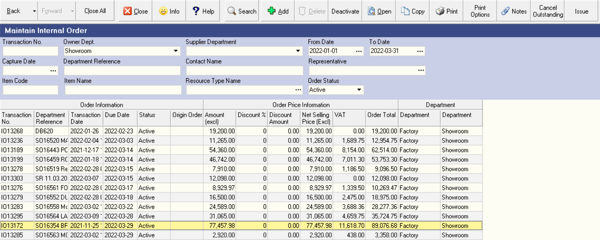
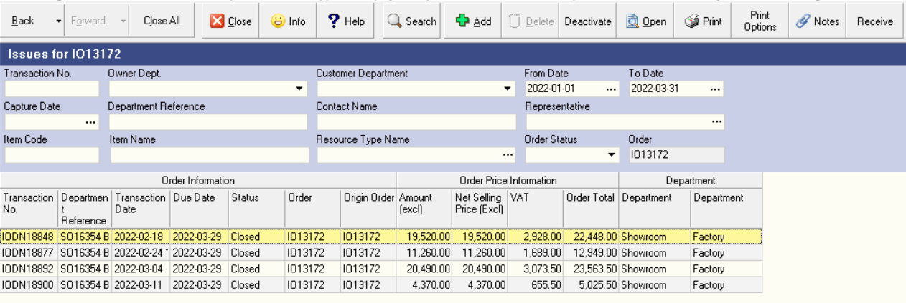
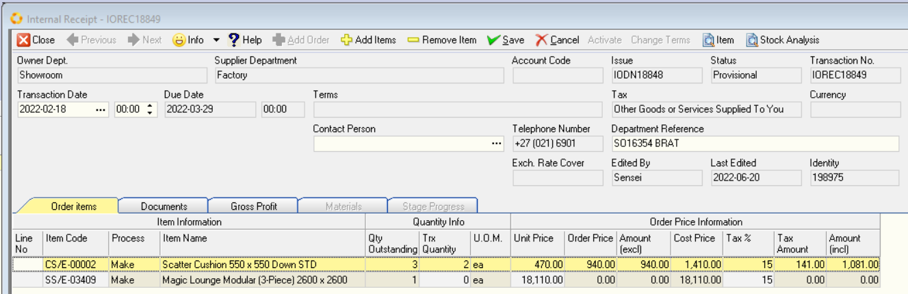
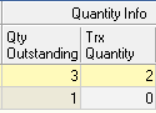
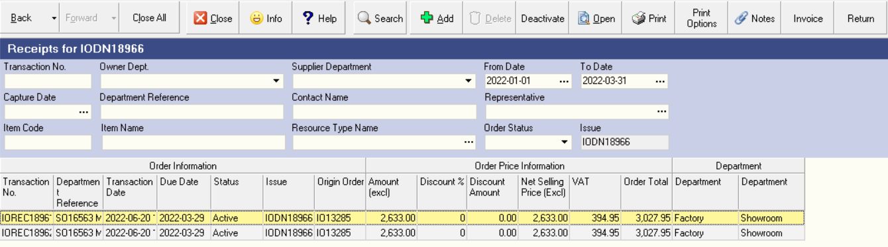

## Step-By-Step Guideline
___  

1.  Click on the **Orders** option in the Main Menu.

2.  Click on the **Internal Order** item on the Drop Down Menu.  

  

The system will open a screen titled **"Maintain Internal Order"**.  

This screen lists all of the Internal Orders that have already been captured
in the system within the **From** and **To Date** specified in the **Search Panel**.  

:::note  
You can change the information displayed in this list by
changing the **dates** and **other information** in **the Search Criteria Panel**
above the list of orders.  
:::

  

3.  Click on the Internal Order in the list for which you wish to
    capture a Receipt.

4.  Click on the **Issue** button on the Form Bar to view a list of
    receipts for this order.

The system will open a screen titled "Issues for _Internal Order
Number XYZ_".  This screen will show a list of all the Internal Order
Receipts (in other words the previous deliveries by the Supplier Dpartment) that
have been captured for this Internal Order.  

  

:::info  
If this is the first time you are receiving materials against this Internal Order the system will obviously list no Internal Order Issues.  
:::

5.  Click on the **Receive** button on the form bar to open the Internal Order
    Receipt screen.

The system will display a screen titled "Receipts for _Internal Order number XYZ"._

6.  Click on the **Add** button on the form bar to open the Internal Order
    Receipt screen.

  

The system will display a screen titled "Add Internal Order Receipt."
This screen will automatically list all of the outstanding items
against the Purchase Order you have selected.  
	
7.  Note the grid at beneath the Order Header lists the item code, the item name and the outstanding quantity for each item on the Purchase Order.  

    As you capture
    receipts against this Internal Order the system will automatically
    update the Outstanding Quantity to make it easy for you to keep
    track of what items your Supplier Department must deliver.  

  

8.  You will need to check and count the items delivered by your
    Supplier Department and then once you have obtained the correct quantity, enter
    the **quantity received** in the **Trx Quantity** column for each item.

9.  When you have completed capturing the quantity of each item
    received, you need to remove items that the Supplier Department has not
    delivered.  
    
    To do this, click the **Remove Item** button on the form bar.

10. Once you have completed capturing the details of the receipt, click
    the Close button on the form bar.

11. The system will display a confirmation dialog asking you if you wish
    to **activate** the Internal Order Receipt. If you are confident that
    all the information is accurate, click the **Yes** button.

12. If the supplier department's delivery has only partially fulfilled the Internal
    Order, the system will present a second dialog asking you if you
    wish to Cancel the Outstanding Items.   
    
    You should only cancel the outstanding items if you no longer wish to receive these. If you do so, the Internal Order will be marked as closed and you will not be
    able to capture any future receipts against it. Normally you would
    choose "No."

13. The screen will return you to the Internal Order Receipt screen and
    list all the receipts that have been captured against the selected
    Internal Order.  

  

14. To print the Internal Order Receipt and attach it to the Supplier Department's
    Delivery Note, click the **Print** button.  

15. If you need to record any notes about the Internal Order or the
    Receipt, click the Notes button on the form bar.

16. Once you have completed capturing the receipt, click the Close
    button on the form bar.

**This is the end of this procedure.**

