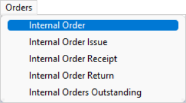

## Step-By-Step Guideline
___ 

1.  Select the **Orders** option from the Main Navigation Menu.  

2.  Then click on **Internal Order**.  
	
  

3.  The system will open a screen titled **"Maintain Internal Order"**.  
    This screen **lists all of the Internal Orders** that have been captured in the
    system. The screen provides a quick and powerful way to keep track
    of what Orders have been received from the other Departments within the Company.  
	
  

4.  Search for the **specific Internal Order** against which you wish to
    capture a Delivery Note.  

    Once you have found the correct Internal Order, **click on the row** in the list and then...  

5.  Click the **Issue** button on the **Form Bar**.
	
  

6.  The system will display a screen titled
    **"Issues for _I0###_"** _(the **Internal Order number** relevant to the specific Order record selected)_.  
    	
  
  
This screen lists any Internal Delivery Notes that have been previously captured and order items issued against the selected Internal Order.

7.  To add a new Delivery Note, click the **Add** button on the **Form Bar**.  

8.  The system will open a screen titled **Internal Order Delivery Note**, with the Internal Order Delivery Note Number (**- IODN###**) automatically generated by the system.  
	
  

This screen lists all the details that were captured on the Internal
    Order, excluding any items that have been delivered in full. You
    will notice the system displays a column called **Qty Outstanding**.  

This column lists the difference between the quantity originally
    ordered by the Customer Department and the total of all previous Delivery
    Notes.

9.  Enter the Quantity that you will be delivering on the Delivery Note
    you are capturing in the **Trx Quantity** Column. Leave the Quantity where
    no items are being delivered as 0.
	
  

10. Once you have entered all the information for items being delivered,
    click on the rows that have 0 quantity and then click the
    **Remove Item** button on the form bar.  
    
    The system removes the details of this product from the Delivery Note but leaves the details in place on the Internal Order so that future Delivery Notes can be captured against the outstanding items.  

11. Once the Delivery Note has been finalised, click the **Save** button.  

12. Select the **Activate** button to Activate the Delivery Note. Activating a Delivery Note finalises the details of the Delivery Note in the system, prevents future changes and allows you to print a Delivery Note for the Customer Department representative to sign.  
	
  

13. The system will then present a dialog that asks you if you wish to
    cancel any outstanding items. Normally you would choose **"No"** so that
    you can deliver any items still outstanding on the Internal Order at a
    later stage.  
    
:::important  
You should only choose **"Yes"** if the Customer Department wants to Cancel the remaining items they ordered and does not want you to deliver these in the future.  
:::

14. Once the Delivery Note has been finalised, click the **Close** button on the form bar.

14. The system will return you to the Issues for _Internal Order_
    screen.

15. The system will display the details of the Delivery Note you have
    just captured in the grid.
	
  

16. Click on the row that contains the details of the Delivery Note you
    have captured.  

17. Then click the **Print** button on the form bar.

18. The system will display the standard **Print Preview** screen so that
    you can then view and print the Delivery Note.

**This is the end of this procedure.**
