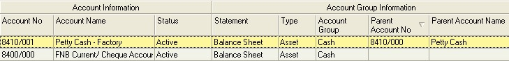

## Step-by-step Guideline  
___  

1.  Click on the **Finance** option on the Main Menu.  

2.  Then click the **Settings** menu item on the drop down menu.  

3.  Then click **General Ledger** and select **Chart of Accounts**.  

  

The system will open a screen titled **"Maintain Chart Of Accounts."**  
This screen lists all of the Accounts that have been defined in the
General Ledger.

  

:::note
You can search for specific accounts using one or more of
the fields in the **Search Criteria Panel** at the top of the screen.  
:::

4.  You could instruct the system to display all the accounts for a
    specific Statement by selecting a Financial Statement from those
    displayed in the **Statement** drop down list and then clicking the
    **Search** button.  

Similarly, you could choose to show all accounts for a specific
Account Group by selecting a specific Account Group in the
**Account Group** field and then clicking the **Search** button.  

You can also search for an Account by entering its Account Code in the
**Account Code** field.  

## Adding Accounts To the Chart of Accounts  

When you decide that you need to add an Account to the Chart of
Accounts you first need to identify whether the Account you are going
to add is a **Parent Account** (to which you cannot post entries), a
**Child Account** (to which you can post entries) or a **Normal Account**
(to which you also can post entries.)  

Whenever you examine a Chart of Accounts you find a combination of
these three account types.  

A **Parent Account** is used to group Sub- or Child Accounts to make
the Trial Balance easier to read. A Parent Account will contain
sub-ordinate accounts and will often be printed in bold on a Chart of
Accounts Listing or Trial Balance. A Parent Account might for example
be created for "Expenses -- Vehicle / Petrol" with child accounts for
different vehicles. Another example might be "Depreciation --
Machinery" with child accounts for each of the various machines used
in the company. **Note that you cannot post to a Parent Account** and
that a Parent Account will get its balance from the sum of the child
accounts it contains.  

A **Child Account** is used to provide more detail to a parent
account and is an account to which you can post entries.  

A **Normal Account** is an account created in the Chart of Accounts
to which you can post entries (for example Salaries, Wages,
Stationary, Audit Fees, Electricity and so on) which does not contain
child accounts.  

When you set-up the Chart of Accounts in Sense-i it is important to
know which accounts you wish to add and to understand what the account
type is for each of these accounts. This is because each account is
added in a slightly different way.  

If you decide to add a new normal Account (neither a Parent nor a
Child) to the Chart of Accounts, follow the steps described in the
section titled "Adding a Normal Account" below.  

If you decide to add a new Parent Account to the Chart of Accounts,
follow the steps described in the section titled "Adding a Parent
Account" below.  

If you decide to add a new Child Account to the Chart of Accounts,
follow the steps described in the section titled "Adding a Parent
Account" below.  

  

### Adding A Normal Account  

5.  To add a new Account to your Chart of Accounts click the **Add** button
    on the Maintain Chart of Accounts screen.  

The system will open a screen titled **"Add Account."**  
This screen enables you to enter the information you need to add an Account in the
General Ledger.  

  

6.  The first step you need to take when creating a new account is to
    check that you assign the account to the correct one of three
    financial statements. Select the appropriate Statement from the drop
    down list appearing the Statement field. It will be one of Balance
    Sheet, Income Statement or Cash Statement. It is important to ensure
    that you select the correct Statement for the Account you are
    adding.  

7.  The next step is to make sure that you link the account to the
    correct Account Type. The system will modify the list of Account
    Types based on the Statement Type you have chosen. Click on the
    appropriate Account Type.  

The next step is to make sure that the account will be linked to the
correct Account Group.

This is essential because the Account Groups provide a structure to
the Chart of Accounts that make analysing the Financial Information
much easier and more useful if this is done correctly.

:::tip Reference
For more on this you should read **[Maintain Account Groups](1911A)**, and
Understanding Financial Statements in Sense-i.  
:::

8.  To select an Account Group, click on the three dot button in the
    Account Group field.  

The system will open a window allows you to click on an Account Group.  

You will notice that the system filters the Accounts Groups in the
list to display only those that match the Financial Statement you
selected in step 6 above.  

  

Generally, the list of Account Groups within a Statement and Account
Type is not very long so you should be able to find the Account Group
you wish to use by simply reviewing the items in the list. You can
however use the any of the Search Fields at the top of the screen to
filter the list even further.  

9.  Once you have found the Account Group you wish to use, click on the
    **appropriate row**.  

10.	Then click the **Select** button.  

The system will return you to the Add Account window and display the
name of the Account Group you have selected in the Account Group
field.  

11.	You next need to define the Status for the Account. To do this
    select either; Provisional, Active or Discontinued.  

**Provisional** -- Does not allow any transactions to be posted to the
account.  

**Active** -- Allows transactions from sub-ledgers and the general
ledger to be posted to the account.  

**Discontinued** -- Is used to prevent further transactions from being
posted to the account while the account is retained because
transactions for the current year already exist in the General Ledger.  

The status of an Account has no other impact on its Profile, its
Posting Rules or its Behaviour. You can change the status back to
Active from Discontinued at any time.  

If the Account you are creating IS NOT a child account, then leave the
Parent Account No and Account Name fields and go directly to the
Account No and Account Name fields.  

  

12.	Enter a Code for the Account in the **Account Code** field.  

13.	Enter a Name for the Account in the **Account Name** field.  

14. Click **Save** and then **Close**.  

The system will return you to the **Maintain Chart of Accounts** window
and displays the information about the Account you have selected in the
list.  

  

15. You can search for the Account using any of the Search fields at the
    top of the screen. To do this, enter information in the appropriate
    Search field, (for example the Account No field)  

16. And then click the Search button at the top of the form.   

The system will update the list to show only those Accounts that match
the search criteria you have selected.  

You can also use the Quick Search features that are built into the
Column Headings on every list screen.  

17. If you click on the right hand side of most column headings on a
    list screen you will notice the system displays a small black arrow
    head. If you click on this button the system will display all of the
    unique values in the list screen.  

  

This is known as the Quick Filter List.  

18. You can select one or more of the items in the list screen by
    clicking in the box to the left of each value.  

The system will then hide all items in the underlying list screen that
do not correspond with the values you have selected in the Quick
Filter List.  

19. To undo the Quick Filter selection, click the (All) option at the
    top of the list.  

### Adding A Parent Account  

To add a Parent Account, repeat the steps described above. You can at
any stage convert a Normal Account (that is one without sub-accounts)
into a Parent Account by simply selecting the Account as a Parent when
you create a Sub-Account.  

### Adding A Child Account  

To create a child account you repeat steps 5 to 14 as described above,
with the exception that you need to insert the following steps between
steps 11 and 12.  

When creating a Sub or Child Account you need to link the Account to
an Account that will act as its Parent Account.  

20. To select an Account to act as the Parent Account, click on the
    three dot button in the Parent Account No field.  

  

The system will open a window allows you to click on an Account from
your Chart of Accounts list.  

You can use the any of the Search Fields at the top of the screen and
the Quick Filter List described above to filter the list if you need
to do so.  

21. Once you have found the Account you wish to use, click on the
    appropriate row.  

22. Then click the **Select** button.  

  

The system will return you to the Add
Account window and display the Account No and Account Name of the
Account you have selected in the Parent Account panel.  

The system will return you to the Maintain Chart of Accounts window
and display the information about the Account you have selected in the
list.  

You will notice that the Account No and Name is displayed in the
Parent Account fields in the list.  

  

**This is the end of the procedure.**
