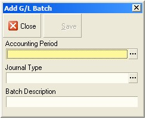

---
id: SAF-1916
title: Create Manual Batches and Journals (SAF-1916)
sidebar_label: G/L Batches and Journals
slug: /1916
---  
## Procedure Guideline
___  

1.  Click on the **<!-- Main Menu Path --> Finance** option on the Main Menu.

2.  Then click the **<!-- Function Menu Path --> General Ledger** item on the drop down menu.

3.  Then click **G/L Batch.**

  

The system will open a screen titled "Maintain G/L Batch." This screen
displays all the batches that exist in the General Ledger that match
the search criteria you have entered.  

  

**Understanding the Maintain G/L Batch Screen.**

The Maintain G/L Batch screen displays the following information for
the General Ledger Batches that have been created by the system for
imported transactions and for batches you have created to enter Manual
Journals.

A.  The system displays the Accounting Period in the format of Year --
    Accounting Period No in the Accounting Period column.

B.  The system displays the Start Date and End Date for the
    corresponding Accounting Period in the Period Dates column.

C.  The system displays the Status for the Accounting Period in the
    Status column.

D.  The system displays the number of the Batch in the G/L Batch column.
    This information is useful for auditing purposes.

E.  The system displays a description of the Batch. This description is
    created by combining the Accounting Period and the Type of
    Transaction in the Batch. This helps you to easily identify a batch
    containing a specific type of transaction.

F.  The system displays the Transaction Type Code that relates to the
    transactions included in the batch in the Transaction Type Code.
    This helps you to quickly identify and select any specific group of
    Transactions you wish to import.

You might for example decide that you want to import and review all
invoices from suppliers. You would then select the POINV or Purchase
Order Invoice transaction row.

G.  The name of each Transaction Type is displayed in the Transaction
    Type Name field.

H.  The system indicates whether the Batch was created from Sub-Ledger
    transactions or if it was Manually created in the General Ledger.

I.  The system displays a "Ready to Post Status" in the Ready to Post
    column.

If the "Ready to Post Status" is Yes, then all the journals contained
within the batch balance and contain the information required to be
posted.

If the "Ready to Post Status" is No, then either the underlying
journals are missing information or they do not balance. You will need
to open each batch that has a "Ready to Post Status" of "No", identify
the journals that are problematic and then delete them from the batch.
You will then need to fix the underlying cause of the error and
re-import the transaction that have been deleted for not balancing.

J.  The system will display that Status of the batch in the Status
    column. This will either be "Open" or "Posted."

If the batch status is "Open" then the batch has not yet been posted.
If the Batch is a Manual Batch then you can change any of the
underlying journals or add new ones. If the batch is a batch that has
been created by importing transactions from a sub-ledger, then you
will not be able to add journals, nor change existing journals but you
will be able to delete selected journals.

If the batch status is "Posted" then the batch is no longer open and
has been posted. You cannot add, delete or modify the journals in a
posted batch.

K.  The Total Financial Value of all the Transactions in the batch
    (Inclusive of Tax Amount where Tax is applicable) is displayed in
    the Batch Total column. You can use this to compare the Total Value
    that will be created in the General Ledger Batch for the Accounting
    Period to a list of the Transaction on which the Batch has been
    created. In our example above, you could print a list of all the
    Purchase Order Invoices captured in the system for the selected
    period and compare the total on the printed list to the total on the
    Maintain Sub-Ledger Import screen.

L.  The system displays the number of transactions that are included in
    the Batch in the No of Journals column.

M.  The system displays information that is useful for auditing purposes
    in the Audit Band. This includes the name of the user who created
    the batch, the date on which the batch was created. If the batch has
    been posted, the system displays the name of the user who posted the
    batch and the date on which the batch was posted. You can use this
    information to monitor and track the source of the journal batches
    and identify any user with whom you need to resolve mistakes.

**Using The Quick Filter**

You can any of the columns to analyse, filter, group and select the
transaction types with which you wish to work. Use the Quick Search
features that are built into the Column Headings on every list screen
to quickly select the rows you need.

4.  If you click on the right hand side of most column headings on a
    list screen you will notice the system displays a small black arrow
    head. If you click on this button the system will display all of the
    unique values in the list screen.

This is known as the Quick Filter List.  

  

5.  To create a new batch for capturing manual journals in the General
    Ledger, click the Add Button at the top of the screen.

> The system will open Add G/L Batch screen.  

  

6.  To select an Accounting Period, click the three dot button in the
    Accounting Period field.

The system will open a Select Accounting Periods window.  

  

7.  Click on the Accounting Period you
    wish to use for creating your manual journal batch. This would
    normally be the month in which you are working, either the Current
    or the Previous Month.

8.  Then click the Select button.

The system will close the Select Accounting Periods window and display
the year and month of the Accounting Period you have chosen in the
Accounting Period field.

9.  Click on the Journal Type field and select Journal from the list.  

  

  ------------------------------------------------------------------------------
  The system automatically creates a description for the manual journal batch.
  ------------------------------------------------------------------------------

  

The system will close the Select Journal
Type window and create a name to describe the manual journal batch you
are creating. This name is displayed in the Batch Description field.

10. Click on the Save button at the top of the Add G/L Batch screen.

The system will create the GL Journal Batch and display it in the list
screen.

  

11. To add journals to the batch you have created, find the batch in the
    list, click on the correct row and...

12. Click the Journals button.

The system will open the Maintain G/L Journal screen. This screen
lists all of the journals that have been created within the batch you
have selected. At this point, because no journal have yet been
captured in this batch, the list will be empty.

  

The system will open the Add Journal screen.

You will need to complete the fields in the header section of the
journal and then select accounts from the Chart of Accounts to which
to post the Journal details.

  

14. The system will display the General Ledger Journal Batch Number in
    the Batch No field.

15. The system will display the description for the Batch in the Batch
    Description field.

16. Each Journal within a Batch is assigned a unique sequential number
    by the system. The system displays the Journal number in the Entry
    No field. This number is only generated after the journal has been
    saved.

17. You need to enter a reference number for the specific Journal you
    are creating. If you are creating a journal to capture a transaction
    such as a lease installment, wage or salary pay run or depreciation
    calculation, these source documents containing the information you
    are entering will often have a number or date and name and you can
    use to create the reference number for this journal. Or use the
    Month, Week or Date and a Transaction Code.

18. You can enter a note for the journal in the notes field. Again, you
    can base this on the source document you are using for the journal.

The system displays the Accounting Period for the batch in the
Accounting Period field.

The system displays the start date for the selected accounting period
in the Period Start Date field.

The system displays the end date for the selected accounting period in
the Period Start Date field.

19. Select a date from the drop down calendar in the date field for the
    journal.

The system displays the Source Code for the Journal you are creating,
in this case JNL for a manual journal in the source code field.

The system displays the Transaction Type as Manual Journal in the
Transaction Type field.

20. Click the Save button on the Journal Header to be able to select
    accounts and enter amounts.

The system then allows you to select accounts from the Chart of
Accounts and to enter amounts as either a debit or a credit against
each account selected in the Journal Detail Grid.

21. The system inserts a blank row in the grid and numbers this row as
    line no 1.

  

22. Selecting Accounts from the General Ledger Chart of Accounts will be
    easier if you select an Account Group first. To do this, click on
    the Account Group field.

> The system then displays the Select Account Group lookup.

  

23. The system displays the main Financial Statements underneath which
    the Account Groups are listed. To expand a Statement, click on the +
    sign to the left of the Statement Name.

The system will display each of the standard Account Groups that are
listed underneath the Statement you have expanded.

  

24. Click on the Account Group you wish to use to filter the Chart of
    Accounts from which you can select and then...

25. click the Select button.

26. Press the tab key to move to the Account No field.

27. You next need to select a specific account from the Chart of
    Accounts lookup screen. You can also type the Account Code in the
    Account Code field and the system will then display the Account
    Group Name and the Account Name for the matching account code in the
    relevant columns in the grid.

  

28. Then enter the amount you wish to post to the account you have
    selected in either the Debit or Credit columns as appropriate.

29. You can then optionally enter a reference and description for each
    row in the relevant columns.

30. You will notice too that the Note you have entered in the Header
    appears in the Notes row in the grid next to each account in the
    journal. This allows you to easily understand journals when you
    review the G/L Transaction lists.

  

31. Press the tab key to move to the next blank row and repeat steps 22
    to 30 until all the information you wish to include in the journal
    has been captured on the system and the journal is in balance.

32. If you wish to remove a detail row from the Journal, click on the
    row you wish to remove and then click the Delete button.

33. Once you have completed adding all the information you need to the
    journal, click the Save button,

34. or if you wish to enter another Journal, click the Next button.

The system allows you to save journals that do not balance but you
will be unable to post a batch containing any "out-of-balance"
journals.

35. You can then either proceed to create another journal by clicking
    the Next button,

36. or you can exist the Journal screen and return to the journal list
    screen by clicking the Close button.

The system will then return you to the Maintain G/L Journal screen.
You can use the fields in the Search Panel to search and filter the
journal in the list.

  

37. You can then also change any journal that has already been captured
    (provided it has not been posted) by finding the journal you wish to
    change in the list, clicking on the appropriate row and then
    clicking the Edit button.

  

38. If you wish to add another journal to your manual journal batch,
    click the Add button and go back to step 14.

39. If you wish to change an existing journal, click on the row
    containing the journal you wish to change and click the Edit button.

40. If you wish to view the details of an existing journal, click on the
    row containing the journal you wish to view and click the View
    button.

41. And finally, if you wish to delete an existing journal, click on the
    row containing the journal you wish to delete and click the Delete
    button.

42. Once you have completed adding and refining the manual journals you
    wish to add to the General Ledger, click the Close button on the
    Maintain G/L Journal screen.

The system will then return you to the Maintain G/L Batch screen. You
can use the fields in the Search Panel to search and filter the
batches in the list.

43. If you want to open the batch you have just created, click the
    Journal button on the form bar

  

44. Once you have completed working with the General Ledger batches,
    click the Close button and the system will return you to the main
    screen.

**This is the end of the procedure.**
