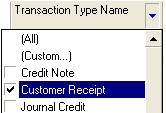
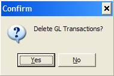

## Step-by-step Guideline  
___ 

1.  Click on the **Finance** option on the Main Menu.

2.  Then click the **General Ledger** menu item on the drop down menu.

3.  Then click **G/L Batch**.  

  

The system will open a screen titled "Maintain G/L Batch." This screen
displays all the batches that exist in the General Ledger that match
the search criteria you have entered.

  

The information that is displayed in the grid can be used to select,
sort and organise information about the General Ledger batches.

A.  The system displays the number of the Batch in the G/L Batch column.
    This information is useful for auditing purposes.

B.  The system displays a description of the Batch. This description is
    created by combining the Accounting Period and the Type of
    Transaction in the Batch. This helps you to easily identify a batch
    containing a specific type of transaction.

C.  The system displays the Transaction Type Code that relates to the
    transactions included in the batch in the Transaction Type Code.
    This helps you to quickly identify and select any specific group of
    Transactions you wish to import.

D.  You might for example decide that you want to import and review all
    invoices from suppliers. You would then select the POINV or Purchase
    Order Invoice transaction row.

E.  The name of each Transaction Type is displayed in the Transaction
    Type Name field.

F.  The system indicates whether the Batch was created from Sub-Ledger
    transactions or if it was Manually created in the General Ledger.

G.  The system displays a "Ready to Post Status" in the Ready to Post
    column.

If the "Ready to Post Status" is Yes, then all the journals contained
within the batch balance and contain the information required to be
posted.

If the "Ready to Post Status" is No, then either the underlying
journals are missing information or they do not balance. You will need
to open each batch that has a "Ready to Post Status" of "No", identify
the journals that are problematic and then delete them from the batch.
You will then need to fix the underlying cause of the error and
re-import the transaction that have been deleted for not balancing.

H.  The system will display that Status of the batch in the Status
    column. This will either be "Open" or "Posted."

If the batch status is "Open" then the batch has not yet been posted.
If the Batch is a Manual Batch then you can change any of the
underlying journals or add new ones. If the batch is a batch that has
been created by importing transactions from a subledger, then you will
not be able to add journals, nor change existing journals but you will
be able to delete selected journals.

If the batch status is "Posted" then the batch is no longer open and
has been posted. You cannot add, delete or modify the journals in a
posted batch.

I.  The Total Financial Value of all the Transactions in the batch
    (Inclusive of Tax Amount where Tax is applicable) is displayed in
    the Batch Total column. You can use this to compare the Total Value
    that will be created in the General Ledger Batch for the Accounting
    Period to a list of the Transaction on which the Batch has been
    created. In our example above, you could print a list of all the
    Purchase Order Invoices captured in the system for the selected
    period and compare the total on the printed list to the total on the
    Maintain Sub-Ledger Import screen.

J.  The system displays the number of transactions that are included in
    the Batch in the No of Journals column.

K.  The system displays information that is useful for auditing purposes
    in the Audit Band. This includes the name of the user who created
    the batch, the date on which the batch was created. If the batch has
    been posted, the system displays the name of the user who posted the
    batch and the date on which the batch was posted. You can use this
    information to monitor and track the source of the journal batches
    and identify any user with whom you need to resolve mistakes.

## Using The Quick Filter 

You can any of the columns to analyse, filter, group and select the
transaction types with which you wish to work. Use the Quick Search
features that are built into the Column Headings on every list screen
to quickly select the rows you need.

4.	If you click on the right hand side of most column headings on a
list screen you will notice the system displays a small black arrow
head. If you click on this button the system will display all of the
unique values in the list screen.

This is known as the Quick Filter List.

  

## Reviewing Imported GL Batches 

You can only post batches in the General Ledger that contain all the
necessary information and where the total of the debit values match
the total of the credit values in each journal.

As part of preparing batches for posting, you will need to identify
which batches contain journals that are not ready to be posted,
identify the cause of the problem and then delete the problem journals
from these batches.

You can then post the batches once all the journals are in balance.

For the problem journals that you have deleted, you will need to
resolve the underlying issues or cause of the problem and then
re-import them into the General Ledger.

When working with General Ledger Batches you are usually trying to
finalise the transactions for a specific Accounting Period. The first
step you should take is to filter the list to show only those batches
for the Accounting Period on which you are focused.

You can use the Quick Filter to do this.

5.  In the Period Information band, click the Quick Filter arrow in the
    Accounting Period column. Then click on the Accounting Period on
    which you wish to focus.

  

The system will then reduce the records displayed in the grid to show
only those batches that match the Accounting Period you have selected.

6.  Next, you should sort the batches into those that are Ready to Post
    and those that are not. To do this, click the Ready to Post Column.
    The system will sort the batches into those that are Not Ready to
    Post and then those that are Ready to Post.  

  

You can choose to review GL Batches where the "Ready to Post" status
is set to "Yes" (in other words, every journal in such a batch is
complete and in balance) or you can focus on those where the "Ready to
Post" status is "No." These will contain one or more problem journals
you will need to resolve.

To analyse a batch you should briefly review the Journals in the batch
and satisfy yourself that the information is correct and, where it is
not, to identify and resolve the causes of the problem.

7.  Click on the row for the Batch that contains the individual Journals
    you wish to review.

8.  Click the Journals button.

  

The system will open the Maintain G/L Journal screen. This screen
lists all of the individual Journals contained in GL Batch you have
selected.

  

9.  To review the journals, you should firstly randomly check all the
    journals where the "Ready To Post" is set to "Yes." You can use the
    Quick Filter on the Ready To Post column and select "Yes" from the
    drop down list.

10. Next, you should click either the Debit or the Credit column to sort
    the Journals by value. Then look at the type of transaction for the
    batch, for example Purchase Order Invoice (this is displayed in the
    Transaction Type Name column) and make sure that the value of each
    journal is within an acceptable range for your company. If you find
    a journal that is too low or too high in value you will need to
    investigate the details of the journal.

11. Click on the row that contains the journal for which you wish to
    view the details.

12. Click the View button.

The system will open the View G/L Journal screen. This screen displays
the details and all of the transaction legs that make up the journal.
This includes the values and accounts to which each value is posted.

  

13. Check that the journal balances, that is that the Total Debit and
    Total Credit are in balance and then check the values in the Debit
    and Credit columns.  

14. You should check that the structure of the Journal is correct. That
    is, for the Transaction Type, the Account Groups to which the values
    are being posted are correct. If you need to, you should refer to
    the "**Transaction Type - Posting Structure guide**."  

15. Once you are satisfied that the journal is correct, you can scroll
    to the next journal in the batch by clicking the Next button at the
    top of the screen.  

16. You can lick on the Close button to close the View Journal screen.  

The system will return you to the Maintain G/L Journal screen.  

  

17. Next, you should focus on those GL Batches and any Journals that
    have are "Ready to Post" status of "No." Click the Ready To Post
    column on the Maintain G/L Journal screen.  

18. Click on the row that contains the next journal in the list that is
    not ready to post.  

19. Click the View button.  

The system will open the View G/L Journal screen. This screen displays
the details and all of the transaction legs that make up the journal.
This includes the values and accounts to which each value is posted.

20. Again, as in steps 13 and 14 you should check the structure and the
    values of the journal. If the journal is not yet ready to post and
    does not balance you should see if you identify the cause of the
    problem.

21. You can also click the Error Check button.

The system will open the Unresolved G/L Transactions screen. This
screen will display any errors that might exist with the structure of
the journal. This is usually caused by a mistake or omission made when
adding a new Customer or Supplier Group or individual Profile, a Tax
Item or a Product or Material.

You can access the correct screen to define the missing link between
the underlying transaction and the General Ledger account.

22. Once you have identified the cause of an error, you will need to
    delete the journal from the batch.  

:::note
You can always re-import the underlying transaction from the sub-ledger
once you have resolved the error.  
:::

23. Click on the row that contains the problem journal that you wish to
    Delete.  

24. Click the **Delete** button.  

  

The system will display a dialog asking you if you **are sure you wish
to delete the selected journal.**

  

25. To delete the journal, click **Yes**.  

26. Then, continue by repeating steps 18 to 25 for each Journal that is
    not ready to post.  

27. Then, repeat steps 7 to 25 for each GL Batch that has a "Ready To
    Post" status of "No."  

28. Once you have reviewed the Journals in the various GL Batches you
    need to in the selected Accounting Period and you have removed all
    problem Journals, you should proceed to resolving these using the
    procedure "**Resolve Errors with GL Batches and Journals**,"
    or if no errors exist, then procede to
	"**Post General Ledger Journal Batches**."  

**This is the end of the procedure.**
