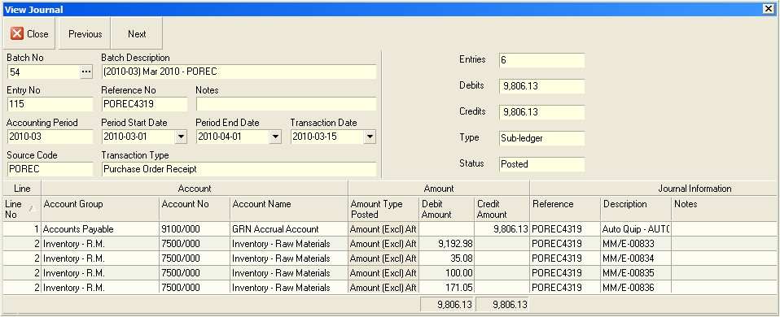
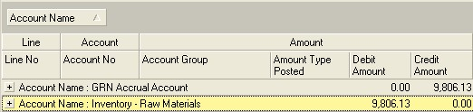
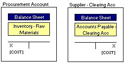

## Step-by-step Guideline  
___ 

In order to generate accurate and meaningful financial information for
the company, you will need to ensure that all the transactions for a
particular period have been captured in the General Ledger and that
these transactions have been posted. The system will not let you post
transactions that do not balance or that have incorrect accounts
linked to them.

As part of the process of preparing financial statements you will need
to identify and isolate any journals that contain such errors.

First, you will need to identify which batches contain journals that
are not ready to be posted.

Next, you will need to identify the cause of the problems with any
such journals.

Then, you will need to delete the problem journals from these batches.

Finally, for the problem journals that you have deleted, you will need
to resolve the underlying issues or cause of the problem and then
re-import them into the General Ledger.

The General Ledger system provides you with a way to easily identify
any batches that contain journals that will not post. This is either
because the journals do not balance or because the system cannot
assign the correct account to one of the rows in a journal.

Steps 1 to 8 below are a repeat of the steps described in the
procedure "**Review Imported GL Batches**."

1.  Click on the Finance option on the Main Menu.

2.  Then click the General Ledger menu item on the drop down menu.

3.  Then click G/L Batch.

  

The system will open a screen titled "Maintain G/L Batch." This screen
displays all the batches that exist in the General Ledger that match
the search criteria you have entered.  

  

The information that is displayed in the grid can be used to select,
sort and organise information about the General Ledger batches.

A.  The system displays the number of the Batch in the G/L Batch column.
    This information is useful for auditing purposes.

B.  The system displays a description of the Batch. This description is
    created by combining the Accounting Period and the Type of
    Transaction in the Batch. This helps you to easily identify a batch
    containing a specific type of transaction.

C.  The system displays the Transaction Type Code that relates to the
    transactions included in the batch in the Transaction Type Code.
    This helps you to quickly identify and select any specific group of
    Transactions you wish to import.

D.  You might for example decide that you want to import and review all
    invoices from suppliers. You would then select the POINV or Purchase
    Order Invoice transaction row.

E.  The name of each Transaction Type is displayed in the Transaction
    Type Name field.

F.  The system indicates whether the Batch was created from Sub-Ledger
    transactions or if it was Manually created in the General Ledger.

G.  The system displays a "Ready to Post Status" in the Ready to Post
    column.

If the "Ready to Post Status" is Yes, then all the journals contained
within the batch balance and contain the information required to be
posted.

If the "Ready to Post Status" is No, then either the underlying
journals are missing information or they do not balance. You will need
to open each batch that has a "Ready to Post Status" of "No", identify
the journals that are problematic and then delete them from the batch.
You will then need to fix the underlying cause of the error and
re-import the transaction that have been deleted for not balancing.

H.  The system will display that Status of the batch in the Status
    column. This will either be "Open" or "Posted."

If the batch status is "Open" then the batch has not yet been posted.
If the Batch is a Manual Batch then you can change any of the underlying
journals or add new ones.  
If the batch is a batch that has been created by importing
transactions from a subledger, then you will not be able to add
journals, nor change existing journals but you will be able to delete
selected journals.

If the batch status is "Posted" then the batch is no longer open and
has been posted.

You cannot add, delete or modify the journals in a posted batch.

I.  The Total Financial Value of all the Transactions in the batch
    (Inclusive of Tax Amount where Tax is applicable) is displayed in
    the Batch Total column. You can use this to compare the Total Value
    that will be created in the General Ledger Batch for the Accounting
    Period to a list of the Transaction on which the Batch has been
    created. In our example above, you could print a list of all the
    Purchase Order Invoices captured in the system for the selected
    period and compare the total on the printed list to the total on the
    Maintain Sub-Ledger Import screen.

J.  The system displays the number of transactions that are included in
    the Batch in the No of Journals column.

K.  The system displays information that is useful for auditing purposes
    in the Audit Band. This includes the name of the user who created
    the batch, the date on which the batch was created. If the batch has
    been posted, the system displays the name of the user who posted the
    batch and the date on which the batch was posted. You can use this
    information to monitor and track the source of the journal batches
    and identify any user with whom you need to resolve mistakes.

## Using The Quick Filter 

You can any of the columns to analyse, filter, group and select the
transaction types with which you wish to work. Use the Quick Search
features that are built into the Column Headings on every list screen
to quickly select the rows you need.

When working with General Ledger Batches you are usually trying to
finalise the transactions for a specific Accounting Period. The first
step you should take is to filter the list to show only those batches
for the Accounting Period on which you are focused.

You can use the Quick Filter to do this.

4.  If you click on the right hand side of most column headings on a
    list screen you will notice the system displays a small black arrow
    head. If you click on this button the system will display all of the
    unique values in the list screen.

This is known as the Quick Filter List.

5.  In the Period Information band, click the Quick Filter arrow in the
    Accounting Period column. Then click on the Accounting Period on
    which you wish to focus.

  

The system will then reduce the records displayed in the grid to show
only those batches that match the Accounting Period you have selected.

## Isolate GL Batches With Problem Journals 

6.  Sort the GL batches into those that are Ready to Post and those that
    are not. To do this, click the Ready to Post Column. The system will
    sort the batches into those that are Not Ready to Post and then
    those that are Ready to Post.

The system will sort the list of GL Batches for the Accounting Period
on which you are focused into those that are not ready to post (i.e.
their Ready To Post Status is "No") and then will display those whose
ready to post status is "Yes."

  

7.  Click on the row for the next Batch in that list that has a Ready to
    Post status of "No" and that contains the Journals that cannot be
    posted.  

8.  Click the Journals button.  

  

The system will open the Maintain G/L Journal screen. This screen
lists all of the individual Journals contained in GL Batch you have
selected.

  

9.  Isolate all the Journals in the GL Batch you have selected that have
    are "Ready to Post" status of "No." You can use the Quick Filter on
    the Ready To Post column and select "No" from the drop down list.  

The system will filter the list of Journal in the selected GL Batch
and show only those that have a "Ready To Post" status of "No" in the
list.  

10. Click on the row that contains the next journal in the list that is
    not ready to post.  

11. Click the View button.

The system will open the View G/L Journal screen.

This screen displays the details and all of the transaction legs that
make up the journal.

This includes the values and accounts to which each value is posted.

  

You will notice when you open a GL Journal that the system lists each
detail or leg of the transaction on a separate row and that for
transactions that contain several details, the system will list each
detail on a separate row. This means that in many journals the same
Account Group, Account No and Account Name will appear on several
different rows. This makes it a little complex when trying to validate
the structure of a Journal.

To check the accuracy and completeness of the rows in the selected
Journal you need to compare the TOTAL VALUES posted to each of the
ACCOUNTS in the JOURNAL to the VALUES AND ACCOUNT GROUPS PRESCRIBED IN
THE POSTING GUIDELINES.

To do this, you need to modify the way in which the information in the
Journal screen is displayed.

12. Position the cursor anywhere in the grid, then right click the mouse
    and select Grid Layout.

13. Then select the Enable Groups option for the list of items that
    appear next to the Grid Layout option.

  

You will notice that the system displays a dark grey bar above the
grid or worksheet with text in white font.

  

You can then rearrange the information in the Journal detail grid by
dragging either the Account Name column or the Account Group and then
the Account Name column heading into the dark grey Group By bar.

  

14. Click on the heading for the column that you wish to group by, in
    this example the Account Name.  

15. Then hold the mouse click down and drag the selected column heading
    into the Group By bar and then let the mouse click go.  

You will now notice that the system has grouped all of the details for
the Journal by the column you have dragged into the Group By bar and
that subtotals are displayed in both the Debit Amount and Credit
Amount columns for each group.

  

The system displays totals for each value at each GROUP ROW.

You can also nest or stack the grouping items one underneath the other
to create a view that totals and enables you to analyse the
information at different levels of detail For example, you could
choose to first group and total information by Account Group and then
underneath that by Account Name.

  

  

16. You can click on the + sign next to any grouped item to reveal the
    details underneath the grouped item that are used to calculate its
    total.  

Now, to check the integrity of the Journal and its underlying
transaction you need to perform five steps. These are; 
-	Identify the Transaction Type
-   Retrieve the Posting Guidelines for the specific Transaction Type
-   Retrieve the Amount Type Guidelines
-   Access the original transaction document
-   And then compare the information from these items to identify the
    cause of the problem.

Use the information in the Journal Header panel to identify the
necessary transaction information.

  

17. Identify the Transaction Type from the Source Code and Transaction
    Type fields in the Journal Header. In the above example, the
    Transaction Type is "Purchase Order Receipt" and the code for this
    transaction type is "POREC."  

18. Retrieve the document titled "General Ledger Posting Guidelines" and
    in this document find the appropriate diagram illustrating how the
    General Ledger posts the specific Transaction Type you have
    identified.  

## Purchase Order Receipt For Inventory Items  

  

The General Ledger Posting Guideline for the Purchase Order Receipt
Transaction.  

19. Next, you need to identify the Original Transaction Number for the
    selected Transaction. You will find this in the Journal Header Panel
    in the Reference No field.

  

20. Open the original transaction in the system. You can use the Men
    Path guideline in the General Leger Posting Guideline to find the
    original transaction. In the case of the Transaction Type of
    Purchase Order Receipt the path is Main Menu -- Supplier -- Purchase
    Order Receipt. Select this option to open the list screen for this
    transaction type.  

  

21. Type the number of the original transaction for the journal (as
    identified in step 19 above) into the Transaction No field  

22. Then click the Search button on the form bar.  

  

23. Click on the row containing the Original Transaction and then click
    the Print button.  

The system will print the original document. This will enable you to
analyse the values and items on the transaction in detail.  

24. Retrieve the Amount Type Guideline  

25. Calculate the values for each Amount Type that should be used by the
    system to post the original transaction. Look at the Amount Types on
    the Posting Guideline and calculate the values from those that
    appear in the Original Transaction.  

26. Record these next to each Account on the Posting Guideline as
    appropriate.  

27. Compare the recorded totals to the values for each Account in the
    View Journal screen.  

28. Identify any difference between the values in the View Journal
    screen and those values that you have calculated and recorded on the
    Posting Guideline.  

Next you need to identify the SOURCE ENTITY where the difference
occurs. In other words, does the difference between the system Journal
Amount and the calculated amount appear for...

-   Customer
-   Supplier
-   Item (Material, Machine, Component, Expense, Product)
-   Tax Item  
-	Bank Account  
-	Bank Charge.

29. Once you have identified the source of the problem, go to the
    General Ledger Account Settings procedure and follow the steps
    described to check all the General Ledger Account Links have been
    defined and that the accounts used are correct.  

30. If you find that a link between one of the SOURCE ENTITIES and the
    General Ledger is missing then add the link or if it is pointing to
    an incorrect account, then remove the link and add the correct
    account.  

31. Once you have done this, close the View Journal screen.  

32. Then Delete the Journal from the GL Batch.  

33. Repeat steps 10 to 32 for each Journal that has a Ready to Post
    status of "No."  

34. Once you have identified and resolved any Journal errors in the
    General and deleted these Journals, re-import the necessary batches
    using the procedure titled "**Import Sub-ledger Batches**."

**This is the end of the procedure.**
