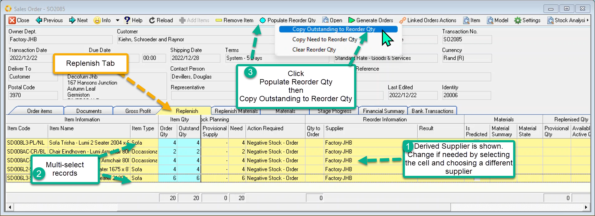
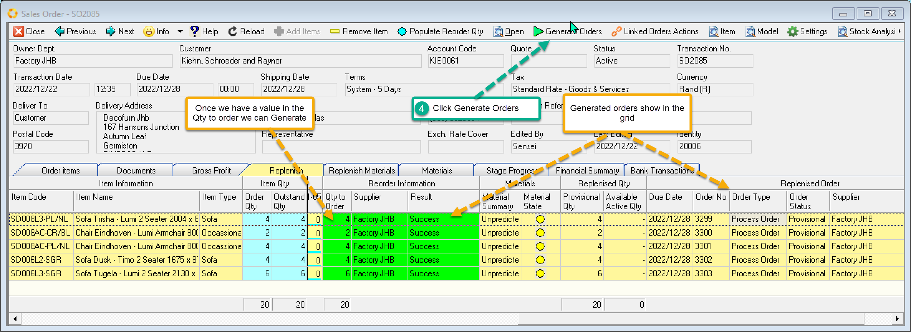
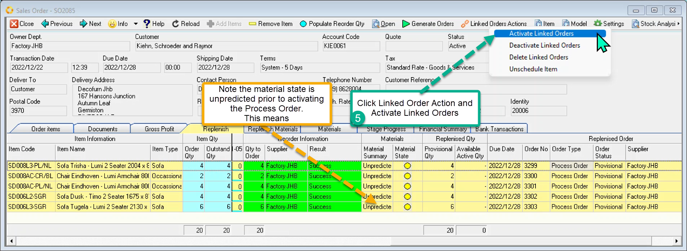
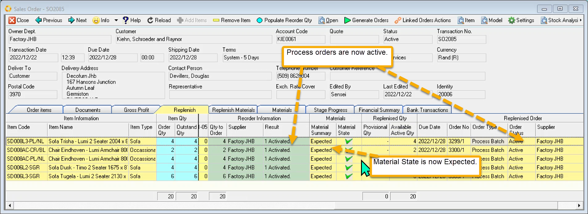

There are numerous entry points to initiate replenishment from an order:

- Sales Order Replenishment
 An Active Sales order Replenishes to

  - Internal Order when another department (factory) is the supplier
  - Process Order when this department (factory) makes it
  - Purchase order when the supplier is external to the company. A Buy-out.

- Sales Order Material Replenishment.
 For a factory department, those items which have replenished to a Process order have a corresponding process model which provides the list of materials required to make the item. Once these process orders are ACTIVATED, the raw material quantities are determined and can be replenished.
  - Purchase order for raw materials

- Internal Order Replenishment.
 Generally this department is a factory.
 An Active Internal order replenishes to
  - Process Order

- Internal Order Material Replenishment.
 Once the linked Process orders are ACTIVATED, the raw materials are listed and can be replenished.
  - Purchase order for raw materials
- Process Order Replenishment.
 This is the replenishment of the raw materials making up the input requirements. These materials generally replenish to a
  - Purchase Order

The process shown below works for all replenishments which originate from an order (as opposed to stock).

Once order has been **activated** , move to the Replenishment tab.

**Set the Replenishment Order Quantity**

The replenishment Tab lists the items associated with the order and these can be selected in the grid.

 

1. Check the derived Supplier and change if needed.
2. Multi-select the records
3. Populate Order Quantity   
Click _Populate Reorder Qty_ Button   
Click _Copy Outstanding to Reorder Qty_      
or   
You could choose to type the quantity directly into the Qty to Order Column.

**Generate the orders - Replenish**.

Keep the records selected or change to another selection.

4. Click on the _Generate Orders_ button.

The system determines which **type of order** to generate based on various criteria: the source order's department; whether the item has a process model; which department is a factory; and the preferred supplier.

 

**Activate the newly generated linked orders**.

While still on this screen you can activate the linked orders Process Order. (In the above example we have replenished the Sales Order Items to Process Orders.)

Select those records you want to activate

5. Click on the _Linked Orders Actions_ button and then _Activate Linked Order_

 

Once any linked Process orders are activated the Materials State becomes **expected**. This means that we expect the raw materials to be issued when the process order is scheduled. This is the projected demand for the materials

 

Both the sales order and internal orders have two replenish pages.

The Replenish Page deals with finished goods and buy-out goods.

The Replenish Materials Page deals with the raw materials only applicable if the finished goods generated process orders.

