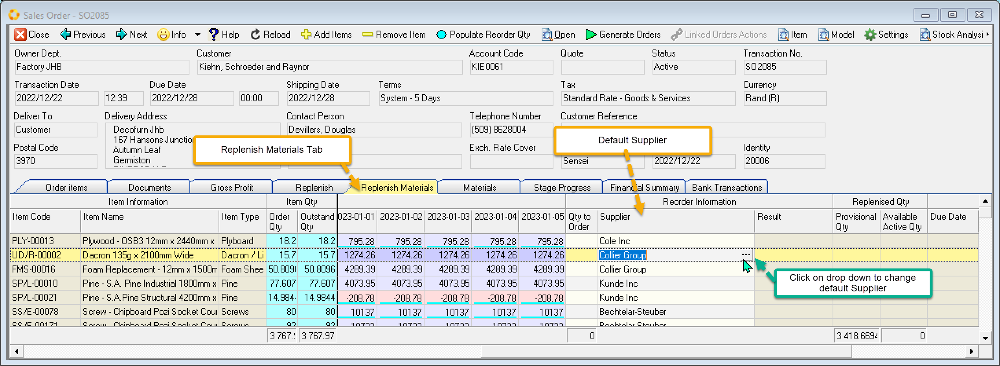
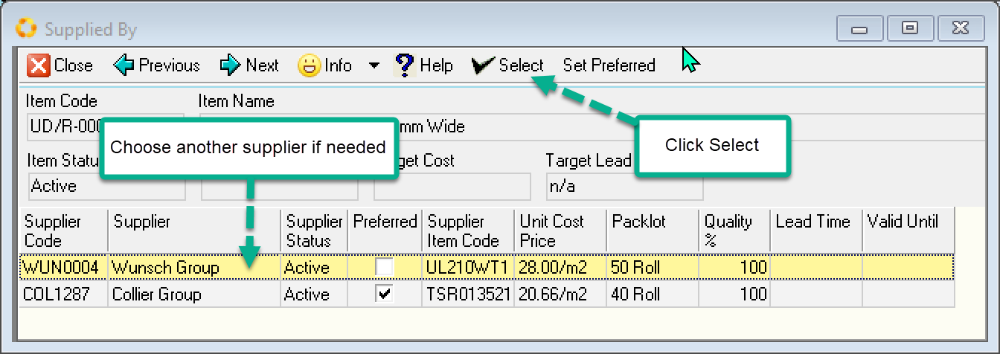

The **Replenish Materials** page works in the same way. Generating Purchases orders against the raw materials.

 

Things to note. The default Supplier is listed. If you want to change the supplier, click on the drop-down button in the grid on the supplier column.

A List of the available suppliers is displayed.

Select the supplier record and Click **Select** button to change.

Note: This is a once off selection for the record you are replenishing. If you want to permanently change the preferred supplier then click Set Preferred.

 
