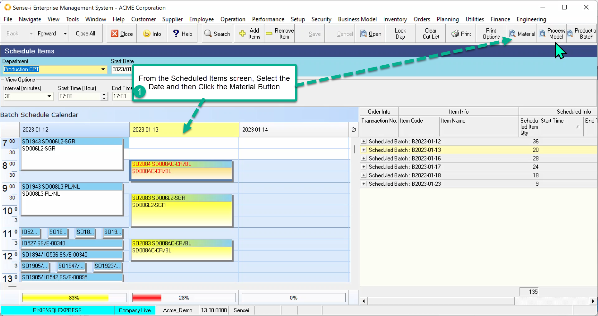
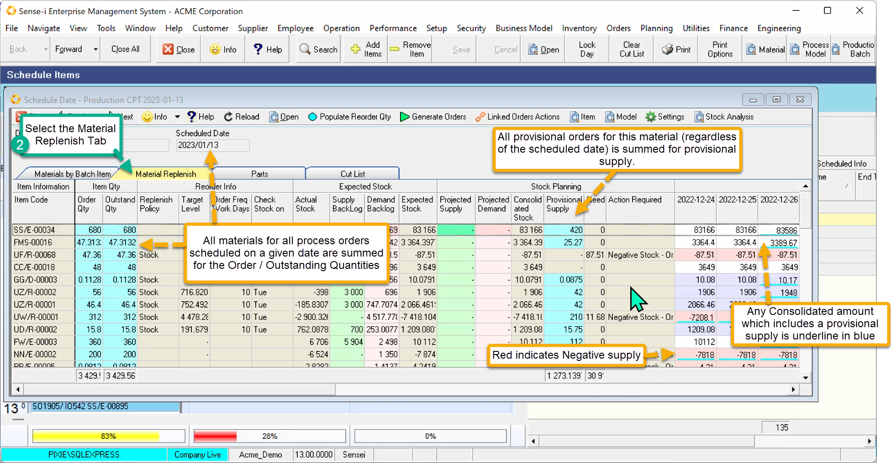
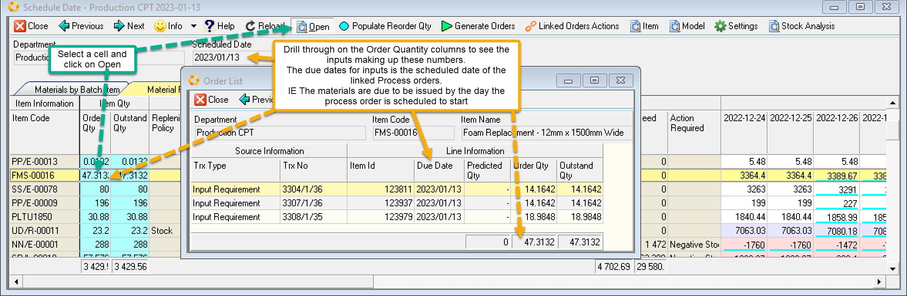
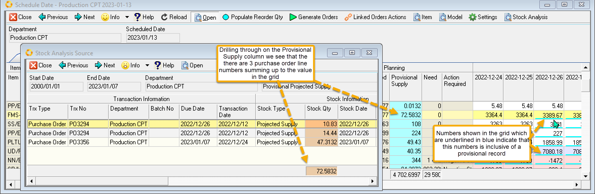
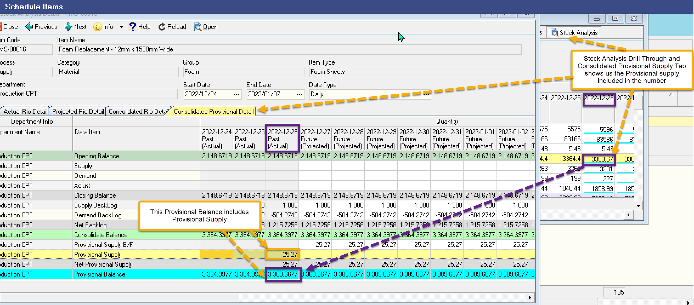

From the menu, navigate through to Operation \> Schedule Order Items.

1. Select the date by clicking on the column header, then click the Materials button.

 

The Materials Detail Pop-up screen is displayed.

2. Select the Material Replenish page

 

:::note

- All materials for all the process orders scheduled for this department on this date make up the Order Quantity and Outstanding Quantities.
- The existing provisional purchases orders are summed and shown in the Provisional Supply column. This means that we can begin to build purchase orders from each day's requirements and only activate the orders when we are ready.
- The colour coding alerts us to negative stock or surplus stock.
:::

3. Replenish as usual: Set Order Quantity & Generate Order.

## Drilling into the numbers

All the replenish screens we have seen so far allow you to drill in to specific cells and confirm the numbers. 

### Orders Drill Through

We click on a cell in the grid and click the **open** button

 

### Source Transaction Drill Through

Similarly, drilling through on the Provisional Supply column, a screen showing the a list of Source Transactions is displayed.

 

The grid shows which values in the date columns have provisional supply included.

### Stock Analysis Drill Through

Check numbers in the any of the Date columns by selecting a cell and clicking the Stock Analysis button.

These number correspond to the _Consolidated Provisional supply_ Tab.

 

 
