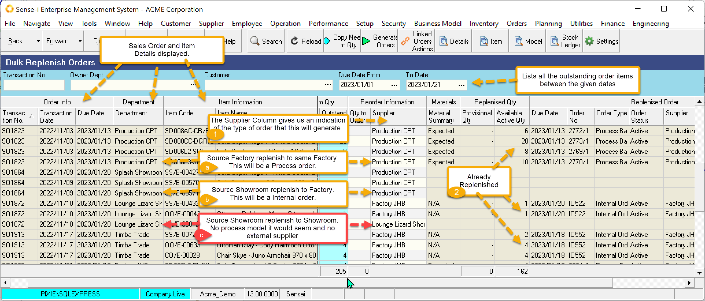
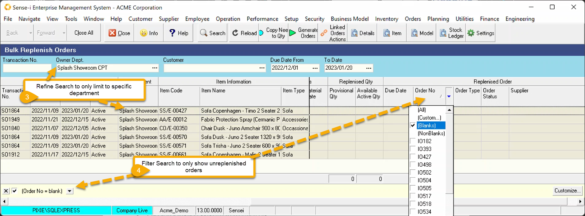

Bulk Replenishment shows a selection of outstanding sales order items. These can be replenished in bulk.

From the menu navigate to Operation \> Bulk Replenish Orders.

The Search parameters let us filter between dates.

 

The order details are displayed (including customer and address not shown here).

Replenishment mechanism remains the same.

:::note

1. If we look at the order **Department** and compare it to the **Supplier,** we can determine the type of order that will be generated.
  - If the source department **is a factory** and the reorder supplier is the **same factory** , we assume this will be a process order.
  - If the source department is **not a factory** but the reorder supplier **is a factory** then this will be an internal order to the factory department.
  - If the source department is **not a factory** and the reorder supplier remains the same, we can conclude that there is no process model and no external supplier able to source this item. Potential problem.

2. Looking at the Replenish Band we can see which records have or have NOT yet been processed. We could filter these records to only show those records NOT yet replenished.
:::

### Limit the list

3. You may choose to refine the search by entering additional search parameters.
 This is useful particularly if you choose to ONLY replenish to another department (create internal orders) from this screen and generate the process order only once the job has been scheduling – described below. If this is the case, we can refine the search accordingly.

4. You could also filter the records and only show those items not yet replenished.

- Click on the Column header containing Replenished data.
- Filter by selecting (Blanks). Only Blank data (IE Not Replenished data) will be shown

 

Replenish as usual.

- Select the records to upgrade
- Set the Order Qty (Click the **Copy Need to Qty** Button)
- Click the **Generate Orders** Button

 
