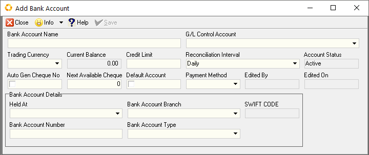
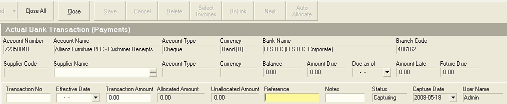

## Procedure Guideline
___  

This procedure describes how you can record details of payments that
have been made to suppliers in the Sense-i System so that the reports
displaying outstanding supplier balances and cash flow reports are
accurate.

1.  Click on the **Finance** item on the Main Menu.  

2.  Click on the **Bank Account** item on the Drop Down Menu.  

  

The system will display the **Maintain Bank Account** screen.  
This screen lists all of the Bank Accounts for your company that have 
been saved in the system.  

  

### Select Bank Account

The first step you need to take is to **select** the **specific bank account**
in which you wish to process supplier payments.  

1.  Click on the bank account in which you wish to capture payments and
    then click the **Transactions** button on the form bar.  

The system will open the **Maintain Bank Transaction** screen. This screen lists 
all of the transactions that have been captured in the selected bank account 
between the **From Date** and **To Date**.  

  

### Search  

To search for a specific transaction you can click on the 
**three dot drop-down button** under **Party Code** to select a company or 
person to whom a payment has been made or from whom a
payment has been received. You can also search for a specific
transaction by its transaction number, a date range, a reference or a
specific user name.  

1.  Once you have entered the search criteria, you can click on the
    **Search** button on the form bar.

The system will display a list of all of the records that match the
search criteria you have entered.  

### Add Payments  

1.  To enter details for a payment to a specific supplier, click on the
    **Add** button on the form bar and select the **Payment for Supplier**
    option.

The system will open a screen titled **Add New Supplier Payment** in which 
you can record the details of the payment.

2.  You need to select the name of the supplier for whom you wish record
    a payment. To do this, click on the **three dot drop-down** button under 
	the **Supplier code** field.

  

The system will display the **Select Supplier** List screen. This screen
enables you to select the name of a specific supplier from all the
suppliers who have been captured in the system.

3.  You can search for the name of a specific supplier by typing in a
    portion of their name in the **Name** field and then click the
    **Search** button on the form bar.

1.  Once you have found the name of the supplier for whom you wish to
    process a payment, click on the name of the supplier in the list and
    then click the **Select** button on the form bar.

The system will return you to the **Add New Supplier Payment** screen and display the
**Supplier Code** and **Supplier Name** in the relevant fields.

  

5. You can enter a reference number in the **Reference** field. This could
    be the number or month on a supplier's statement.  
	
1.	Select the **Payment Method**.	

1.  Enter a number for the payment in the **Transaction Number** field. If you are 
	processing an internet payment, enter the internet payment reference number in this field.

1. Enter the Effective Date of the payment by selecting a date from the
    drop down calendar in the **Effective Date** field.

1. Enter the amount of the payment in the **Transaction Amount** field.

1. You can enter a note in the **Notes** field.

  

11. Once you have entered the details of the payment to the supplier,
    click the **Save** button on the form bar.  
	
### Payment Allocation  

At this point you can either:

-   Allocate the saved payment to specific invoices or

-	You can enter another payment to the same or a different 
    supplier and allocate the payments to invoices
    at a later point in the process.

1.  To process another payment, click the **Next** button on the form bar.  

If you click the **Next** button the system will clear the fields and
enable you to enter another payment. To do this, simply repeat the steps above.

:::warning This section Forward to be updated.
:::	

2.  To allocate the entered and saved payment to specific invoices,
    click the **Select Invoices** button on the form bar.  
	
  

If you choose to allocate the payment you have entered to specific
invoices and have clicked the Select Invoices button the system will
open Accounts Payable Installment Screen. This screen lists all of the
invoices that have been received from the selected supplier that are
either completely or partially unpaid.

  

3.  Click on the invoices to which you wish allocate the saved payment
    in the grid. To select more than one invoice, hold down the Control
    key on the key board and then click on the invoices you wish to
    select.

1.  Once you have selected the invoices to which you wish to allocate
    the payment, click on the Select button at the bottom of the
    Accounts Payable Installments screen.

  

The system will return you to the Actual Bank Transaction screen and
display the invoices you have selected in the grid at the bottom of
the screen.

  

5.  You can apply specific amounts from the overall payment to each
    invoice by typing the amount you wish to apply to each invoice in
    the Applied Amount field. To move the cursor to the next invoice,
    simply press the down arrow on the keyboard and the system will
    select the next invoice in the list.

1.  You can also enter the amount of discount you wish to apply to each
    invoice by typing this amount in the Applied Discount field.

1.  The system can automatically apply the amount of the payment you
    have saved to each invoice from the oldest invoice to the most
    recent. To do this, simply click the AutoAllocate button on the form
    bar. Note that if the terms for the supplier have been set-up
    correctly the system will calculate the discount on each invoice and
    take this into consideration when applying the payment.

1.  To remove an invoice from the list click the UnLink button on the
    form bar.

1.  Once you have completed allocating the payment to the selected
    invoices click the Save button.

Repeat the above steps until you have completed capturing all the
necessary supplier payments.

10. Click the Close button on the form bar once you are finished.

**This is the end of the procedure**
