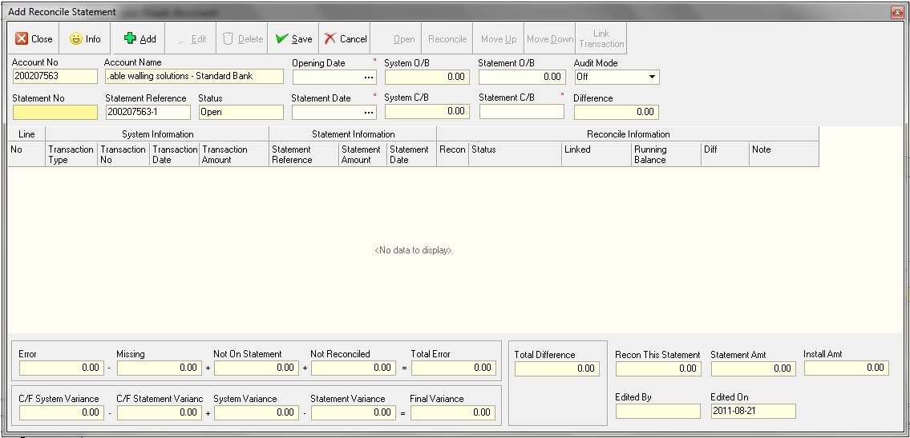
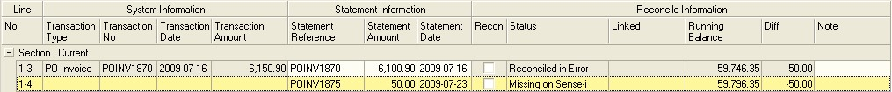

## Procedure Guideline
___  
The Bank Account Reconciliation function in the Sense-I system enables
you to compare the transactions captured in the system to those
reflected on the statements you receive for each of the company's bank
accounts.

Reconciling the transactions in the system to those on the statements
received enables you to identify any problems with the information
captured in the system and to identify and the correct any errors that
have been made (either by you in the system or by the bank).

To reconcile a bank account you need to perform the following steps...

1.  Click on **Finance** on the Main Menu.  

2.  Then select **Bank Account** from the drop down menu.

  

The system will open a screen titled **"Maintain Bank Account"**.

  

This screen lists all of the Bank Accounts or Cashbooks that you have defined in the system.  

The Maintain Bank Account screen has a **search panel** at the top that
you can use to control which Bank Accounts are displayed by the system
and a detail grid underneath that displays the information about each
Bank Account (such as the account code, name and current balance).  

3.  To reconcile a Bank Account, click on a row that contains the name
    of the Bank Account or Cashbook that you wish to reconcile.  

4.  Click the Reconcile button on the form bar.  

The system will open a screen titled "Reconcile Bank Account." This
screen lists all of the Reconciliations that have been performed for
the selected Bank Account.

  

The first time that you view the Reconcile Bank Account screen the
list will blank. Once you have reconciled the selected Bank Account
the summary for each of the previous reconciliations will be displayed
in the list.

5.  Click the **Add** button on the form bar.

The system will open a screen titled "Reconcile Bank Statement." This
screen enables you to enter information from the statement received
from the bank and compare it to the information captured in the
cashbook.

  

The first time you enter the Reconcile Bank Statement function for a
specific Bank Account you will notice that the system displays the
Bank Account Number and Name but that no information about dates and
balances.

The Opening Date and Balances and Closing Date and Balances are blank.

To start a reconciliations you need to enter the following information
in the header:  

6.  Enter the Opening Statement Date in the Opening Date field.  
**Set this to the DATE your SENSE-i software was installed for the 1st time.**  

7.  Enter the Opening Statement Balance in the Statement O/B field.  **SET THIS TO 0.00**  

8.  Enter the Statement No in the Statement No field. Each Bank
    Statement that you receive from the bank for the selected account is
    numbered and you should use that number.  

9.  Enter the Closing Date of the statement you are going to reconcile
    in the Statement  
	**SET THIS TO THE DAY IMMEDIATELY PRIOR TO THE FIRST MONTH YOU WISH TO PROCESS.**

Date field.  

  

10. Enter the final closing balance of the
    statement you are going to reconcile in the Statement C/B (Closing
    Balance) field.  

Once you click Save the system will retrieve the remaining information
such as the System Opening and Closing Balances from the database for
the dates you have entered and display these in the header of the
screen.

  

12. The status of the current reconciliation will show in the Status field.

The system will display a list of all open and unreconciled
transactions that make up the closing balance in the reconciliation
detail section of the screen.

  

You will notice too that the system displays a panel underneath the
list of all the transactions that need to be reconciled. This panel is
called the Reconciliation Footer and it displays the sum of all
transactions that have been included in the current reconciliation.  

  

To successfully reconcile a Bank Account, **you must focus on two
running balances simultaneously.**  

The system calculates the difference between the System Opening
Balance and the System Closing Balance and displays this in the
**Not Reconciled** field.  

For every system transaction that you include in the reconciliation,
the system adjusts this total.

The goal is for you to reduce the Not Reconciled Amount to zero by
marking each of the system transactions that are listed in the grid as
either Matched and Reconciled, Reconciled in Error, Missing on
Statement or linking the transaction to an open Statement record from
a previous Reconciliation.

The system also calculates the difference between the Statement
Opening Balance and the Statement Closing Balance and displays this
amount in the **Statement Variance** field.

The goal here is for you to ensure that the value of all the
transactions you enter in the Statement Amount column match the
calculated difference.

As you mark a system transaction as Matched and Reconciled, the system
will automatically insert the Transaction Amount in the system in the
Statement Amount column to save you the effort of having to enter each
amount.  

If the amount is different, you can double click on the Statement
Amount field and type in the amount as it appears on the Bank
Statement.

This would then be considered a Reconciled in Error transaction.

You can also include transactions that appear on the Bank Statement
but that have not been captured in Sense-I as "Missing on System".
This would allow you to enter the Transaction Number, Date and Amount
of such transactions as they appear on the Bank Statement, but the
corresponding columns in the System Information Band would remain
blank.

Any transaction entered as Missing on System would be included in the
Statement Variance calculation but would not be included in the value
of transactions needed to reconcile the System Balance.

:::note
When both the Not Reconciled Amount and the Statement Variance Amount are 0.00, then   
the account is ready to marked as Reconciled.  
:::

When reconciling a Bank Account, there are several different ways you
can reconcile the transactions that have been captured in Sense-I to
the Statement you receive from the bank.

These are:  
-   Direct Match
-   Reconciled In Error
-   Missing on Sense-i
-   Missing on Statement
-   Linked to Open Transaction Carried Forward
-   Linked to Another Transaction in the System
-   Linked to Another Transaction on the Statement

To reconcile the system transactions to those appearing on the Bank
Statement you will need to perform the following steps.  

It is a good to idea to place the Bank Statement on your desk and
place a ruler underneath the first transaction that appears on the
statement.

First, check the opening balance on the Bank Statement corresponds to
the Opening Balance displayed in the Statement O/B field on the
screen.

If it does, it is safe to proceed with the reconciliation. If it does
not, you will need to retrieve the Bank Statements for the previous
month and go back to the previous reconciliation in Sense-I and ensure
that the account is reconciled.

13. You then proceed to reconcile each transaction in the grid in one
of several ways...

To reconcile the Cashbook to the Bank Statement you need to match each
transaction in the system to the transactions listed on the printed
statement you have received.  

You should use the date, the transaction number (although this does
not always match) and the amount to match the system transaction to
those on the statement.

Identify the first transaction on the Bank Statement and place a ruler
underneath this transaction.

Look for a matching transaction with the same or similar date and
transaction number and an identical amount among the list of
transactions in the system.  

### Direct Match 

  

14. If you find a transaction on the Bank Statement where the
Transaction No, Date and Amount match, then the fastest way to
reconcile a record is to click on the record you wish to reconcile in
the reconciliation detail grid, position the cursor in the status
column and 

  

16. The system will copy the transaction number, transaction value and
    date from the system into the Statement Information column. This
    will save you from having to enter the information manually.  

17. The system also places a  in the Recon column and changes the
    status from Not Reconciled to Reconciled.  

18. The system will change the Difference amount to zero.  

The system will also move the transaction you have reconciled up in
the sequence and display a running balance.

The idea behind this feature is to ensure that the sequence in which
transactions appear in the reconciliation match the transactions on
the Bank Statement so that the running balances correspond.

:::note
This allows you easily identify at which point the reconciliation has
gone out of sync with a printed statement and makes finding an error
that may have occurred in the reconciliation process quick and
therefore easy to resolve.  
:::

### Reconciled In Error 

19. If you find a transaction on the statement where the Transaction No
    and Date match but the Amount is different, then position the cursor
    in the status column and  

20. Right click the mouse and select Match.  

  

21. The system will copy the transaction number, transaction value and
    date from the system into the Statement Information column.  

22. Position the cursor in the Statement Amount field for the
    transaction you are reconciling and double click the mouse. The
    system will then allow you to edit the Statement Amount. Change the
    amount to match the amount reflected on the Bank Statement.  

  

23. The system will change the status from Not Reconciled to Reconciled
    in Error.  

24. The system will change the Difference amount to show the difference
    between the Transaction Amount as it appears on the System from that
    on the Bank Statement.  

25. The system will again move the transaction you have reconciled up in
    the sequence and display a running balance.  

### Reconciled On Sense-i

26. If you find a transaction that appears on the Bank Statement but is
    not among the list of transactions in Sense-i.  

27. Right click the mouse and select Missing on Sense-i.  

  

The system will insert a row into the Reconciliation into which you
can enter the information as it appears on the Bank Statement. Because
this transaction is missing from the system, the System Information
columns for this row will remain blank until this transaction has been
resolved.  

  

28. Enter the Transaction Number for the missing transaction as it
    appears on the Bank Statement in the Statement Reference field.  

29. Enter the amount for the missing transaction as it appears on the
    Bank Statement in the Statement Amount field.  

30. Enter the date for the missing transaction as it appears on the Bank
    Statement in the Statement Date field.  

  

31. The system will change the status from Not Reconciled to Missing On
    Sense-i.  

32. The system will change the Difference amount to show the difference
    between the Transaction Amount as it appears on the System from that
    on the Bank Statement.  

33. The system will again move the transaction you have reconciled up in
    the sequence and display a running balance.  

:::note
You will need to investigate the reason for the transaction not appearing in
Sense-i and then take action to correct the mistake as well as take action
to prevent such errors from reoccurring in the future either the transaction
is legitimate but has not been captured in the System.  
:::

If this is the case then you need to obtain a copy of the original
transaction document and once you are satisfied that the transaction
is legitimate and correct, capture it in the system and then reconcile
it.

Or, if the transaction is not legitimate, enter a reason for this in
the Notes field. This reason will then print on the Cashbook
Reconciliation and you can email the Reconciliation to the Bank so
that they can correct their records.  

### Missing On Statement 

34. If you find a transaction that exists on Sense-I but does not appear
    on the Bank Statement, right click the mouse on the row containing
    this transaction and select Not on Statement.  

  

35. If you find a transaction on the statement where the Transaction No
    and Date match but the Amount is different, then position the cursor
    in the status column and

  

The system will insert a blank section in the Statement Information
columns because this transaction is missing from the Bank Statement.  

36. The system will set the Reconciliation Status to Not on Statement
    and will change the sort order of the records by moving this
    transaction up above the Not Reconciled Transactions.  

37. You will notice too that by Reconciling the Transaction as Not on
    Statement, the system includes the amount of the Transaction in the
    System Balance but not on the Statement Balance.  

### Linked Open Transaction

**Linked To Open Transaction Carried Forward**  

If any items remain with problems from the previous reconciliation,
such as transactions that were missing on either the system or a
previous Bank Statement (such as payments made but not reflected) and
any transactions have differences in amounts, that the system lists
these in the reconciliation detail in the Carried Forward section.  

  

The system provides a function that allows you to link transactions
from the current statement that have been captured after the closing
date of the previous statement or that have been created to correct
errors to the open transactions from the previous statement that still
need to be fully reconciled.  

38. Find the transaction in the current reconciliation that you wish to
    link to an open item carried forward from a previous reconciliation,
    right click the mouse and click Link.

  

The system will mark the transaction you have selected to link in pale
green.  

  

39. Click the row containing the original transaction that you wish to
    link the new transaction to, right click the mouse and select Link.  

  

The system will display the number of the original transaction to
which the new transaction has been linked in the Linked Column. You
will also notice two numbers in brackets behind the Linked Transaction
Number, such a 1-4. These numbers help you to easily find the linked
transaction. The first number indicates the Statement Reconciliation
Number and the second number the number of row containing the
transaction to which the new transaction has been linked.  

  

### Linked Transactions  

**Linked To Another Transaction on the System or the Statement**  

The system allows you to link many transactions on the system to many
transactions on the Bank Statement.

This is useful in cases where you might have a transaction you have
captured in the system that links to one or more transactions on the
Bank Statement.  

The system also allows you to link transactions on one side, either
the System or the Statement to other transactions on the same side.

For example, you might find a transaction on the System for R 500 but
on the Bank Statement for R 450.  

After doing an investigation you might find that the correct amount is
R 450. Because the Bank Statement is correct you would not expect to
find an adjustment transaction on their statement.  

You would need to capture a Journal in Sense-I to correct the error.

Thus you would have a transaction on the System for R 500 and a
Journal for -- R 50 and on the Bank Statement a single transaction for
R 450.  

You would therefore Reconcile the R 500 System transaction to the R
450 Bank Statement transaction, capture a Journal for the difference
and then link the -- R50 Journal to the System transaction of R 500
using the linking steps as described above.

A similar situation in reverse could apply to a mistake made on the
Bank Statement and you could treat this in the same way.

As part of resolving missing and error transactions you will sometimes
need to capture a Payments, Receipts and Bank Charges in the System
AFTER you have started a new Reconciliation.

:::note
Because these transactions will be captured after the Reconciliation was
started, they will not appear in the Reconciliation Detail Grid unless
you take steps to specifically include them in your reconciliation.  
:::                                    

The system has a function that enables you to include transactions
that you have captured after you have started reconciling a Bank
Account or Cashbook.  

40. To do this, click the Link Transaction button on the form bar.

The system will then display a list of all transactions that have been
captured in the system after you started the current reconciliation in
the Link Transactions screen.  

  

41. Simply click on the row containing the transaction you wish to pull
    into your reconcilation and then  

42. Click the select button on the form bar.  

43. The system will close the Link Transactions screen and return you
    the Reconcile Bank Account screen. You will find the transactions
    you have selected appear at the bottom of the list of transactions
    to reconcile.  

### Save / Close a Reconciliation

**Saving and closing a Reconciliation **

:::note
As you proceed with reconciling transactions in the Bank Account the
system will update the **Total Errors, Missing on System, Not on their
Statement** and **Reconciled totals** at the top of the screen.
:::

You will notice that once you reconcile a transaction, whether it is a
match, in error or a missing transaction, that the system moves the
transaction up in the list and sorts the transactions on the screen in
the order in which they were reconciled. The purpose of this is to
ensure that the transactions on the screen are listed in the same
sequence as they appear on the statement.

The system will recalculate the Statement Running Balance and display
this in the Running Balance column.

The Running Balance allows you to easily identify any transaction that
is preventing you from fully reconciling the selected Bank Account.

If, once you have completed reconciling the account the system balance
still does not match the final balance on the statement, you can
compare the running balance on the system to the balance on the
statement.

The moment you find that the running balances are not the same, you
know you have found a transaction that has not been correctly
reconciled or missed and you can then correct this.

You will notice that the system displayed a Not Reconciled and
Statement Variance amount at the bottom of the screen, and that if
these amounts are not 0.00, the system displays a colour in each of
these fields to highlight the difference.  

  

The system calculated the Not Reconciled amount as the sum of the
value of all the transactions in Sense-i that have dates that occur
after the Opening Date and before the Statement Date and that have not
been marked as reconciled in the current Reconciliation.

Each of the transactions that have been captured in Sense-i must
either be matched to a transaction on the Bank Statement or marked as
Not on Statement.

And transactions on the system that have not been marked in this way
will be included I the balance displayed in the Not Reconciled amount.

The system also calculates the difference between the last Running
Balance in the grid and the Statement C/B and displays this in the
Statement Variance field. You need to ensure that the final Running
Balance in the grid matches the Statement Closing Balance you entered
in step 13 above.

If you find that the Statement Variance is not 0.00, you must either
continue adding transactions to the Reconciliation that appear on the
Bank Statement but not your Reconciliation or you must remove
transactions that appear on the Reconciliation that do not exist on
the Bank statement.

Right click the mouse and select Remove to remove any such entries
that have been captured by mistake.

Once you have completed the Reconciliation and the Difference and
Reconciled Amounts in the header match and all the items on the
Statement and the System have been reconciled fully, in error or
missing transactions have been captured, then the account is fully
reconciled.  

44. You can save the Reconciliation at any stage.  

45. Click Save to save your work.  

46. To mark the Bank Account as reconciled, click the Reconcile button
    on the form bar.  

  

The system will ask you if you wish to mark the Bank Account as
reconciled.

  

47. Select Yes if the Account is fully reconciled.  

If the Bank Account has not been completely and accurately reconciled,
the system will present you with a warning message.  

  

You will need to return to the reconciliation and check the
transactions and balances.  

### New Reconciliation

**Starting a New Reconciliation For the Same Bank Account**  

48. To add another reconciliation for the same Bank Account or Cashbook,
    click the Add button.  

49. The system will open a new reconciliation, update the Statement
    Number and carry forward details from the previous reconciliation
    (such as Opening Dates and Balances) to the new reconciliation.  

50. You can also scroll back and forwards between each reconciled
    statement for the Bank Account on which you are working by clicking
    the left and right arrows that appear above the statement number
    field.  

  

51. When you have completed Reconciling the selected Bank Account, you
    can then elect to Close the screen by clicking the Close button on
    the form bar.  

The system will return you to the Maintain Bank Reconciliations Screen
and update the information in the grid with the Summary Reconciliation
information.  

52. You can now repeat the above steps to reconcile any other Bank
    Accounts or you can exit this function.  

### Previous Reconciliations

Opening Previous Reconciliations  

**The system allows you to Un-Reconcile a Bank Account at any point after it has been reconciled.**  

:::note
If subsequent periods exist that have already been reconciled these
will also be reopened.  
:::

The system requires that you reconcile Bank Accounts sequentially in
month order.  

You cannot skip any periods nor can you have Un-reconciled periods
interspersed between Reconciled periods.  

53. To re-open a Bank Reconciliation, click the Un-Reconcile button and
    then perform the steps to reconciling their account as outlined
    above.  

54. Once you have completed reconciling the Bank Accounts, click the
    Close button on the Form bar and the system will close the Reconcile
    Bank Account screen.  

**This is the end of the procedure.**
