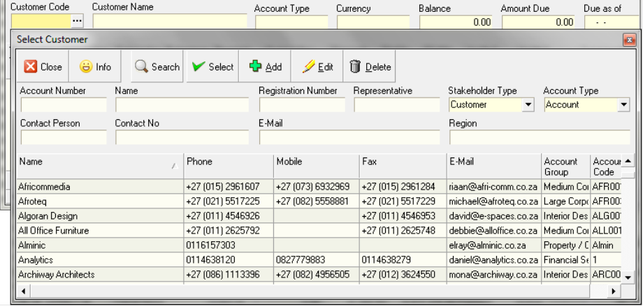

___ 
## Step-by-step Guideline

This procedure describes how you can record details of payments that
have been made by Customers in the Sense-I System so that the cashflow
reports and those displaying outstanding customer balances are
accurate and up-to-date.  

1.  Click **Finance** on the main menu.

2.  Select **Bank Account** from the drop down menu.

  

The system will display the Maintain Bank Account screen. This screen
lists all of the Bank Accounts for your company that have been saved
in the system.  

  

The first step you need to take is to select the specific bank account
in which you wish to process payments received from customers.  

3.  Click on the **bank account** in which you wish to capture payments and
    then click the **Transactions** button on the form bar.

The system will open the **Maintain Bank Transaction** screen. This screen
lists all of the transactions that have been captured in the selected
bank account between the From Date and To Date.  

  

To search for a specific transaction you can enter the name of the
company or person to whom a payment has been made or from whom a
payment has been received in the Party Name field.  

You can also search for a specific transaction by its transaction
number, a date range, a reference or a specific user name by entering
the values in the relevant field in the Search Panel.  

4.  Once you have entered the search criteria, you can click on the
    Search button on the form bar.  

The system will display a list of all of the records that match the
search criteria you have entered.  

5.  To enter details for a payment to a specific supplier, click on the
    Add Payments button on the form bar and then select the "Receipts
    for Customer" option.  

  

The system will open a screen in which you can record the details of
actual payments received from customers.  

  

6.  You need to select the name of the customer from whom you have
    received a payment. To do this, type the Account Code for the
    Customer in the Customer Code field or click on three dot button to
    view a list of Customers in the system.  

If you decide to select a Customer from the Customer List by clicking
on the three dot button in the Customer Code field the system will
display the Select Customer screen.  

This screen enables you to search for and select a specific Customer
Name from all the Customers who have been captured in the system.  

  

7.  You can search for the name of a specific Customer by typing in a
    portion of their name in the name field and then...  

8.  click the Search button on the form bar.  

9.  Once you have found the name of the Customer from whom you wish to
    process a payment, click on the name of the Customer in the list and
    then  

10. click the Select button on the form bar.  

The system will return you to the Add Customer Receipt screen and
display the name of the selected Customer in the Customer Name field.  

  

11. Select the Payment Method from the drop down list in the Payment
    Method field.  

12. Enter a number for the payment in the Transaction Number field. You
    should use the Payment Number as it appears on your Bank Statement
    for this number.  

13. Enter the Effective Date of the payment by selecting a date from the
    drop down calendar in the Effective Date field.  

14. Enter the amount of the payment in the Transaction Amount field.
    This is the Amount Net After Discount, in other words, the Amount as
    it appears on your Bank Statement.  

15. You can enter a reference number in the Reference field. This could
    be the number or month on a supplier's statement.  

  

16. Once you have entered the details of the payment to the supplier,
    click the Save button on the form bar.

At this point you can either:  

-   Allocate the saved payment to specific invoices or  

-   You can enter another payment to the same or a different supplier
    and allocate the payments to invoices at a later point in the
    process.

  

17. To process another payment, click the Next button on the form bar
    and then repeat steps 6 to 15 above.  

18. To allocate the entered and saved payment to specific invoices,
    click the Select Invoices button on the form bar.  

If you click the Next button the system will clear the fields and
enable you to enter another payment. To do this, simply repeat steps 6
to 15.  

  

If you choose to allocate the payment you have entered to specific
invoices and have clicked the Select Invoices button the system will
open Accounts Payable Installment Screen. This screen lists all of the
invoices that have been received from the selected supplier that are
either completely or partially unpaid.  

  

-   Click on the invoices to which you wish allocate the saved payment
    in the grid. To select more than one invoice, hold down the Control
    key on the key board and then click on the invoices you wish to
    select.  

-   Once you have selected the invoices to which you wish to allocate
    the payment, click on the Select button at the bottom of the
    Accounts Payable Installments screen.  

  

The system will return you to the Actual Bank Transaction screen and
display the invoices you have selected in the grid at the bottom of
the screen.  

  

-   You can apply specific amounts from the overall payment to each
    invoice by typing the amount you wish to apply to each invoice in
    the Applied Amount field. To move the cursor to the next invoice,
    simply press the down arrow on the keyboard and the system will
    select the next invoice in the list.  

-   You can also enter the amount of discount you wish to apply to each
    invoice by typing this amount in the Applied Discount field.  

-   The system can automatically apply the amount of the payment you
    have saved to each invoice from the oldest invoice to the most
    recent. To do this, simply click the AutoAllocate button on the form
    bar. Note that if the terms for the supplier have been set-up
    correctly the system will calculate the discount on each invoice and
    take this into consideration when applying the payment.  

-   To remove an invoice from the list click the UnLink button on the
    form bar.  

-   Once you have completed allocating the payment to the selected
    invoices click the Save button.  

Repeat the above steps until you have completed capturing all the
necessary supplier payments.  

-   Click the Close button on the form bar once you are finished.  

**This is the end of the procedure**
