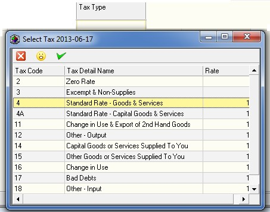

## Procedure Guideline
___ 

1.  Click on **Finance** on the Main Menu.  

2.  Then click the **Journal** item on the
    Sub-Menu.  
	
  

3.  The system will open a screen titled **"Maintain Journal."**
This screen lists all of the Journals that have already been captured in the
system within the **From** and **To Date** specified in the Search Panel.  
Note that you can change the information displayed in this list by
changing the dates and other information in the Search Criteria
Panel above the list of orders.

  

The columns on the Maintain Journal screen display key information
about each Journal that you can use to find and review each Journal
without opening the transaction in detail.  

  

4.  The system displays the effective date for each Journal that has
    been captured in the system. The effective date is the date on which
    the Journal Transaction will impact the Supplier's Account and
    account balance.  

It is possible to back date a Journal in the system provided the
Effective Date does not precede the latest Reconciliation Date for the
account and that the Accounting Period related to the Effective Date
is still open in the General Ledger.  

5.  The system displays Transaction Number assigned to each Journal in
    the Trans No field.  

1.  The system displays the name of the Supplier for whom the Journal
    has been captured in the Party Name field.  

1.  The system displays Supplier's Account Code in the Account Code
    field.  

1.  If the Journal Debits the Supplier's Account Balance, the system
    will display the Financial Value of the Journal in the Debit column.  

1.  If the Journal Credits the Supplier's Account Balance, the system
    will display the Financial Value of the Journal in the Credit
    column.  

1.  The system displays the Balance of the Journal Account in the
    Balance column.  

1.  The system displays the Type of Journal in the Type column.

The system posts a Journal to deal with any Settlement Discount taken
against a Supplier's Account with a system created Discount Journal.
Such Journals show in the Maintain Journal screen with the type of
**"Discount."**  

If the Journal is a manually created Journal, then the system displays
the Journal Type as **"Journal."**  

12. The system displays the status of each Journal in the Status column.

  

13. The system displays the Reconciliation Status in the Party Reconcile
    column. If the Transaction has been included in a Supplier
    Reconciliation, then the system will display a ? in the Party
    Reconcile column. Reconciled Journals cannot be modified. If the
    Journal has not been included in a Supplier Reconciliation, then the
    check box in the Party Reconcile column will be blank.  

1.  Any Reference entered on a Journal will be displayed in the
    Reference column. Usually a Journal Reference would contain an
    external document such as a Supplier's Voucher or Journal number.  

1.  The system displays any comments entered against the Journal in the
    Notes field.  

1.  The system displays the date on which the Journal was captured in
    the Capture Date column.  

1.  The system displays the name of the user who captured the journal in
    the Capture Opr column.  

  

  

18. To view the details of a Journal, double click on the row containing
    the Journal you wish to view.

  

  

19. Click the Close button to close the Journal Detail screen and return
    to the Maintain Journal screen to view a list of all the Journals
    that match the Journal Search criteria you have entered.  

## Add New Supplier Journal  

1.  To Add a new Supplier Journal, click the Add button on the Form Bar
    and

1.  Then select Supplier from the list of items on the Sub-Menu.  
	
  	

3.  The system will open a screen titled "Add New Supplier Journal."
    This screen enables you to select a specific Supplier, enter a Date,
    an Amount and a Description for the Journal and then to allocate the
	Journal Amount to one of more Accounts in the General Ledger.

  

4.  You will first need to select the name of the Supplier for whom you
    wish to capture this journal. Simply either type in the Account Code
    for the Supplier in the Supplier Code field or select the Supplier
    from a list of Supplier Names by clicking on the three-dot button in
    the Supplier Code field.  

1.  Enter a Reference for the Journal in the Reference field. This could
    be, for example, Rent -- May 2013.  

1.  Assign the Journal a Transaction Number. Ideally you should keep
    these sequential but you can also enter the Supplier's Document or
    Invoice Number in this field.  

1. Enter the date on which this Transaction became Effective. This is
    not the Capture Date but rather the Transaction Date. 
	So, if Rent is due on the 1st of the Month, then select **1 May** 
	from the drop down calendar.  

1. Enter the Amount of the Transaction in the Transaction Amount field.  

1. If you wish to add a Note to the Journal you can type this in the
    Note field.  

  

10. Once you have completed the header portion for the journal, click
    the yellow + button at the top of the form to add Accounts from the
    General Ledger to which you can allocate the amount of the journal.  

1.  Click the three-dot button in the right hand side of the Account
    Code field in the grid.  

1.  The system will open the Select Chart of Accounts screen. Enter the
    name of the Account to which you wish to allocate the Journal. For
    example, Rent.  

1.  Then click the Search button.  

1.  Then make sure the account you are about to select is correct by
    confirming it appears on the right statement and is either an Income
    or Expense account.  

1.  Then click the Select button.  

1.  Then you need to select the applicable Tax or VAT for this
    Transaction. Most often it Is code 4 -- Standard Rate -- Goods and
    Services.  
	
  	

17. Once you have selected the appropriate VAT code click the select
    button.  

1. Click the Select Button on the form bar.  

1. The system will display the VAT code you have selected in the
    Journal.  

  

20. Then enter the total VAT Inclusive Amount in the Bank Inclusive
    column.  

1. The system will calculate both the VAT and the VAT Exclusive Amounts
    and display these in the appropriate columns in the Journal.  

1. Click the Save button.  

1. The system will return you to the Maintain Supplier Journal Screen
    and you will see the Journal you have entered in the list.  

1. You might now wish to go to **[Aged Accounts Payable](4053)** and check
    that the Journal you have entered for the supplier appears in the
    list of outstanding payments.  

:::note
You should not use the Journal function to correct errors made with
capturing invoices, credit notes, payments and refunds. The Sense-i
system is sufficiently robust to allow you to delete transactions
under certain conditions. You can delete any active invoice, credit
note, payment and refund provided the Suppliers Account is not
reconciled, the Bank Account referencing the payments and refunds is
not reconciled, no subsequent transactions are linked to the
transaction you are trying to delete and the transaction you are
trying to correct has not been retrieved to the General Ledger.  
If you
have made an error and wish to correct, first check to see if these
conditions have not yet been imposed. If they have not, rather delete
the mistaken transaction to prevent your accounting records from
becoming clogged with mistakes and corrections.  

The Sense-i transaction
controls and audit trail reports will maintain the integrity of your
accounting information even if you delete a mistaken and unlinked open
transaction. Think of it as if the transaction has not yet been posted
while these conditions are still open.  

Only if the above conditions have been imposed and you cannot delete
an error transaction should you capture a journal for the purposes of
correcting an account. Journal should not be used for correcting
mistakes but rather for posting transactions that cannot be captured
using normal transaction. Journals should be used for capturing
information related to paying interest on overdue accounts for
example, or being charged a penalty for late completion or mistakes
with items supplied.  
:::  

**This is the end of this procedure.**
