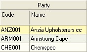
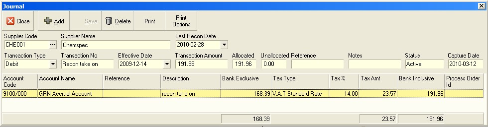
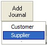
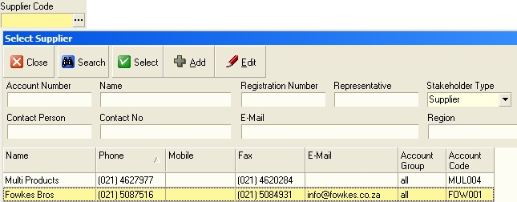
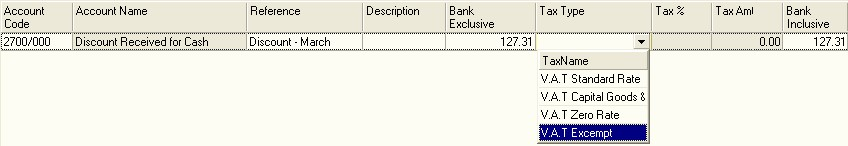

## Step-by-step Guideline
___  

1.  Click on the Finance option on the Main Menu.  

2.  Then click the Journal item on the drop down menu.  

The system will open a screen titled "Maintain Journal." This screen
lists all of the individual Journal Transactions that have been posted
in the company's database and that match the criteria specified in the
Search Panel at the top of the screen.  

  

The columns on the Maintain Journal screen display key information
about each Journal that you can use to find and review each Journal
without opening the transaction in detail.  

  

3.  The system displays the effective date for each Journal that has
    been captured in the system. The effective date is the date on which
    the Journal Transaction will impact the Supplier's Account and
    account balance.  

It is possible to back date a Journal in the system provided the
Effective Date does not precede the latest Reconciliation Date for the
account and that the Accounting Period related to the Effective Date
is still open in the General Ledger.  

4.  The system displays Transaction Number assigned to each Journal in
    the Trans No field.  

5.  The system displays the name of the Supplier for whom the Journal
    has been captured in the Party Name field.  

6.  The system displays Supplier's Account Code in the Account Code
    field.  

7.  If the Journal Debits the Supplier's Account Balance, the system
    will display the Financial Value of the Journal in the Debit column.  

8.  If the Journal Credits the Supplier's Account Balance, the system
    will display the Financial Value of the Journal in the Credit
    column.  

9.  The system displays the Balance of the Journal Account in the
    Balance column.  

10. The system displays the Type of Journal in the Type column.

The system posts a Journal to deal with any Settlement Discount taken
against a Supplier's Account with a system created Discount Journal.
Such Journals show in the Maintain Journal screen with the type of
**"Discount."**  

If the Journal is a manually created Journal, then the system displays
the Journal Type as **"Journal."**  

11. The system displays the status of each Journal in the Status column.

  

12. The system displays the Reconciliation Status in the Party Reconcile
    column. If the Transaction has been included in a Supplier
    Reconciliation, then the system will display a  in the Party
    Reconcile column. Reconciled Journals cannot be modified. If the
    Journal has not been included in a Supplier Reconciliation, then the
    check box in the Party Reconcile column will be blank.  

13. Any Reference entered on a Journal will be displayed in the
    Reference column. Usually a Journal Reference would contain an
    external document such as a Supplier's Voucher or Journal number.  

14. The system displays any comments entered against the Journal in the
    Notes field.  

15. The system displays the date on which the Journal was captured in
    the Capture Date column.  

16. The system displays the name of the user who captured the journal in
    the Capture Opr column.  

  

  

17. To view the details of a Journal, double click on the row containing
    the Journal you wish to view.

  

  

18. Click the Close button to close the Journal Detail screen and return
    to the Maintain Journal screen to view a list of all the Journals
    that match the Journal Search criteria you have entered.  

19. To add a new Journal click the Add Journal button.  

20. Then select the Supplier item from the list of options that the
    system displays underneath the Add Journal button.  
	
	

The system will open the Supplier Journal screen.

  

21. The first step in creating a Supplier Journal is to select the
    Supplier's Account from the Supplier Code field. Click the three-dot
    button in the Supplier Code field.  

The system will open the Select Supplier screen.  

  

22. You can enter the Account Code you have assigned to the Supplier in
    the Sense-I System in the Account Number field and  

23. then click the Search button.  

24. Or you can search for the Supplier by entering a portion of the
    Supplier's Company Name in the Name field using the % symbol, e.g.
    %Fow% to search for Fowkes Brothers and then click the Search
    button.  

25. Once you have found the Supplier's Account you need, click on the
    row containing this Supplier's name and account code.  

26. Then click the Select button on the form bar.  

The system will close the Select Supplier screen and display the
Account Code and Name of the Supplier you have selected in the
Supplier Code and Supplier Name fields on the Supplier Journal screen.  

  

27. You need to select a Transaction Type. The Transaction Type
    determines how the amount you are entering for the Journal is posted
    against the Supplier's Control Account. The system will use the
    opposite posting for the General Ledger Journal Account you select.
    So if you Select Debit in the Transaction Type field, the system
    will Debit the Supplier's Account and Credit the General Ledger
    account you choose in the Journal detail below.  

28. Enter a Number for the Transaction in the Transaction No field.  

29. Select the Effective Date for the Transaction from the drop down
    Calendar in the Effective Date field.  

30. Enter the Total Amount to be Debited or Credited to the Supplier's
    Account in the Transaction Amount field.  

31. Enter a Reference if required in the Reference field.  

Once you have entered the information about the Journal, you need to
allocate the balance leg of the Journal to the appropriate General
Ledger Account.  

32. To do this, click the Add button.

The system will display a blank row in the Journal Detail section of
the Supplier Journal screen.  

33. You can enter the General Ledger Account Code to which you wish to
    allocate the second leg of the Journal by typing the appropriate
    Account Number in Account Code field.  

34. Or, you can search for the correct General Ledger Account by
    clicking on the three dot button on the right hand edge of the
    Account Code field and then entering a portion of the General Ledger
    Account Name in the Account Name field using the % symbol, e.g.
    %Discount% to search for all Accounts in the Chart of Accounts that
    contain the word Discount  

35. and then click the Search button.  

36. Once you have found the correct General Ledger Account you need,
    click on the row containing this account and  

  

The system will close the Select General Ledger Account screen and
display the Account Code and Name of the General Ledger Account in the
grid.  

  

38. Enter a Reference for this portion of the Journal if appropriate in
    the Reference column.  

39. Enter a Description for this portion of the Journal in the
    Description field.  

40. Enter the Journal Amount Excluding Tax in the Amount Exclusive
    column. If the Journal is not affected by Tax then this amount would
    not differ from the Amount Inclusive.  

41. If Tax is applicable to the Journal select the appropriate Tax Type
    from the list of Tax Types in the Tax Type column.  

The system will display the selected Tax Type, Tax % and calculated
Tax Amount in the various Tax columns.  

42. The system will display the Tax Inclusive amount in the Amount
    Inclusive field.  

You can repeat steps 32 to 42 if the Journal has more than one leg
posted in the General Ledger.  

43. Once you have entered the details of the Journal, click the Save
    button on the form bar.

  

44. Click the Close button to close the Journal Detail screen and return
    to the Maintain Journal screen to view a list of all the Journals
    that match Search criteria.  

45. The system will display the summary information for the Supplier
    Journal you have entered in the system in the grid.  

  

46. Click the Close button to close the Maintain Journal screen and
    return to the main menu.  

:::note
You should not use the Journal function to correct errors made with
capturing invoices, credit notes, payments and refunds. The Sense-i
system is sufficiently robust to allow you to delete transactions
under certain conditions. You can delete any active invoice, credit
note, payment and refund provided the Suppliers Account is not
reconciled, the Bank Account referencing the payments and refunds is
not reconciled, no subsequent transactions are linked to the
transaction you are trying to delete and the transaction you are
trying to correct has not been retrieved to the General Ledger.  
If you
have made an error and wish to correct, first check to see if these
conditions have not yet been imposed. If they have not, rather delete
the mistaken transaction to prevent your accounting records from
becoming clogged with mistakes and corrections.  

The Sense-i transaction
controls and audit trail reports will maintain the integrity of your
accounting information even if you delete a mistaken and unlinked open
transaction. Think of it as if the transaction has not yet been posted
while these conditions are still open.  

Only if the above conditions have been imposed and you cannot delete
an error transaction should you capture a journal for the purposes of
correcting an account. Journal should not be used for correcting
mistakes but rather for posting transactions that cannot be captured
using normal transaction. Journals should be used for capturing
information related to paying interest on overdue accounts for
example, or being charged a penalty for late completion or mistakes
with items supplied.  
:::

**This is the end of the procedure.**  
