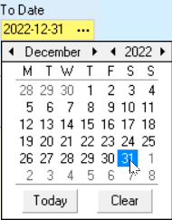
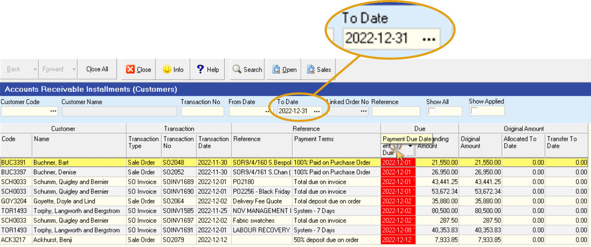
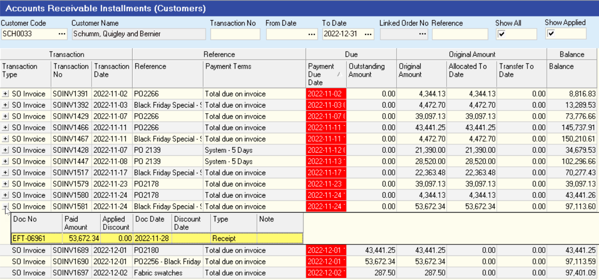

## Procedure Guideline
___  

Installments are either amounts due from customers as deposits against Sales Orders or amounts due on invoices or statements sent to customers.  

The **AR _(Accounts Receivable)_ Open Installment** screen in Sense-i displays a list and the details of each of these amounts.  

Note that all transactions that have been fully settled are excluded from the list.  

1.  Click on **Finance** on the main menu.  

2.  Click **Customers** on the drop down menu.  

3.  Click **AR Open Installment** on the side menu.  

  

The system will display the **Accounts Receivable Installments (Customers)** screen.  

  

This screen will enable you to view a list and the details of all customer
installments that remain unpaid.  

The system does not display any information until you have entered
**Search** options, e.g. a date in the **To Date** field.  

### Search Options  

1.  Click on the **To Date** field and then select a closing date for the report from the drop down **calendar**.  
	
  

2.  Then click the **Search** button on the form bar.  

The system will display a list of all unpaid installments that were due for payment before the **To Date** you entered above.  

  

3.  Click on the **Payment Due Date** column to have the system sort all the installments in the screen in date order.  

4.  If you change the **To Date** in the search frame at the top of the screen to an earlier date and then click the Search button again, you will notice that any installments that were on the screen and were due for payment _**after**_ the **To Date** you have now entered, will no longer appear on the screen.  

:::tip  
Setting the **To Date** enables you to immediately view a list of all payments outstanding and due to a specific date. Remember that all transactions that have been fully settled are excluded from the list.  
:::  

5.  You can filter the list of installments in the screen to show only those installments that are outstanding for a specific customer. To do this, enter the customer's account code in the **Customer Code** field in the search panel. You can also click on the **three-dot button** in the **Customer Code** field and search for a specific supplier by name using the pop-up **Select Customer** window.  
	
  

6.  Clicking the **Show All** option will cause the system to list all transactions for the selected customer that occur within the **From Date** and the **To Date** selected in the search panel.  
	
  

The **"Show All"** option will also display the details of each installment, including the **Cancelled Value** of each transaction as a separate row.  
	
:::note  
When **Show All** remains unchecked, then the system combines the value of the original installment with the value of any cancelled transactions and displays only the net amount outstanding for each transaction on a single row.  
:::  

7.  Clicking the **Show Applied** option will cause the system to list the details of any payments that have been allocated to each of partially paid installments.  

  

You will notice a **"+"** sign appears next to the **Transaction Type** on each row where more detail exists for a specific transaction.  

### Information Displayed  

**Understanding the on-screen Information**  

The system displays a comprehensive list of information about each of the outstanding installments in the various columns on the screen.  

  

1.  The customer's account code is displayed in the **Code** column.  

2.  The name of the customer is displayed in the **Customer Name** column.  

3.  The transaction type that caused the installment is displayed in the **Transaction Type** column.  

:::note  
The installment can be caused by a deposit that needs be paid when issuing a Sales Order, then the **Transaction Type** will be **Sales Order** or\...  

The installment can be caused by an invoice sent to a customer, then the **Transaction Type** will be **SO Invoice**.  
:::  

4.  The system displays the transaction number in the **Transaction No** column.  
This allows you to find the Sales Order or Sales Order Invoice that has caused the installment to be created.  

5.  The system displays the date of the transaction in the  **Transaction Date** column. This is not the date on which the payment is due but rather the date on which either the Sales Order or the Sales Order Invoice was created.  

6.  Any additional reference number, such as an internal order number or job number that was captured on the Sales Order or Sales Order Invoice is displayed in the **Reference** column.  

7.  The system displays the Term Detail Name in the **Payment Terms** column.  
This is the rule in the payment terms that created the installment displayed in the list.  
---

  

8.  The system displays the date on which the installment is due to be paid in the **Payment Due Date** column.  

9.  The system displays the amount still to be paid, _(that is the Original Installment Amount **minus** Payments Made To Date)_ in the **Outstanding Amount** column.  

10. If any discount is available to be taken for early payment, the system displays the date by which payment must be made to qualify for the discount in the **Discount Date** column.  

11. The system calculates the discount available as a percentage of the total installment and displays this in the **Eligible Discount %** column.  
	
:::note 
The Eligible Discount is based on what discount can taken if the payment 
is made **prior** to the **Discount Date**.  
The Eligible Discount % changes to **"0 %"** if a payment is late.  
:::

12. The system displays the value of the discount available in the **Eligible Discount** column.  

13. The system displays the number of days to go before the payment is due.  
**If the payment is late**, this figure will be a **negative value**.  
---

  

14. The system displays the original amount of the installment in the
    **Original Amount** column.  

15. The system displays the original discount amount in the 
	**Original Discount** column.  

16. The system displays the total value of the payments made and
    allocated to the installment in the **Allocated To Date** column.  

17. The system displays the total value of the discounts taken against
    the installment in the **Discount To Date** column.  

You can use the normal techniques for displaying the information in
the screen in a way that suits your purpose to sort and filter
installment details.  
Refer to the document titled **["Customising Information Display"](https://sense-i.co/docs/LST004)**.  

**This is the end of this procedure.**
