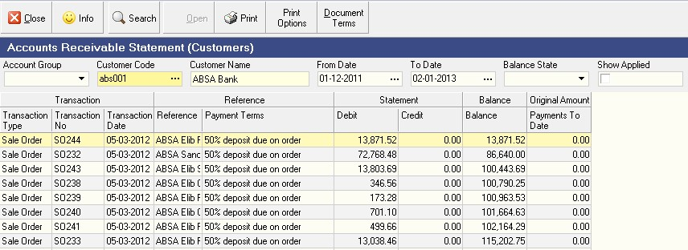
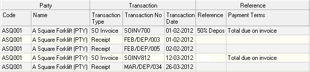

## Procedure Guideline

### Introduction

**What is the Purpose of this procedure?**

The purpose of this procedure is to describe the steps you need to
take to generate a report of that lists all transactions that have
occurred between the Company and its Customers. This document, called
a Customer Statement, is generated for each customer and sent to each
customer to provide them with a guide for making payments to the
company by showing them what transactions have been captured and what
transactions are due to be paid.

**When would you use this procedure?**

You would use this procedure either during the course of a month if
you were querying the status of a customer's account and then at the
end of the month you would generate statements for all customers to
advise them what payments they will need to make during the coming
period.  

### Step-By-Step Guideline
___ 

To generate a Customer Statement perform the following steps...

1.  Click **Finance** on the main menu.

2.  Click **Customers** on the drop down menu.

3.  Select **AR Statement _(for Accounts Receivable)_** on the side menu.

  

The system will open a screen titled **"Accounts Receivable Statement."**
This provides you with a set of criteria that you can use to filter
the information that will be used to generate Customer Statements.  

  

You will notice that as you enter the screen there is no information
displayed. This prevents the system from running unnecessary queries
and instead you need to enter some information in the search panel at
the top of the screen before the system will display any information
in the report.  

### Search Options  

**Using the Search Options in the Search Panel**

4.  You can filter the list of transactions in the Accounts Receivable
    Statement screen to show only those transactions that belong to a
    specific CUSTOMER GROUP. To do this select one Customer Group from
    the drop down list of Account Groups.  

5.  You can also choose to view only those transactions that occur for a
    specific customer. To do this, enter the customer's account code in
    the Customer Code field in the search panel. You can also click on
    the three-dot button in the Customer Code field and search for a
    specific customer by name using the pop-up Select Customer window.  

6.  You can choose to view only those transactions that occur AFTER a
    specific date. To do so select the starting date from the drop down
    calendar that is displayed in the From Date field.  

7.  You can choose to exclude transactions that occur AFTER a specific
    date. To do so select the ending date from the drop down calendar
    that is displayed in the To date field.  

8.  When you have entered specific information in the Search Panel,
    click the Search button on the form bar. Note that you can also
    choose to click the Search button without entering any information
    in the Search Panel and the system will then display all the
    information related to Customer transactions on the screen.  

### On-screen Information  

**Understanding the Information in the Screen**

The system displays a comprehensive list of information about the
various transactions captured against each customer's account in the
columns on the screen.  

  

9.  The customer's account code is displayed in the Code column.  

10. The name of the customer is displayed in the Customer Name column.  

11. The transaction type is displayed in the Transaction Type column.  

The instalment can be caused by a deposit that needs be paid when
placing a Purchase Order, then the Transaction Type will be SO or\...  

The instalment can be caused by an invoice received from a customer,
then the Transaction Type will be SO Invoice.  

A payment received from a customer is assigned a Transaction Type of
Receipt.  

12. The system displays the transaction number in the Transaction No
    column. This allows you to easily find any transaction that has been
    captured against that customer's account.  

13. The system displays the date of the transaction in the Transaction
    Date column.  

14. Any additional reference number, such as an internal order number or
    job number that was captured on the Sales Order or Sales Order
    Invoice is displayed in the Reference Number column.  
	
  

15. The system displays the Term Detail
    Name in the Payment Terms column. This is the rule in the payment
    terms that created the instalment displayed in the list.  

16. The system displays any transaction that increased the customer's
    account balance in the Debit column.  

17. The system displays any transaction that decreased the customer's
    account balance in the Credit column.  

18. The system displays the running balance after each debit or credit
    transaction in the Balance column.  

19. The system display information about any payments made to date
    against a specific installment in the Payments to Date column.  

### Print Customer Statement  

20. To print a statement for the customer, click the Print button on the
    form bar and  

21. then click the Customer Statement menu item.  

  

22. The system displays the statement in a Print Preview window.  

  

You can choose to either print, fax or email the statement to the
customer.  

23. If you decide that you wish to email the Statement to the customer
    you can create a PDF copy of the Statement and then attach it to an
    email. To do this click the PDF button on the top of the Print
    Preview screen.  

24. To simply Print the Sales Quote, click the Printer Icon.  

25. To close this screen, click the close button at the top of the
    screen.  

**This is the end of this procedure.**
