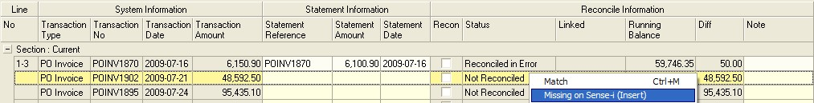
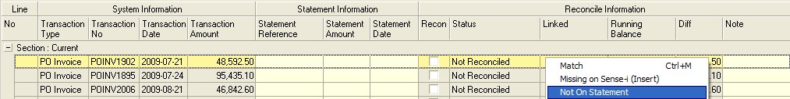
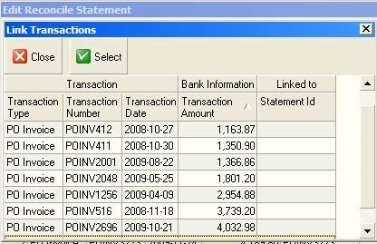

## Step-by-step Guideline
___ 

The Account Reconciliation function in the Sense-i system enables you
to compare the transactions captured in the system to those reflected
on the statements you receive from your suppliers. Reconciling the
transactions in the system to those on the statements received enables
you to identify any problems with the information captured in the
system and to identify and the correct any errors that have been made
(either in Sense-i or by the Supplier) before you make payments to
your suppliers.  

To reconcile a supplier's account / bank account you need to perform
the following steps...  

1.  Click on the **Finance** option on the Main Menu.  

2.  Then click the **Supplier** menu item on the drop down menu.  

3.  Then select the **Reconcile Account** option on the side menu.  

  

The system will open a screen titled "Maintain Supplier
Reconciliation." This screen lists all of the Suppliers that have
outstanding balances in the system and shows summary reconciliation
information related to each Supplier's Account. In addition, the
screen provides the details of the last reconciliation completed for
each of these suppliers. To show all suppliers, including those with
no outstanding transactions, select the All option from the Show
field.  

  

The Reconcile Suppliers' Account screen has a search panel at the top
that you can use to control which Supplier's Accounts are displayed by
the system and a detail grid underneath that displays the information
about each Supplier, (such as their code and name) and totals related
to system balances, supplier statement balances and reconciliation
differences.  

You can show only reconciliation for information with Suppliers who
have Outstanding Balances, or Zero Balances or you can include both by
selecting the appropriate option in the System Balance drop down.  

4.  To reconcile a Supplier's Account, click on a row that contains the
    name of the Supplier whose account you wish to reconcile.  

5.  Click the Add button on the form bar.  

The system will open a screen titled "Reconcile Supplier's Account."
This screen enables you to enter information from the statement
received from the Supplier and compare it to the information captured
in the system.  

The first time you enter the Reconciliation function for a specific
supplier you will notice that the system displays the Supplier Code
and Name but that no information about dates and balances is displayed
in the header. The Opening Date and Balances and Closing Date and
Balances are blank.  

  

To start a reconciliations you need to enter the following information
in the header:  

6.  Enter the Opening Statement Date in the Opening Date field.  
    **SET THIS TO THE START OF SENSE-i.**  

7.  Enter the Opening Statement Balance in the Statement O/B field. 
	**SET THIS TO 0.00**  

8.  Enter the Statement No in the Statement No field. If the supplier
    does not number the statements they send for your company's account,
    simply enter the number 1 in this field for the first statement that
    you reconcile.  

9.  Enter the Closing Date on the first statement you are going to
    reconcile in the Statement Date field.  
	**SET THIS TO THE DAY IMMEDIATELY PRIOR TO THE FIRST MONTH YOU WISH TO PROCESS.**

10. Enter the final closing balance on the first statement you are going
    to reconcile in the Statement C/B (Closing Balance) field.  

11. Click the Save button on the form bar.  

Once you click Save the system will retrieve the remaining information
such as the System Opening and Closing Balances from the database for
the dates you have entered.  

  

12. The status of the current reconciliation will show in the Status
    field.  

The system will display a list of all open and unreconciled
transactions that make up the closing balance in the reconciliation
detail section of the screen.  

  

13. The system will display the following information related to the
    last reconciliation in the header panel.  

14. The Account Number assigned to the Supplier in the Account Number
    field.  

15. The Name of the Supplier in the Supplier Name field.  

16. The date on which this specific Supplier's Account was last
    reconciled in the Opening Date field. If this is the first time,
    this field will show a -.  

17. The balance as per the supplier\'s statement if the account was
    previously reconciled in the Statement O/B (for Opening Balance)
    field. If this is the first time the account is being reconciled the
    field will show a -.  

You will notice too that the system displays a panel underneath the
list of all the transactions that need to be reconciled. This panel is
called the Reconciliation Footer.

The Reconciliation Footer displays the sum of all transactions that
have been included in the current reconciliation.

  

To successfully reconcile a Supplier's Account, you must focus on two
running balances simultaneously.  

The system calculates the difference between the System Opening
Balance and the System Closing Balance and displays this in the Not
Reconciled field. For every system transaction that you include in the
reconciliation, the system adjusts this total. The goal is for you to
reduce the Not Reconciled Amount to zero by marking each of the system
transactions that are listed in the grid as either Matched and
Reconciled, Reconciled in Error, Missing on Statement or linking the
transaction to an open Statement record from a previous
Reconciliation.  

The system also calculated the difference between the Statement
Opening Balance and the Statement Closing Balance and displays this
amount in the Statement Variance field. The goal here is for you to
ensure that the value of all the transactions you enter in the
Statement Amount column matches the calculated difference. As you mark
a system transaction are Matched and Reconciled, the system will
automatically insert the Transaction Amount in the system in the
Statement Amount column to save you the effort of having to enter each
amount. If the amount is different, you can double click on the
Statement Amount field and type in the amount as it appears on the
Supplier's Statement. This would then be considered a Reconciled in
Error transaction. You can also include transactions from the
Supplier's Statement without changing the System Balance by marking a
transaction as Missing on System. This would allow you to enter the
Transaction Number, Date and Amount in the Supplier's Statement
columns but the corresponding columns in the System Information Band
would remain blank. Any transaction entered as Missing on System would
be included in the Statement Variance calculation but would not be
included in the value of transactions needed to reconcile the System
Balance.  

When both the Not Reconciled Amount and the Statement Variance Amount
are 0.00, then the account is ready to marked as Reconciled.

When reconciling a Supplier's Account, there are several different
ways you can reconcile the transactions in Sense-I to the Statement
you receive from a Supplier. There are:

-   Direct Match
-   Reconciled In Error
-   Missing on Sense-i
-   Missing on Statement
-   Linked to Open Transaction Carried Forward
-   Linked to Another Transaction in the System
-   Linked to Another Transaction on the Statement

To reconcile the system transactions to those appearing on the
statement received from the supplier you will need to perform the
following steps.  

It is a good to idea to place the Supplier's Statement on your desk
and place a ruler underneath the first transaction that appears on
their statement.  

First, check the opening balance on the statement received from the
Supplier corresponds to the Opening Balance displayed in the Statement
O/B field on the screen. If it does, it is safe to proceed with the
reconciliation. If it does not, you will need to retrieve the
statement received from the supplier for the previous month and go
back to the previous reconciliation in Sense-I and ensure that the
account is reconciled.  

18. You then proceed to reconcile each transaction in the grid in one of
    several ways...  

To reconcile the Supplier's Account you need to match each transaction
in the system to the transactions listed on the printed statement you
have received. You should use the date, the transaction number
(although this does not always match) and the amount to match the
system transaction to those on the statement.  

Identify the first transaction on the Supplier's Statement and place a
ruler underneath this transaction.  

Look for a matching transaction with the same or similar date and
transaction number and an identical amount among the list of
transactions in the system.  

  

19. If you find a transaction on the statement where the Transaction No,
    Date and Amount match, then the fastest way to reconcile a record is
    to find the record you wish to reconcile in the reconciliation
    detail grid, position the cursor in the status column and  

20. Right click the mouse and select Match.  

  

21. The system will copy the transaction number, transaction value and
    date from the system into the Supplier Reconcile information column.
    This will save you from having to enter the information manually.  

22. The system also places a  :ballot_box_with_check: in the Recon column and changes the
    status from Not Reconciled to Reconciled.  

23. The system will change the Difference amount to zero and will move
    the transaction you have reconciled up in the sequence and display a
    running balance.  

The idea behind this feature is to ensure that the sequence in which
transactions appear in the reconciliation match the transactions on
the supplier\'s statement so that the running balances correspond.  

This allows you easily identify at which point the reconciliation has
gone out of sync with a printed statement and makes finding an error
that may have occurred in the reconciliation process quick and
therefore easy to resolve.  

### Reconciled In Error 

24. If you find a transaction on the statement where the Transaction No
    and Date match but the Amount is different, then position the cursor
    in the status column and  

25. Right click the mouse and select Match.  

  

26. The system will copy the transaction number, transaction value and
    date from the system into the Supplier Reconcile information column.  

27. Position the cursor in the Statement Amount field for the
    transaction you are reconciling and double click the mouse. The
    system will then allow you to edit the Statement Amount. Change the
    amount to match the amount reflected on the Supplier's Statement.  

  

28. The system will change the status from Not Reconciled to Reconciled
    in Error.  

29. The system will change the Difference amount to show the difference
    between the Transaction Amount as it appears on the System from that
    on the Supplier's Statement.  

30. The system will again move the transaction you have reconciled up in
    the sequence and display a running balance.  

### Reconciled On Sense-i  

31. If you find a transaction that appears on the Supplier's Statement
    but is not among the list of transactions in Sense-i,  

32. Right click the mouse and select Missing on Sense-i.  

  

The system will insert a row into the Reconciliation into which you
can enter the information as it appears on the Supplier's Statement.
Because this transaction is missing from the system, the System
Information columns for this row will remain blank until this
transaction has been resolved.  

  

33. Enter the Transaction Number in the Statement Reference field. This
    will normally be either the Supplier's Invoice No, Credit Note No, a
    Journal No, a Payment or Discount Transaction No.  

34. Enter the amount as it appears on the Statement in the Statement
    Amount field.  

35. Enter the date for the missing transaction as it appears on the
    Supplier's Statement in the Statement Date field.  

  

36. The system will change the status from Not Reconciled to Missing On
    Sense-i.  

37. The system will change the Difference amount to show the difference
    between the Transaction Amount as it appears on the System from that
    on the Supplier's Statement.  

38. The system will again move the transaction you have reconciled up in
    the sequence and display a running balance.  

You will need to investigate the reason for the transaction not
appearing in Sense-i. Either the transaction is legitimate but has not
been captured in the System. If this is the case then you need to
obtain a copy of the original transaction document, match it to an
authorisation, (usually a Purchase Order and Purchase Order Receipt)
and once you are satisfied that the transaction is legitimate and
correct, capture it in the system and then reconcile it.  

Or, if the transaction is not legitimate, enter a reason for this in
the Notes field. This reason will then print on the Supplier's
Reconciliation and you can email the Reconciliation to the Supplier so
that they can correct their records.  

### Missing On Statement 

39. If you find a transaction that exists on Sense-I but does not appear
    on the supplier's statement, right click the mouse on the row
    containing this transaction and select Not on Statement.

  

40. If you find a transaction on the statement where the Transaction No
    and Date match but the Amount is different, then position the cursor
    in the status column and  

  

The system will insert a blank section in the Supplier's Statement
columns because this transaction is missing from their Statement.  

41. The system will set the Reconciliation Status to Not on Statement
    and will change the sort order of the records by moving this
    transaction up above the Not Reconciled Transactions.  

42. You will notice too that by Reconciling the Transaction as Not on
    Statement, the system includes the amount of the Transaction in the
    System Balance but not on the Supplier Balance.  

The system will insert a blank section in the Supplier's Statement
columns because this transaction is missing from their Statement.  

### Linked To Open Transaction Carried Forward 

If any items remain with problems from the previous reconciliation,
such as transactions that were missing on either the system (such as
invoices and credit notes not received) or the supplier's statement
(such as payments made but not reflected) and any transactions have
differences in amounts, that the system lists these in the
reconciliation detail in the Carried Forward section.  

  

The system provides a function that allows you to link transactions
from the current statement that have been captured after the closing
date of the previous statement or that have been created to correct
errors to the open transactions from the previous statement that still
need to be fully reconciled.  

43. Find the transaction in the current reconciliation that you wish to
    link to an open item carried forward from a previous reconciliation,
    right click the mouse and click Link.

  

The system will mark the transaction you have selected to link in pale
green.  

  

44. Click the row containing the original transaction that you wish to
    link the new transaction to, right click the mouse and select Link.  

  

  

The system will display the number of the original transaction to
which the new transaction has been linked in the Linked Column. You
will also notice two numbers in brackets behind the Linked Transaction
Number, such a 1-4. These numbers help you to easily find the linked
transaction. The first number indicates the Statement Reconciliation
Number and the second number the number of row containing the
transaction to which the new transaction has been linked.  

  

### Linked To Another Transaction on the System / Statement  

The system allows you to link many transactions on the system to many
transactions on the supplier's statement. This is useful in cases
where you might have an invoice on the system with a journal to
correct an error that links to one or more transactions on the
Supplier's Statements, also for example an invoice with adjustments or
journals to correct mistakes.  

The system also allows you to link transactions on one side, either
the System or the Statement to other transactions on the same side.
For example, you might find an Invoice on the System for R 500 but on
the Statement for R 450. After doing an investigation you might find
that the correct amount is R 450. Because the Supplier's Statement is
correct you would not expect to find an adjustment transaction on
their statement. You would need to capture a Journal in Sense-I to
correct the error. Thus you would have on the System an Invoice for R
500 and a Journal for -- R 50 and on the Supplier's Statement an
Invoice for R 450. You would therefore Reconcile the R 500 System
Invoice to the R 450 Statement Invoice, capture a Journal and then
link the -- R50 Journal to the System Invoice of R 500 using the
linking steps as described above.  

A similar situation in reverse could apply to a mistake made on the
Supplier's Statement and you could treat this in the same way.  

As part of resolving missing and error transactions you will sometimes
need to capture an Invoice, Credit Note, Journal or Payment in the
System.  

Because these transactions will be captured after the Reconciliation
was started, they will not appear in the Reconciliation Detail Grid
unless you take steps to specifically include them in your
reconciliation.  

The system allows you to include transactions that you have captured
after you have started a reconciliation in the reconciliation with
which you are busy.  

45. To do this, click the Link Transaction button on the form bar.  

The system will then display a list of all transactions that have been
captured in the system after you started the current reconciliation in
the Link Transactions screen.  

  

46. Simply click on the row containing the transaction you wish to pull
    into your reconcilation and then  

47. Click the select button on the form bar.  

48. Once you have matched a transaction on the Supplier / Bank Account
    to one on the system places a tick next to the transaction in the
    Recon column.  

### Saving and closing a Reconciliation  

As you proceed with reconciling transactions the system will update
the Total Errors, Missing on System, Not on their Statement and
Reconciled totals at the top of the screen.

You will notice that once you reconcile a transaction, whether it is a
match, in error or a missing transaction, that the system moves the
transaction up in the list and sorts the transactions on the screen in
the order in which they were reconciled. The purpose of this is to
ensure that the transactions on the screen are listed in the same
sequence as they appear on the statement.  

The system will recalculate the Statement Running Balance and display
this in the Running Balance column. The Running Balance allows you to
easily identify any transaction that is preventing you from fully
reconciling the selected Supplier's Account. If, once you have
completed reconciling the account the system balance still does not
match the final balance on the statement, you can compare the running
balance on the system to the balance on the statement. The moment you
find that the running balances are not the same, you know you have
found a transaction that has not been correctly reconciled or missed
and you can then correct this.  

You will notice that the system displayed a Not Reconciled and
Statement Variance amount at the bottom of the screen, and that if
these amounts are not 0.00, the system displays a colour in each of
these fields to highlight the difference.  

  

The system calculated the Not Reconciled amount as the sum of the
value of all the transactions in Sense-i that have dates that occur
after the Opening Date and before the Statement Date and that have not
been marked as reconciled in the current Reconciliation.  

Each of the transactions that have been captured in Sense-i must
either be matched to a transaction on the Supplier's statement or
marked as Not on Statement. And transactions on the system that have
not been marked in this way will be included I the balance displayed
in the Not Reconciled amount.  

The system also calculates the difference between the last Running
Balance in the grid and the Statement C/B and displays this in the
Statement Variance field. You need to ensure that the final Running
Balance in the grid matches the Statement Closing Balance you entered
in step 13 above.  

If you find that the Statement Variance is not 0.00, you must either
continue adding transactions to the Reconciliation that appear on the
Supplier's Statement but not your Reconciliation or you must remove
transactions that appear on the Reconciliation that do not exist on
the Supplier's statement. Right click the mouse and select Remove to
remove any such entries that have been captured by mistake.  

Once you have completed the Reconciliation and the Difference and
Reconciled Amounts in the header match and all the items on the
Statement and the System have been reconciled fully, in error or
missing transactions have been captured, then the account is fully
reconciled.  

49. You can save the Reconciliation at any stage.  

50. Click Save to save your work.  

51. To mark the supplier's account as reconciled, click the Reconcile
    button on the form bar.  
	
  	

The system will ask you if you wish to mark the Supplier's Account as
reconciled.  

  

52. Select Yes if the Account is fully reconciled.  

If the supplier's account has not been completely and accurately
reconciled, the system will present you with a warning message.  

  

You will need to return to the reconciliation and check the
transactions and balances.  

### Starting a New Reconciliation For the Same Supplier 

53. To add another reconciliation for the same supplier, click the Add
    button. The system will open a new reconciliation, update the
    Statement Number and carry forward details from the previous
    reconciliation (such as Opening Dates and Balances) to the new
    reconciliation.  

You can also scroll back and forwards between each reconciled
statement for the supplier with whom you are working by clicking the
left and right arrows that appear above the statement number field.  

54. When you have completed Reconciling the selected Supplier's Account,
    you can then elect to Close the screen by clicking the Close button
    on the form bar.  

The system will return you to the Maintain Supplier Reconciliations
Screen and update the information in the grid with the Summary
Reconciliation information.  

55. You can now repeat the above steps to reconcile the next supplier's
    account or you can exit this function.  

### Keeping Track of the Reconciliation Process

You can use the Quick Filter function on the Maintain Supplier
Reconciliation Screen to keep track of which accounts have been
reconciled and which still need to be reconciled.  

56. Move the cursor over the right-hand edge of the Status column to
    expose the black downward facing arrow. Click on this arrow.  

  

The system will display a list of available statuses for Supplier
Reconciliations.

57. To show all Supplier Accounts where the reconciliation procedure has
    not been started, click the square that is blank. To show all
    Supplier Accounts where the reconciliation process has been started
    but is not complete, click the square next to the word Open.  

As you click the quick filter, the system will automatically update
the information displayed in the list to show only those Supplier
Accounts that match the Status you have selected.

By showing all Supplier Accounts that have not been fully reconciled
you can create a To Do List of all those records that still need to be
reconciled.

The system allows you to Un-Reconcile a Supplier's Account at any
point after it has been reconciled. Note that if subsequent months for
the Supplier have been reconciled these will also be re-opened. The
system requires that you reconcile Supplier's Accounts sequentially in
month order. You cannot skip any periods not can you have
Un-reconciled periods interspersed between Reconciled periods.  

58. To re-open a Supplier Reconciliation, click the Un-Reconcile button
    and then perform the steps to reconciling their account as outlined
    above.  

  

59. Once you have completed reconciling the Supplier's Accounts, click
    the Close button on the Form bar and the system will close the
    Reconcile Supplier's Account screen.  

**This is the end of the procedure.**
